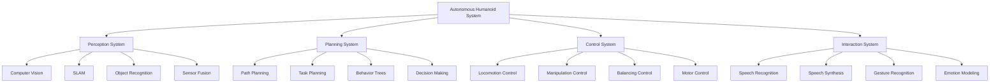

# Capstone: Autonomous Humanoid Project

## Overview

This capstone project brings together all the concepts learned throughout this textbook to create a complete autonomous humanoid robot system. You'll implement perception, planning, control, and interaction capabilities that demonstrate mastery of Physical AI and humanoid robotics.

## Project Objectives

The goal of this project is to design and implement an autonomous humanoid robot that can:
- Navigate through an unknown environment
- Identify and manipulate objects
- Respond to voice commands
- Maintain balance and stability
- Demonstrate learned behaviors

### Learning Outcomes

By completing this project, you will:
- Integrate multiple robotics subsystems into a cohesive system
- Apply advanced control algorithms for humanoid locomotion
- Implement perception systems for environment understanding
- Create interactive capabilities for human-robot communication
- Deploy and test the complete system on real or simulated hardware

## Project Architecture



## Hardware Requirements

### Minimum Configuration
```yaml
# Hardware requirements for the project
robot_platform:
  - Unitree Go2 (preferred)
  - Unitree G1 (alternative)
  - Custom humanoid platform
  - Simulation environment (Gazebo)

computing:
  - NVIDIA Jetson Orin (preferred for mobile computing)
  - High-end GPU (for simulation and training)
  - Real-time control computer

sensors:
  - RGB-D camera
  - IMU for balance
  - Force/torque sensors
  - Joint position encoders
```

### For Different Hardware Configurations

#### NVIDIA Jetson Users
```python
# Jetson-specific optimizations for the capstone project
import jetson.inference
import jetson.utils
import cv2
import numpy as np

class JetsonHumanoidController:
    def __init__(self):
        """
        Optimized for Jetson hardware with built-in AI accelerators
        """
        # Initialize Jetson-specific components
        self.detection_net = jetson.inference.detectNet("ssd-mobilenet-v2", threshold=0.5)
        self.camera = jetson.utils.gstCamera(1280, 720, "/dev/video0")

        # Initialize control systems optimized for Jetson
        self.balance_controller = self.initialize_balance_controller()

    def initialize_balance_controller(self):
        """
        Set up balance control optimized for Jetson's computational capabilities
        """
        # Implementation details for Jetson-optimized balance control
        pass
```

#### High-End GPU Users
```python
# GPU-optimized implementation for complex computations
import torch
import torchvision
import numpy as np
from scipy import signal

class GPUHumanoidController:
    def __init__(self, gpu_model):
        """
        Optimized for high-end GPU hardware
        """
        self.device = torch.device("cuda" if torch.cuda.is_available() else "cpu")

        # Load complex models that benefit from GPU acceleration
        self.vision_model = self.load_vision_model().to(self.device)
        self.control_model = self.load_control_model().to(self.device)

        print(f"Using {gpu_model} for autonomous humanoid project")

    def load_vision_model(self):
        """
        Load computer vision model optimized for GPU processing
        """
        # Implementation for GPU-accelerated vision
        pass

    def load_control_model(self):
        """
        Load control algorithms optimized for GPU processing
        """
        # Implementation for GPU-accelerated control
        pass
```

## ROS2 System Integration

### Node Architecture
```python
# Complete ROS2 node structure for the capstone project
import rclpy
from rclpy.node import Node
from sensor_msgs.msg import Image, Imu, JointState
from geometry_msgs.msg import Twist, Point
from std_msgs.msg import String
from builtin_interfaces.msg import Time
import threading
import time

class CapstoneHumanoidNode(Node):
    def __init__(self):
        super().__init__('capstone_humanoid_node')

        # Initialize all subsystems
        self.perception_system = PerceptionSystem(self)
        self.planning_system = PlanningSystem(self)
        self.control_system = ControlSystem(self)
        self.interaction_system = InteractionSystem(self)

        # Publishers for all systems
        self.joint_cmd_pub = self.create_publisher(JointState, 'joint_commands', 10)
        self.cmd_vel_pub = self.create_publisher(Twist, 'cmd_vel', 10)
        self.status_pub = self.create_publisher(String, 'system_status', 10)

        # Subscribers for sensor data
        self.image_sub = self.create_subscription(Image, 'camera/image_raw', self.image_callback, 10)
        self.imu_sub = self.create_subscription(Imu, 'imu/data', self.imu_callback, 10)
        self.joint_state_sub = self.create_subscription(JointState, 'joint_states', self.joint_state_callback, 10)

        # Main control timer
        self.control_timer = self.create_timer(0.01, self.main_control_loop)

        # System status
        self.system_initialized = False
        self.active_behavior = "idle"

    def main_control_loop(self):
        """
        Main control loop that integrates all subsystems
        """
        if not self.system_initialized:
            self.initialize_system()
            return

        # Get sensor data
        sensor_data = self.get_sensor_data()

        # Run perception
        perception_results = self.perception_system.process(sensor_data)

        # Run planning
        plan = self.planning_system.create_plan(perception_results)

        # Execute control
        control_commands = self.control_system.execute_plan(plan)

        # Handle interactions
        interaction_commands = self.interaction_system.process()

        # Publish commands
        self.publish_commands(control_commands, interaction_commands)

    def get_sensor_data(self):
        """
        Collect and synchronize sensor data from all sources
        """
        # Implementation for sensor data collection
        pass

    def publish_commands(self, control_cmd, interaction_cmd):
        """
        Publish commands to robot actuators and interaction systems
        """
        # Implementation for command publishing
        pass

    def image_callback(self, msg):
        """
        Handle incoming camera images
        """
        self.perception_system.add_image_data(msg)

    def imu_callback(self, msg):
        """
        Handle incoming IMU data for balance control
        """
        self.control_system.add_imu_data(msg)

    def joint_state_callback(self, msg):
        """
        Handle incoming joint state data
        """
        self.control_system.add_joint_data(msg)

class PerceptionSystem:
    def __init__(self, node):
        self.node = node
        self.image_buffer = []

    def process(self, sensor_data):
        """
        Process sensor data to extract meaningful information
        """
        # Implementation for perception processing
        return {}

class PlanningSystem:
    def __init__(self, node):
        self.node = node

    def create_plan(self, perception_results):
        """
        Create action plan based on perception results
        """
        # Implementation for planning
        return {}

class ControlSystem:
    def __init__(self, node):
        self.node = node

    def execute_plan(self, plan):
        """
        Execute the plan through robot control commands
        """
        # Implementation for control execution
        return {}

class InteractionSystem:
    def __init__(self, node):
        self.node = node

    def process(self):
        """
        Handle human-robot interaction
        """
        # Implementation for interaction processing
        return {}

def main(args=None):
    rclpy.init(args=args)
    capstone_node = CapstoneHumanoidNode()

    try:
        rclpy.spin(capstone_node)
    except KeyboardInterrupt:
        pass
    finally:
        capstone_node.destroy_node()
        rclpy.shutdown()

if __name__ == '__main__':
    main()
```

## Gazebo Simulation Environment

### World Configuration
```xml
<!-- Complete Gazebo world for capstone project -->
<sdf version="1.7">
  <world name="capstone_humanoid_world">
    <!-- Include standard models -->
    <include>
      <uri>model://ground_plane</uri>
    </include>
    <include>
      <uri>model://sun</uri>
    </include>

    <!-- Custom environment for the capstone project -->
    <model name="obstacle_course">
      <pose>5 0 0 0 0 0</pose>
      <static>true</static>
      <link name="course_link">
        <visual name="course_visual">
          <geometry>
            <mesh filename="model://obstacle_course/meshes/course.dae"/>
          </geometry>
        </visual>
        <collision name="course_collision">
          <geometry>
            <mesh filename="model://obstacle_course/meshes/course.dae"/>
          </geometry>
        </collision>
      </link>
    </model>

    <!-- Objects for manipulation tasks -->
    <model name="red_cube">
      <pose>2 1 0.5 0 0 0</pose>
      <link name="cube_link">
        <inertial>
          <mass>0.5</mass>
          <inertia>
            <ixx>0.001</ixx>
            <ixy>0</ixy>
            <ixz>0</ixz>
            <iyy>0.001</iyy>
            <iyz>0</iyz>
            <izz>0.001</izz>
          </inertia>
        </inertial>
        <visual name="cube_visual">
          <geometry>
            <box>
              <size>0.1 0.1 0.1</size>
            </box>
          </geometry>
          <material>
            <ambient>1 0 0 1</ambient>
            <diffuse>1 0 0 1</diffuse>
          </material>
        </visual>
        <collision name="cube_collision">
          <geometry>
            <box>
              <size>0.1 0.1 0.1</size>
            </box>
          </geometry>
        </collision>
      </link>
    </model>

    <!-- Humanoid robot model -->
    <model name="humanoid_robot">
      <include>
        <uri>model://humanoid_model</uri>
        <pose>0 0 1 0 0 0</pose>
      </include>

      <!-- Attach controllers -->
      <plugin name="humanoid_controller" filename="libgazebo_ros_control.so">
        <robotNamespace>/humanoid</robotNamespace>
        <robotParam>robot_description</robotParam>
      </plugin>
    </model>

    <!-- Physics configuration -->
    <physics type="ode">
      <max_step_size>0.001</max_step_size>
      <real_time_factor>1.0</real_time_factor>
      <real_time_update_rate>1000</real_time_update_rate>
      <gravity>0 0 -9.8</gravity>
    </physics>
  </world>
</sdf>
```

## NVIDIA Isaac Integration

### Isaac ROS Pipeline
```python
# Isaac ROS pipeline for the capstone project
import rclpy
from rclpy.node import Node
from isaac_ros_tensor_list_interfaces.msg import TensorList
from sensor_msgs.msg import Image, CameraInfo
from geometry_msgs.msg import PoseStamped
import cv2
import numpy as np

class IsaacCapstonePipeline(Node):
    def __init__(self):
        super().__init__('isaac_capstone_pipeline')

        # Isaac-specific publishers and subscribers
        self.image_sub = self.create_subscription(
            Image, 'camera/image_raw', self.image_callback, 10)
        self.tensor_sub = self.create_subscription(
            TensorList, 'tensor_sub', self.tensor_callback, 10)

        self.pose_pub = self.create_publisher(
            PoseStamped, 'object_pose', 10)

        # Initialize Isaac perception modules
        self.initialize_isaac_modules()

    def initialize_isaac_modules(self):
        """
        Initialize Isaac-specific perception and processing modules
        Optimized for [USER_GPU] hardware
        """
        # Implementation for Isaac module initialization
        pass

    def image_callback(self, msg):
        """
        Process image using Isaac perception pipeline
        """
        # Implementation for Isaac image processing
        pass

    def tensor_callback(self, msg):
        """
        Process tensors from Isaac perception modules
        """
        # Implementation for tensor processing
        pass
```

## Vision Language Action (VLA) Integration

### VLA System Architecture
```mermaid
graph LR
    A[User Command: "Pick up the red cube"] --> B[Vision System: Detect red cube at (x,y,z)]
    C[Language Understanding: Parse action "pick up"] --> B
    B --> D[VLA Model: Generate grasp plan]
    C --> D
    D --> E[Action Execution: Move arm and grasp]
    E --> F[Feedback: "Successfully picked up the red cube"]
    D --> F
```

```python
# VLA integration for the capstone project
import torch
import transformers
from transformers import CLIPProcessor, CLIPModel
import numpy as np

class VLACapstoneSystem:
    def __init__(self):
        """
        Initialize Vision-Language-Action system for the capstone project
        """
        # Load pre-trained VLA model
        self.clip_model = CLIPModel.from_pretrained("openai/clip-vit-base-patch32")
        self.clip_processor = CLIPProcessor.from_pretrained("openai/clip-vit-base-patch32")

        # Initialize action generation model
        self.action_generator = self.initialize_action_model()

    def process_command(self, image, text_command):
        """
        Process visual input and text command to generate actions
        """
        # Encode image and text
        inputs = self.clip_processor(text=[text_command], images=[image], return_tensors="pt", padding=True)
        outputs = self.clip_model(**inputs)

        # Generate appropriate action based on encoded information
        action = self.generate_action(outputs)
        return action

    def generate_action(self, encoded_info):
        """
        Generate specific robot action based on encoded visual and linguistic information
        """
        # Implementation for action generation
        return "grasp_object"
```

## Implementation Phases

### Phase 1: System Integration
```bash
# Set up the complete system architecture
mkdir -p ~/capstone_project/{src,config,launch,worlds,models}
cd ~/capstone_project

# Create package structure
catkin_create_pkg capstone_humanoid std_msgs rospy roscpp sensor_msgs geometry_msgs
```

### Phase 2: Basic Locomotion
```python
# Basic walking controller for the humanoid
class WalkingController:
    def __init__(self):
        self.step_length = 0.3  # meters
        self.step_height = 0.1  # meters
        self.step_duration = 1.0  # seconds

    def generate_walk_pattern(self, steps):
        """
        Generate walking pattern for the specified number of steps
        """
        pattern = []
        for i in range(steps):
            # Generate step trajectory
            step_traj = self.generate_step_trajectory(i)
            pattern.append(step_traj)
        return pattern

    def generate_step_trajectory(self, step_num):
        """
        Generate trajectory for a single step
        """
        # Implementation for step trajectory generation
        pass
```

### Phase 3: Object Manipulation
```python
# Object manipulation system
class ManipulationController:
    def __init__(self):
        self.arm_dof = 7  # 7-DOF arm
        self.gripper_type = "parallel_jaw"

    def plan_grasp(self, object_pose, object_shape):
        """
        Plan grasp for the target object
        """
        # Calculate grasp points based on object shape
        grasp_points = self.calculate_grasp_points(object_shape)

        # Plan trajectory to reach grasp points
        trajectory = self.plan_reach_trajectory(object_pose, grasp_points)

        return trajectory

    def execute_grasp(self, grasp_trajectory):
        """
        Execute the grasp maneuver
        """
        # Implementation for grasp execution
        pass
```

### Phase 4: Perception and Navigation
```python
# SLAM and navigation system
class NavigationSystem:
    def __init__(self):
        self.map_resolution = 0.05  # meters per cell
        self.planning_frequency = 1.0  # Hz
        self.global_planner = "navfn"
        self.local_planner = "dwa_local_planner"

    def build_map(self, laser_scan, pose):
        """
        Build map using SLAM algorithms
        """
        # Implementation for map building
        pass

    def plan_path(self, start_pose, goal_pose):
        """
        Plan path from start to goal
        """
        # Implementation for path planning
        pass

    def execute_navigation(self, path):
        """
        Execute navigation along the planned path
        """
        # Implementation for navigation execution
        pass
```

## Testing and Validation

### Unit Tests
```python
import unittest
import numpy as np
from capstone_humanoid import WalkingController, ManipulationController, NavigationSystem

class TestCapstoneSystem(unittest.TestCase):
    def setUp(self):
        self.walking_controller = WalkingController()
        self.manipulation_controller = ManipulationController()
        self.navigation_system = NavigationSystem()

    def test_walk_pattern_generation(self):
        """Test that walk pattern is generated correctly"""
        pattern = self.walking_controller.generate_walk_pattern(5)
        self.assertEqual(len(pattern), 5)

    def test_grasp_planning(self):
        """Test that grasp planning works correctly"""
        object_pose = np.array([1.0, 1.0, 0.5])
        object_shape = "cube_0.1m"
        trajectory = self.manipulation_controller.plan_grasp(object_pose, object_shape)
        self.assertIsNotNone(trajectory)

    def test_path_planning(self):
        """Test that path planning works correctly"""
        start_pose = np.array([0.0, 0.0, 0.0])
        goal_pose = np.array([5.0, 5.0, 0.0])
        path = self.navigation_system.plan_path(start_pose, goal_pose)
        self.assertIsNotNone(path)

if __name__ == '__main__':
    unittest.main()
```

### Integration Tests
```bash
# Launch complete system test
roslaunch capstone_humanoid system_test.launch

# Run system-level validation
rostest capstone_humanoid capstone_system.test

# Performance benchmarking
roslaunch capstone_humanoid benchmark.launch
```

## Performance Optimization

### For Different Hardware Configurations

#### Jetson Orin Optimization
```python
# Jetson-specific optimizations
import jetson.utils
import jetson.inference

class JetsonOptimizedController:
    def __init__(self):
        # Use Jetson's built-in accelerators
        self.detection = jetson.inference.detectNet("ssd-mobilenet-v2")
        self.tensors = jetson.utils.cudaDeviceSynchronize()

    def optimized_processing(self, image):
        """
        Use Jetson's hardware accelerators for optimized processing
        """
        # Implementation using Jetson accelerators
        pass
```

#### High-End GPU Optimization
```python
# GPU-optimized processing pipeline
import torch
import torch_tensorrt

class GPUOptimizedController:
    def __init__(self, gpu_model):
        # Optimize models for specific GPU
        self.gpu_model = gpu_model
        self.optimized_model = self.optimize_for_gpu()

    def optimize_for_gpu(self):
        """
        Optimize neural networks for specific GPU model
        """
        # Implementation for GPU-specific optimization
        pass
```

## Deployment Considerations

### Real Robot Deployment
```yaml
# Deployment configuration for real robot
deployment:
  safety_limits:
    joint_limits: true
    velocity_limits: true
    acceleration_limits: true
  emergency_stop: true
  power_management: true
  communication_fallbacks: true

hardware_specific:
  unitree_go2:
    joint_names: ["left_hip", "left_knee", "left_ankle", ...]
    control_frequency: 500  # Hz
  unitree_g1:
    joint_names: ["left_hip_yaw", "left_hip_roll", "left_hip_pitch", ...]
    control_frequency: 1000  # Hz
```

### Simulation Deployment
```bash
# Launch in simulation mode
roslaunch capstone_humanoid simulation.launch

# Launch with real robot
roslaunch capstone_humanoid real_robot.launch
```

## Key Takeaways

1. **System Integration** is the most challenging aspect of humanoid robotics, requiring careful coordination of multiple subsystems.

2. **Hardware Optimization** is crucial for real-time performance, especially when running complex algorithms on resource-constrained platforms.

3. **Safety Considerations** must be paramount when deploying on real hardware, with proper limits and emergency procedures.

4. **Testing Strategy** should include both simulation and real-world testing, with progressive complexity.

5. **Modular Design** allows for easier debugging and maintenance of complex robotic systems.

6. **Real-time Performance** requires careful consideration of computational complexity and hardware capabilities.

## Practice Exercises

### Exercise 1: System Integration Challenge
Integrate the perception, planning, and control systems into a single ROS2 node. Test the integration in simulation and verify that data flows correctly between subsystems.

### Exercise 2: Hardware-Specific Optimization
Optimize the complete system for your specific hardware configuration (GPU model, Jetson type, or real robot). Measure and compare performance metrics.

### Exercise 3: Navigation Challenge
Implement a complete navigation system that can navigate through an unknown environment to reach a target location while avoiding obstacles.

### Exercise 4: Manipulation Task
Create a manipulation task where the robot must pick up an object and place it in a specific location. Include perception, planning, and control aspects.

### Exercise 5: Human-Robot Interaction
Implement a complete interaction system that allows the robot to understand voice commands and respond appropriately with both verbal and physical actions.

## MCQs Quiz

1. What is the most challenging aspect of the capstone project?
   - A) Individual subsystems
   - B) System integration of multiple subsystems
   - C) Writing documentation
   - D) Creating 3D models
   - **Answer: B**

2. Which hardware consideration is crucial for real-time humanoid control?
   - A) Storage capacity
   - B) Computational performance and optimization
   - C) Screen resolution
   - D) Network bandwidth
   - **Answer: B**

3. What is the primary safety concern when deploying on real hardware?
   - A) Data loss
   - B) Joint and motion limits
   - C) Network connectivity
   - D) Battery life
   - **Answer: B**

4. Which testing approach is recommended for complex robotic systems?
   - A) Real-world testing only
   - B) Simulation only
   - C) Progressive testing from simulation to real-world
   - D) No testing needed
   - **Answer: C**

5. Why is modular design important in humanoid robotics?
   - A) For aesthetic purposes
   - B) For easier debugging and maintenance
   - C) To increase complexity
   - D) To reduce performance
   - **Answer: B**

## Further Reading

- "Humanoid Robotics: A Reference" by Veloso
- "Introduction to Autonomous Manipulation" by Albu-Schäffer and Hirzinger
- "Modern Robotics: Mechanics, Planning, and Control" by Lynch and Park
- "Probabilistic Robotics" by Thrun, Burgard, and Fox
- "Robotics: Control, Sensing, Vision, and Intelligence" by Fu, Gonzalez, and Lee
- NVIDIA Isaac Documentation: https://docs.nvidia.com/isaac/
- ROS2 Documentation: https://docs.ros.org/en/humble/
- Gazebo Simulation: http://gazebosim.org/
- Unitree Robotics Documentation: https://www.unitree.com/

---

*Generated with reusable Claude Subagents & Spec-Kit Plus*