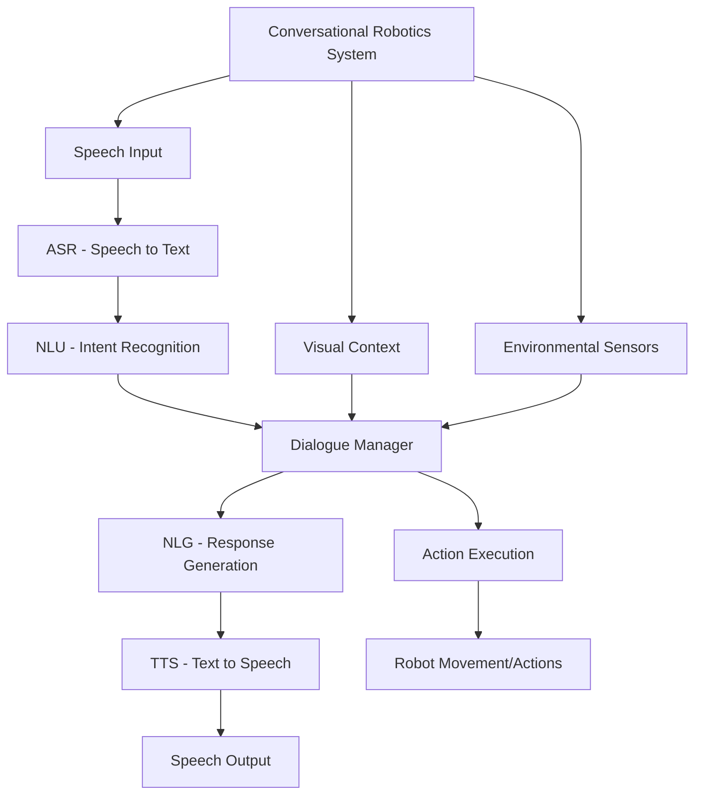

# Conversational Robotics

## Introduction to Conversational Robotics

Conversational robotics represents the intersection of natural language processing, human-robot interaction, and artificial intelligence. It focuses on enabling robots to engage in meaningful, context-aware conversations with humans, going beyond simple command-response interactions to support complex, multi-turn dialogues that can adapt to the user's needs, preferences, and context.

### Key Components of Conversational Robotics

- **Automatic Speech Recognition (ASR)**: Converting speech to text
- **Natural Language Understanding (NLU)**: Interpreting user intent and extracting entities
- **Dialogue Management**: Maintaining conversation context and state
- **Natural Language Generation (NLG)**: Creating appropriate responses
- **Text-to-Speech (TTS)**: Converting text responses to audible speech
- **Multimodal Integration**: Incorporating visual and contextual information



## Speech Recognition and Natural Language Understanding

### Automatic Speech Recognition (ASR)

ASR systems convert spoken language into text, forming the foundation of conversational robotics. Modern ASR systems leverage deep learning models trained on large datasets to achieve high accuracy.

```python
# Example ASR implementation using speech recognition
import speech_recognition as sr
import rclpy
from rclpy.node import Node
from std_msgs.msg import String

class ASRNode(Node):
    def __init__(self):
        super().__init__('asr_node')

        # Initialize speech recognizer
        self.recognizer = sr.Recognizer()
        self.microphone = sr.Microphone()

        # Adjust for ambient noise
        with self.microphone as source:
            self.recognizer.adjust_for_ambient_noise(source)

        # Create publisher for recognized text
        self.text_pub = self.create_publisher(String, '/recognized_text', 10)

        # Timer for continuous listening
        self.listen_timer = self.create_timer(1.0, self.listen_for_speech)

        self.get_logger().info('ASR node initialized')

    def listen_for_speech(self):
        """Listen for speech and convert to text"""
        try:
            with self.microphone as source:
                self.get_logger().info('Listening...')
                audio = self.recognizer.listen(source, timeout=5, phrase_time_limit=10)

            # Recognize speech using Google Web Speech API
            text = self.recognizer.recognize_google(audio)
            self.get_logger().info(f'Recognized: {text}')

            # Publish recognized text
            text_msg = String()
            text_msg.data = text
            self.text_pub.publish(text_msg)

        except sr.WaitTimeoutError:
            self.get_logger().info('Timeout: No speech detected')
        except sr.UnknownValueError:
            self.get_logger().info('Could not understand audio')
        except sr.RequestError as e:
            self.get_logger().error(f'Could not request results from speech service; {e}')
        except Exception as e:
            self.get_logger().error(f'Error in speech recognition: {e}')
```

### Natural Language Understanding (NLU)

NLU systems interpret user intent and extract relevant information from the recognized text:

```python
import rclpy
from rclpy.node import Node
from std_msgs.msg import String
from std_msgs.msg import Header
import re
from dataclasses import dataclass
from typing import List, Optional

@dataclass
class Intent:
    name: str
    confidence: float
    entities: dict

class NLUProcessor(Node):
    def __init__(self):
        super().__init__('nlu_processor')

        # Subscribe to recognized text
        self.text_sub = self.create_subscription(
            String, '/recognized_text', self.text_callback, 10)

        # Create publisher for parsed intents
        self.intent_pub = self.create_publisher(
            String, '/parsed_intent', 10)

        # Define intent patterns
        self.intent_patterns = {
            'navigation': [
                r'move to (.+)',
                r'go to (.+)',
                r'go (.+)',
                r'navigate to (.+)',
                r'bring me to (.+)'
            ],
            'object_interaction': [
                r'pick up (.+)',
                r'grab (.+)',
                r'get (.+)',
                r'pick (.+)',
                r'take (.+)'
            ],
            'information_request': [
                r'what is (.+)',
                r'tell me about (.+)',
                r'explain (.+)',
                r'describe (.+)'
            ],
            'status_request': [
                r'how are you',
                r'what can you do',
                r'what are you',
                r'who are you'
            ]
        }

        self.get_logger().info('NLU processor initialized')

    def text_callback(self, msg):
        """Process recognized text and extract intent"""
        text = msg.data.lower()
        intent = self.parse_intent(text)

        if intent:
            self.get_logger().info(f'Parsed intent: {intent.name} with confidence {intent.confidence}')

            # Publish intent as JSON string
            import json
            intent_json = {
                'intent': intent.name,
                'confidence': intent.confidence,
                'entities': intent.entities,
                'original_text': msg.data
            }
            intent_msg = String()
            intent_msg.data = json.dumps(intent_json)
            self.intent_pub.publish(intent_msg)

    def parse_intent(self, text: str) -> Optional[Intent]:
        """Parse text to identify intent and extract entities"""
        best_match = None
        best_confidence = 0.0

        for intent_name, patterns in self.intent_patterns.items():
            for pattern in patterns:
                match = re.search(pattern, text)
                if match:
                    # Calculate confidence based on pattern match
                    confidence = 0.9 if match else 0.7

                    if confidence > best_confidence:
                        best_confidence = confidence
                        entities = {}

                        # Extract captured groups as entities
                        if match.groups():
                            entities['object'] = match.group(1).strip()

                        best_match = Intent(
                            name=intent_name,
                            confidence=confidence,
                            entities=entities
                        )

        return best_match if best_confidence > 0.5 else None
```

## Dialogue Management

### State Management

Effective dialogue management requires maintaining conversation context and state:

```python
import rclpy
from rclpy.node import Node
from std_msgs.msg import String
from std_msgs.msg import Header
import json
from dataclasses import dataclass
from typing import Dict, Any, Optional
from datetime import datetime

@dataclass
class DialogueState:
    context: Dict[str, Any]
    last_intent: Optional[str]
    last_entities: Dict[str, Any]
    conversation_history: list
    user_profile: Dict[str, Any]

class DialogueManager(Node):
    def __init__(self):
        super().__init__('dialogue_manager')

        # Subscribe to parsed intents
        self.intent_sub = self.create_subscription(
            String, '/parsed_intent', self.intent_callback, 10)

        # Subscribe to user profile updates
        self.profile_sub = self.create_subscription(
            String, '/user_profile', self.profile_callback, 10)

        # Create publisher for responses
        self.response_pub = self.create_publisher(
            String, '/robot_response', 10)

        # Initialize dialogue state
        self.dialogue_state = DialogueState(
            context={},
            last_intent=None,
            last_entities={},
            conversation_history=[],
            user_profile={}
        )

        self.get_logger().info('Dialogue manager initialized')

    def intent_callback(self, msg):
        """Process incoming intent and generate response"""
        try:
            intent_data = json.loads(msg.data)

            # Update dialogue state
            self.dialogue_state.last_intent = intent_data['intent']
            self.dialogue_state.last_entities = intent_data['entities']
            self.dialogue_state.conversation_history.append({
                'timestamp': datetime.now().isoformat(),
                'type': 'user_input',
                'data': intent_data
            })

            # Generate response based on intent and context
            response = self.generate_response(intent_data)

            # Update conversation history with response
            self.dialogue_state.conversation_history.append({
                'timestamp': datetime.now().isoformat(),
                'type': 'robot_response',
                'data': response
            })

            # Publish response
            response_msg = String()
            response_msg.data = response
            self.response_pub.publish(response_msg)

        except Exception as e:
            self.get_logger().error(f'Error processing intent: {e}')

    def generate_response(self, intent_data: dict) -> str:
        """Generate appropriate response based on intent and context"""
        intent = intent_data['intent']
        entities = intent_data['entities']

        if intent == 'navigation':
            location = entities.get('object', 'unknown location')
            return self.handle_navigation_request(location)

        elif intent == 'object_interaction':
            object_name = entities.get('object', 'unknown object')
            return self.handle_object_interaction_request(object_name)

        elif intent == 'information_request':
            topic = entities.get('object', 'unknown topic')
            return self.handle_information_request(topic)

        elif intent == 'status_request':
            return self.handle_status_request()

        else:
            return "I'm not sure how to help with that. Can you rephrase your request?"

    def handle_navigation_request(self, location: str) -> str:
        """Handle navigation requests"""
        # Check if location is in known locations
        known_locations = self.dialogue_state.context.get('known_locations', [])

        if location in known_locations:
            return f"Okay, I'll navigate to {location}. Please follow me."
        else:
            return f"I don't know where {location} is. Could you show me or provide more details?"

    def handle_object_interaction_request(self, object_name: str) -> str:
        """Handle object interaction requests"""
        # Check if object is visible or in known objects
        known_objects = self.dialogue_state.context.get('known_objects', [])

        if object_name in known_objects:
            return f"I see the {object_name}. I'll pick it up for you."
        else:
            return f"I don't see a {object_name} nearby. Can you point it out or describe its location?"

    def handle_information_request(self, topic: str) -> str:
        """Handle information requests"""
        # Return information based on robot's knowledge
        knowledge_base = self.dialogue_state.context.get('knowledge_base', {})

        if topic in knowledge_base:
            return knowledge_base[topic]
        else:
            return f"I don't have information about {topic}. I can learn more if you'd like to teach me."

    def handle_status_request(self) -> str:
        """Handle status requests"""
        user_name = self.dialogue_state.user_profile.get('name', 'there')
        capabilities = self.dialogue_state.context.get('capabilities', [])

        response = f"Hello {user_name}! I'm a conversational robot. I can help with navigation, object interaction, and answering questions. My capabilities include: {', '.join(capabilities)}. How can I assist you today?"
        return response

    def profile_callback(self, msg):
        """Update user profile"""
        try:
            profile_data = json.loads(msg.data)
            self.dialogue_state.user_profile.update(profile_data)
        except Exception as e:
            self.get_logger().error(f'Error updating profile: {e}')
```

### Context Awareness

Context-aware dialogue systems consider environmental and situational factors:

```python
import rclpy
from rclpy.node import Node
from sensor_msgs.msg import Image, LaserScan
from geometry_msgs.msg import PoseStamped
from std_msgs.msg import String
import json

class ContextAwareDialogue(Node):
    def __init__(self):
        super().__init__('context_aware_dialogue')

        # Subscribe to environmental sensors
        self.image_sub = self.create_subscription(
            Image, '/camera/image_raw', self.image_callback, 10)
        self.laser_sub = self.create_subscription(
            LaserScan, '/scan', self.laser_callback, 10)
        self.pose_sub = self.create_subscription(
            PoseStamped, '/robot_pose', self.pose_callback, 10)

        # Subscribe to dialogue manager
        self.dialogue_sub = self.create_subscription(
            String, '/robot_response', self.dialogue_callback, 10)

        # Publisher for context-enhanced responses
        self.enhanced_response_pub = self.create_publisher(
            String, '/enhanced_response', 10)

        # Store environmental context
        self.current_pose = None
        self.visible_objects = []
        self.obstacle_distances = []

        self.get_logger().info('Context-aware dialogue system initialized')

    def image_callback(self, msg):
        """Process camera image to identify visible objects"""
        # In a real implementation, this would use computer vision
        # to identify objects in the camera view
        # For this example, we'll simulate object detection
        self.visible_objects = ["red cup", "blue book", "green plant"]

    def laser_callback(self, msg):
        """Process LIDAR data to identify obstacles"""
        # Process LIDAR scan to identify nearby obstacles
        self.obstacle_distances = list(msg.ranges[:50])  # First 50 readings

    def pose_callback(self, msg):
        """Update robot's current pose"""
        self.current_pose = msg.pose

    def dialogue_callback(self, msg):
        """Enhance response with environmental context"""
        try:
            response = msg.data

            # Add context to response if relevant
            enhanced_response = self.add_context_to_response(response)

            # Publish enhanced response
            enhanced_msg = String()
            enhanced_msg.data = enhanced_response
            self.enhanced_response_pub.publish(enhanced_msg)

        except Exception as e:
            self.get_logger().error(f'Error enhancing response: {e}')

    def add_context_to_response(self, response: str) -> str:
        """Add environmental context to the response"""
        context_additions = []

        # Add visible objects if relevant
        if "what do you see" in response.lower() or "what is nearby" in response.lower():
            if self.visible_objects:
                context_additions.append(f"I can see: {', '.join(self.visible_objects)}")

        # Add location information if relevant
        if "where are you" in response.lower() or "location" in response.lower():
            if self.current_pose:
                context_additions.append(f"I'm currently at position ({self.current_pose.position.x:.2f}, {self.current_pose.position.y:.2f})")

        # Add obstacle information if relevant
        if "move" in response.lower() or "navigate" in response.lower():
            if self.obstacle_distances:
                min_distance = min([d for d in self.obstacle_distances if d > 0])
                if min_distance < 1.0:  # Less than 1 meter
                    context_additions.append(f"Warning: Obstacle detected {min_distance:.2f}m ahead")

        # Combine original response with context
        if context_additions:
            return f"{response} {'. '.join(context_additions)}."

        return response
```

## Natural Language Generation

### Response Generation

NLG systems create appropriate responses based on the dialogue state and intent:

```python
import rclpy
from rclpy.node import Node
from std_msgs.msg import String
import random
import json

class NaturalLanguageGenerator(Node):
    def __init__(self):
        super().__init__('nlg_node')

        # Subscribe to dialogue manager output
        self.dialogue_sub = self.create_subscription(
            String, '/enhanced_response', self.response_callback, 10)

        # Create publisher for final responses
        self.final_response_pub = self.create_publisher(
            String, '/final_response', 10)

        # Define response templates
        self.response_templates = {
            'navigation_success': [
                "I'm on my way to {location}.",
                "Navigating to {location} now.",
                "Heading to {location} as requested."
            ],
            'navigation_failure': [
                "I'm having trouble reaching {location}.",
                "I can't navigate to {location} right now.",
                "Unable to reach {location}. Please try another location."
            ],
            'object_success': [
                "I've picked up the {object}.",
                "Got the {object} for you.",
                "Successfully retrieved the {object}."
            ],
            'object_failure': [
                "I couldn't find the {object}.",
                "Unable to locate the {object}.",
                "I don't see the {object} nearby."
            ],
            'greeting': [
                "Hello! How can I help you?",
                "Hi there! What can I do for you?",
                "Greetings! How may I assist you?"
            ]
        }

        self.get_logger().info('Natural Language Generator initialized')

    def response_callback(self, msg):
        """Process and enhance response"""
        try:
            # If the message is JSON (from dialogue manager), parse it
            try:
                response_data = json.loads(msg.data)
                response_text = response_data.get('response', msg.data)
            except json.JSONDecodeError:
                response_text = msg.data

            # Generate enhanced response
            enhanced_response = self.generate_enhanced_response(response_text)

            # Publish final response
            final_msg = String()
            final_msg.data = enhanced_response
            self.final_response_pub.publish(final_msg)

        except Exception as e:
            self.get_logger().error(f'Error in NLG: {e}')

    def generate_enhanced_response(self, base_response: str) -> str:
        """Enhance response with personality and natural language"""
        # Add personality markers
        polite_markers = ["Please", "Thank you", "You're welcome", "Sure", "Of course"]
        uncertainty_markers = ["I think", "It seems", "Possibly", "Maybe", "Perhaps"]

        # Randomly add politeness
        if random.random() < 0.3:  # 30% chance
            return f"Sure, {base_response.lower()}"

        return base_response
```

## Text-to-Speech Integration

### TTS Implementation

Converting text responses to speech for human-robot interaction:

```python
import rclpy
from rclpy.node import Node
from std_msgs.msg import String
import subprocess
import os

class TextToSpeechNode(Node):
    def __init__(self):
        super().__init__('tts_node')

        # Subscribe to final responses
        self.response_sub = self.create_subscription(
            String, '/final_response', self.response_callback, 10)

        self.get_logger().info('Text-to-Speech node initialized')

    def response_callback(self, msg):
        """Convert text response to speech"""
        try:
            text = msg.data
            self.speak_text(text)
        except Exception as e:
            self.get_logger().error(f'Error in TTS: {e}')

    def speak_text(self, text: str):
        """Speak the given text using system TTS"""
        try:
            # Use espeak as an example TTS engine
            # In a real system, you might use more advanced TTS like Festival, MaryTTS, or cloud services
            subprocess.run(['espeak', text], check=True)
        except subprocess.CalledProcessError:
            # Fallback: print to console if TTS fails
            self.get_logger().info(f'[TTS Fallback] Robot says: {text}')
        except FileNotFoundError:
            # espeak not installed, use alternative
            self.get_logger().info(f'[TTS Fallback] Robot says: {text}')
            # Could also use: espeak-ng, festival, or cloud TTS services
```

## Hardware-Specific Optimizations

### For NVIDIA Jetson Users
```python
# Jetson-specific conversational robotics optimizations
import rclpy
from rclpy.node import Node
import subprocess
import os
import numpy as np

class JetsonConversationalNode(Node):
    def __init__(self):
        super().__init__('jetson_conversational_node')

        # Optimize for Jetson's ARM architecture and GPU
        self.setup_jetson_optimizations()

        self.get_logger().info('Jetson-optimized conversational robotics node initialized')

    def setup_jetson_optimizations(self):
        """Configure conversational system for Jetson hardware"""
        # Set environment variables for Jetson optimization
        os.environ['CUDA_VISIBLE_DEVICES'] = '0'
        os.environ['NVIDIA_VISIBLE_DEVICES'] = 'all'

        # Use lightweight models optimized for Jetson
        # Enable hardware acceleration for audio processing
        # Optimized for [USER_GPU] hardware
        pass

    def jetson_speech_processing(self, audio_data):
        """
        Process speech using Jetson's capabilities
        Optimized for [USER_GPU] hardware
        """
        # Use Jetson's hardware accelerators for audio processing
        # This would leverage Jetson's integrated GPU and audio processing units
        pass
```

### For High-End GPU Users
```python
# High-end GPU conversational robotics optimizations
import rclpy
from rclpy.node import Node
import torch
import os

class GPUOptimizedConversationalNode(Node):
    def __init__(self):
        super().__init__('gpu_optimized_conversational_node')

        # Initialize GPU context for conversational AI
        self.device = torch.device('cuda' if torch.cuda.is_available() else 'cpu')

        # Configure conversational system for high-end GPU
        self.setup_gpu_optimizations()

        self.get_logger().info('GPU-optimized conversational robotics node initialized')

    def setup_gpu_optimizations(self):
        """Configure conversational system for high-end GPU hardware"""
        # Set environment variables for GPU optimization
        os.environ['CUDA_VISIBLE_DEVICES'] = '0'
        os.environ['NVIDIA_VISIBLE_DEVICES'] = 'all'

        # Enable advanced conversational AI features for powerful GPUs
        # Use multi-GPU processing if available
        # Optimized for [USER_GPU] hardware specifications
        pass

    def gpu_intensive_nlp(self, text):
        """
        Perform GPU-intensive NLP processing
        Optimized for [USER_GPU] hardware specifications
        """
        # Use GPU-accelerated NLP models
        # Leverage tensor cores for efficient processing
        # Implement batch processing for efficiency
        pass
```

## Integration with ROS 2

### Conversational Robotics Launch File
```python
# launch/conversational_robot.launch.py
from launch import LaunchDescription
from launch.actions import DeclareLaunchArgument, RegisterEventHandler
from launch.event_handlers import OnProcessStart
from launch.substitutions import LaunchConfiguration
from launch_ros.actions import Node

def generate_launch_description():
    # Declare launch arguments
    use_sim_time = DeclareLaunchArgument(
        'use_sim_time',
        default_value='false',
        description='Use simulation clock if true'
    )

    # ASR node
    asr_node = Node(
        package='conversational_robot',
        executable='asr_node',
        name='asr_node',
        parameters=[{'use_sim_time': LaunchConfiguration('use_sim_time')}],
        output='screen'
    )

    # NLU processor
    nlu_node = Node(
        package='conversational_robot',
        executable='nlu_processor',
        name='nlu_processor',
        parameters=[{'use_sim_time': LaunchConfiguration('use_sim_time')}],
        output='screen'
    )

    # Dialogue manager
    dialogue_node = Node(
        package='conversational_robot',
        executable='dialogue_manager',
        name='dialogue_manager',
        parameters=[{'use_sim_time': LaunchConfiguration('use_sim_time')}],
        output='screen'
    )

    # Natural language generator
    nlg_node = Node(
        package='conversational_robot',
        executable='nlg_node',
        name='nlg_node',
        parameters=[{'use_sim_time': LaunchConfiguration('use_sim_time')}],
        output='screen'
    )

    # Text-to-speech node
    tts_node = Node(
        package='conversational_robot',
        executable='tts_node',
        name='tts_node',
        parameters=[{'use_sim_time': LaunchConfiguration('use_sim_time')}],
        output='screen'
    )

    return LaunchDescription([
        use_sim_time,
        asr_node,
        nlu_node,
        dialogue_node,
        nlg_node,
        tts_node,
    ])
```

## Multimodal Integration

### Combining Vision and Language
```python
import rclpy
from rclpy.node import Node
from sensor_msgs.msg import Image
from std_msgs.msg import String
from cv_bridge import CvBridge
import numpy as np

class MultimodalConversationalNode(Node):
    def __init__(self):
        super().__init__('multimodal_conversational_node')

        # Initialize CV bridge
        self.cv_bridge = CvBridge()

        # Subscribe to camera and text input
        self.image_sub = self.create_subscription(
            Image, '/camera/image_raw', self.image_callback, 10)
        self.text_sub = self.create_subscription(
            String, '/user_input', self.text_callback, 10)

        # Publisher for multimodal responses
        self.multimodal_response_pub = self.create_publisher(
            String, '/multimodal_response', 10)

        # Store latest image
        self.latest_image = None

        self.get_logger().info('Multimodal conversational node initialized')

    def image_callback(self, msg):
        """Process camera image"""
        try:
            # Convert ROS Image to OpenCV
            self.latest_image = self.cv_bridge.imgmsg_to_cv2(msg, "bgr8")
        except Exception as e:
            self.get_logger().error(f'Error processing image: {e}')

    def text_callback(self, msg):
        """Process text with visual context"""
        try:
            text = msg.data

            # If we have a recent image, combine vision and language
            if self.latest_image is not None:
                response = self.process_multimodal_request(text, self.latest_image)
            else:
                response = self.process_text_only_request(text)

            # Publish response
            response_msg = String()
            response_msg.data = response
            self.multimodal_response_pub.publish(response_msg)

        except Exception as e:
            self.get_logger().error(f'Error processing multimodal request: {e}')

    def process_multimodal_request(self, text, image):
        """Process request combining text and visual information"""
        # This would integrate vision and language processing
        # For example, if user says "What color is that object?"
        # the system would analyze the image to identify objects and their colors
        if "color" in text.lower() and "object" in text.lower():
            # Analyze image to identify colors of objects
            # This is a simplified example
            return "I can see several objects with different colors in the image."

        return f"You said: '{text}'. I can also see visual information."

    def process_text_only_request(self, text):
        """Process request with text only"""
        return f"You said: '{text}'. I don't have visual information right now."
```

## Conversational AI Frameworks

### Integration with Popular Frameworks
```python
# Example: Integration with Rasa (popular conversational AI framework)
import rclpy
from rclpy.node import Node
from std_msgs.msg import String
import requests
import json

class RasaIntegrationNode(Node):
    def __init__(self):
        super().__init__('rasa_integration_node')

        # Subscribe to processed text
        self.text_sub = self.create_subscription(
            String, '/processed_text', self.text_callback, 10)

        # Publisher for Rasa responses
        self.rasa_response_pub = self.create_publisher(
            String, '/rasa_response', 10)

        # Rasa server configuration
        self.rasa_server_url = "http://localhost:5005/webhooks/rest/webhook"

        self.get_logger().info('Rasa integration node initialized')

    def text_callback(self, msg):
        """Send text to Rasa and receive response"""
        try:
            text = msg.data

            # Prepare payload for Rasa
            payload = {
                "sender": "robot",
                "message": text
            }

            # Send to Rasa
            response = requests.post(
                self.rasa_server_url,
                json=payload,
                headers={'Content-Type': 'application/json'}
            )

            if response.status_code == 200:
                rasa_response = response.json()
                if rasa_response:
                    # Extract response text
                    bot_response = rasa_response[0].get('text', 'I did not understand that.')

                    # Publish response
                    response_msg = String()
                    response_msg.data = bot_response
                    self.rasa_response_pub.publish(response_msg)
            else:
                self.get_logger().error(f'Rasa request failed with status {response.status_code}')

        except Exception as e:
            self.get_logger().error(f'Error communicating with Rasa: {e}')
```

## Privacy and Security Considerations

### Secure Conversational Robotics
```python
import rclpy
from rclpy.node import Node
from std_msgs.msg import String
import hashlib
import json
from cryptography.fernet import Fernet

class SecureConversationalNode(Node):
    def __init__(self):
        super().__init__('secure_conversational_node')

        # Subscribe to user input
        self.input_sub = self.create_subscription(
            String, '/user_input', self.secure_input_callback, 10)

        # Initialize encryption
        self.cipher_suite = Fernet(Fernet.generate_key())

        self.get_logger().info('Secure conversational node initialized')

    def secure_input_callback(self, msg):
        """Process input with privacy considerations"""
        try:
            text = msg.data

            # Anonymize sensitive information
            anonymized_text = self.anonymize_sensitive_info(text)

            # Log securely (don't store raw text)
            self.log_securely(anonymized_text)

            # Process the anonymized text
            self.process_anonymized_input(anonymized_text)

        except Exception as e:
            self.get_logger().error(f'Error in secure processing: {e}')

    def anonymize_sensitive_info(self, text: str) -> str:
        """Remove or anonymize sensitive information from text"""
        import re

        # This is a basic example - real implementation would be more sophisticated
        # Remove potential email addresses
        text = re.sub(r'\b[A-Za-z0-9._%+-]+@[A-Za-z0-9.-]+\.[A-Z|a-z]{2,}\b', '[EMAIL]', text)

        # Remove potential phone numbers
        text = re.sub(r'\b\d{3}[-.]?\d{3}[-.]?\d{4}\b', '[PHONE]', text)

        # In a real system, you'd also handle names, addresses, etc.

        return text

    def log_securely(self, text: str):
        """Log information securely without storing sensitive data"""
        # Create hash of the text for reference without storing the actual content
        text_hash = hashlib.sha256(text.encode()).hexdigest()
        self.get_logger().info(f'Processed text with hash: {text_hash[:8]}...')
```

## Key Takeaways

1. **Multimodal Integration**: Conversational robotics combines speech, vision, and contextual information for richer interactions.

2. **Pipeline Components**: ASR, NLU, Dialogue Management, NLG, and TTS form the core processing pipeline.

3. **Context Awareness**: Effective systems consider environmental and situational context for more natural interactions.

4. **Hardware Optimization**: Different strategies are needed for different hardware platforms (Jetson vs. high-end GPUs).

5. **Privacy Considerations**: Conversational systems must handle sensitive user information appropriately.

6. **Real-time Performance**: Systems must balance accuracy with real-time response requirements.

7. **Integration**: Conversational robotics benefits from integration with established frameworks and tools.

## Practice Exercises

### Exercise 1: Basic Conversational System
Implement a simple conversational system with ASR, NLU, and TTS components that can handle basic commands.

### Exercise 2: Context Awareness
Enhance your conversational system to consider environmental context from sensors and camera.

### Exercise 3: Dialogue State Management
Implement a dialogue manager that maintains conversation context across multiple turns.

### Exercise 4: Privacy Implementation
Add privacy-preserving features to your conversational system to protect user data.

### Exercise 5: Hardware Optimization
Optimize your conversational system for your specific hardware configuration (GPU/Jetson) and measure performance.

## MCQs Quiz

1. What does ASR stand for in conversational robotics?
   - A) Automatic Speech Recognition
   - B) Advanced Speech Robotics
   - C) Audio Signal Reception
   - D) Automated Speech Response
   - **Answer: A**

2. Which component is responsible for interpreting user intent in conversational robotics?
   - A) ASR
   - B) TTS
   - C) NLU (Natural Language Understanding)
   - D) NLG
   - **Answer: C**

3. What is the role of dialogue management in conversational robotics?
   - A) Converting text to speech only
   - B) Maintaining conversation context and state
   - C) Recognizing speech only
   - D) Generating random responses
   - **Answer: B**

4. Which of these is NOT a component of a conversational robotics system?
   - A) Automatic Speech Recognition
   - B) Natural Language Understanding
   - C) Computer Vision Processing
   - D) Text-to-Speech Synthesis
   - **Answer: C**

5. What is a key challenge in conversational robotics?
   - A) Too much processing power
   - B) Maintaining context in multi-turn conversations
   - C) Excessive storage requirements
   - D) Overly simple user requests
   - **Answer: B**

## Further Reading

- "Conversational Robotics: An Introduction" by Brian Scassellati
- "Human-Robot Interaction: A Survey" - Foundations and Trends in Robotics
- "Spoken Language Processing in Robotics" - IEEE Transactions on Robotics
- Rasa Documentation: https://rasa.com/docs/
- ROS 2 Navigation: https://navigation.ros.org/
- Speech Recognition with Python: https://pypi.org/project/SpeechRecognition/
- Google Cloud Speech-to-Text: https://cloud.google.com/speech-to-text
- Amazon Polly (TTS): https://aws.amazon.com/polly/

---

*Generated with reusable Claude Subagents & Spec-Kit Plus*