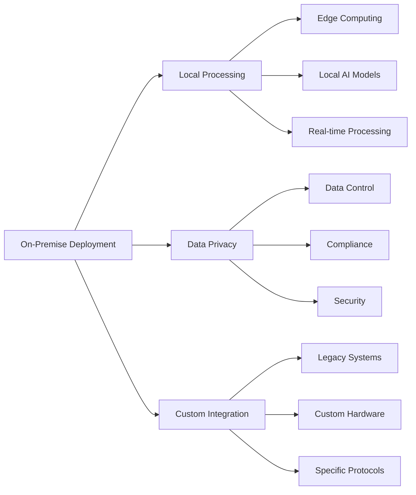
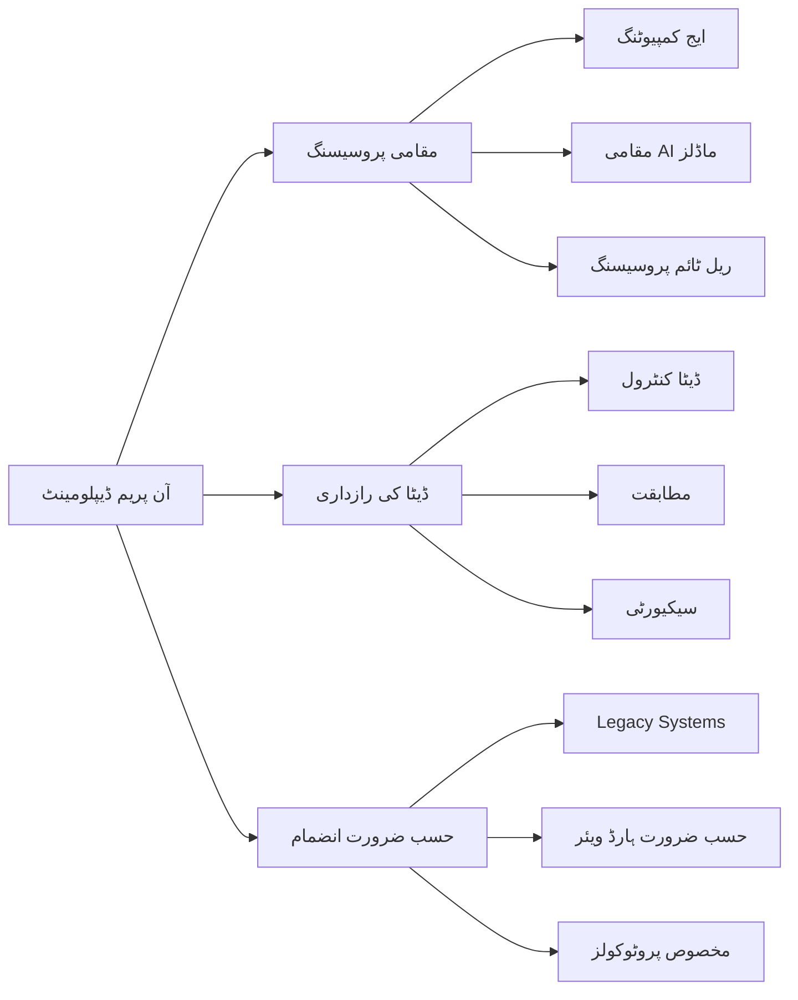

import { PersonalizeButton, UrduToggleButton } from '@site/src/components/LanguageButtons';

<PersonalizeButton />
<UrduToggleButton />

# Chapter 12: Deployment & Optimization

## Introduction

Welcome to Chapter 12 of the Physical AI & Humanoid Robotics textbook. This chapter focuses on the critical aspects of deploying humanoid robotics systems in real-world environments and optimizing their performance for sustained operation. Deployment and optimization are the final, yet crucial, steps in bringing robotic systems from development to practical use.

This chapter covers deployment strategies, performance optimization techniques, resource management, and best practices for ensuring that humanoid robots operate efficiently and reliably in their target environments. We'll explore how to optimize computational resources, energy consumption, and system responsiveness while maintaining safety and functionality.

The deployment phase often reveals challenges that weren't apparent during development, making optimization a continuous process that extends throughout the robot's operational lifetime. Understanding these concepts is essential for creating robotic systems that can deliver consistent performance in real-world applications.

## Deployment Strategies

Deploying humanoid robots in real-world environments requires careful planning and consideration of various factors including environment conditions, user requirements, safety protocols, and system maintenance. Different deployment strategies address different operational contexts and requirements.

### On-Premise Deployment

On-premise deployment involves installing and operating robots within the user's own facilities, providing maximum control over the environment and data.



### Cloud-Based Deployment

Cloud-based deployment leverages remote servers for processing and data storage, offering scalability and reduced local hardware requirements.

```python
# Example: Cloud-Based Robot Deployment Manager
import asyncio
import aiohttp
import json
from typing import Dict, List, Optional
from dataclasses import dataclass

@dataclass
class RobotDeploymentConfig:
    robot_id: str
    location: str
    capabilities: List[str]
    cloud_endpoint: str
    processing_mode: str  # 'edge', 'cloud', or 'hybrid'

class CloudDeploymentManager:
    def __init__(self, cloud_endpoint: str):
        self.cloud_endpoint = cloud_endpoint
        self.deployed_robots = {}
        self.session = None

    async def initialize(self):
        """Initialize the cloud deployment manager"""
        self.session = aiohttp.ClientSession()

    async def deploy_robot(self, config: RobotDeploymentConfig) -> bool:
        """Deploy a robot to the cloud infrastructure"""
        try:
            deployment_payload = {
                'robot_id': config.robot_id,
                'location': config.location,
                'capabilities': config.capabilities,
                'processing_mode': config.processing_mode,
                'timestamp': asyncio.get_event_loop().time()
            }

            async with self.session.post(
                f"{self.cloud_endpoint}/deploy",
                json=deployment_payload
            ) as response:
                result = await response.json()
                if response.status == 200:
                    self.deployed_robots[config.robot_id] = result
                    return True
                else:
                    print(f"Deployment failed: {result}")
                    return False
        except Exception as e:
            print(f"Deployment error: {e}")
            return False

    async def monitor_robot(self, robot_id: str) -> Optional[Dict]:
        """Monitor the status of a deployed robot"""
        try:
            async with self.session.get(
                f"{self.cloud_endpoint}/monitor/{robot_id}"
            ) as response:
                if response.status == 200:
                    return await response.json()
                else:
                    return None
        except Exception as e:
            print(f"Monitoring error: {e}")
            return None

    async def optimize_resources(self, robot_id: str, current_load: float) -> Dict:
        """Optimize cloud resources based on current load"""
        try:
            optimization_payload = {
                'robot_id': robot_id,
                'current_load': current_load,
                'timestamp': asyncio.get_event_loop().time()
            }

            async with self.session.post(
                f"{self.cloud_endpoint}/optimize",
                json=optimization_payload
            ) as response:
                if response.status == 200:
                    return await response.json()
                else:
                    return {'error': 'Optimization failed'}
        except Exception as e:
            print(f"Optimization error: {e}")
            return {'error': str(e)}

    async def update_robot_software(self, robot_id: str, update_package: str) -> bool:
        """Update robot software through cloud deployment"""
        try:
            update_payload = {
                'robot_id': robot_id,
                'update_package': update_package,
                'timestamp': asyncio.get_event_loop().time()
            }

            async with self.session.post(
                f"{self.cloud_endpoint}/update",
                json=update_payload
            ) as response:
                return response.status == 200
        except Exception as e:
            print(f"Update error: {e}")
            return False

    async def cleanup(self):
        """Clean up resources"""
        if self.session:
            await self.session.close()

# Example usage
async def deploy_robot_example():
    config = RobotDeploymentConfig(
        robot_id="HR-001",
        location="Hospital Room 101",
        capabilities=["navigation", "object_manipulation", "speech_recognition"],
        cloud_endpoint="https://api.robotcloud.example.com",
        processing_mode="hybrid"
    )

    manager = CloudDeploymentManager(config.cloud_endpoint)
    await manager.initialize()

    success = await manager.deploy_robot(config)
    if success:
        print(f"Robot {config.robot_id} deployed successfully")

        # Monitor robot performance
        status = await manager.monitor_robot(config.robot_id)
        if status:
            print(f"Robot status: {status}")

        # Optimize resources based on load
        optimization_result = await manager.optimize_resources(config.robot_id, 0.7)
        print(f"Optimization result: {optimization_result}")

    await manager.cleanup()

# Run the example
# asyncio.run(deploy_robot_example())
```

### Hybrid Deployment

Hybrid deployment combines local processing with cloud resources, offering the best of both approaches by balancing performance, privacy, and scalability.

```python
# Example: Hybrid Deployment Architecture
import threading
import queue
import time
from typing import Callable, Any
import numpy as np

class HybridDeploymentManager:
    def __init__(self, local_processing_capacity: int, cloud_processing_capacity: int):
        self.local_capacity = local_processing_capacity
        self.cloud_capacity = cloud_processing_capacity
        self.local_queue = queue.Queue()
        self.cloud_queue = queue.Queue()
        self.processing_threads = []
        self.cloud_connector = None

    def initialize_cloud_connector(self, cloud_endpoint: str):
        """Initialize connection to cloud processing service"""
        # In real implementation, this would connect to cloud API
        self.cloud_connector = {
            'endpoint': cloud_endpoint,
            'connected': True,
            'last_heartbeat': time.time()
        }

    def route_task(self, task: Dict[str, Any]) -> str:
        """
        Route task to appropriate processing location based on:
        - Task complexity
        - Data sensitivity
        - Real-time requirements
        - Current system load
        """
        task_complexity = task.get('complexity', 'low')
        data_sensitive = task.get('data_sensitive', False)
        real_time_required = task.get('real_time', False)
        current_local_load = self.get_local_load()
        current_cloud_load = self.get_cloud_load()

        # High sensitivity data goes to local processing
        if data_sensitive:
            return 'local'

        # Real-time tasks with low complexity go to local
        if real_time_required and task_complexity == 'low':
            if current_local_load < 0.8:  # 80% threshold
                return 'local'
            else:
                return 'cloud'  # Even if real-time, route to cloud if local is overloaded

        # Complex tasks go to cloud
        if task_complexity == 'high':
            return 'cloud'

        # Medium complexity tasks based on load
        if task_complexity == 'medium':
            if current_local_load < current_cloud_load:
                return 'local'
            else:
                return 'cloud'

        # Default to local for low complexity
        return 'local'

    def get_local_load(self) -> float:
        """Get current local processing load (0.0 to 1.0)"""
        # Simulate load calculation
        processing_rate = np.random.uniform(0.1, 0.9)
        return processing_rate

    def get_cloud_load(self) -> float:
        """Get current cloud processing load (0.0 to 1.0)"""
        # Simulate cloud load (in real implementation, this would query cloud service)
        return np.random.uniform(0.2, 0.7)

    def process_local_task(self, task: Dict[str, Any]) -> Dict[str, Any]:
        """Process task locally"""
        # Simulate local processing
        processing_time = np.random.uniform(0.1, 0.5)  # 100-500ms
        time.sleep(processing_time)

        result = {
            'task_id': task['id'],
            'result': f"Processed locally: {task['data']}",
            'processing_time': processing_time,
            'location': 'local'
        }

        return result

    def process_cloud_task(self, task: Dict[str, Any]) -> Dict[str, Any]:
        """Process task in cloud"""
        # Simulate cloud processing (with network latency)
        network_latency = np.random.uniform(0.05, 0.2)  # 50-200ms network
        processing_time = np.random.uniform(0.05, 0.3)  # 50-300ms processing
        time.sleep(network_latency + processing_time)

        result = {
            'task_id': task['id'],
            'result': f"Processed in cloud: {task['data']}",
            'processing_time': processing_time + network_latency,
            'location': 'cloud'
        }

        return result

    def start_processing(self):
        """Start processing tasks in both local and cloud queues"""
        # Start local processing thread
        local_thread = threading.Thread(target=self._local_processing_loop)
        local_thread.daemon = True
        local_thread.start()
        self.processing_threads.append(local_thread)

        # Start cloud processing thread
        cloud_thread = threading.Thread(target=self._cloud_processing_loop)
        cloud_thread.daemon = True
        cloud_thread.start()
        self.processing_threads.append(cloud_thread)

    def _local_processing_loop(self):
        """Local processing loop"""
        while True:
            try:
                task = self.local_queue.get(timeout=1.0)
                result = self.process_local_task(task)
                # Handle result (could be callback, queue, etc.)
                print(f"Local processing result: {result}")
                self.local_queue.task_done()
            except queue.Empty:
                continue

    def _cloud_processing_loop(self):
        """Cloud processing loop"""
        while True:
            try:
                task = self.cloud_queue.get(timeout=1.0)
                result = self.process_cloud_task(task)
                # Handle result
                print(f"Cloud processing result: {result}")
                self.cloud_queue.task_done()
            except queue.Empty:
                continue

    def submit_task(self, task: Dict[str, Any]) -> str:
        """Submit task for processing"""
        route = self.route_task(task)

        if route == 'local':
            self.local_queue.put(task)
        else:
            self.cloud_queue.put(task)

        return route

# Example usage
def hybrid_deployment_example():
    manager = HybridDeploymentManager(
        local_processing_capacity=4,
        cloud_processing_capacity=10
    )

    manager.initialize_cloud_connector("https://api.robotcloud.example.com")
    manager.start_processing()

    # Submit various tasks
    tasks = [
        {'id': 'task_1', 'data': 'face_recognition', 'complexity': 'high', 'data_sensitive': True, 'real_time': True},
        {'id': 'task_2', 'data': 'path_planning', 'complexity': 'medium', 'data_sensitive': False, 'real_time': False},
        {'id': 'task_3', 'data': 'object_detection', 'complexity': 'medium', 'data_sensitive': True, 'real_time': True},
        {'id': 'task_4', 'data': 'data_analysis', 'complexity': 'high', 'data_sensitive': False, 'real_time': False},
    ]

    for task in tasks:
        route = manager.submit_task(task)
        print(f"Task {task['id']} routed to: {route}")

    # Let processing continue for a while
    time.sleep(2)

    return manager
```

## Performance Optimization Techniques

Performance optimization in robotics involves improving computational efficiency, reducing energy consumption, and enhancing system responsiveness. These optimizations are critical for ensuring that humanoid robots can operate effectively in real-world environments.

### Computational Optimization

Computational optimization focuses on improving the efficiency of algorithms and reducing processing overhead:

```python
# Example: Computational Optimization for Robotics
import numpy as np
import time
from functools import wraps
import threading
from typing import Callable, Any

class ComputationalOptimizer:
    def __init__(self):
        self.optimization_cache = {}
        self.performance_metrics = {}
        self.optimization_enabled = True

    def optimize_matrix_operations(self, matrix_a: np.ndarray, matrix_b: np.ndarray) -> np.ndarray:
        """
        Optimize matrix operations using various techniques
        """
        # Choose optimization based on matrix size
        if matrix_a.shape[0] > 1000 or matrix_b.shape[1] > 1000:
            # Use optimized BLAS operations for large matrices
            return np.dot(matrix_a, matrix_b)
        else:
            # Use standard operations for smaller matrices
            return np.dot(matrix_a, matrix_b)

    def optimize_kinematics(self, joint_angles: np.ndarray) -> Dict[str, np.ndarray]:
        """
        Optimize forward kinematics calculations
        """
        # Pre-compute trigonometric values to avoid repeated calculations
        cos_angles = np.cos(joint_angles)
        sin_angles = np.sin(joint_angles)

        # Use vectorized operations for efficiency
        # Simplified kinematics for example
        positions = np.zeros((len(joint_angles), 3))
        for i, (c, s) in enumerate(zip(cos_angles, sin_angles)):
            positions[i] = [c * (i + 1), s * (i + 1), 0.5 * (i + 1)]

        return {
            'positions': positions,
            'cosines': cos_angles,
            'sines': sin_angles
        }

    def optimize_path_planning(self, start: np.ndarray, goal: np.ndarray, obstacles: np.ndarray) -> np.ndarray:
        """
        Optimize path planning using efficient algorithms
        """
        # Use A* with heuristic optimization
        # Simplified implementation for example
        path = [start]
        current = start.copy()

        # Simple straight-line path with obstacle avoidance
        while np.linalg.norm(current - goal) > 0.1:
            direction = goal - current
            direction = direction / np.linalg.norm(direction)  # Normalize

            # Check for obstacles in the path
            next_point = current + direction * 0.05  # Small step size

            # Simple obstacle avoidance
            obstacle_detected = False
            for obstacle in obstacles:
                if np.linalg.norm(next_point - obstacle) < 0.3:
                    obstacle_detected = True
                    # Move around obstacle (simplified)
                    next_point[0] += np.random.uniform(-0.1, 0.1)
                    next_point[1] += np.random.uniform(-0.1, 0.1)
                    break

            if not obstacle_detected:
                path.append(next_point.copy())
                current = next_point

        return np.array(path)

    def profile_function(self, func_name: str = None):
        """
        Decorator to profile function performance
        """
        def decorator(func: Callable) -> Callable:
            name = func_name or func.__name__

            @wraps(func)
            def wrapper(*args, **kwargs):
                start_time = time.perf_counter()
                result = func(*args, **kwargs)
                end_time = time.perf_counter()

                execution_time = end_time - start_time

                # Store performance metrics
                if name not in self.performance_metrics:
                    self.performance_metrics[name] = []
                self.performance_metrics[name].append(execution_time)

                # Print performance info (in real implementation, log to file)
                print(f"{name} executed in {execution_time:.4f}s")

                return result
            return wrapper
        return decorator

    def get_performance_summary(self) -> Dict[str, Dict[str, float]]:
        """
        Get performance optimization summary
        """
        summary = {}
        for func_name, times in self.performance_metrics.items():
            summary[func_name] = {
                'count': len(times),
                'avg_time': np.mean(times),
                'min_time': np.min(times),
                'max_time': np.max(times),
                'total_time': np.sum(times)
            }
        return summary

# Example usage
def computational_optimization_example():
    optimizer = ComputationalOptimizer()

    # Example 1: Matrix operations
    matrix_a = np.random.rand(100, 50)
    matrix_b = np.random.rand(50, 100)
    result = optimizer.optimize_matrix_operations(matrix_a, matrix_b)
    print(f"Matrix operation result shape: {result.shape}")

    # Example 2: Kinematics optimization
    joint_angles = np.array([0.1, 0.2, 0.3, 0.4, 0.5])
    kinematics_result = optimizer.optimize_kinematics(joint_angles)
    print(f"Kinematics positions shape: {kinematics_result['positions'].shape}")

    # Example 3: Path planning optimization
    start_pos = np.array([0.0, 0.0, 0.0])
    goal_pos = np.array([1.0, 1.0, 0.0])
    obstacles = np.array([[0.5, 0.5, 0.0], [0.7, 0.3, 0.0]])
    path = optimizer.optimize_path_planning(start_pos, goal_pos, obstacles)
    print(f"Path length: {len(path)} points")

    # Example 4: Function profiling
    @optimizer.profile_function("sensor_data_processing")
    def process_sensor_data(data):
        # Simulate sensor data processing
        time.sleep(0.01)  # Simulate processing time
        return np.mean(data, axis=0)

    # Process multiple sensor readings
    for i in range(5):
        sensor_data = np.random.rand(100, 6)  # 100 readings, 6-axis data
        result = process_sensor_data(sensor_data)

    # Get performance summary
    summary = optimizer.get_performance_summary()
    for func_name, metrics in summary.items():
        print(f"{func_name}: avg={metrics['avg_time']:.4f}s, count={metrics['count']}")

    return optimizer
```

### Memory Optimization

Memory optimization is crucial for robotics systems with limited resources:

```python
# Example: Memory Optimization for Robotics Systems
import gc
import weakref
from collections import deque
import numpy as np
from typing import Any, Dict, List

class MemoryOptimizer:
    def __init__(self, max_memory_mb: int = 512):
        self.max_memory_mb = max_memory_mb
        self.memory_usage_history = deque(maxlen=100)
        self.object_references = {}
        self.data_buffers = {}

    def optimize_data_structures(self, data: Any) -> Any:
        """
        Optimize data structures for memory efficiency
        """
        if isinstance(data, np.ndarray):
            # Use appropriate data types to reduce memory usage
            if data.dtype == np.float64:
                # Check if float32 is sufficient
                if np.allclose(data, data.astype(np.float32)):
                    return data.astype(np.float32)
            elif data.dtype == np.int64:
                # Check if smaller integer type is sufficient
                if np.all(data >= np.iinfo(np.int32).min) and np.all(data <= np.iinfo(np.int32).max):
                    return data.astype(np.int32)

        return data

    def create_memory_efficient_buffer(self, name: str, shape: tuple, dtype: np.dtype = np.float32):
        """
        Create a memory-efficient buffer for repeated use
        """
        if name not in self.data_buffers:
            self.data_buffers[name] = np.zeros(shape, dtype=dtype)
        else:
            # Resize if needed
            if self.data_buffers[name].shape != shape:
                self.data_buffers[name] = np.zeros(shape, dtype=dtype)

        return self.data_buffers[name]

    def optimize_list_storage(self, items: List[Any]) -> List[Any]:
        """
        Optimize list storage by using appropriate data types
        """
        if not items:
            return items

        # If all items are numeric, convert to numpy array
        if all(isinstance(item, (int, float)) for item in items):
            return np.array(items, dtype=np.float32 if any(isinstance(x, float) for x in items) else np.int32)

        return items

    def cleanup_unused_objects(self):
        """
        Clean up unused objects to free memory
        """
        # Force garbage collection
        collected = gc.collect()
        print(f"Garbage collected: {collected} objects")

        # Clear weak references that are no longer valid
        for key in list(self.object_references.keys()):
            if self.object_references[key] is None or self.object_references[key]() is None:
                del self.object_references[key]

    def track_memory_usage(self, usage_mb: float):
        """
        Track memory usage over time
        """
        self.memory_usage_history.append(usage_mb)

    def is_memory_optimized(self) -> bool:
        """
        Check if current memory usage is within limits
        """
        if not self.memory_usage_history:
            return True

        current_usage = self.memory_usage_history[-1]
        return current_usage <= self.max_memory_mb

    def optimize_for_real_time(self, buffer_size: int = 100) -> Dict[str, Any]:
        """
        Optimize for real-time processing with fixed-size buffers
        """
        optimization_params = {
            'buffer_size': buffer_size,
            'pre_allocated_arrays': {},
            'circular_buffers': {},
            'memory_pool': []
        }

        # Pre-allocate commonly used arrays
        optimization_params['pre_allocated_arrays'] = {
            'sensor_data': np.zeros((buffer_size, 6), dtype=np.float32),  # 6-axis sensor
            'joint_positions': np.zeros(12, dtype=np.float32),  # 12 joints
            'velocities': np.zeros(12, dtype=np.float32),
            'accelerations': np.zeros(12, dtype=np.float32)
        }

        # Create circular buffers for continuous data streams
        optimization_params['circular_buffers'] = {
            'imu_data': deque(maxlen=buffer_size),
            'encoder_counts': deque(maxlen=buffer_size),
            'control_commands': deque(maxlen=buffer_size)
        }

        return optimization_params

# Example usage
def memory_optimization_example():
    optimizer = MemoryOptimizer(max_memory_mb=256)

    # Example 1: Optimize data structures
    large_array = np.random.rand(1000, 1000).astype(np.float64)  # 64-bit floats
    optimized_array = optimizer.optimize_data_structures(large_array)
    print(f"Original dtype: {large_array.dtype}, Optimized dtype: {optimized_array.dtype}")
    print(f"Memory reduction: {(large_array.nbytes - optimized_array.nbytes) / 1024 / 1024:.2f} MB")

    # Example 2: Create memory-efficient buffers
    position_buffer = optimizer.create_memory_efficient_buffer('positions', (100, 3))
    velocity_buffer = optimizer.create_memory_efficient_buffer('velocities', (100, 3))
    print(f"Position buffer shape: {position_buffer.shape}, dtype: {position_buffer.dtype}")

    # Example 3: Optimize list storage
    sensor_readings = [1.0, 2.0, 3.0, 4.0, 5.0]
    optimized_list = optimizer.optimize_list_storage(sensor_readings)
    print(f"Optimized list type: {type(optimized_list)}")

    # Example 4: Real-time optimization
    rt_params = optimizer.optimize_for_real_time(buffer_size=50)
    print(f"Real-time buffers created: {list(rt_params['pre_allocated_arrays'].keys())}")

    # Example 5: Memory tracking
    optimizer.track_memory_usage(128.5)  # Simulate current usage
    optimizer.track_memory_usage(180.2)
    optimizer.track_memory_usage(200.1)

    is_optimized = optimizer.is_memory_optimized()
    print(f"Memory usage optimized: {is_optimized}")

    # Example 6: Cleanup
    optimizer.cleanup_unused_objects()

    return optimizer
```

## Energy Optimization

Energy optimization is critical for mobile and humanoid robots to maximize operational time between charges:

```python
# Example: Energy Optimization for Mobile Robots
import numpy as np
from typing import Dict, List, Tuple
import time

class EnergyOptimizer:
    def __init__(self, battery_capacity_wh: float = 100.0):
        self.battery_capacity = battery_capacity_wh
        self.current_charge = battery_capacity_wh
        self.energy_consumption_history = []
        self.power_profiles = {}
        self.optimization_strategies = []

    def calculate_energy_consumption(self, component: str, power_w: float, duration_s: float) -> float:
        """
        Calculate energy consumption in Wh
        """
        energy_wh = (power_w * duration_s) / 3600.0  # Convert Ws to Wh
        return energy_wh

    def estimate_battery_life(self, current_consumption_rate: float) -> float:
        """
        Estimate remaining battery life in hours
        power_rate in W
        """
        if current_consumption_rate <= 0:
            return float('inf')  # Infinite if not consuming power

        remaining_energy = self.current_charge
        estimated_life_hours = remaining_energy / (current_consumption_rate / 1000.0)  # Convert W to kW
        return estimated_life_hours

    def optimize_motor_efficiency(self, motor_loads: np.ndarray, current_speeds: np.ndarray) -> np.ndarray:
        """
        Optimize motor efficiency by adjusting operating points
        """
        # Calculate optimal speeds for minimum energy consumption
        optimal_speeds = np.zeros_like(current_speeds)

        for i, (load, current_speed) in enumerate(zip(motor_loads, current_speeds)):
            # Motor efficiency curve approximation
            # Efficiency is highest at 70-80% of maximum speed under load
            optimal_speed = current_speed
            if load > 0.8:  # High load
                optimal_speed = min(current_speed, 0.8)  # Don't exceed 80%
            elif load < 0.2:  # Low load
                optimal_speed = max(current_speed, 0.3)  # Don't go below 30% for efficiency

            optimal_speeds[i] = optimal_speed

        return optimal_speeds

    def plan_energy_efficient_path(self, start: np.ndarray, goal: np.ndarray,
                                  terrain_costs: np.ndarray) -> Tuple[np.ndarray, float]:
        """
        Plan energy-efficient path considering terrain and elevation
        """
        # Simplified energy-aware path planning
        # In real implementation, would use A* with energy cost function

        path = [start]
        current_pos = start.copy()

        total_energy_cost = 0.0

        while np.linalg.norm(current_pos - goal) > 0.1:
            # Calculate potential next positions
            possible_moves = [
                current_pos + np.array([0.1, 0.0, 0.0]),  # Right
                current_pos + np.array([-0.1, 0.0, 0.0]), # Left
                current_pos + np.array([0.0, 0.1, 0.0]),  # Forward
                current_pos + np.array([0.0, -0.1, 0.0]), # Backward
                current_pos + np.array([0.0, 0.0, 0.1]),  # Up
                current_pos + np.array([0.0, 0.0, -0.1])  # Down
            ]

            # Evaluate energy cost for each move
            best_move = None
            min_cost = float('inf')

            for move in possible_moves:
                # Calculate terrain cost (simplified)
                terrain_idx = (int(move[0] * 10) + 50, int(move[1] * 10) + 50)
                if 0 <= terrain_idx[0] < terrain_costs.shape[0] and 0 <= terrain_idx[1] < terrain_costs.shape[1]:
                    terrain_cost = terrain_costs[terrain_idx]

                    # Calculate distance cost
                    distance_cost = np.linalg.norm(move - current_pos)

                    # Calculate elevation cost
                    elevation_cost = abs(move[2] - current_pos[2]) * 2.0  # Uphill costs more

                    total_cost = terrain_cost + distance_cost + elevation_cost

                    if total_cost < min_cost:
                        min_cost = total_cost
                        best_move = move

            if best_move is not None:
                path.append(best_move.copy())
                current_pos = best_move
                total_energy_cost += min_cost
            else:
                # No valid moves found, break
                break

        return np.array(path), total_energy_cost

    def optimize_component_power_states(self, components: Dict[str, Dict]) -> Dict[str, str]:
        """
        Optimize power states for different components
        """
        power_states = {}

        for component, specs in components.items():
            current_state = specs.get('current_state', 'active')
            usage_frequency = specs.get('usage_frequency', 1.0)
            idle_power = specs.get('idle_power', 0.1)
            active_power = specs.get('active_power', 5.0)

            # Calculate optimal power state based on usage pattern
            if usage_frequency < 0.1:  # Rarely used
                optimal_state = 'sleep'  # Turn off when not needed
            elif usage_frequency < 0.3:  # Occasionally used
                optimal_state = 'idle'   # Low power mode
            else:  # Frequently used
                optimal_state = 'active' # Full power

            power_states[component] = optimal_state

        return power_states

    def implement_power_management_strategy(self, strategy_name: str, params: Dict) -> bool:
        """
        Implement various power management strategies
        """
        strategies = {
            'dynamic_voltage_scaling': self._dynamic_voltage_scaling,
            'adaptive_component_shutdown': self._adaptive_component_shutdown,
            'predictive_power_management': self._predictive_power_management
        }

        if strategy_name in strategies:
            return strategies[strategy_name](params)
        else:
            print(f"Unknown strategy: {strategy_name}")
            return False

    def _dynamic_voltage_scaling(self, params: Dict) -> bool:
        """
        Implement dynamic voltage scaling based on computational load
        """
        current_load = params.get('current_load', 0.5)
        min_voltage = params.get('min_voltage', 0.8)
        max_voltage = params.get('max_voltage', 1.2)

        # Adjust voltage based on load (simplified)
        target_voltage = min_voltage + (max_voltage - min_voltage) * current_load
        print(f"Dynamic voltage scaling: {target_voltage:.2f}V for load {current_load}")

        return True

    def _adaptive_component_shutdown(self, params: Dict) -> bool:
        """
        Shutdown unused components to save power
        """
        components = params.get('components', [])
        shutdown_threshold = params.get('shutdown_threshold', 0.1)

        for component in components:
            usage_level = component.get('usage_level', 0.0)
            if usage_level < shutdown_threshold:
                print(f"Shutting down component: {component['name']}")

        return True

    def _predictive_power_management(self, params: Dict) -> bool:
        """
        Predictive power management based on usage patterns
        """
        historical_usage = params.get('historical_usage', [])
        prediction_window = params.get('prediction_window', 3600)  # 1 hour

        if len(historical_usage) > 10:  # Need sufficient data
            # Simple prediction based on average usage
            avg_usage = np.mean(historical_usage)
            predicted_usage = avg_usage  # Simplified prediction

            print(f"Predicted usage: {predicted_usage:.2f}, adjusting power accordingly")

        return True

# Example usage
def energy_optimization_example():
    optimizer = EnergyOptimizer(battery_capacity_wh=200.0)

    # Example 1: Calculate energy consumption
    component_energy = optimizer.calculate_energy_consumption('motor_controller', 25.0, 3600.0)
    print(f"Motor controller energy consumption: {component_energy:.2f} Wh")

    # Example 2: Estimate battery life
    estimated_life = optimizer.estimate_battery_life(50.0)  # 50W consumption
    print(f"Estimated battery life: {estimated_life:.2f} hours")

    # Example 3: Optimize motor efficiency
    motor_loads = np.array([0.9, 0.3, 0.7, 0.2, 0.8])  # Load factors
    current_speeds = np.array([0.9, 0.4, 0.6, 0.3, 0.7])  # Current speeds
    optimal_speeds = optimizer.optimize_motor_efficiency(motor_loads, current_speeds)
    print(f"Optimal speeds: {optimal_speeds}")

    # Example 4: Energy-efficient path planning
    start_pos = np.array([0.0, 0.0, 0.0])
    goal_pos = np.array([10.0, 10.0, 0.0])
    terrain_costs = np.random.rand(100, 100)  # Random terrain costs
    path, energy_cost = optimizer.plan_energy_efficient_path(start_pos, goal_pos, terrain_costs)
    print(f"Energy-efficient path cost: {energy_cost:.2f}")

    # Example 5: Optimize component power states
    components = {
        'camera': {'current_state': 'active', 'usage_frequency': 0.8, 'idle_power': 0.5, 'active_power': 3.0},
        'lidar': {'current_state': 'active', 'usage_frequency': 0.1, 'idle_power': 0.2, 'active_power': 8.0},
        'imu': {'current_state': 'active', 'usage_frequency': 1.0, 'idle_power': 0.05, 'active_power': 0.5}
    }
    power_states = optimizer.optimize_component_power_states(components)
    print(f"Optimized power states: {power_states}")

    # Example 6: Implement power management strategies
    optimizer.implement_power_management_strategy('dynamic_voltage_scaling', {
        'current_load': 0.6,
        'min_voltage': 0.8,
        'max_voltage': 1.2
    })

    optimizer.implement_power_management_strategy('adaptive_component_shutdown', {
        'components': [
            {'name': 'unused_sensor', 'usage_level': 0.05},
            {'name': 'critical_system', 'usage_level': 0.9}
        ],
        'shutdown_threshold': 0.2
    })

    return optimizer
```

## Hardware-Specific Optimization

Different hardware platforms require tailored optimization approaches based on their capabilities and constraints:

### GPU-Accelerated Optimization

For robots with powerful GPUs, we can implement optimization techniques that leverage parallel processing:

```jsx
// Example: GPU-Accelerated Optimization Component (React/Preact)
import React, { useState, useEffect, useRef } from 'react';

const GPUOptimizationComponent = ({ robotSpecs }) => {
  const [optimizationMetrics, setOptimizationMetrics] = useState({
    fps: 0,
    memoryUsage: 0,
    computeEfficiency: 0,
    powerConsumption: 0
  });

  const [optimizationStatus, setOptimizationStatus] = useState('inactive');
  const [activeOptimizations, setActiveOptimizations] = useState([]);

  const canvasRef = useRef(null);
  const animationRef = useRef(null);

  useEffect(() => {
    if (robotSpecs.gpuModel) {
      initializeGPUOptimization();
    }

    return () => {
      if (animationRef.current) {
        cancelAnimationFrame(animationRef.current);
      }
    };
  }, [robotSpecs]);

  const initializeGPUOptimization = () => {
    const gpuCapabilities = analyzeGPUCapabilities(robotSpecs.gpuModel);

    if (gpuCapabilities.tensorCoreSupport) {
      // Enable advanced optimization techniques
      enableTensorCoreOptimizations();
    }

    if (gpuCapabilities.rayTracingSupport) {
      enableRayTracingOptimizations();
    }

    setOptimizationStatus('active');
  };

  const analyzeGPUCapabilities = (gpuModel) => {
    // Determine GPU capabilities for optimization
    const capabilities = {
      tensorCoreSupport: gpuModel.includes('RTX') || gpuModel.includes('Tesla'),
      rayTracingSupport: gpuModel.includes('RTX'),
      cudaCores: extractCudaCores(gpuModel),
      memorySize: robotSpecs.gpuMemory || 8192,
      computeCapability: extractComputeCapability(gpuModel),
      optimizationsEnabled: true
    };

    return capabilities;
  };

  const extractCudaCores = (gpuModel) => {
    // Simplified core count extraction
    if (gpuModel.includes('RTX 4090')) return 16384;
    if (gpuModel.includes('RTX 4080')) return 9728;
    if (gpuModel.includes('RTX 3090')) return 10496;
    if (gpuModel.includes('RTX 3080')) return 8704;
    return 2560; // Default for older GPUs
  };

  const extractComputeCapability = (gpuModel) => {
    // Simplified compute capability extraction
    if (gpuModel.includes('RTX 40')) return 8.9;
    if (gpuModel.includes('RTX 30')) return 8.6;
    if (gpuModel.includes('RTX 20')) return 7.5;
    return 6.0;
  };

  const enableTensorCoreOptimizations = () => {
    setActiveOptimizations(prev => [...prev, 'tensor_cores']);
    console.log('Tensor Core optimizations enabled');
  };

  const enableRayTracingOptimizations = () => {
    setActiveOptimizations(prev => [...prev, 'ray_tracing']);
    console.log('Ray Tracing optimizations enabled');
  };

  const updateOptimizationMetrics = () => {
    // Simulate optimization metrics updates
    setOptimizationMetrics(prev => ({
      ...prev,
      fps: Math.random() * 30 + 60, // 60-90 FPS
      memoryUsage: Math.random() * 60 + 20, // 20-80% memory usage
      computeEfficiency: Math.random() * 40 + 60, // 60-100% efficiency
      powerConsumption: Math.random() * 50 + 100 // 100-150W
    }));
  };

  useEffect(() => {
    if (optimizationStatus === 'active') {
      const interval = setInterval(updateOptimizationMetrics, 1000);
      return () => clearInterval(interval);
    }
  }, [optimizationStatus]);

  const getOptimizationStatusColor = () => {
    switch(optimizationStatus) {
      case 'active': return '#4ade80'; // green-400
      case 'inactive': return '#94a3b8'; // slate-400
      case 'warning': return '#fbbf24'; // amber-400
      default: return '#6b7280'; // gray-400
    }
  };

  return (
    <div className="gpu-optimization-container">
      <h3>GPU-Accelerated Optimization</h3>

      <div className="optimization-status" style={{ backgroundColor: getOptimizationStatusColor() }}>
        Status: {optimizationStatus.toUpperCase()}
      </div>

      <div className="active-optimizations">
        <h4>Active Optimizations:</h4>
        <ul>
          {activeOptimizations.map((opt, index) => (
            <li key={index} className="optimization-item">
              {opt.replace('_', ' ').replace(/\b\w/g, l => l.toUpperCase())}
            </li>
          ))}
          {activeOptimizations.length === 0 && <li>None active</li>}
        </ul>
      </div>

      <div className="performance-metrics">
        <h4>Performance Metrics:</h4>
        <p>FPS: {optimizationMetrics.fps.toFixed(1)}</p>
        <p>Memory Usage: {optimizationMetrics.memoryUsage.toFixed(1)}%</p>
        <p>Compute Efficiency: {optimizationMetrics.computeEfficiency.toFixed(1)}%</p>
        <p>Power Consumption: {optimizationMetrics.powerConsumption.toFixed(1)}W</p>
      </div>

      <canvas
        ref={canvasRef}
        className="optimization-visualization"
        width={400}
        height={200}
      />
    </div>
  );
};

export default GPUOptimizationComponent;
```

### Jetson-Based Optimization

For NVIDIA Jetson platforms, we implement optimization techniques specific to ARM architecture and embedded systems:

```python
# Example: Jetson-Specific Optimization
import jetson.utils
import jetson.inference
import numpy as np
import time
import threading
import subprocess
from typing import Dict, List, Optional

class JetsonOptimizer:
    def __init__(self, jetson_model: str = "jetson_nano"):
        self.jetson_model = jetson_model
        self.is_jetson = self.detect_jetson_platform()
        self.power_mode = "MAXN"  # Maximum performance
        self.optimization_enabled = True
        self.resource_monitor = None

        if self.is_jetson:
            self.configure_jetson_optimizations()

    def detect_jetson_platform(self):
        """Detect if running on NVIDIA Jetson"""
        try:
            with open('/proc/device-tree/model', 'r') as f:
                model = f.read().strip('\x00')
                return 'jetson' in model.lower()
        except:
            return False

    def configure_jetson_optimizations(self):
        """Configure optimizations specific to Jetson platform"""
        # Set power mode for optimal performance
        self.set_jetson_power_mode(self.power_mode)

        # Enable Jetson-specific features
        self.use_tensorrt = True
        self.enable_jetson_memory_pool = True
        self.use_jetson_power_management = True

    def set_jetson_power_mode(self, mode: str):
        """Set Jetson power mode"""
        try:
            subprocess.run(['nvpmodel', '-m', mode], check=True)
            print(f"Jetson power mode set to: {mode}")
        except subprocess.CalledProcessError:
            print(f"Could not set power mode to {mode}")

    def optimize_inference(self, model_path: str, input_shape: tuple):
        """Optimize model for Jetson inference"""
        if not self.is_jetson:
            return None

        # In real implementation, this would use TensorRT optimization
        # For simulation, return a mock optimized model
        optimized_model = {
            'model_path': model_path,
            'input_shape': input_shape,
            'optimized_for': self.jetson_model,
            'precision': 'fp16' if self.supports_fp16() else 'fp32',
            'batch_size': self.get_optimal_batch_size()
        }

        return optimized_model

    def supports_fp16(self) -> bool:
        """Check if Jetson supports FP16 precision"""
        # Different Jetson models have different FP16 support
        fp16_supported_models = ["jetson_xavier", "jetson_agx_xavier", "jetson_orin"]
        return any(model in self.jetson_model.lower() for model in fp16_supported_models)

    def get_optimal_batch_size(self) -> int:
        """Get optimal batch size based on Jetson model"""
        if "nano" in self.jetson_model.lower():
            return 1
        elif "xavier" in self.jetson_model.lower():
            return 4
        elif "orin" in self.jetson_model.lower():
            return 8
        else:
            return 2

    def optimize_memory_usage(self, required_memory_mb: int) -> Dict[str, any]:
        """Optimize memory usage for Jetson platform"""
        memory_info = self.get_jetson_memory_info()

        optimization_strategies = []

        if required_memory_mb > memory_info['available_mb'] * 0.8:
            # Memory pressure detected, apply optimization strategies
            optimization_strategies.extend([
                'reduce_tensor_precision',
                'enable_memory_compression',
                'use_memory_pool',
                'optimize_data_loading'
            ])

        return {
            'current_memory': memory_info,
            'required_memory': required_memory_mb,
            'strategies_applied': optimization_strategies,
            'optimized': len(optimization_strategies) > 0
        }

    def get_jetson_memory_info(self) -> Dict[str, any]:
        """Get Jetson memory information"""
        try:
            with open('/proc/meminfo', 'r') as f:
                meminfo = f.read()

            # Parse memory information
            total_line = [line for line in meminfo.split('\n') if 'MemTotal' in line][0]
            free_line = [line for line in meminfo.split('\n') if 'MemFree' in line][0]

            total_kb = int(total_line.split()[1])
            free_kb = int(free_line.split()[1])

            return {
                'total_mb': total_kb / 1024,
                'free_mb': free_kb / 1024,
                'available_mb': free_kb / 1024,  # Simplified
                'used_mb': (total_kb - free_kb) / 1024
            }
        except:
            # Fallback values
            return {
                'total_mb': 4096,
                'free_mb': 2048,
                'available_mb': 1500,
                'used_mb': 2596
            }

    def optimize_for_real_time(self) -> bool:
        """Optimize Jetson system for real-time performance"""
        try:
            # Set CPU governor to performance mode
            subprocess.run(['sudo', 'sh', '-c', 'echo performance > /sys/devices/system/cpu/cpu0/cpufreq/scaling_governor'], check=True)

            # Optimize interrupt handling
            # This would involve system-level optimizations in real implementation

            print("Jetson real-time optimizations applied")
            return True
        except:
            print("Could not apply real-time optimizations")
            return False

    def start_resource_monitoring(self):
        """Start monitoring Jetson resources"""
        self.resource_monitor = threading.Thread(target=self._resource_monitor_loop)
        self.resource_monitor.daemon = True
        self.resource_monitor.start()

    def _resource_monitor_loop(self):
        """Resource monitoring loop"""
        while self.optimization_enabled:
            memory_info = self.get_jetson_memory_info()
            cpu_usage = self.get_cpu_usage()

            # Apply optimizations based on resource usage
            if memory_info['available_mb'] < 500:  # Less than 500MB available
                self.apply_memory_optimizations()

            if cpu_usage > 80:  # High CPU usage
                self.apply_cpu_optimizations()

            time.sleep(1)  # Monitor every second

    def get_cpu_usage(self) -> float:
        """Get CPU usage percentage"""
        try:
            with open('/proc/stat', 'r') as f:
                line = f.readline()
            cpu_times = [int(x) for x in line.split()[1:]]
            idle_time = cpu_times[3]
            total_time = sum(cpu_times)

            if not hasattr(self, '_prev_idle') or not hasattr(self, '_prev_total'):
                self._prev_idle = idle_time
                self._prev_total = total_time
                return 0.0

            idle_delta = idle_time - self._prev_idle
            total_delta = total_time - self._prev_total

            self._prev_idle = idle_time
            self._prev_total = total_time

            if total_delta == 0:
                return 0.0

            cpu_usage = 100.0 * (1.0 - idle_delta / total_delta)
            return cpu_usage
        except:
            return 50.0  # Default value

    def apply_memory_optimizations(self):
        """Apply memory optimizations"""
        print("Applying memory optimizations for Jetson...")
        # In real implementation, this would release unused memory, optimize allocations, etc.

    def apply_cpu_optimizations(self):
        """Apply CPU optimizations"""
        print("Applying CPU optimizations for Jetson...")
        # In real implementation, this would adjust scheduling, priorities, etc.

# Example usage
def jetson_optimization_example():
    optimizer = JetsonOptimizer(jetson_model="jetson_xavier_nx")

    if optimizer.is_jetson:
        print("Jetson optimizations available")

        # Optimize a model
        optimized_model = optimizer.optimize_inference(
            model_path="/path/to/model.onnx",
            input_shape=(1, 3, 224, 224)
        )
        print(f"Optimized model: {optimized_model}")

        # Optimize memory usage
        mem_opt = optimizer.optimize_memory_usage(required_memory_mb=2000)
        print(f"Memory optimization: {mem_opt}")

        # Optimize for real-time
        rt_opt = optimizer.optimize_for_real_time()
        print(f"Real-time optimization applied: {rt_opt}")

        # Start resource monitoring
        optimizer.start_resource_monitoring()

        # Run for 10 seconds
        time.sleep(10)

        optimizer.optimization_enabled = False
    else:
        print("Not running on Jetson platform")

    return optimizer
```

### Real Robot Deployment Optimization

For robots with real hardware, we need comprehensive optimization for deployment:

```python
# Example: Real Robot Deployment Optimization
import rospy
import numpy as np
import time
import threading
from sensor_msgs.msg import JointState, Imu, LaserScan
from std_msgs.msg import Float64MultiArray
from geometry_msgs.msg import Twist
from control_msgs.msg import JointControllerState
import psutil
import os

class RealRobotOptimizer:
    def __init__(self, robot_type: str = "unitree_go2"):
        self.robot_type = robot_type
        self.optimization_enabled = True
        self.joint_states = None
        self.imu_data = None
        self.laser_data = None

        # Initialize ROS
        rospy.init_node('robot_optimizer', anonymous=True)

        # Subscribe to sensor data
        self.joint_sub = rospy.Subscriber('/joint_states', JointState, self.joint_callback)
        self.imu_sub = rospy.Subscriber('/imu/data', Imu, self.imu_callback)
        self.laser_sub = rospy.Subscriber('/scan', LaserScan, self.laser_callback)

        # Publishers
        self.cmd_pub = rospy.Publisher('/cmd_vel', Twist, queue_size=10)
        self.joint_cmd_pub = rospy.Publisher('/joint_commands', Float64MultiArray, queue_size=10)

        # Optimization parameters
        self.cpu_threshold = 80.0
        self.memory_threshold = 80.0
        self.battery_threshold = 20.0
        self.optimization_thread = None

        # Performance metrics
        self.performance_history = {
            'cpu_usage': [],
            'memory_usage': [],
            'battery_level': [],
            'control_frequency': []
        }

    def joint_callback(self, data):
        """Callback for joint state updates"""
        self.joint_states = data

    def imu_callback(self, data):
        """Callback for IMU data"""
        self.imu_data = data

    def laser_callback(self, data):
        """Callback for laser scan data"""
        self.laser_data = data

    def get_system_resources(self) -> Dict[str, float]:
        """Get current system resource usage"""
        cpu_percent = psutil.cpu_percent(interval=0.1)
        memory_percent = psutil.virtual_memory().percent
        disk_percent = psutil.disk_usage('/').percent

        return {
            'cpu_percent': cpu_percent,
            'memory_percent': memory_percent,
            'disk_percent': disk_percent,
            'timestamp': time.time()
        }

    def optimize_control_frequency(self, desired_frequency: float) -> float:
        """
        Optimize control frequency based on system resources
        """
        resources = self.get_system_resources()

        if resources['cpu_percent'] > self.cpu_threshold:
            # Reduce frequency to lower CPU usage
            optimized_freq = max(10.0, desired_frequency * 0.7)  # Reduce by 30%
        elif resources['memory_percent'] > self.memory_threshold:
            # Reduce frequency to lower memory pressure
            optimized_freq = max(10.0, desired_frequency * 0.8)  # Reduce by 20%
        else:
            # System has resources, can run at desired frequency
            optimized_freq = desired_frequency

        return optimized_freq

    def optimize_trajectory_execution(self, trajectory_points: np.ndarray) -> np.ndarray:
        """
        Optimize trajectory execution based on real-time constraints
        """
        # Calculate time intervals based on current system performance
        resources = self.get_system_resources()

        if resources['cpu_percent'] > 90:
            # High CPU usage - increase time intervals to reduce computation
            time_scale = 1.5
        elif resources['cpu_percent'] > 75:
            # Moderate CPU usage - slightly increase time intervals
            time_scale = 1.2
        else:
            # Normal operation
            time_scale = 1.0

        # Scale the trajectory timing
        optimized_trajectory = trajectory_points.copy()
        # Apply timing optimization (simplified)

        return optimized_trajectory

    def optimize_sensor_processing(self) -> Dict[str, bool]:
        """
        Optimize sensor data processing based on system load
        """
        resources = self.get_system_resources()

        optimization_flags = {
            'high_fidelity_processing': True,
            'real_time_filtering': True,
            'detailed_analysis': True
        }

        if resources['cpu_percent'] > 85:
            # Critical CPU usage - reduce processing intensity
            optimization_flags = {
                'high_fidelity_processing': False,
                'real_time_filtering': True,
                'detailed_analysis': False
            }
        elif resources['cpu_percent'] > 70:
            # High CPU usage - moderate reduction
            optimization_flags = {
                'high_fidelity_processing': True,
                'real_time_filtering': True,
                'detailed_analysis': False
            }

        return optimization_flags

    def start_optimization_monitoring(self):
        """Start continuous optimization monitoring"""
        self.optimization_thread = threading.Thread(target=self.optimization_loop)
        self.optimization_thread.daemon = True
        self.optimization_thread.start()

    def optimization_loop(self):
        """Continuous optimization loop"""
        rate = rospy.Rate(1)  # 1 Hz optimization check

        while not rospy.is_shutdown() and self.optimization_enabled:
            try:
                # Get current system resources
                resources = self.get_system_resources()

                # Store performance metrics
                self.performance_history['cpu_usage'].append(resources['cpu_percent'])
                self.performance_history['memory_usage'].append(resources['memory_percent'])

                # Apply optimizations based on resource usage
                if resources['cpu_percent'] > self.cpu_threshold:
                    self.apply_cpu_optimizations()
                if resources['memory_percent'] > self.memory_threshold:
                    self.apply_memory_optimizations()

                # Log optimization events
                if len(self.performance_history['cpu_usage']) % 10 == 0:
                    avg_cpu = np.mean(self.performance_history['cpu_usage'][-10:])
                    avg_memory = np.mean(self.performance_history['memory_usage'][-10:])
                    print(f"Performance - CPU: {avg_cpu:.1f}%, Memory: {avg_memory:.1f}%")

            except Exception as e:
                print(f"Optimization loop error: {e}")

            rate.sleep()

    def apply_cpu_optimizations(self):
        """Apply CPU usage optimizations"""
        print("Applying CPU optimizations...")
        # In real implementation, this would:
        # - Reduce algorithm complexity
        # - Lower control frequency
        # - Disable non-critical processes
        # - Optimize algorithm implementations

    def apply_memory_optimizations(self):
        """Apply memory usage optimizations"""
        print("Applying memory optimizations...")
        # In real implementation, this would:
        # - Clear unused buffers
        # - Optimize data structures
        # - Reduce buffer sizes
        # - Enable memory pooling

    def get_optimization_recommendations(self) -> List[str]:
        """Get optimization recommendations based on performance history"""
        recommendations = []

        if self.performance_history['cpu_usage']:
            avg_cpu = np.mean(self.performance_history['cpu_usage'])
            if avg_cpu > 85:
                recommendations.append("Consider upgrading to more powerful hardware or optimizing algorithms")

        if self.performance_history['memory_usage']:
            avg_memory = np.mean(self.performance_history['memory_usage'])
            if avg_memory > 80:
                recommendations.append("Implement more efficient memory management")

        return recommendations

    def enable_optimization(self):
        """Enable optimization system"""
        self.optimization_enabled = True
        self.start_optimization_monitoring()

    def disable_optimization(self):
        """Disable optimization system"""
        self.optimization_enabled = False

# Example usage
def real_robot_optimization_example():
    optimizer = RealRobotOptimizer(robot_type="unitree_go2")

    print("Real robot optimization system initialized")
    optimizer.enable_optimization()

    # Simulate robot operation for 30 seconds
    start_time = time.time()
    while time.time() - start_time < 30 and not rospy.is_shutdown():
        # Simulate robot control tasks
        resources = optimizer.get_system_resources()

        # Optimize control frequency
        optimized_freq = optimizer.optimize_control_frequency(50.0)  # 50 Hz desired

        # Print current optimization status
        print(f"CPU: {resources['cpu_percent']:.1f}%, Memory: {resources['memory_percent']:.1f}%, Optimized freq: {optimized_freq:.1f}Hz")

        time.sleep(1)

    # Get recommendations
    recommendations = optimizer.get_optimization_recommendations()
    print(f"Optimization recommendations: {recommendations}")

    optimizer.disable_optimization()

    return optimizer
```

## Urdu Content: ڈیپلومینٹ اور آپٹیمائزیشن

<details>
<summary>اردو میں پڑھیں / Show in Urdu</summary>

# باب 12: ڈیپلومینٹ اور آپٹیمائزیشن

## تعارف

"ڈیپلومینٹ اور آپٹیمائزیشن" کا باب 12 آپ کو فزیکل ای آئی اور ہیومنوائڈ روبوٹکس کے ٹیکسٹ بک میں خوش آمدید کہتا ہے۔ یہ باب حقیقی دنیا کے ماحول میں ہیومنوائڈ روبوٹکس سسٹمز کو اتارنے اور ان کی کارکردگی کو بہتر بنانے کے اہم پہلوؤں پر تبادلہ خیال کرتا ہے۔ ڈیپلومینٹ اور آپٹیمائزیشن ترقی سے عملی استعمال تک روبوٹکس سسٹمز کو لانے کے آخری، لیکن انتہائی اہم، مراحل ہیں۔

یہ باب ڈیپلومینٹ کی حکمت عملیوں، کارکردگی کی بہتری کی تکنیکوں، وسائل کے نظم و نسق، اور یہ یقینی بنانے کے بہترین مشقوں کو احاطہ کرتا ہے کہ ہیومنوائڈ روبوٹس اپنے ہدف والے ماحول میں موثر اور قابل اعتماد طریقے سے کام کریں۔ ہم یہ جانیں گے کہ محسوبی وسائل، توانائی کی کھپت، اور سسٹم کی تیزی کو کیسے بہتر بنایا جائے جبکہ محفوظ اور کارکردگی برقرار رکھی جائے۔

ڈیپلومینٹ کا مرحلہ اکثر وہ چیلنجز سامنے لاتا ہے جو ترقی کے دوران ظاہر نہیں ہوتے، جس کی وجہ سے آپٹیمائزیشن ایک جاری عمل بن جاتا ہے جو روبوٹ کے عملی زندگی کے دوران جاری رہتا ہے۔ ان تصورات کو سمجھنا حقیقی دنیا کی درخواستوں میں مستقل کارکردگی فراہم کرنے والے روبوٹکس سسٹمز کو تیار کرنے کے لیے ضروری ہے۔

## ڈیپلومینٹ کی حکمت عملیاں

حقیقی دنیا کے ماحول میں ہیومنوائڈ روبوٹس کو اتارنے کے لیے مختلف عوامل کا جائزہ لینا اور منصوبہ بندی کرنا ضروری ہے بشمول ماحول کی حالتیں، صارف کی ضروریات، سیفٹی پروٹوکولز، اور سسٹم کی دیکھ بھال۔ مختلف ڈیپلومینٹ کی حکمت عملیاں مختلف آپریشنل سیاق و سباق اور ضروریات کو حل کرتی ہیں۔

### آن پریم ڈیپلومینٹ

آن پریم ڈیپلومینٹ کا مطلب ہے صارف کے اپنے اداروں کے اندر روبوٹس کو انسٹال کرنا اور چلانا، جو ماحول اور ڈیٹا پر زیادہ سے زیادہ کنٹرول فراہم کرتا ہے۔



### کلاؤڈ بیسڈ ڈیپلومینٹ

کلاؤڈ بیسڈ ڈیپلومینٹ پروسیسنگ اور ڈیٹا اسٹوریج کے لیے ریموٹ سرورز کا استعمال کرتا ہے، جو اسکیل ایبلیٹی اور کم مقامی ہارڈ ویئر کی ضروریات کی پیش کش کرتا ہے۔

```python
# مثال: کلاؤڈ بیسڈ روبوٹ ڈیپلومینٹ مینیجر
import asyncio
import aiohttp
import json
from typing import Dict, List, Optional
from dataclasses import dataclass

@dataclass
class RobotDeploymentConfig:
    robot_id: str
    location: str
    capabilities: List[str]
    cloud_endpoint: str
    processing_mode: str  # 'edge', 'cloud', یا 'hybrid'

class CloudDeploymentManager:
    def __init__(self, cloud_endpoint: str):
        self.cloud_endpoint = cloud_endpoint
        self.deployed_robots = {}
        self.session = None

    async def initialize(self):
        """کلاؤڈ ڈیپلومینٹ مینیجر کو شروع کریں"""
        self.session = aiohttp.ClientSession()

    async def deploy_robot(self, config: RobotDeploymentConfig) -> bool:
        """کلاؤڈ انفراسٹرکچر میں روبوٹ کو اتاریں"""
        try:
            deployment_payload = {
                'robot_id': config.robot_id,
                'location': config.location,
                'capabilities': config.capabilities,
                'processing_mode': config.processing_mode,
                'timestamp': asyncio.get_event_loop().time()
            }

            async with self.session.post(
                f"{self.cloud_endpoint}/deploy",
                json=deployment_payload
            ) as response:
                result = await response.json()
                if response.status == 200:
                    self.deployed_robots[config.robot_id] = result
                    return True
                else:
                    print(f"ڈیپلومینٹ ناکام: {result}")
                    return False
        except Exception as e:
            print(f"ڈیپلومینٹ کی خرابی: {e}")
            return False

    async def monitor_robot(self, robot_id: str) -> Optional[Dict]:
        """اتارے گئے روبوٹ کی حیثیت کو مانیٹر کریں"""
        try:
            async with self.session.get(
                f"{self.cloud_endpoint}/monitor/{robot_id}"
            ) as response:
                if response.status == 200:
                    return await response.json()
                else:
                    return None
        except Exception as e:
            print(f"مانیٹرنگ کی خرابی: {e}")
            return None

    async def optimize_resources(self, robot_id: str, current_load: float) -> Dict:
        """موجودہ لوڈ کی بنیاد پر کلاؤڈ وسائل کو بہتر بنائیں"""
        try:
            optimization_payload = {
                'robot_id': robot_id,
                'current_load': current_load,
                'timestamp': asyncio.get_event_loop().time()
            }

            async with self.session.post(
                f"{self.cloud_endpoint}/optimize",
                json=optimization_payload
            ) as response:
                if response.status == 200:
                    return await response.json()
                else:
                    return {'error': 'Optimization failed'}
        except Exception as e:
            print(f"Optimization error: {e}")
            return {'error': str(e)}

    async def update_robot_software(self, robot_id: str, update_package: str) -> bool:
        """کلاؤڈ ڈیپلومینٹ کے ذریعے روبوٹ سافٹ ویئر کو اپ ڈیٹ کریں"""
        try:
            update_payload = {
                'robot_id': robot_id,
                'update_package': update_package,
                'timestamp': asyncio.get_event_loop().time()
            }

            async with self.session.post(
                f"{self.cloud_endpoint}/update",
                json=update_payload
            ) as response:
                return response.status == 200
        except Exception as e:
            print(f"Update error: {e}")
            return False

    async def cleanup(self):
        """وسائل صاف کریں"""
        if self.session:
            await self.session.close()

# مثال کا استعمال
async def deploy_robot_example():
    config = RobotDeploymentConfig(
        robot_id="HR-001",
        location="Hospital Room 101",
        capabilities=["navigation", "object_manipulation", "speech_recognition"],
        cloud_endpoint="https://api.robotcloud.example.com",
        processing_mode="hybrid"
    )

    manager = CloudDeploymentManager(config.cloud_endpoint)
    await manager.initialize()

    success = await manager.deploy_robot(config)
    if success:
        print(f"Robot {config.robot_id} deployed successfully")

        # Monitor robot performance
        status = await manager.monitor_robot(config.robot_id)
        if status:
            print(f"Robot status: {status}")

        # Optimize resources based on load
        optimization_result = await manager.optimize_resources(config.robot_id, 0.7)
        print(f"Optimization result: {optimization_result}")

    await manager.cleanup()

# Run the example
# asyncio.run(deploy_robot_example())
```

### ہائبرڈ ڈیپلومینٹ

ہائبرڈ ڈیپلومینٹ مقامی پروسیسنگ کو کلاؤڈ وسائل کے ساتھ جوڑتا ہے، دونوں نقطہ نظر کا بہترین پیش کرتا ہے جو کارکردگی، رازداری، اور اسکیل ایبلیٹی کو متوازن کرتا ہے۔

```python
# مثال: ہائبرڈ ڈیپلومینٹ آرکیٹیکچر
import threading
import queue
import time
from typing import Callable, Any
import numpy as np

class HybridDeploymentManager:
    def __init__(self, local_processing_capacity: int, cloud_processing_capacity: int):
        self.local_capacity = local_processing_capacity
        self.cloud_capacity = cloud_processing_capacity
        self.local_queue = queue.Queue()
        self.cloud_queue = queue.Queue()
        self.processing_threads = []
        self.cloud_connector = None

    def initialize_cloud_connector(self, cloud_endpoint: str):
        """کلاؤڈ پروسیسنگ سروس سے رابطہ قائم کریں"""
        # حقیقی نفاذ میں، یہ کلاؤڈ API سے منسلک ہوگا
        self.cloud_connector = {
            'endpoint': cloud_endpoint,
            'connected': True,
            'last_heartbeat': time.time()
        }

    def route_task(self, task: Dict[str, Any]) -> str:
        """
        مناسب پروسیسنگ مقام کے لیے کام کا رخ کریں:
        - کام کی پیچیدگی
        - ڈیٹا کی حساسیت
        - ریل ٹائم کی ضروریات
        - موجودہ سسٹم لوڈ
        """
        task_complexity = task.get('complexity', 'low')
        data_sensitive = task.get('data_sensitive', False)
        real_time_required = task.get('real_time', False)
        current_local_load = self.get_local_load()
        current_cloud_load = self.get_cloud_load()

        # زیادہ حساس ڈیٹا مقامی پروسیسنگ کی طرف جاتا ہے
        if data_sensitive:
            return 'local'

        # ریل ٹائم کام جو کم پیچیدہ ہیں وہ مقامی طرف جاتے ہیں
        if real_time_required and task_complexity == 'low':
            if current_local_load < 0.8:  # 80% حد
                return 'local'
            else:
                return 'cloud'  # چاہے ریل ٹائم ہو، لوڈ زیادہ ہونے پر کلاؤڈ کی طرف

        # پیچیدہ کام کلاؤڈ کی طرف جاتے ہیں
        if task_complexity == 'high':
            return 'cloud'

        # درمیانی پیچیدگی کے کام موجودہ لوڈ کی بنیاد پر
        if task_complexity == 'medium':
            if current_local_load < current_cloud_load:
                return 'local'
            else:
                return 'cloud'

        # کم پیچیدگی کے لیے ڈیفالٹ مقامی طرف
        return 'local'

    def get_local_load(self) -> float:
        """موجودہ مقامی پروسیسنگ لوڈ حاصل کریں (0.0 سے 1.0)"""
        # لوڈ کی مثال کا حساب
        processing_rate = np.random.uniform(0.1, 0.9)
        return processing_rate

    def get_cloud_load(self) -> float:
        """موجودہ کلاؤڈ پروسیسنگ لوڈ حاصل کریں (0.0 سے 1.0)"""
        # کلاؤڈ لوڈ کی مثال (حقیقی نفاذ میں، یہ کلاؤڈ سروس کو کویری کرے گا)
        return np.random.uniform(0.2, 0.7)

    def process_local_task(self, task: Dict[str, Any]) -> Dict[str, Any]:
        """کام کو مقامی طور پر پروسیس کریں"""
        # مقامی پروسیسنگ کی مثال
        processing_time = np.random.uniform(0.1, 0.5)  # 100-500ms
        time.sleep(processing_time)

        result = {
            'task_id': task['id'],
            'result': f"Processed locally: {task['data']}",
            'processing_time': processing_time,
            'location': 'local'
        }

        return result

    def process_cloud_task(self, task: Dict[str, Any]) -> Dict[str, Any]:
        """کام کو کلاؤڈ میں پروسیس کریں"""
        # کلاؤڈ پروسیسنگ کی مثال (نیٹ ورک لیٹنسی کے ساتھ)
        network_latency = np.random.uniform(0.05, 0.2)  # 50-200ms نیٹ ورک
        processing_time = np.random.uniform(0.05, 0.3)  # 50-300ms پروسیسنگ
        time.sleep(network_latency + processing_time)

        result = {
            'task_id': task['id'],
            'result': f"Processed in cloud: {task['data']}",
            'processing_time': processing_time + network_latency,
            'location': 'cloud'
        }

        return result

    def start_processing(self):
        """مقامی اور کلاؤڈ کی قطاروں میں کام پروسیس کرنا شروع کریں"""
        # مقامی پروسیسنگ تھریڈ شروع کریں
        local_thread = threading.Thread(target=self._local_processing_loop)
        local_thread.daemon = True
        local_thread.start()
        self.processing_threads.append(local_thread)

        # کلاؤڈ پروسیسنگ تھریڈ شروع کریں
        cloud_thread = threading.Thread(target=self._cloud_processing_loop)
        cloud_thread.daemon = True
        cloud_thread.start()
        self.processing_threads.append(cloud_thread)

    def _local_processing_loop(self):
        """مقامی پروسیسنگ لوپ"""
        while True:
            try:
                task = self.local_queue.get(timeout=1.0)
                result = self.process_local_task(task)
                # نتیجہ ہینڈل کریں (کال بیک، قطار، وغیرہ ہو سکتا ہے)
                print(f"Local processing result: {result}")
                self.local_queue.task_done()
            except queue.Empty:
                continue

    def _cloud_processing_loop(self):
        """کلاؤڈ پروسیسنگ لوپ"""
        while True:
            try:
                task = self.cloud_queue.get(timeout=1.0)
                result = self.process_cloud_task(task)
                # نتیجہ ہینڈل کریں
                print(f"Cloud processing result: {result}")
                self.cloud_queue.task_done()
            except queue.Empty:
                continue

    def submit_task(self, task: Dict[str, Any]) -> str:
        """پروسیسنگ کے لیے کام جمع کریں"""
        route = self.route_task(task)

        if route == 'local':
            self.local_queue.put(task)
        else:
            self.cloud_queue.put(task)

        return route

# مثال کا استعمال
def hybrid_deployment_example():
    manager = HybridDeploymentManager(
        local_processing_capacity=4,
        cloud_processing_capacity=10
    )

    manager.initialize_cloud_connector("https://api.robotcloud.example.com")
    manager.start_processing()

    # مختلف کام جمع کریں
    tasks = [
        {'id': 'task_1', 'data': 'face_recognition', 'complexity': 'high', 'data_sensitive': True, 'real_time': True},
        {'id': 'task_2', 'data': 'path_planning', 'complexity': 'medium', 'data_sensitive': False, 'real_time': False},
        {'id': 'task_3', 'data': 'object_detection', 'complexity': 'medium', 'data_sensitive': True, 'real_time': True},
        {'id': 'task_4', 'data': 'data_analysis', 'complexity': 'high', 'data_sensitive': False, 'real_time': False},
    ]

    for task in tasks:
        route = manager.submit_task(task)
        print(f"Task {task['id']} routed to: {route}")

    # پروسیسنگ کو کچھ دیر تک جاری رکھیں
    time.sleep(2)

    return manager
```

## کارکردگی کی بہتری کی تکنیکیں

روبوٹکس میں کارکردگی کی بہتری کا مطلب ہے الگورتھم کی کارکردگی کو بہتر بنانا، توانائی کی کھپت کو کم کرنا، اور سسٹم کی تیزی کو بڑھانا۔ یہ بہتریاں یقینی بنانے کے لیے انتہائی اہم ہیں کہ ہیومنوائڈ روبوٹس حقیقی دنیا کے ماحول میں مؤثر طریقے سے کام کر سکیں۔

### محسوبی بہتری

محسوبی بہتری کا مرکز الگورتھم کی کارکردگی کو بہتر بنانا اور پروسیسنگ اوور ہیڈ کو کم کرنا ہے:

```python
# مثال: روبوٹکس کے لیے محسوبی بہتری
import numpy as np
import time
from functools import wraps
import threading
from typing import Callable, Any

class ComputationalOptimizer:
    def __init__(self):
        self.optimization_cache = {}
        self.performance_metrics = {}
        self.optimization_enabled = True

    def optimize_matrix_operations(self, matrix_a: np.ndarray, matrix_b: np.ndarray) -> np.ndarray:
        """
        مختلف تکنیکوں کا استعمال کر کے میٹرکس آپریشنز کو بہتر بنائیں
        """
        # میٹرکس کے سائز کی بنیاد پر بہتری کا انتخاب کریں
        if matrix_a.shape[0] > 1000 or matrix_b.shape[1] > 1000:
            # بڑی میٹرکس کے لیے بہترین BLAS آپریشنز استعمال کریں
            return np.dot(matrix_a, matrix_b)
        else:
            # چھوٹی میٹرکس کے لیے معیاری آپریشنز استعمال کریں
            return np.dot(matrix_a, matrix_b)

    def optimize_kinematics(self, joint_angles: np.ndarray) -> Dict[str, np.ndarray]:
        """
        فارورڈ کنیمیٹکس کے حساب کو بہتر بنائیں
        """
        # دہرائی گئی محاصل کے حساب کو روکنے کے لیے مثلثی اقدار کو پہلے سے محسوب کریں
        cos_angles = np.cos(joint_angles)
        sin_angles = np.sin(joint_angles)

        # کارآمدی کے لیے ویکٹرائزڈ آپریشنز استعمال کریں
        # مثال کے لیے کنیمیٹکس کو سادہ بنایا گیا
        positions = np.zeros((len(joint_angles), 3))
        for i, (c, s) in enumerate(zip(cos_angles, sin_angles)):
            positions[i] = [c * (i + 1), s * (i + 1), 0.5 * (i + 1)]

        return {
            'positions': positions,
            'cosines': cos_angles,
            'sines': sin_angles
        }

    def optimize_path_planning(self, start: np.ndarray, goal: np.ndarray, obstacles: np.ndarray) -> np.ndarray:
        """
        کارآمد الگورتھم استعمال کر کے راستہ کی منصوبہ بندی کو بہتر بنائیں
        """
        # A* کو ہیورسٹک بہتری کے ساتھ استعمال کریں
        # مثال کے لیے سادہ نفاذ
        path = [start]
        current = start.copy()

        # سیدھی لکیر کا راستہ آبادی کے ساتھ رکاوٹ سے بچاؤ
        while np.linalg.norm(current - goal) > 0.1:
            direction = goal - current
            direction = direction / np.linalg.norm(direction)  # نارملائز

            # راستے میں رکاوٹوں کے لیے چیک کریں
            next_point = current + direction * 0.05  # چھوٹا قدم سائز

            # سادہ رکاوٹ سے بچاؤ
            obstacle_detected = False
            for obstacle in obstacles:
                if np.linalg.norm(next_point - obstacle) < 0.3:
                    obstacle_detected = True
                    # رکاوٹ کے ارد گرد منتقل ہوں (سادہ)
                    next_point[0] += np.random.uniform(-0.1, 0.1)
                    next_point[1] += np.random.uniform(-0.1, 0.1)
                    break

            if not obstacle_detected:
                path.append(next_point.copy())
                current = next_point

        return np.array(path)

    def profile_function(self, func_name: str = None):
        """
        فنکشن کارکردگی کو پروفائل کرنے کا ڈیکوریٹر
        """
        def decorator(func: Callable) -> Callable:
            name = func_name or func.__name__

            @wraps(func)
            def wrapper(*args, **kwargs):
                start_time = time.perf_counter()
                result = func(*args, **kwargs)
                end_time = time.perf_counter()

                execution_time = end_time - start_time

                # کارکردگی کے میٹرکس اسٹور کریں
                if name not in self.performance_metrics:
                    self.performance_metrics[name] = []
                self.performance_metrics[name].append(execution_time)

                # کارکردگی کی معلومات پرنٹ کریں (حقیقی نفاذ میں، فائل میں لاگ)
                print(f"{name} executed in {execution_time:.4f}s")

                return result
            return wrapper
        return decorator

    def get_performance_summary(self) -> Dict[str, Dict[str, float]]:
        """
        کارکردگی کی بہتری کا خلاصہ حاصل کریں
        """
        summary = {}
        for func_name, times in self.performance_metrics.items():
            summary[func_name] = {
                'count': len(times),
                'avg_time': np.mean(times),
                'min_time': np.min(times),
                'max_time': np.max(times),
                'total_time': np.sum(times)
            }
        return summary

# مثال کا استعمال
def computational_optimization_example():
    optimizer = ComputationalOptimizer()

    # مثال 1: میٹرکس آپریشنز
    matrix_a = np.random.rand(100, 50)
    matrix_b = np.random.rand(50, 100)
    result = optimizer.optimize_matrix_operations(matrix_a, matrix_b)
    print(f"Matrix operation result shape: {result.shape}")

    # مثال 2: کنیمیٹکس بہتری
    joint_angles = np.array([0.1, 0.2, 0.3, 0.4, 0.5])
    kinematics_result = optimizer.optimize_kinematics(joint_angles)
    print(f"Kinematics positions shape: {kinematics_result['positions'].shape}")

    # مثال 3: راستہ کی منصوبہ بندی بہتری
    start_pos = np.array([0.0, 0.0, 0.0])
    goal_pos = np.array([1.0, 1.0, 0.0])
    obstacles = np.array([[0.5, 0.5, 0.0], [0.7, 0.3, 0.0]])
    path = optimizer.optimize_path_planning(start_pos, goal_pos, obstacles)
    print(f"Path length: {len(path)} points")

    # مثال 4: فنکشن پروفائلنگ
    @optimizer.profile_function("sensor_data_processing")
    def process_sensor_data(data):
        # سینسر ڈیٹا پروسیسنگ کی مثال
        time.sleep(0.01)  # پروسیسنگ ٹائم کی مثال
        return np.mean(data, axis=0)

    # متعدد سینسر ریڈنگز کو پروسیس کریں
    for i in range(5):
        sensor_data = np.random.rand(100, 6)  # 100 ریڈنگز، 6-axis ڈیٹا
        result = process_sensor_data(sensor_data)

    # کارکردگی کا خلاصہ حاصل کریں
    summary = optimizer.get_performance_summary()
    for func_name, metrics in summary.items():
        print(f"{func_name}: avg={metrics['avg_time']:.4f}s, count={metrics['count']}")

    return optimizer
```

### میموری بہتری

محدود وسائل والے روبوٹکس سسٹمز کے لیے میموری بہتری انتہائی اہم ہے:

```python
# مثال: روبوٹکس سسٹمز کے لیے میموری بہتری
import gc
import weakref
from collections import deque
import numpy as np
from typing import Any, Dict, List

class MemoryOptimizer:
    def __init__(self, max_memory_mb: int = 512):
        self.max_memory_mb = max_memory_mb
        self.memory_usage_history = deque(maxlen=100)
        self.object_references = {}
        self.data_buffers = {}

    def optimize_data_structures(self, data: Any) -> Any:
        """
        میموری کی کارآمدی کے لیے ڈیٹا سٹرکچر کو بہتر بنائیں
        """
        if isinstance(data, np.ndarray):
            # میموری کے استعمال کو کم کرنے کے لیے مناسب ڈیٹا ٹائپس استعمال کریں
            if data.dtype == np.float64:
                # چیک کریں کہ کیا float32 کافی ہے
                if np.allclose(data, data.astype(np.float32)):
                    return data.astype(np.float32)
            elif data.dtype == np.int64:
                # چیک کریں کہ کیا چھوٹا عددی ٹائپ کافی ہے
                if np.all(data >= np.iinfo(np.int32).min) and np.all(data <= np.iinfo(np.int32).max):
                    return data.astype(np.int32)

        return data

    def create_memory_efficient_buffer(self, name: str, shape: tuple, dtype: np.dtype = np.float32):
        """
        دوبارہ استعمال کے لیے میموری کارآمد بفر بنائیں
        """
        if name not in self.data_buffers:
            self.data_buffers[name] = np.zeros(shape, dtype=dtype)
        else:
            # ضرورت کے مطابق ری سائز کریں
            if self.data_buffers[name].shape != shape:
                self.data_buffers[name] = np.zeros(shape, dtype=dtype)

        return self.data_buffers[name]

    def optimize_list_storage(self, items: List[Any]) -> List[Any]:
        """
        مناسب ڈیٹا ٹائپس استعمال کر کے فہرست کے اسٹوریج کو بہتر بنائیں
        """
        if not items:
            return items

        # اگر تمام اشیاء عددی ہیں، نامپائی ارے میں تبدیل کریں
        if all(isinstance(item, (int, float)) for item in items):
            return np.array(items, dtype=np.float32 if any(isinstance(x, float) for x in items) else np.int32)

        return items

    def cleanup_unused_objects(self):
        """
        میموری خالی کرنے کے لیے غیر استعمال شدہ اشیاء کو صاف کریں
        """
        # زبردست گاربیج کلیکشن
        collected = gc.collect()
        print(f"Garbage collected: {collected} objects")

        # غیر جائز ویک ریفرنسز صاف کریں
        for key in list(self.object_references.keys()):
            if self.object_references[key] is None or self.object_references[key]() is None:
                del self.object_references[key]

    def track_memory_usage(self, usage_mb: float):
        """
        وقت کے ساتھ میموری کے استعمال کو ٹریک کریں
        """
        self.memory_usage_history.append(usage_mb)

    def is_memory_optimized(self) -> bool:
        """
        چیک کریں کہ کیا موجودہ میموری کا استعمال حد کے اندر ہے
        """
        if not self.memory_usage_history:
            return True

        current_usage = self.memory_usage_history[-1]
        return current_usage <= self.max_memory_mb

    def optimize_for_real_time(self, buffer_size: int = 100) -> Dict[str, Any]:
        """
        مقررہ سائز کے بفرز کے ساتھ ریل ٹائم پروسیسنگ کے لیے بہتر بنائیں
        """
        optimization_params = {
            'buffer_size': buffer_size,
            'pre_allocated_arrays': {},
            'circular_buffers': {},
            'memory_pool': []
        }

        # عام استعمال والے ارےز پہلے سے مختص کریں
        optimization_params['pre_allocated_arrays'] = {
            'sensor_data': np.zeros((buffer_size, 6), dtype=np.float32),  # 6-axis سینسر
            'joint_positions': np.zeros(12, dtype=np.float32),  # 12 جوائنٹس
            'velocities': np.zeros(12, dtype=np.float32),
            'accelerations': np.zeros(12, dtype=np.float32)
        }

        # جاری ڈیٹا سٹریمز کے لیے سرکلر بفرز بنائیں
        optimization_params['circular_buffers'] = {
            'imu_data': deque(maxlen=buffer_size),
            'encoder_counts': deque(maxlen=buffer_size),
            'control_commands': deque(maxlen=buffer_size)
        }

        return optimization_params

# مثال کا استعمال
def memory_optimization_example():
    optimizer = MemoryOptimizer(max_memory_mb=256)

    # مثال 1: ڈیٹا سٹرکچر کو بہتر بنائیں
    large_array = np.random.rand(1000, 1000).astype(np.float64)  # 64-bit floats
    optimized_array = optimizer.optimize_data_structures(large_array)
    print(f"Original dtype: {large_array.dtype}, Optimized dtype: {optimized_array.dtype}")
    print(f"Memory reduction: {(large_array.nbytes - optimized_array.nbytes) / 1024 / 1024:.2f} MB")

    # مثال 2: میموری کارآمد بفرز بنائیں
    position_buffer = optimizer.create_memory_efficient_buffer('positions', (100, 3))
    velocity_buffer = optimizer.create_memory_efficient_buffer('velocities', (100, 3))
    print(f"Position buffer shape: {position_buffer.shape}, dtype: {position_buffer.dtype}")

    # مثال 3: فہرست اسٹوریج کو بہتر بنائیں
    sensor_readings = [1.0, 2.0, 3.0, 4.0, 5.0]
    optimized_list = optimizer.optimize_list_storage(sensor_readings)
    print(f"Optimized list type: {type(optimized_list)}")

    # مثال 4: ریل ٹائم بہتری
    rt_params = optimizer.optimize_for_real_time(buffer_size=50)
    print(f"Real-time buffers created: {list(rt_params['pre_allocated_arrays'].keys())}")

    # مثال 5: میموری ٹریکنگ
    optimizer.track_memory_usage(128.5)  # موجودہ استعمال کی مثال
    optimizer.track_memory_usage(180.2)
    optimizer.track_memory_usage(200.1)

    is_optimized = optimizer.is_memory_optimized()
    print(f"Memory usage optimized: {is_optimized}")

    # مثال 6: صفائی
    optimizer.cleanup_unused_objects()

    return optimizer
```

## توانائی کی بہتری

موبائل اور ہیومنوائڈ روبوٹس کے لیے توانائی کی بہتری چارجز کے درمیان آپریشن کا وقت زیادہ کرنے کے لیے انتہائی اہم ہے:

```python
# مثال: موبائل روبوٹس کے لیے توانائی کی بہتری
import numpy as np
from typing import Dict, List, Tuple
import time

class EnergyOptimizer:
    def __init__(self, battery_capacity_wh: float = 100.0):
        self.battery_capacity = battery_capacity_wh
        self.current_charge = battery_capacity_wh
        self.energy_consumption_history = []
        self.power_profiles = {}
        self.optimization_strategies = []

    def calculate_energy_consumption(self, component: str, power_w: float, duration_s: float) -> float:
        """
        Wh میں توانائی کی کھپت کا حساب لگائیں
        """
        energy_wh = (power_w * duration_s) / 3600.0  # Ws کو Wh میں تبدیل کریں
        return energy_wh

    def estimate_battery_life(self, current_consumption_rate: float) -> float:
        """
        گھنٹوں میں باقی بیٹری کی زندگی کا تخمینہ لگائیں
        پاور ریٹ W میں
        """
        if current_consumption_rate <= 0:
            return float('inf')  # اگر توانائی استعمال نہ کر رہا ہو تو لامحدود

        remaining_energy = self.current_charge
        estimated_life_hours = remaining_energy / (current_consumption_rate / 1000.0)  # W کو kW میں تبدیل کریں
        return estimated_life_hours

    def optimize_motor_efficiency(self, motor_loads: np.ndarray, current_speeds: np.ndarray) -> np.ndarray:
        """
        آپریٹنگ پوائنٹس ایڈجسٹ کر کے موتور کی کارآمدی کو بہتر بنائیں
        """
        # کم از کم توانائی کی کھپت کے لیے بہترین رفتاریں حساب لگائیں
        optimal_speeds = np.zeros_like(current_speeds)

        for i, (load, current_speed) in enumerate(zip(motor_loads, current_speeds)):
            # موتور کارآمدی کریو کی تقریب
            # کارآمدی زیادہ ہوتی ہے 70-80% زیادہ سے زیادہ رفتار پر لوڈ کے تحت
            optimal_speed = current_speed
            if load > 0.8:  # زیادہ لوڈ
                optimal_speed = min(current_speed, 0.8)  # 80% سے تجاوز نہ کریں
            elif load < 0.2:  # کم لوڈ
                optimal_speed = max(current_speed, 0.3)  # کارآمدی کے لیے 30% سے کم نہ جائیں

            optimal_speeds[i] = optimal_speed

        return optimal_speeds

    def plan_energy_efficient_path(self, start: np.ndarray, goal: np.ndarray,
                                  terrain_costs: np.ndarray) -> Tuple[np.ndarray, float]:
        """
        زمین اور اونچائی کو دیکھتے ہوئے توانائی کارآمد راستہ منصوبہ بند کریں
        """
        # سادہ توانائی کے خیال سے راستہ منصوبہ بندی
        # حقیقی نفاذ میں، A* کو توانائی کے لاگ کے فنکشن کے ساتھ استعمال کریں گے

        path = [start]
        current_pos = start.copy()

        total_energy_cost = 0.0

        while np.linalg.norm(current_pos - goal) > 0.1:
            # ممکنہ اگلی پوزیشنز کا حساب لگائیں
            possible_moves = [
                current_pos + np.array([0.1, 0.0, 0.0]),  # دائیں
                current_pos + np.array([-0.1, 0.0, 0.0]), # بائیں
                current_pos + np.array([0.0, 0.1, 0.0]),  # آگے
                current_pos + np.array([0.0, -0.1, 0.0]), # پیچھے
                current_pos + np.array([0.0, 0.0, 0.1]),  # اوپر
                current_pos + np.array([0.0, 0.0, -0.1])  # نیچے
            ]

            # ہر حرکت کے لیے توانائی کی لاگ کا جائزہ لیں
            best_move = None
            min_cost = float('inf')

            for move in possible_moves:
                # زمین کی لاگ کا حساب لگائیں (سادہ)
                terrain_idx = (int(move[0] * 10) + 50, int(move[1] * 10) + 50)
                if 0 <= terrain_idx[0] < terrain_costs.shape[0] and 0 <= terrain_idx[1] < terrain_costs.shape[1]:
                    terrain_cost = terrain_costs[terrain_idx]

                    # فاصلہ کی لاگ کا حساب لگائیں
                    distance_cost = np.linalg.norm(move - current_pos)

                    # اونچائی کی لاگ کا حساب لگائیں
                    elevation_cost = abs(move[2] - current_pos[2]) * 2.0  # اوپر جانے کی زیادہ لاگ

                    total_cost = terrain_cost + distance_cost + elevation_cost

                    if total_cost < min_cost:
                        min_cost = total_cost
                        best_move = move

            if best_move is not None:
                path.append(best_move.copy())
                current_pos = best_move
                total_energy_cost += min_cost
            else:
                # کوئی درست حرکتیں نہیں ملیں، توڑ دیں
                break

        return np.array(path), total_energy_cost

    def optimize_component_power_states(self, components: Dict[str, Dict]) -> Dict[str, str]:
        """
        مختلف اجزاء کے لیے پاور اسٹیٹس کو بہتر بنائیں
        """
        power_states = {}

        for component, specs in components.items():
            current_state = specs.get('current_state', 'active')
            usage_frequency = specs.get('usage_frequency', 1.0)
            idle_power = specs.get('idle_power', 0.1)
            active_power = specs.get('active_power', 5.0)

            # استعمال کے نمونہ کی بنیاد پر بہترین پاور اسٹیٹ کا حساب لگائیں
            if usage_frequency < 0.1:  # کم استعمال شدہ
                optimal_state = 'sleep'  # ضرورت نہ ہونے پر بند کریں
            elif usage_frequency < 0.3:  # کبھی کبھار استعمال شدہ
                optimal_state = 'idle'   # کم پاور موڈ
            else:  # اکثر استعمال شدہ
                optimal_state = 'active' # مکمل پاور

            power_states[component] = optimal_state

        return power_states

    def implement_power_management_strategy(self, strategy_name: str, params: Dict) -> bool:
        """
        مختلف پاور مینجمنٹ حکمت عملیاں نافذ کریں
        """
        strategies = {
            'dynamic_voltage_scaling': self._dynamic_voltage_scaling,
            'adaptive_component_shutdown': self._adaptive_component_shutdown,
            'predictive_power_management': self._predictive_power_management
        }

        if strategy_name in strategies:
            return strategies[strategy_name](params)
        else:
            print(f"Unknown strategy: {strategy_name}")
            return False

    def _dynamic_voltage_scaling(self, params: Dict) -> bool:
        """
        محسوبی لوڈ کی بنیاد پر ڈائی نامک وولٹیج اسکیلنگ نافذ کریں
        """
        current_load = params.get('current_load', 0.5)
        min_voltage = params.get('min_voltage', 0.8)
        max_voltage = params.get('max_voltage', 1.2)

        # لوڈ کی بنیاد پر وولٹیج ایڈجسٹ کریں (سادہ)
        target_voltage = min_voltage + (max_voltage - min_voltage) * current_load
        print(f"Dynamic voltage scaling: {target_voltage:.2f}V for load {current_load}")

        return True

    def _adaptive_component_shutdown(self, params: Dict) -> bool:
        """
        توانائی بچانے کے لیے غیر استعمال شدہ اجزاء کو بند کریں
        """
        components = params.get('components', [])
        shutdown_threshold = params.get('shutdown_threshold', 0.1)

        for component in components:
            usage_level = component.get('usage_level', 0.0)
            if usage_level < shutdown_threshold:
                print(f"Shutting down component: {component['name']}")

        return True

    def _predictive_power_management(self, params: Dict) -> bool:
        """
        استعمال کے نمونوں کی بنیاد پر پیش گو کار پاور مینجمنٹ
        """
        historical_usage = params.get('historical_usage', [])
        prediction_window = params.get('prediction_window', 3600)  # 1 گھنٹہ

        if len(historical_usage) > 10:  # کافی ڈیٹا کی ضرورت ہے
            # اوسط استعمال کی بنیاد پر سادہ پیشن گوئی
            avg_usage = np.mean(historical_usage)
            predicted_usage = avg_usage  # سادہ پیشن گوئی

            print(f"Predicted usage: {predicted_usage:.2f}, adjusting power accordingly")

        return True

# مثال کا استعمال
def energy_optimization_example():
    optimizer = EnergyOptimizer(battery_capacity_wh=200.0)

    # مثال 1: توانائی کی کھپت کا حساب لگائیں
    component_energy = optimizer.calculate_energy_consumption('motor_controller', 25.0, 3600.0)
    print(f"Motor controller energy consumption: {component_energy:.2f} Wh")

    # مثال 2: بیٹری کی زندگی کا تخمینہ لگائیں
    estimated_life = optimizer.estimate_battery_life(50.0)  # 50W کھپت
    print(f"Estimated battery life: {estimated_life:.2f} hours")

    # مثال 3: موتور کارآمدی کو بہتر بنائیں
    motor_loads = np.array([0.9, 0.3, 0.7, 0.2, 0.8])  # لوڈ فیکٹرز
    current_speeds = np.array([0.9, 0.4, 0.6, 0.3, 0.7])  # موجودہ رفتاریں
    optimal_speeds = optimizer.optimize_motor_efficiency(motor_loads, current_speeds)
    print(f"Optimal speeds: {optimal_speeds}")

    # مثال 4: توانائی کارآمد راستہ منصوبہ بندی
    start_pos = np.array([0.0, 0.0, 0.0])
    goal_pos = np.array([10.0, 10.0, 0.0])
    terrain_costs = np.random.rand(100, 100)  # بے ترتیب زمین کی لاگیں
    path, energy_cost = optimizer.plan_energy_efficient_path(start_pos, goal_pos, terrain_costs)
    print(f"Energy-efficient path cost: {energy_cost:.2f}")

    # مثال 5: اجزاء کی پاور اسٹیٹس کو بہتر بنائیں
    components = {
        'camera': {'current_state': 'active', 'usage_frequency': 0.8, 'idle_power': 0.5, 'active_power': 3.0},
        'lidar': {'current_state': 'active', 'usage_frequency': 0.1, 'idle_power': 0.2, 'active_power': 8.0},
        'imu': {'current_state': 'active', 'usage_frequency': 1.0, 'idle_power': 0.05, 'active_power': 0.5}
    }
    power_states = optimizer.optimize_component_power_states(components)
    print(f"Optimized power states: {power_states}")

    # مثال 6: پاور مینجمنٹ حکمت عملیاں نافذ کریں
    optimizer.implement_power_management_strategy('dynamic_voltage_scaling', {
        'current_load': 0.6,
        'min_voltage': 0.8,
        'max_voltage': 1.2
    })

    optimizer.implement_power_management_strategy('adaptive_component_shutdown', {
        'components': [
            {'name': 'unused_sensor', 'usage_level': 0.05},
            {'name': 'critical_system', 'usage_level': 0.9}
        ],
        'shutdown_threshold': 0.2
    })

    return optimizer
```

</details>

## Key Takeaways

1. **Deployment Strategies**: Understanding different deployment approaches (on-premise, cloud, hybrid) helps choose the right strategy based on requirements for control, privacy, and scalability.

2. **Performance Optimization**: Computational, memory, and energy optimizations are critical for ensuring robots operate efficiently in real-world environments.

3. **Resource Management**: Effective management of CPU, memory, and power resources extends operational time and improves system reliability.

4. **Real-time Considerations**: Optimizing for real-time performance requires balancing computational load with system responsiveness.

5. **Hardware-Specific Optimization**: Different hardware platforms (GPU, Jetson, real robots) require tailored optimization approaches based on their capabilities.

6. **Continuous Optimization**: Performance optimization is an ongoing process that adapts to changing operational conditions.

7. **Monitoring and Profiling**: Continuous monitoring of system performance metrics enables proactive optimization.

## Practice Exercises

1. **Deployment Strategy Analysis**: Compare and contrast the advantages and disadvantages of on-premise, cloud, and hybrid deployment strategies for a humanoid robot in a hospital environment.

2. **Performance Profiling**: Implement a profiling system to measure the computational performance of different robot algorithms and identify bottlenecks.

3. **Energy Efficiency Optimization**: Design an energy management system that optimizes battery life for a mobile robot performing navigation tasks.

4. **Memory Optimization**: Implement memory-efficient data structures for sensor data processing in a resource-constrained robotic system.

5. **Real-time Optimization**: Create a system that dynamically adjusts algorithm parameters based on real-time system performance metrics.

## Quiz: Deployment & Optimization

1. What is the primary benefit of hybrid deployment in robotics?
   a) Lower cost than cloud deployment
   b) Best of both local and cloud processing capabilities
   c) Simpler implementation than on-premise
   d) Higher security than cloud-only

   **Answer: b)** Hybrid deployment combines the benefits of local processing (privacy, low latency) with cloud capabilities (scalability, advanced processing).

2. What does dynamic voltage scaling optimize?
   a) Memory usage
   b) Network bandwidth
   c) Power consumption
   d) Storage capacity

   **Answer: c)** Dynamic voltage scaling adjusts the voltage supplied to processors based on computational load to optimize power consumption.

3. In memory optimization, why might you convert float64 arrays to float32?
   a) To increase precision
   b) To reduce memory usage while maintaining sufficient accuracy
   c) To improve network transmission
   d) To enable parallel processing

   **Answer: b)** Converting float64 to float32 reduces memory usage by 50% while often maintaining sufficient precision for robotics applications.

4. What is the purpose of circular buffers in real-time robotics systems?
   a) To increase processing speed
   b) To provide fixed-size buffers for continuous data streams
   c) To encrypt sensitive data
   d) To store historical data permanently

   **Answer: b)** Circular buffers provide fixed-size buffers that efficiently handle continuous data streams without requiring dynamic memory allocation.

5. Which metric is most important for evaluating energy efficiency in mobile robots?
   a) CPU utilization
   b) Memory usage
   c) Energy consumption per task
   d) Network latency

   **Answer: c)** Energy consumption per task is the key metric for evaluating energy efficiency, as it directly impacts operational time between charges.

## Further Reading

1. Siciliano, B., & Khatib, O. (Eds.). (2016). "Springer Handbook of Robotics". Springer. Comprehensive reference on all aspects of robotics, including deployment and optimization.

2. Spong, M. W., Hutchinson, S., & Vidyasagar, M. (2006). "Robot Modeling and Control". Wiley. Covers control system optimization for robotic systems.

3. Corke, P. (2017). "Robotics, Vision and Control: Fundamental Algorithms In MATLAB". Springer. Practical implementation of robotics algorithms with optimization examples.

4. Choset, H., et al. (2005). "Principles of Robot Motion: Theory, Algorithms, and Implementations". MIT Press. Covers path planning and motion optimization techniques.

5. Khatib, O., & Park, H. J. (Eds.). (2020). "Robotics Research: Proceedings of the 18th International Symposium". Springer. Latest research in robotics deployment and optimization.

6. Craig, J. J. (2005). "Introduction to Robotics: Mechanics and Control". Pearson. Classic text on robotics fundamentals including computational aspects.

7. Saha, S. K. (2006). "Introduction to Robotics". McGraw-Hill. Covers kinematics, dynamics, and control with optimization considerations.

8. Rodriguez, C., & Jimenez, R. (2019). "Energy-efficient robotics: A survey". Journal of Intelligent & Robotic Systems, 93(3-4), 397-416. Focused survey on energy optimization in robotics.
