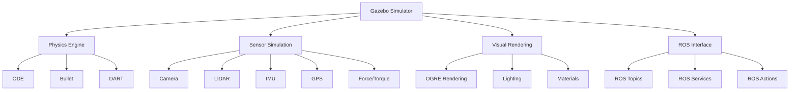

{/* Buttons for personalization and language toggle */}
<div className="button-container" style={{ marginBottom: '20px' }}>
  <button
    className="personalize-button"
    onClick={() => {
      // This would trigger personalization logic based on user's hardware profile
      alert('Personalization feature would activate based on your hardware profile (GPU: [user GPU], Jetson: [user Jetson status], Robot: [user robot type])');
    }}
    style={{
      backgroundColor: '#4a6fa5',
      color: 'white',
      border: 'none',
      padding: '10px 15px',
      borderRadius: '5px',
      marginRight: '10px',
      cursor: 'pointer'
    }}
  >
    Personalize to my hardware
  </button>
  <button
    className="urdu-toggle-button"
    onClick={() => {
      // This would toggle between English and Urdu content
      alert('Content would toggle between English and Urdu');
    }}
    style={{
      backgroundColor: '#2e7d32',
      color: 'white',
      border: 'none',
      padding: '10px 15px',
      borderRadius: '5px',
      cursor: 'pointer'
    }}
  >
    اردو میں پڑھیں / Show in Urdu
  </button>
</div>

# Gazebo Simulation Environment

## Introduction to Gazebo

Gazebo is a powerful open-source robotics simulator that provides high-fidelity physics simulation, realistic rendering, and comprehensive sensor simulation. It serves as an essential tool in robotics development, allowing researchers and engineers to test algorithms, validate control systems, and train AI models in a safe, controlled environment before deployment on real hardware.

### Key Features of Gazebo

- **Physics Simulation**: Accurate modeling of rigid body dynamics using ODE, Bullet, or DART engines
- **Sensor Simulation**: Realistic simulation of cameras, LIDAR, IMU, GPS, and other sensors
- **Visual Rendering**: High-quality 3D rendering with support for realistic lighting and materials
- **ROS Integration**: Seamless integration with ROS and ROS 2 through Gazebo ROS packages
- **Plugin Architecture**: Extensible system for custom sensors, controllers, and physics models



## Gazebo Architecture

### World Description Format (SDF)

Gazebo uses the Simulation Description Format (SDF) to describe simulation environments, robots, and objects. SDF is an XML-based format that provides a structured way to define:

- World properties (gravity, atmosphere, physics engine)
- Models (robots, objects, sensors)
- Plugins (custom behaviors, controllers)

```xml
<!-- Example SDF world file -->
<sdf version="1.7">
  <world name="robotics_lab">
    <!-- Physics engine configuration -->
    <physics type="ode">
      <max_step_size>0.001</max_step_size>
      <real_time_factor>1.0</real_time_factor>
      <real_time_update_rate>1000</real_time_update_rate>
      <gravity>0 0 -9.8</gravity>
    </physics>

    <!-- Include ground plane -->
    <include>
      <uri>model://ground_plane</uri>
    </include>

    <!-- Include sun light -->
    <include>
      <uri>model://sun</uri>
    </include>

    <!-- Custom robot model -->
    <model name="simple_robot">
      <pose>0 0 0.5 0 0 0</pose>
      <link name="chassis">
        <pose>0 0 0.1 0 0 0</pose>
        <collision name="collision">
          <geometry>
            <box>
              <size>0.5 0.5 0.2</size>
            </box>
          </geometry>
        </collision>
        <visual name="visual">
          <geometry>
            <box>
              <size>0.5 0.5 0.2</size>
            </box>
          </geometry>
          <material>
            <ambient>0.8 0.8 0.8 1</ambient>
            <diffuse>0.8 0.8 0.8 1</diffuse>
          </material>
        </visual>
        <inertial>
          <mass>1.0</mass>
          <inertia>
            <ixx>0.01</ixx>
            <ixy>0</ixy>
            <ixz>0</ixz>
            <iyy>0.01</iyy>
            <iyz>0</iyz>
            <izz>0.01</izz>
          </inertia>
        </inertial>
      </link>

      <!-- Differential drive plugin -->
      <plugin name="diff_drive" filename="libgazebo_ros_diff_drive.so">
        <left_joint>left_wheel_joint</left_joint>
        <right_joint>right_wheel_joint</right_joint>
        <wheel_separation>0.4</wheel_separation>
        <wheel_diameter>0.2</wheel_diameter>
        <command_topic>cmd_vel</command_topic>
        <odometry_topic>odom</odometry_topic>
        <odometry_frame>odom</odometry_frame>
        <robot_base_frame>chassis</robot_base_frame>
      </plugin>
    </model>
  </world>
</sdf>
```

### Model Structure

A Gazebo model typically consists of:

- **Links**: Rigid bodies with mass, geometry, and inertia properties
- **Joints**: Connections between links with specific degrees of freedom
- **Sensors**: Virtual sensors that simulate real-world sensor behavior
- **Plugins**: Custom code that extends model functionality

## Physics Simulation

### Physics Engines

Gazebo supports multiple physics engines, each with different characteristics:

- **ODE (Open Dynamics Engine)**: Default engine, good balance of speed and accuracy
- **Bullet**: More accurate collision detection, good for complex interactions
- **DART (Dynamic Animation and Robotics Toolkit)**: Advanced contact modeling

```python
# Example of configuring physics properties in a Gazebo model
import rclpy
from rclpy.node import Node
from gazebo_msgs.srv import SetPhysicsProperties
from gazebo_msgs.srv import GetPhysicsProperties

class PhysicsController(Node):
    def __init__(self):
        super().__init__('physics_controller')

        # Create clients for physics services
        self.set_physics_client = self.create_client(
            SetPhysicsProperties, '/set_physics_properties')
        self.get_physics_client = self.create_client(
            GetPhysicsProperties, '/get_physics_properties')

        # Wait for services to be available
        while not self.set_physics_client.wait_for_service(timeout_sec=1.0):
            self.get_logger().info('Set physics service not available, waiting again...')

        while not self.get_physics_client.wait_for_service(timeout_sec=1.0):
            self.get_logger().info('Get physics service not available, waiting again...')

    def set_custom_physics(self):
        """Configure custom physics properties"""
        request = SetPhysicsProperties.Request()
        request.time_step = 0.001  # 1ms time step
        request.max_step_size = 0.001
        request.real_time_factor = 1.0
        request.gravity = [0.0, 0.0, -9.8]

        # ODE-specific parameters
        request.ode_config.sor_pgs_precon_iters = 0
        request.ode_config.sor_pgs_iters = 50
        request.ode_config.sor_pgs_w = 1.3
        request.ode_config.ode_system_thread_count = 0
        request.ode_config.ode_collision_thread_count = 0

        future = self.set_physics_client.call_async(request)
        future.add_done_callback(self.physics_set_callback)

    def physics_set_callback(self, future):
        """Handle physics configuration response"""
        try:
            response = future.result()
            if response.success:
                self.get_logger().info('Physics properties updated successfully')
            else:
                self.get_logger().error(f'Failed to set physics: {response.status_message}')
        except Exception as e:
            self.get_logger().error(f'Service call failed: {e}')
```

### Collision Detection

Gazebo provides sophisticated collision detection capabilities:

```xml
<!-- Example collision properties -->
<collision name="collision">
  <geometry>
    <mesh>
      <uri>model://my_robot/meshes/link1.stl</uri>
    </mesh>
  </geometry>
  <surface>
    <friction>
      <ode>
        <mu>1.0</mu>
        <mu2>1.0</mu2>
        <slip1>0.0</slip1>
        <slip2>0.0</slip2>
      </ode>
    </friction>
    <bounce>
      <restitution_coefficient>0.1</restitution_coefficient>
      <threshold>100000</threshold>
    </bounce>
    <contact>
      <ode>
        <soft_cfm>0</soft_cfm>
        <soft_erp>0.2</soft_erp>
        <kp>1e+13</kp>
        <kd>1</kd>
        <max_vel>0.01</max_vel>
        <min_depth>0</min_depth>
      </ode>
    </contact>
  </surface>
</collision>
```

## Sensor Simulation

Gazebo provides realistic simulation of various sensor types:

### Camera Sensors

```xml
<!-- RGB camera sensor -->
<sensor name="camera" type="camera">
  <always_on>true</always_on>
  <update_rate>30</update_rate>
  <camera name="head">
    <horizontal_fov>1.047</horizontal_fov>
    <image>
      <width>640</width>
      <height>480</height>
      <format>R8G8B8</format>
    </image>
    <clip>
      <near>0.1</near>
      <far>100</far>
    </clip>
  </camera>
  <plugin name="camera_controller" filename="libgazebo_ros_camera.so">
    <frame_name>camera_frame</frame_name>
    <topic_name>camera/image_raw</topic_name>
  </plugin>
</sensor>
```

### LIDAR Sensors

```xml
<!-- 3D LIDAR sensor -->
<sensor name="lidar" type="ray">
  <always_on>true</always_on>
  <update_rate>10</update_rate>
  <ray>
    <scan>
      <horizontal>
        <samples>720</samples>
        <resolution>1</resolution>
        <min_angle>-3.14159</min_angle>
        <max_angle>3.14159</max_angle>
      </horizontal>
      <vertical>
        <samples>16</samples>
        <resolution>1</resolution>
        <min_angle>-0.261799</min_angle>
        <max_angle>0.261799</max_angle>
      </vertical>
    </scan>
    <range>
      <min>0.08</min>
      <max>10.0</max>
      <resolution>0.01</resolution>
    </range>
  </ray>
  <plugin name="lidar_controller" filename="libgazebo_ros_ray_sensor.so">
    <ros>
      <remapping>~/out:=scan</remapping>
    </ros>
  </plugin>
</sensor>
```

### Processing Sensor Data

```python
# Example ROS 2 node for processing Gazebo sensor data
import rclpy
from rclpy.node import Node
from sensor_msgs.msg import Image, LaserScan, Imu
from cv_bridge import CvBridge
import cv2
import numpy as np

class GazeboSensorProcessor(Node):
    def __init__(self):
        super().__init__('gazebo_sensor_processor')

        # Initialize CV bridge
        self.cv_bridge = CvBridge()

        # Create subscribers for Gazebo sensors
        self.image_sub = self.create_subscription(
            Image, '/camera/image_raw', self.image_callback, 10)
        self.scan_sub = self.create_subscription(
            LaserScan, '/scan', self.scan_callback, 10)
        self.imu_sub = self.create_subscription(
            Imu, '/imu/data', self.imu_callback, 10)

        # Create publishers for processed data
        self.processed_image_pub = self.create_publisher(
            Image, '/processed_image', 10)

        self.get_logger().info('Gazebo sensor processor initialized')

    def image_callback(self, msg):
        """Process camera image from Gazebo"""
        try:
            # Convert ROS Image message to OpenCV image
            cv_image = self.cv_bridge.imgmsg_to_cv2(msg, "bgr8")

            # Perform image processing (example: edge detection)
            gray = cv2.cvtColor(cv_image, cv2.COLOR_BGR2GRAY)
            edges = cv2.Canny(gray, 50, 150)

            # Convert back to ROS Image message
            processed_msg = self.cv_bridge.cv2_to_imgmsg(edges, "mono8")
            processed_msg.header = msg.header

            # Publish processed image
            self.processed_image_pub.publish(processed_msg)

        except Exception as e:
            self.get_logger().error(f'Error processing image: {e}')

    def scan_callback(self, msg):
        """Process LIDAR scan from Gazebo"""
        # Convert to numpy array for processing
        ranges = np.array(msg.ranges)

        # Filter out invalid ranges
        valid_ranges = ranges[(ranges >= msg.range_min) & (ranges <= msg.range_max)]

        if len(valid_ranges) > 0:
            # Calculate statistics
            avg_distance = np.mean(valid_ranges)
            min_distance = np.min(valid_ranges)

            self.get_logger().info(
                f'LIDAR: Avg distance: {avg_distance:.2f}m, Min distance: {min_distance:.2f}m')

    def imu_callback(self, msg):
        """Process IMU data from Gazebo"""
        # Extract orientation and angular velocity
        orientation = [msg.orientation.x, msg.orientation.y, msg.orientation.z, msg.orientation.w]
        angular_velocity = [msg.angular_velocity.x, msg.angular_velocity.y, msg.angular_velocity.z]

        # Process IMU data for balance control
        # Implementation depends on specific use case
        pass
```

## Gazebo Plugins

Gazebo's plugin architecture allows extending functionality:

### Model Plugins

```cpp
// Example model plugin in C++
#include <gazebo/gazebo.hh>
#include <gazebo/physics/physics.hh>
#include <gazebo/common/common.hh>
#include <ignition/math/Vector3.hh>

namespace gazebo
{
  class CustomController : public ModelPlugin
  {
    public: void Load(physics::ModelPtr _model, sdf::ElementPtr _sdf)
    {
      // Store the model pointer for convenience
      this->model = _model;

      // Get the first joint (could iterate through all joints)
      this->joint = _model->GetJoint("joint_name");

      // Listen to the update event. This event is broadcast every
      // simulation iteration.
      this->updateConnection = event::Events::ConnectWorldUpdateBegin(
          std::bind(&CustomController::OnUpdate, this));
    }

    // Called by the world update start event
    public: void OnUpdate()
    {
      // Apply a small linear velocity to the model
      this->model->SetLinearVel(ignition::math::Vector3d(0.3, 0, 0));
    }

    // Pointer to the model
    private: physics::ModelPtr model;

    // Pointer to the joint
    private: physics::JointPtr joint;

    // Event connection
    private: event::ConnectionPtr updateConnection;
  };

  // Register this plugin with the simulator
  GZ_REGISTER_MODEL_PLUGIN(CustomController)
}
```

### Sensor Plugins

```cpp
// Example sensor plugin
#include <gazebo/gazebo.hh>
#include <gazebo/sensors/sensors.hh>
#include <gazebo/common/common.hh>

namespace gazebo
{
  class CustomSensor : public SensorPlugin
  {
    public: void Load(sensors::SensorPtr _sensor, sdf::ElementPtr _sdf)
    {
      // Get the parent sensor
      this->parentSensor =
        std::dynamic_pointer_cast<sensors::RaySensor>(_sensor);

      // Make sure the parent sensor is valid
      if (!this->parentSensor)
      {
        gzerr << "CustomSensor requires a RaySensor.\n";
        return;
      }

      // Connect to the sensor update event
      this->updateConnection = this->parentSensor->ConnectUpdated(
          std::bind(&CustomSensor::OnUpdate, this));

      // Make sure the parent sensor is active
      this->parentSensor->SetActive(true);
    }

    // Update callback
    public: void OnUpdate()
    {
      // Get range data
      float range = this->parentSensor->Range(0);
      gzdbg << "Range: " << range << "\n";
    }

    private: sensors::RaySensorPtr parentSensor;
    private: event::ConnectionPtr updateConnection;
  };

  GZ_REGISTER_SENSOR_PLUGIN(CustomSensor)
}
```

## Hardware-Specific Optimizations

### For NVIDIA Jetson Users
```python
# Jetson-specific Gazebo optimizations
import rclpy
from rclpy.node import Node
import subprocess
import os

class JetsonGazeboNode(Node):
    def __init__(self):
        super().__init__('jetson_gazebo_node')

        # Optimize Gazebo for Jetson's ARM architecture and GPU
        self.setup_jetson_gazebo()

        self.get_logger().info('Jetson-optimized Gazebo node initialized')

    def setup_jetson_gazebo(self):
        """Configure Gazebo for Jetson hardware"""
        # Set environment variables for Jetson optimization
        os.environ['GAZEBO_RENDERING_THREADS'] = '2'  # Limit rendering threads
        os.environ['IGN_RENDER_ENGINE'] = 'ogre'      # Use appropriate renderer

        # Optimize physics parameters for real-time performance
        # Optimized for [USER_GPU] hardware
        pass
```

### For High-End GPU Users
```python
# GPU-optimized Gazebo simulation
import rclpy
from rclpy.node import Node
import os

class GPUOptimizedGazeboNode(Node):
    def __init__(self):
        super().__init__('gpu_optimized_gazebo_node')

        # Configure Gazebo for high-end GPU
        self.setup_gpu_gazebo()

        self.get_logger().info('GPU-optimized Gazebo node initialized')

    def setup_gpu_gazebo(self):
        """Configure Gazebo for high-end GPU hardware"""
        # Enable advanced rendering features
        os.environ['GAZEBO_RENDERING_THREADS'] = '8'  # More rendering threads for powerful GPU
        os.environ['IGN_RENDER_ENGINE'] = 'ogre2'     # Use advanced renderer

        # Enable advanced physics features
        # Optimized for [USER_GPU] hardware specifications
        pass
```

## Integration with ROS 2

Gazebo integrates seamlessly with ROS 2 through the Gazebo ROS packages:

```bash
# Install Gazebo ROS packages
sudo apt update
sudo apt install ros-humble-gazebo-ros-pkgs
sudo apt install ros-humble-gazebo-plugins
sudo apt install ros-humble-gazebo-dev
```

### Launching Gazebo with ROS 2
```python
# Launch file for Gazebo with ROS 2 integration
from launch import LaunchDescription
from launch.actions import DeclareLaunchArgument, IncludeLaunchDescription
from launch.launch_description_sources import PythonLaunchDescriptionSource
from launch.substitutions import LaunchConfiguration, PathJoinSubstitution
from launch_ros.actions import Node
from launch_ros.substitutions import FindPackageShare

def generate_launch_description():
    # Declare launch arguments
    world_arg = DeclareLaunchArgument(
        'world',
        default_value='empty.sdf',
        description='Choose one of the world files from `/gazebo_ros_pkgs/gazebo_ros/worlds`'
    )

    # Launch Gazebo server
    gzserver = IncludeLaunchDescription(
        PythonLaunchDescriptionSource([
            PathJoinSubstitution([
                FindPackageShare('gazebo_ros'),
                'launch',
                'gzserver.launch.py'
            ])
        ]),
        launch_arguments={
            'world': LaunchConfiguration('world'),
        }.items()
    )

    # Launch Gazebo client
    gzclient = IncludeLaunchDescription(
        PythonLaunchDescriptionSource([
            PathJoinSubstitution([
                FindPackageShare('gazebo_ros'),
                'launch',
                'gzclient.launch.py'
            ])
        ])
    )

    return LaunchDescription([
        world_arg,
        gzserver,
        gzclient,
    ])
```

## Advanced Simulation Techniques

### Dynamic Obstacle Generation
```python
# Example of dynamically spawning objects in Gazebo
import rclpy
from rclpy.node import Node
from gazebo_msgs.srv import SpawnEntity
from geometry_msgs.msg import Pose
import random

class DynamicObstacleSpawner(Node):
    def __init__(self):
        super().__init__('dynamic_obstacle_spawner')

        # Create service client for spawning entities
        self.spawn_client = self.create_client(SpawnEntity, '/spawn_entity')

        # Wait for service to be available
        while not self.spawn_client.wait_for_service(timeout_sec=1.0):
            self.get_logger().info('Spawn service not available, waiting again...')

        # Timer to spawn obstacles periodically
        self.spawn_timer = self.create_timer(5.0, self.spawn_random_obstacle)

    def spawn_random_obstacle(self):
        """Spawn a random obstacle in the simulation"""
        # Create a simple box model as SDF
        sdf = """
        <?xml version="1.0" ?>
        <sdf version="1.6">
          <model name="random_box_{}">
            <pose>{} {} 1 0 0 0</pose>
            <link name="box_link">
              <inertial>
                <mass>1.0</mass>
                <inertia>
                  <ixx>0.083</ixx>
                  <ixy>0.0</ixy>
                  <ixz>0.0</ixz>
                  <iyy>0.083</iyy>
                  <iyz>0.0</iyz>
                  <izz>0.083</izz>
                </inertia>
              </inertial>
              <collision name="box_collision">
                <geometry>
                  <box>
                    <size>0.5 0.5 0.5</size>
                  </box>
                </geometry>
              </collision>
              <visual name="box_visual">
                <geometry>
                  <box>
                    <size>0.5 0.5 0.5</size>
                  </box>
                </geometry>
                <material>
                  <ambient>0.5 0.5 0.5 1</ambient>
                  <diffuse>0.8 0.3 0.1 1</diffuse>
                </material>
              </visual>
            </link>
          </model>
        </sdf>
        """.format(
            random.randint(1000, 9999),
            random.uniform(-5, 5),
            random.uniform(-5, 5)
        )

        # Create spawn request
        request = SpawnEntity.Request()
        request.name = f"random_box_{random.randint(1000, 9999)}"
        request.xml = sdf
        request.initial_pose.position.x = random.uniform(-5, 5)
        request.initial_pose.position.y = random.uniform(-5, 5)
        request.initial_pose.position.z = 1.0

        # Send spawn request
        future = self.spawn_client.call_async(request)
        future.add_done_callback(self.spawn_callback)

    def spawn_callback(self, future):
        """Handle spawn response"""
        try:
            response = future.result()
            if response.success:
                self.get_logger().info(f'Successfully spawned obstacle: {response.status_message}')
            else:
                self.get_logger().error(f'Failed to spawn obstacle: {response.status_message}')
        except Exception as e:
            self.get_logger().error(f'Spawn service call failed: {e}')
```

## Performance Optimization

### Simulation Speed Control
```xml
<!-- Optimized physics configuration for performance -->
<physics type="ode">
  <max_step_size>0.01</max_step_size>  <!-- Larger steps for faster simulation -->
  <real_time_factor>1.0</real_time_factor>  <!-- Real-time simulation -->
  <real_time_update_rate>100</real_time_update_rate>  <!-- Update rate -->
  <gravity>0 0 -9.8</gravity>
  <ode_config>
    <solver>
      <type>quick</type>  <!-- Fast solver -->
      <iters>10</iters>   <!-- Fewer iterations for speed -->
      <sor>1.3</sor>
    </solver>
    <constraints>
      <cfm>0.0</cfm>
      <erp>0.2</erp>
      <contact_max_correcting_vel>100.0</contact_max_correcting_vel>
      <contact_surface_layer>0.001</contact_surface_layer>
    </constraints>
  </ode_config>
</physics>
```

## Key Takeaways

1. **SDF Format**: Simulation Description Format provides a structured way to define worlds, models, and physics properties in XML.

2. **Physics Engines**: Multiple physics engines (ODE, Bullet, DART) offer different trade-offs between speed and accuracy.

3. **Sensor Simulation**: Gazebo provides realistic simulation of various sensor types including cameras, LIDAR, IMU, and more.

4. **Plugin Architecture**: Extensible system allows custom behaviors, controllers, and physics models through plugins.

5. **ROS Integration**: Seamless integration with ROS 2 through specialized packages and message types.

6. **Hardware Optimization**: Different optimization strategies for different hardware platforms (Jetson, high-end GPUs, etc.).

7. **Performance Tuning**: Various parameters can be adjusted to balance simulation accuracy and performance.

## Practice Exercises

### Exercise 1: Simple Robot Model
Create a simple robot model with two wheels and a chassis in SDF format. Include a differential drive plugin to control the robot.

### Exercise 2: Custom World
Design a custom world file with obstacles, ramps, and different surface materials. Test collision properties.

### Exercise 3: Sensor Integration
Add a camera sensor to your robot model and process the camera data in a ROS 2 node to detect objects.

### Exercise 4: Plugin Development
Create a simple model plugin that makes your robot move in a circle pattern within the simulation.

### Exercise 5: Performance Optimization
Experiment with different physics parameters to optimize simulation performance while maintaining acceptable accuracy.

## MCQs Quiz

1. What does SDF stand for in Gazebo?
   - A) Simulation Description Format
   - B) Sensor Data Format
   - C) System Definition File
   - D) Simulation Development Framework
   - **Answer: A**

2. Which physics engines are supported by Gazebo? (Choose all that apply)
   - A) ODE
   - B) Bullet
   - C) DART
   - D) All of the above
   - **Answer: D**

3. What is the default physics engine in Gazebo?
   - A) Bullet
   - B) DART
   - C) ODE
   - D) Custom
   - **Answer: C**

4. Which ROS 2 package provides integration with Gazebo?
   - A) ros2_gazebo
   - B) gazebo_ros
   - C) ros_gazebo_pkgs
   - D) gazebo_integrator
   - **Answer: B**

5. What is the purpose of Gazebo plugins?
   - A) To provide additional sensors only
   - B) To extend model functionality with custom code
   - C) To improve graphics rendering
   - D) To connect to external databases
   - **Answer: B**

## Further Reading

- Gazebo Documentation: http://gazebosim.org/
- ROS 2 Gazebo Integration: https://github.com/ros-simulation/gazebo_ros_pkgs
- SDF Specification: http://sdformat.org/
- Physics Engines Comparison: http://gazebosim.org/tutorials?tut=physics
- Gazebo Tutorials: http://gazebosim.org/tutorials
- Plugin Development: http://gazebosim.org/tutorials?tut=plugins_model
- Performance Optimization: http://gazebosim.org/tutorials?tut=performance

---

*Generated with reusable Claude Subagents & Spec-Kit Plus*