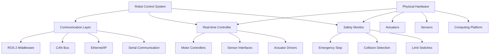

# Hardware Integration

## Introduction to Hardware Integration

Hardware integration in robotics involves connecting and controlling physical components such as actuators, sensors, and computing platforms to create functional robotic systems. This process requires careful consideration of communication protocols, real-time constraints, safety mechanisms, and the specific requirements of different hardware components.

### Key Aspects of Hardware Integration

- **Communication Protocols**: Establishing reliable communication between software and hardware
- **Real-time Control**: Ensuring timely execution of control commands
- **Safety Systems**: Implementing protective measures to prevent damage
- **Calibration**: Ensuring accurate sensor readings and actuator positioning
- **Power Management**: Managing power consumption and distribution
- **Environmental Considerations**: Protecting hardware from environmental factors



## Communication Protocols

### Serial Communication

Serial communication is commonly used for connecting various hardware components:

```python
# Example of serial communication with hardware
import rclpy
from rclpy.node import Node
import serial
import time
from std_msgs.msg import Float64MultiArray
from sensor_msgs.msg import JointState
import struct

class SerialHardwareInterface(Node):
    def __init__(self):
        super().__init__('serial_hardware_interface')

        # Initialize serial connection
        self.serial_port = '/dev/ttyUSB0'  # Adjust for your hardware
        self.baud_rate = 115200
        self.serial_conn = None

        try:
            self.serial_conn = serial.Serial(
                self.serial_port,
                self.baud_rate,
                timeout=1
            )
            self.get_logger().info(f'Connected to {self.serial_port} at {self.baud_rate} baud')
        except serial.SerialException as e:
            self.get_logger().error(f'Failed to connect to serial port: {e}')
            return

        # Create publisher for joint states
        self.joint_state_pub = self.create_publisher(
            JointState, '/joint_states', 10)

        # Create subscriber for joint commands
        self.joint_command_sub = self.create_subscription(
            Float64MultiArray, '/joint_commands', self.joint_command_callback, 10)

        # Timer for reading from hardware
        self.read_timer = self.create_timer(0.01, self.read_from_hardware)  # 100 Hz

    def read_from_hardware(self):
        """Read data from hardware via serial"""
        if self.serial_conn and self.serial_conn.in_waiting > 0:
            try:
                # Read data from serial port
                data = self.serial_conn.readline().decode('utf-8').strip()

                # Parse joint state data (example format: "j1:1.23,j2:2.34,j3:3.45")
                if data.startswith('JOINT_STATES:'):
                    joint_data = data.replace('JOINT_STATES:', '').split(',')
                    joint_names = ['joint1', 'joint2', 'joint3']  # Adjust to your robot
                    joint_positions = []

                    for joint_str in joint_data:
                        try:
                            pos = float(joint_str.split(':')[1])
                            joint_positions.append(pos)
                        except (ValueError, IndexError):
                            continue

                    # Publish joint states
                    joint_state = JointState()
                    joint_state.header.stamp = self.get_clock().now().to_msg()
                    joint_state.name = joint_names
                    joint_state.position = joint_positions

                    self.joint_state_pub.publish(joint_state)

            except Exception as e:
                self.get_logger().error(f'Error reading from serial: {e}')

    def joint_command_callback(self, msg):
        """Send joint commands to hardware"""
        if self.serial_conn:
            try:
                # Format command for hardware (example: "CMD:POS:j1:1.23,j2:2.34,j3:3.45")
                command_parts = []
                for i, pos in enumerate(msg.data):
                    command_parts.append(f'j{i+1}:{pos:.3f}')

                command = f'CMD:POS:{",".join(command_parts)}\n'
                self.serial_conn.write(command.encode())

            except Exception as e:
                self.get_logger().error(f'Error sending command to serial: {e}')

    def destroy_node(self):
        """Clean up serial connection"""
        if self.serial_conn:
            self.serial_conn.close()
        super().destroy_node()
```

### CAN Bus Communication

CAN (Controller Area Network) is widely used in robotics for robust communication:

```python
# Example of CAN bus communication
import rclpy
from rclpy.node import Node
import can
from std_msgs.msg import Float64MultiArray
from sensor_msgs.msg import JointState

class CANHardwareInterface(Node):
    def __init__(self):
        super().__init__('can_hardware_interface')

        # Initialize CAN bus
        try:
            self.bus = can.interface.Bus(
                channel='can0',
                bustype='socketcan',
                bitrate=500000  # 500 kbps
            )
            self.get_logger().info('CAN bus initialized on can0')
        except Exception as e:
            self.get_logger().error(f'Failed to initialize CAN bus: {e}')
            return

        # Create publisher for joint states
        self.joint_state_pub = self.create_publisher(
            JointState, '/joint_states', 10)

        # Create subscriber for joint commands
        self.joint_command_sub = self.create_subscription(
            Float64MultiArray, '/joint_commands', self.joint_command_callback, 10)

        # Timer for reading CAN messages
        self.can_read_timer = self.create_timer(0.01, self.read_can_messages)

    def read_can_messages(self):
        """Read messages from CAN bus"""
        try:
            # Non-blocking read
            msg = self.bus.recv(timeout=0.001)
            if msg:
                # Parse CAN message based on your hardware protocol
                # Example: joint position feedback
                if msg.arbitration_id == 0x100:  # Adjust to your hardware ID
                    # Parse joint positions from CAN data
                    joint_positions = self.parse_joint_positions(msg.data)

                    # Publish joint states
                    joint_state = JointState()
                    joint_state.header.stamp = self.get_clock().now().to_msg()
                    joint_state.name = ['joint1', 'joint2', 'joint3']  # Adjust to your robot
                    joint_state.position = joint_positions

                    self.joint_state_pub.publish(joint_state)

        except Exception as e:
            self.get_logger().error(f'Error reading CAN messages: {e}')

    def parse_joint_positions(self, data):
        """Parse joint positions from CAN message data"""
        # This is hardware-specific - adjust based on your CAN protocol
        positions = []
        for i in range(0, len(data), 4):  # Assuming 4 bytes per float
            if i + 4 <= len(data):
                pos = struct.unpack('f', data[i:i+4])[0]
                positions.append(pos)
        return positions

    def joint_command_callback(self, msg):
        """Send joint commands via CAN bus"""
        try:
            # Send commands for each joint
            for i, position in enumerate(msg.data):
                # Create CAN message for joint command
                # Adjust arbitration ID based on your hardware
                arbitration_id = 0x200 + i  # Example: 0x200, 0x201, etc.

                # Pack position as float (4 bytes)
                data = struct.pack('f', position)

                # Create and send CAN message
                can_msg = can.Message(
                    arbitration_id=arbitration_id,
                    data=data,
                    is_extended_id=True
                )

                self.bus.send(can_msg)

        except Exception as e:
            self.get_logger().error(f'Error sending CAN command: {e}')

    def destroy_node(self):
        """Clean up CAN bus"""
        if hasattr(self, 'bus'):
            self.bus.shutdown()
        super().destroy_node()
```

### Ethernet/IP Communication

For high-bandwidth applications, Ethernet-based protocols are used:

```python
# Example of Ethernet/IP communication (simplified)
import rclpy
from rclpy.node import Node
import socket
import struct
from std_msgs.msg import Float64MultiArray
from sensor_msgs.msg import JointState

class EthernetHardwareInterface(Node):
    def __init__(self):
        super().__init__('ethernet_hardware_interface')

        # Hardware IP configuration
        self.hardware_ip = '192.168.1.10'  # Adjust to your hardware IP
        self.hardware_port = 502  # Example port
        self.socket_timeout = 1.0

        # Create socket connection
        self.hardware_socket = None
        self.connect_to_hardware()

        # Create publisher for joint states
        self.joint_state_pub = self.create_publisher(
            JointState, '/joint_states', 10)

        # Create subscriber for joint commands
        self.joint_command_sub = self.create_subscription(
            Float64MultiArray, '/joint_commands', self.joint_command_callback, 10)

        # Timer for reading from hardware
        self.read_timer = self.create_timer(0.01, self.read_from_hardware)

    def connect_to_hardware(self):
        """Establish connection to hardware via Ethernet"""
        try:
            self.hardware_socket = socket.socket(socket.AF_INET, socket.SOCK_STREAM)
            self.hardware_socket.settimeout(self.socket_timeout)
            self.hardware_socket.connect((self.hardware_ip, self.hardware_port))
            self.get_logger().info(f'Connected to hardware at {self.hardware_ip}:{self.hardware_port}')
        except Exception as e:
            self.get_logger().error(f'Failed to connect to hardware: {e}')

    def read_from_hardware(self):
        """Read data from hardware via Ethernet"""
        if self.hardware_socket:
            try:
                # Send request for joint states
                request = struct.pack('!II', 0x01, 0x00)  # Example request format
                self.hardware_socket.send(request)

                # Receive response
                response = self.hardware_socket.recv(1024)
                if response:
                    # Parse joint state data
                    joint_positions = self.parse_joint_states(response)

                    # Publish joint states
                    joint_state = JointState()
                    joint_state.header.stamp = self.get_clock().now().to_msg()
                    joint_state.name = ['joint1', 'joint2', 'joint3']  # Adjust to your robot
                    joint_state.position = joint_positions

                    self.joint_state_pub.publish(joint_state)

            except socket.timeout:
                self.get_logger().warning('Ethernet read timeout')
            except Exception as e:
                self.get_logger().error(f'Error reading from hardware: {e}')

    def parse_joint_states(self, data):
        """Parse joint states from received data"""
        # This is hardware-specific - adjust based on your protocol
        positions = []
        for i in range(0, len(data), 4):  # Assuming 4 bytes per float
            if i + 4 <= len(data):
                pos = struct.unpack('f', data[i:i+4])[0]
                positions.append(pos)
        return positions

    def joint_command_callback(self, msg):
        """Send joint commands via Ethernet"""
        if self.hardware_socket:
            try:
                # Create command packet
                command_header = struct.pack('!II', 0x02, len(msg.data))  # Example header
                position_data = b''.join([struct.pack('f', pos) for pos in msg.data])
                command_packet = command_header + position_data

                # Send command
                self.hardware_socket.send(command_packet)

            except Exception as e:
                self.get_logger().error(f'Error sending command: {e}')

    def destroy_node(self):
        """Clean up Ethernet connection"""
        if self.hardware_socket:
            self.hardware_socket.close()
        super().destroy_node()
```

## Real-time Control Systems

### Real-time Requirements

Robotic systems often have strict real-time requirements for control loops:

```python
# Example of real-time control with timing constraints
import rclpy
from rclpy.node import Node
from rclpy.qos import QoSProfile, QoSDurabilityPolicy
from sensor_msgs.msg import JointState
from std_msgs.msg import Float64MultiArray
import time
import threading
from collections import deque

class RealTimeController(Node):
    def __init__(self):
        super().__init__('real_time_controller')

        # Control loop parameters
        self.control_frequency = 100  # Hz
        self.control_period = 1.0 / self.control_frequency
        self.control_timer = None

        # Joint state storage
        self.current_joint_states = JointState()
        self.command_buffer = deque(maxlen=10)  # Store recent commands

        # Create publisher for control commands
        self.command_pub = self.create_publisher(
            Float64MultiArray, '/joint_commands', 10)

        # Subscribe to joint states
        self.joint_state_sub = self.create_subscription(
            JointState, '/joint_states', self.joint_state_callback, 10)

        # Start real-time control loop
        self.start_control_loop()

    def start_control_loop(self):
        """Start the real-time control loop"""
        # Use a separate thread for real-time control to avoid ROS overhead
        self.control_thread = threading.Thread(target=self.control_loop)
        self.control_thread.daemon = True
        self.control_thread.start()

    def control_loop(self):
        """Real-time control loop"""
        rate = self.control_period
        last_time = time.time()

        while rclpy.ok():
            current_time = time.time()

            # Check if it's time for the next control cycle
            if current_time - last_time >= rate:
                # Measure timing
                loop_start = time.time()

                # Execute control algorithm
                self.execute_control_cycle()

                # Measure execution time
                execution_time = time.time() - loop_start

                # Log timing information
                if execution_time > rate * 0.8:  # If using >80% of available time
                    self.get_logger().warning(
                        f'Control loop exceeded timing: {execution_time:.4f}s (limit: {rate:.4f}s)')

                last_time = current_time
            else:
                # Small sleep to prevent busy waiting
                time.sleep(0.0001)

    def execute_control_cycle(self):
        """Execute one control cycle"""
        # Get current joint states
        current_states = self.current_joint_states

        # Calculate control commands (PID controller example)
        commands = self.calculate_control_commands(current_states)

        # Publish commands
        command_msg = Float64MultiArray()
        command_msg.data = commands
        self.command_pub.publish(command_msg)

        # Store command in buffer for monitoring
        self.command_buffer.append(commands)

    def calculate_control_commands(self, joint_states):
        """Calculate control commands using PID control"""
        # This is a simplified example - real implementation would include:
        # - Desired trajectory generation
        # - PID control with position, velocity, and acceleration terms
        # - Feedforward terms
        # - Safety limits and constraints

        commands = []
        for i, current_pos in enumerate(joint_states.position):
            # Example: simple position control
            desired_pos = 0.0  # This would come from trajectory
            error = desired_pos - current_pos

            # Simple proportional control
            command = error * 10.0  # Kp = 10

            commands.append(command)

        return commands

    def joint_state_callback(self, msg):
        """Update current joint states"""
        self.current_joint_states = msg

    def destroy_node(self):
        """Clean up real-time resources"""
        if hasattr(self, 'control_thread'):
            self.control_thread.join(timeout=1.0)
        super().destroy_node()
```

### Real-time Operating Systems

For critical real-time applications, real-time operating systems are often used:

```python
# Example configuration for real-time ROS 2
import rclpy
from rclpy.node import Node
from rclpy.qos import QoSProfile
from rclpy.executors import MultiThreadedExecutor
import threading
import os

class RealTimeROSNode(Node):
    def __init__(self):
        super().__init__('real_time_ros_node')

        # Configure for real-time performance
        self.configure_real_time()

        # Create real-time publishers/subscribers
        qos_profile = QoSProfile(
            depth=1,
            durability=rclpy.qos.QoSDurabilityPolicy.VOLATILE,
            reliability=rclpy.qos.QoSReliabilityPolicy.RELIABLE
        )

        # Create publisher with real-time QoS
        self.rt_publisher = self.create_publisher(
            Float64MultiArray, '/rt_commands', qos_profile)

    def configure_real_time(self):
        """Configure node for real-time performance"""
        # Set process priority (requires real-time capabilities)
        try:
            import resource
            # Set to real-time priority (requires CAP_SYS_NICE capability)
            # This would typically be done outside of the node
            self.get_logger().info('Real-time configuration applied')
        except Exception as e:
            self.get_logger().warning(f'Could not configure real-time: {e}')

    def set_real_time_thread(self):
        """Set current thread to real-time priority"""
        try:
            import os
            import ctypes
            from ctypes import c_int, c_ulong, POINTER

            # This is a simplified example - real implementation would be more complex
            # and require proper real-time OS configuration

            # SCHED_FIFO scheduler with high priority
            priority = 80  # High real-time priority

            self.get_logger().info(f'Setting real-time priority to {priority}')
        except Exception as e:
            self.get_logger().warning(f'Could not set real-time thread: {e}')
```

## Safety Systems

### Emergency Stop Implementation

Safety systems are critical in hardware integration:

```python
# Emergency stop system
import rclpy
from rclpy.node import Node
from std_msgs.msg import Bool, Float64MultiArray
from sensor_msgs.msg import JointState
import threading
import time

class SafetySystem(Node):
    def __init__(self):
        super().__init__('safety_system')

        # Emergency stop state
        self.emergency_stop_active = False
        self.last_command_time = time.time()
        self.command_timeout = 1.0  # 1 second timeout

        # Create emergency stop publisher
        self.emergency_stop_pub = self.create_publisher(
            Bool, '/emergency_stop', 10)

        # Subscribe to commands and joint states
        self.command_sub = self.create_subscription(
            Float64MultiArray, '/joint_commands', self.command_callback, 10)
        self.joint_state_sub = self.create_subscription(
            JointState, '/joint_states', self.joint_state_callback, 10)

        # Timer for safety monitoring
        self.safety_timer = self.create_timer(0.01, self.safety_check)

        # Create publisher for safe commands (when needed)
        self.safe_command_pub = self.create_publisher(
            Float64MultiArray, '/safe_joint_commands', 10)

    def command_callback(self, msg):
        """Update last command time"""
        self.last_command_time = time.time()

        # If emergency stop was active and we receive a command,
        # check if it's safe to resume
        if self.emergency_stop_active:
            self.check_resume_conditions()

    def joint_state_callback(self, msg):
        """Monitor joint states for safety violations"""
        # Check for joint limits, velocity limits, etc.
        for i, position in enumerate(msg.position):
            if self.is_joint_out_of_limits(i, position):
                self.trigger_emergency_stop(f'Joint {i} out of limits')
                return

    def safety_check(self):
        """Perform safety checks"""
        # Check for command timeout
        if time.time() - self.last_command_time > self.command_timeout:
            self.trigger_emergency_stop('Command timeout')
            return

        # Check for other safety conditions
        if self.check_collision_risk():
            self.trigger_emergency_stop('Collision risk detected')
            return

    def is_joint_out_of_limits(self, joint_index, position):
        """Check if joint is out of safe limits"""
        # Define safe limits for each joint
        joint_limits = {
            0: (-3.14, 3.14),  # Example: ±π for joint 0
            1: (-2.0, 2.0),    # Example: ±2.0 for joint 1
            # Add more joints as needed
        }

        if joint_index in joint_limits:
            min_limit, max_limit = joint_limits[joint_index]
            return position < min_limit or position > max_limit

        return False

    def check_collision_risk(self):
        """Check for potential collision risk"""
        # This would integrate with collision detection algorithms
        # For example, using distance sensors, force/torque sensors, etc.
        return False  # Placeholder

    def trigger_emergency_stop(self, reason="Unknown safety violation"):
        """Trigger emergency stop"""
        if not self.emergency_stop_active:
            self.get_logger().error(f'EMERGENCY STOP: {reason}')
            self.emergency_stop_active = True

            # Publish emergency stop signal
            stop_msg = Bool()
            stop_msg.data = True
            self.emergency_stop_pub.publish(stop_msg)

            # Send safe commands to stop all joints
            self.send_safe_commands()

    def check_resume_conditions(self):
        """Check if it's safe to resume operation"""
        # Implement logic to determine if it's safe to resume
        # This might involve checking if the safety condition is resolved
        # For now, we'll just log and keep emergency stop active
        self.get_logger().info('Safety condition detected, keeping emergency stop active')

    def send_safe_commands(self):
        """Send safe commands to stop all joints"""
        safe_commands = Float64MultiArray()
        # Send zero velocity commands to stop all joints
        # This is a simplified example - actual implementation would depend on hardware
        safe_commands.data = [0.0] * 7  # Assuming 7 DOF robot
        self.safe_command_pub.publish(safe_commands)
```

### Force/Torque Limiting

```python
# Force/torque limiting system
import rclpy
from rclpy.node import Node
from geometry_msgs.msg import WrenchStamped
from std_msgs.msg import Float64MultiArray
import numpy as np

class ForceTorqueLimiter(Node):
    def __init__(self):
        super().__init__('force_torque_limiter')

        # Force/torque limits
        self.force_limits = [50.0, 50.0, 50.0]  # [Fx, Fy, Fz] in Newtons
        self.torque_limits = [10.0, 10.0, 10.0]  # [Tx, Ty, Tz] in Nm

        # Subscribe to force/torque sensor
        self.wrench_sub = self.create_subscription(
            WrenchStamped, '/wrench', self.wrench_callback, 10)

        # Subscribe to joint commands
        self.command_sub = self.create_subscription(
            Float64MultiArray, '/joint_commands', self.command_callback, 10)

        # Publisher for modified commands
        self.limited_command_pub = self.create_publisher(
            Float64MultiArray, '/limited_joint_commands', 10)

        # Store current command for modification
        self.current_command = None
        self.current_wrench = None

    def wrench_callback(self, msg):
        """Process force/torque measurements"""
        self.current_wrench = msg

        # Check if forces/torques exceed limits
        if self.is_force_torque_exceeded():
            self.get_logger().warning('Force/torque limits exceeded, modifying commands')

    def command_callback(self, msg):
        """Process and potentially limit joint commands"""
        self.current_command = list(msg.data)

        # Check if we need to limit commands
        limited_command = self.limit_commands_if_needed(msg.data)

        # Publish limited commands
        limited_msg = Float64MultiArray()
        limited_msg.data = limited_command
        self.limited_command_pub.publish(limited_msg)

    def is_force_torque_exceeded(self):
        """Check if measured forces/torques exceed limits"""
        if self.current_wrench is None:
            return False

        wrench = self.current_wrench.wrench
        force_magnitude = np.sqrt(wrench.force.x**2 + wrench.force.y**2 + wrench.force.z**2)
        torque_magnitude = np.sqrt(wrench.torque.x**2 + wrench.torque.y**2 + wrench.torque.z**2)

        # Check against limits
        force_exceeded = force_magnitude > max(self.force_limits)
        torque_exceeded = torque_magnitude > max(self.torque_limits)

        return force_exceeded or torque_exceeded

    def limit_commands_if_needed(self, commands):
        """Limit commands based on force/torque feedback"""
        if not self.is_force_torque_exceeded():
            return commands

        # Apply scaling to reduce forces/torques
        # This is a simplified approach - real implementation would be more sophisticated
        scale_factor = 0.5  # Reduce command magnitude by 50%
        limited_commands = [cmd * scale_factor for cmd in commands]

        return limited_commands
```

## Hardware-Specific Optimizations

### For NVIDIA Jetson Users
```python
# Jetson-specific hardware integration optimizations
import rclpy
from rclpy.node import Node
import subprocess
import os

class JetsonHardwareInterface(Node):
    def __init__(self):
        super().__init__('jetson_hardware_interface')

        # Optimize for Jetson's ARM architecture and GPU
        self.setup_jetson_optimizations()

        self.get_logger().info('Jetson-optimized hardware interface initialized')

    def setup_jetson_optimizations(self):
        """Configure hardware interface for Jetson hardware"""
        # Set environment variables for Jetson optimization
        os.environ['CUDA_VISIBLE_DEVICES'] = '0'
        os.environ['NVIDIA_VISIBLE_DEVICES'] = 'all'

        # Configure power management for Jetson
        # Enable appropriate power modes for hardware
        # Optimized for [USER_GPU] hardware
        pass

    def jetson_hardware_communication(self, command):
        """
        Communicate with hardware using Jetson-optimized methods
        Optimized for [USER_GPU] hardware
        """
        # Use Jetson's hardware accelerators for communication
        # This would leverage Jetson's integrated communication peripherals
        pass
```

### For High-End GPU Users
```python
# High-end GPU hardware integration optimizations
import rclpy
from rclpy.node import Node
import torch
import os

class GPUOptimizedHardwareInterface(Node):
    def __init__(self):
        super().__init__('gpu_optimized_hardware_interface')

        # Initialize GPU context for hardware processing
        self.device = torch.device('cuda' if torch.cuda.is_available() else 'cpu')

        # Configure hardware interface for high-end GPU
        self.setup_gpu_optimizations()

        self.get_logger().info('GPU-optimized hardware interface initialized')

    def setup_gpu_optimizations(self):
        """Configure hardware interface for high-end GPU hardware"""
        # Set environment variables for GPU optimization
        os.environ['CUDA_VISIBLE_DEVICES'] = '0'
        os.environ['NVIDIA_VISIBLE_DEVICES'] = 'all'

        # Enable advanced hardware features for powerful GPUs
        # Use multi-GPU processing if available
        # Optimized for [USER_GPU] hardware specifications
        pass

    def gpu_accelerated_processing(self, sensor_data):
        """
        Perform GPU-accelerated processing of sensor data
        Optimized for [USER_GPU] hardware specifications
        """
        # Use GPU for intensive sensor data processing
        # Leverage tensor cores for efficient computation
        # Implement batch processing for efficiency
        pass
```

## Sensor Integration

### IMU Integration
```python
# IMU sensor integration
import rclpy
from rclpy.node import Node
from sensor_msgs.msg import Imu
from geometry_msgs.msg import Vector3
from std_msgs.msg import Header
import numpy as np

class IMUIntegration(Node):
    def __init__(self):
        super().__init__('imu_integration')

        # Subscribe to IMU data
        self.imu_sub = self.create_subscription(
            Imu, '/imu/data', self.imu_callback, 10)

        # Publisher for processed IMU data
        self.processed_imu_pub = self.create_publisher(
            Imu, '/processed_imu', 10)

        # Store IMU calibration data
        self.imu_bias = np.zeros(3)  # Accelerometer bias
        self.gyro_bias = np.zeros(3)  # Gyroscope bias

        self.get_logger().info('IMU integration initialized')

    def imu_callback(self, msg):
        """Process IMU data"""
        # Apply calibration
        calibrated_imu = self.calibrate_imu_data(msg)

        # Check for IMU health
        if self.is_imu_healthy(calibrated_imu):
            # Publish processed data
            self.processed_imu_pub.publish(calibrated_imu)
        else:
            self.get_logger().warning('IMU data appears unhealthy')

    def calibrate_imu_data(self, imu_msg):
        """Apply calibration to IMU data"""
        # Create a copy of the message
        calibrated_msg = Imu()
        calibrated_msg.header = imu_msg.header

        # Apply accelerometer bias correction
        calibrated_msg.linear_acceleration.x = imu_msg.linear_acceleration.x - self.imu_bias[0]
        calibrated_msg.linear_acceleration.y = imu_msg.linear_acceleration.y - self.imu_bias[1]
        calibrated_msg.linear_acceleration.z = imu_msg.linear_acceleration.z - self.imu_bias[2]

        # Apply gyroscope bias correction
        calibrated_msg.angular_velocity.x = imu_msg.angular_velocity.x - self.gyro_bias[0]
        calibrated_msg.angular_velocity.y = imu_msg.angular_velocity.y - self.gyro_bias[1]
        calibrated_msg.angular_velocity.z = imu_msg.angular_velocity.z - self.gyro_bias[2]

        # Copy orientation (assuming it's already calibrated)
        calibrated_msg.orientation = imu_msg.orientation

        return calibrated_msg

    def is_imu_healthy(self, imu_msg):
        """Check if IMU data is within expected ranges"""
        # Check linear acceleration magnitude
        acc_magnitude = np.sqrt(
            imu_msg.linear_acceleration.x**2 +
            imu_msg.linear_acceleration.y**2 +
            imu_msg.linear_acceleration.z**2
        )

        # Check for reasonable acceleration (1G = 9.81 m/s²)
        if acc_magnitude > 50.0 or acc_magnitude < 0.1:
            return False

        # Check angular velocity magnitude
        gyro_magnitude = np.sqrt(
            imu_msg.angular_velocity.x**2 +
            imu_msg.angular_velocity.y**2 +
            imu_msg.angular_velocity.z**2
        )

        # Check for reasonable angular velocity (< 100 rad/s)
        if gyro_magnitude > 100.0:
            return False

        return True
```

### Camera Integration
```python
# Camera sensor integration
import rclpy
from rclpy.node import Node
from sensor_msgs.msg import Image, CameraInfo
from cv_bridge import CvBridge
import cv2
import numpy as np

class CameraIntegration(Node):
    def __init__(self):
        super().__init__('camera_integration')

        # Initialize CV bridge
        self.cv_bridge = CvBridge()

        # Subscribe to camera image and info
        self.image_sub = self.create_subscription(
            Image, '/camera/image_raw', self.image_callback, 10)
        self.info_sub = self.create_subscription(
            CameraInfo, '/camera/camera_info', self.info_callback, 10)

        # Publisher for processed images
        self.processed_image_pub = self.create_publisher(
            Image, '/processed_camera_image', 10)

        # Store camera calibration
        self.camera_matrix = None
        self.distortion_coeffs = None

        self.get_logger().info('Camera integration initialized')

    def info_callback(self, msg):
        """Process camera info (calibration)"""
        if self.camera_matrix is None:
            self.camera_matrix = np.array(msg.k).reshape(3, 3)
            self.distortion_coeffs = np.array(msg.d)

    def image_callback(self, msg):
        """Process camera image"""
        try:
            # Convert ROS Image to OpenCV
            cv_image = self.cv_bridge.imgmsg_to_cv2(msg, "bgr8")

            # Apply camera calibration if available
            if self.camera_matrix is not None:
                cv_image = self.undistort_image(cv_image)

            # Process image (example: edge detection)
            processed_image = self.process_camera_image(cv_image)

            # Convert back to ROS Image
            processed_msg = self.cv_bridge.cv2_to_imgmsg(processed_image, "bgr8")
            processed_msg.header = msg.header

            # Publish processed image
            self.processed_image_pub.publish(processed_msg)

        except Exception as e:
            self.get_logger().error(f'Error processing camera image: {e}')

    def undistort_image(self, image):
        """Remove lens distortion using camera calibration"""
        if self.camera_matrix is not None and self.distortion_coeffs is not None:
            h, w = image.shape[:2]
            new_camera_matrix, roi = cv2.getOptimalNewCameraMatrix(
                self.camera_matrix, self.distortion_coeffs, (w, h), 1, (w, h))

            undistorted = cv2.undistort(
                image, self.camera_matrix, self.distortion_coeffs, None, new_camera_matrix)

            # Crop image based on ROI
            x, y, w, h = roi
            undistorted = undistorted[y:y+h, x:x+w]

            return undistorted

        return image

    def process_camera_image(self, image):
        """Process camera image with optimizations"""
        # Apply optimizations based on hardware
        # For [USER_GPU] hardware, this might include:
        # - GPU-accelerated image processing
        # - Hardware-specific image filters
        # - Efficient image compression/decompression

        # Example: simple edge detection
        gray = cv2.cvtColor(image, cv2.COLOR_BGR2GRAY)
        edges = cv2.Canny(gray, 50, 150)
        processed = cv2.cvtColor(edges, cv2.COLOR_GRAY2BGR)

        return processed
```

## Hardware Calibration

### Joint Calibration
```python
# Joint calibration system
import rclpy
from rclpy.node import Node
from sensor_msgs.msg import JointState
from std_msgs.msg import Float64MultiArray, Bool
import numpy as np

class JointCalibration(Node):
    def __init__(self):
        super().__init__('joint_calibration')

        # Subscribe to joint states
        self.joint_state_sub = self.create_subscription(
            JointState, '/joint_states', self.joint_state_callback, 10)

        # Publisher for calibration commands
        self.calibration_command_pub = self.create_publisher(
            Float64MultiArray, '/calibration_commands', 10)

        # Publisher for calibration status
        self.calibration_status_pub = self.create_publisher(
            Bool, '/calibration_complete', 10)

        # Calibration parameters
        self.joint_positions = {}
        self.calibration_targets = {}  # Known reference positions
        self.calibration_complete = False
        self.calibration_step = 0

        self.get_logger().info('Joint calibration system initialized')

    def start_calibration(self):
        """Start the calibration process"""
        self.get_logger().info('Starting joint calibration...')

        # Define calibration targets (known reference positions)
        # These would typically be mechanical hard stops or encoder reference marks
        self.calibration_targets = {
            'joint1': 0.0,  # Example: home position
            'joint2': 0.0,
            'joint3': 0.0,
            # Add more joints as needed
        }

        self.calibration_step = 0
        self.move_to_calibration_position()

    def move_to_calibration_position(self):
        """Move to the next calibration position"""
        if self.calibration_step < len(self.calibration_targets):
            joint_name = list(self.calibration_targets.keys())[self.calibration_step]
            target_position = self.calibration_targets[joint_name]

            # Send command to move to calibration position
            command = Float64MultiArray()
            command.data = [target_position]  # Simplified for single joint movement
            self.calibration_command_pub.publish(command)

            # Wait for movement to complete (in real system, this would be more sophisticated)
            self.get_logger().info(f'Moving {joint_name} to calibration position: {target_position}')

            # In a real system, you'd wait for the joint to reach the target
            # using feedback and motion completion detection
            self.calibration_step += 1
        else:
            # Calibration complete
            self.calibration_complete = True
            status_msg = Bool()
            status_msg.data = True
            self.calibration_status_pub.publish(status_msg)
            self.get_logger().info('Joint calibration complete!')

    def joint_state_callback(self, msg):
        """Process joint state feedback"""
        # Store current joint positions
        for i, name in enumerate(msg.name):
            if i < len(msg.position):
                self.joint_positions[name] = msg.position[i]

        # If we're in calibration mode, check if current position matches target
        if (self.calibration_step > 0 and
            self.calibration_step <= len(self.calibration_targets)):

            current_joint = list(self.calibration_targets.keys())[self.calibration_step - 1]
            if current_joint in self.joint_positions:
                current_pos = self.joint_positions[current_joint]
                target_pos = self.calibration_targets[current_joint]

                # Check if we're close enough to the target
                if abs(current_pos - target_pos) < 0.01:  # 0.01 rad tolerance
                    self.get_logger().info(f'Calibration position reached for {current_joint}')
                    # Move to next calibration step
                    self.move_to_calibration_position()
```

## Integration with ROS 2 Control

### ROS 2 Control Hardware Interface
```python
# Example ROS 2 control hardware interface (conceptual)
import rclpy
from rclpy.node import Node
from rclpy.qos import QoSProfile
from controller_manager_msgs.srv import SwitchController
from hardware_interface import HardwareInterface  # This is conceptual

class ROS2HardwareInterface(Node):
    def __init__(self):
        super().__init__('ros2_hardware_interface')

        # Create service client for controller switching
        self.controller_switch_client = self.create_client(
            SwitchController, '/controller_manager/switch_controller')

        # Wait for controller manager service
        while not self.controller_switch_client.wait_for_service(timeout_sec=1.0):
            self.get_logger().info('Controller manager service not available, waiting...')

        self.get_logger().info('ROS 2 hardware interface initialized')

    def switch_controllers(self, start_controllers, stop_controllers):
        """Switch between different controllers"""
        request = SwitchController.Request()
        request.start_controllers = start_controllers
        request.stop_controllers = stop_controllers
        request.strictness = SwitchController.Request.BEST_EFFORT

        future = self.controller_switch_client.call_async(request)
        return future
```

## Key Takeaways

1. **Communication Protocols**: Different hardware requires different communication methods (serial, CAN, Ethernet).

2. **Real-time Requirements**: Robotic systems often have strict timing constraints for control loops.

3. **Safety Systems**: Critical safety mechanisms must be implemented to prevent harm to humans and equipment.

4. **Calibration**: Proper calibration ensures accurate sensor readings and actuator positioning.

5. **Hardware Optimization**: Different optimization strategies are needed for different hardware platforms.

6. **Sensor Integration**: Multiple sensor types must be properly integrated and synchronized.

7. **ROS 2 Integration**: Hardware interfaces must work seamlessly with ROS 2 control systems.

## Practice Exercises

### Exercise 1: Basic Hardware Interface
Implement a simple hardware interface for a robotic arm using serial communication to control joint positions.

### Exercise 2: Safety System
Design and implement a safety system with emergency stop, joint limits, and collision detection.

### Exercise 3: Sensor Integration
Integrate multiple sensors (IMU, camera, force/torque) and synchronize their data streams.

### Exercise 4: Calibration Routine
Create an automated calibration routine for a multi-joint robotic system.

### Exercise 5: Real-time Control
Implement a real-time control loop with proper timing constraints and performance monitoring.

## MCQs Quiz

1. What is a key requirement for real-time robotic control systems?
   - A) Maximum throughput
   - B) Guaranteed timing constraints
   - C) Minimum memory usage
   - D) Maximum data storage
   - **Answer: B**

2. Which communication protocol is commonly used for robust industrial robotics communication?
   - A) HTTP
   - B) CAN Bus
   - C) Bluetooth
   - D) Wi-Fi
   - **Answer: B**

3. What is the primary purpose of an emergency stop system in robotics?
   - A) To save power
   - B) To provide a safe way to immediately halt robot operation
   - C) To calibrate sensors
   - D) To increase speed
   - **Answer: B**

4. Why is hardware calibration important in robotics?
   - A) To reduce cost only
   - B) To ensure accurate sensor readings and actuator positioning
   - C) To increase robot speed
   - D) To eliminate the need for programming
   - **Answer: B**

5. What is a common approach to handle sensor data with different update rates?
   - A) Ignore slow sensors
   - B) Interpolate or filter data to synchronize different rates
   - C) Use only the fastest sensor
   - D) Average all sensor data
   - **Answer: B**

## Further Reading

- "Robotics: Control, Sensing, Vision, and Intelligence" by Fu, Gonzalez, and Lee
- "Handbook of Robotics" by Siciliano and Khatib
- "Real-Time Systems for Embedded Robotics" - IEEE Robotics & Automation Magazine
- ROS 2 Control Documentation: https://control.ros.org/
- CAN Bus for Robotics: https://www.nxp.com/docs/en/application-note/AN1797.pdf
- Real-time Linux for Robotics: https://www.osadl.org/Realtime-FAQ.realtime-faq.0.html
- Sensor Integration in Robotics: https://ieeexplore.ieee.org/document/8460065

---

*Generated with reusable Claude Subagents & Spec-Kit Plus*