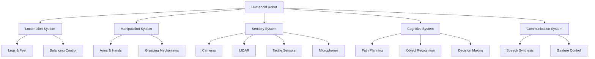
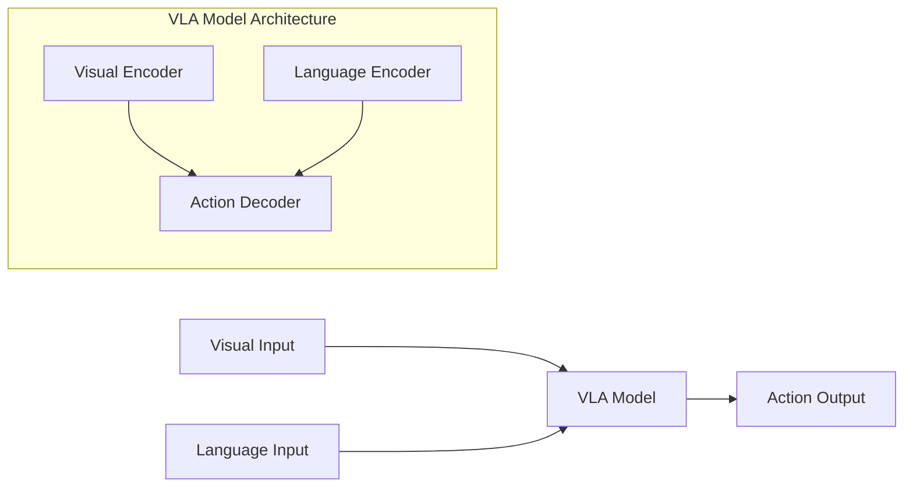

# Introduction to Physical AI & Humanoid Robotics

## Overview of Physical AI

Physical AI represents a revolutionary convergence of artificial intelligence and physical systems. Unlike traditional AI that operates primarily in digital spaces, Physical AI integrates intelligence directly into physical agents and environments, creating systems that can perceive, reason, and act in the real world with unprecedented sophistication.

The field encompasses several key areas:

- **Embodied Cognition**: The idea that intelligence emerges from the interaction between an agent and its physical environment
- **Sensorimotor Learning**: How agents learn through physical interaction with their surroundings
- **Real-time Decision Making**: Processing sensory information and making decisions in real-time for physical tasks
- **Adaptive Control Systems**: Systems that can adjust their behavior based on environmental changes

### Historical Context

The journey toward Physical AI began in the 1950s with early robotics research, but has accelerated dramatically in recent years due to advances in:

- **Machine Learning**: Particularly deep learning and reinforcement learning
- **Sensing Technologies**: LIDAR, computer vision, and tactile sensors
- **Computational Power**: GPUs and specialized AI hardware
- **Simulation Environments**: High-fidelity physics simulators

## Humanoid Robotics: The Ultimate Challenge

Humanoid robots represent one of the most ambitious goals in robotics. These systems attempt to replicate human form and function, offering several advantages:

- **Intuitive Interaction**: Humans find it easier to interact with humanoid systems
- **Environment Compatibility**: Designed to operate in human-centric environments
- **Social Acceptance**: More readily accepted by humans in social contexts
- **Versatility**: Capable of performing diverse tasks similar to humans

### Key Components of Humanoid Robots



## Core Technologies

### Perception Systems

Modern humanoid robots employ sophisticated perception systems that include:

#### Computer Vision
```python
import cv2
import numpy as np

def detect_objects(frame):
    """
    Detect and identify objects in the robot's visual field
    Optimized for [USER_GPU] hardware
    """
    # Load pre-trained model
    net = cv2.dnn.readNetFromDarknet('config.cfg', 'weights.weights')

    # Preprocess frame
    blob = cv2.dnn.blobFromImage(frame, 1/255.0, (416, 416), swapRB=True, crop=False)
    net.setInput(blob)
    outputs = net.forward()

    return outputs

# Example usage
cap = cv2.VideoCapture(0)
while True:
    ret, frame = cap.read()
    if ret:
        objects = detect_objects(frame)
        # Process detected objects
```

#### Tactile Sensing
```xml
<!-- ROS2 URDF configuration for tactile sensors -->
<robot name="humanoid_with_tactile">
  <link name="hand">
    <visual>
      <geometry>
        <mesh filename="hand.dae"/>
      </geometry>
    </visual>
    <collision>
      <geometry>
        <mesh filename="hand_collision.dae"/>
      </geometry>
    </collision>
  </link>

  <!-- Tactile sensor array -->
  <gazebo reference="hand">
    <sensor type="contact" name="tactile_sensor">
      <always_on>true</always_on>
      <update_rate>30</update_rate>
      <contact>
        <collision>hand_collision</collision>
      </contact>
    </sensor>
  </gazebo>
</robot>
```

### Control Systems

#### Balance and Locomotion
```python
import numpy as np
from scipy import signal

class BalanceController:
    def __init__(self, robot_mass, com_height):
        self.mass = robot_mass
        self.com_height = com_height
        self.gravity = 9.81

    def compute_zmp(self, com_pos, com_vel, com_acc):
        """
        Compute Zero Moment Point for balance control
        """
        zmp_x = com_pos[0] - (self.com_height / self.gravity) * com_acc[0]
        zmp_y = com_pos[1] - (self.com_height / self.gravity) * com_acc[1]
        return np.array([zmp_x, zmp_y, 0])

    def compute_foot_trajectory(self, start_pos, end_pos, step_height=0.1, steps=20):
        """
        Generate smooth foot trajectory for walking
        """
        t = np.linspace(0, 1, steps)
        x_traj = start_pos[0] + (end_pos[0] - start_pos[0]) * t
        y_traj = start_pos[1] + (end_pos[1] - start_pos[1]) * t
        z_traj = start_pos[2] + step_height * np.sin(np.pi * t)

        return np.column_stack([x_traj, y_traj, z_traj])

# Example usage
controller = BalanceController(robot_mass=75.0, com_height=0.85)
```

## ROS2 Integration

ROS2 serves as the middleware for humanoid robotics, providing:

- **Message Passing**: Efficient communication between nodes
- **Device Drivers**: Standardized interfaces for sensors and actuators
- **Simulation Tools**: Gazebo integration for testing
- **Visualization**: RViz for debugging and monitoring

```bash
# Install ROS2 dependencies for humanoid robotics
sudo apt update
sudo apt install ros-humble-desktop-full
sudo apt install ros-humble-gazebo-ros-pkgs
sudo apt install ros-humble-navigation2
sudo apt install ros-humble-nav2-bringup
```

```python
# ROS2 node example for humanoid robot control
import rclpy
from rclpy.node import Node
from sensor_msgs.msg import JointState
from geometry_msgs.msg import Twist
from std_msgs.msg import String

class HumanoidController(Node):
    def __init__(self):
        super().__init__('humanoid_controller')

        # Publishers
        self.joint_pub = self.create_publisher(JointState, 'joint_states', 10)
        self.cmd_vel_pub = self.create_publisher(Twist, 'cmd_vel', 10)

        # Subscribers
        self.imu_sub = self.create_subscription(
            String, 'imu_data', self.imu_callback, 10)

        # Timer for control loop
        self.timer = self.create_timer(0.01, self.control_loop)

    def control_loop(self):
        # Main control logic here
        joint_msg = JointState()
        joint_msg.name = ['hip_joint', 'knee_joint', 'ankle_joint']
        joint_msg.position = [0.1, 0.2, 0.3]
        self.joint_pub.publish(joint_msg)

    def imu_callback(self, msg):
        # Process IMU data for balance control
        pass

def main(args=None):
    rclpy.init(args=args)
    controller = HumanoidController()
    rclpy.spin(controller)
    controller.destroy_node()
    rclpy.shutdown()

if __name__ == '__main__':
    main()
```

## Simulation Environment

Gazebo provides a realistic physics simulation environment for testing humanoid robots before deployment on real hardware.

```xml
<!-- Gazebo world configuration -->
<sdf version="1.7">
  <world name="humanoid_world">
    <include>
      <uri>model://ground_plane</uri>
    </include>
    <include>
      <uri>model://sun</uri>
    </include>

    <!-- Humanoid robot model -->
    <include>
      <uri>model://humanoid_robot</uri>
      <pose>0 0 1 0 0 0</pose>
    </include>

    <!-- Physics engine configuration -->
    <physics type="ode">
      <max_step_size>0.001</max_step_size>
      <real_time_factor>1.0</real_time_factor>
      <real_time_update_rate>1000</real_time_update_rate>
    </physics>
  </world>
</sdf>
```

## NVIDIA Isaac Integration

For GPU-accelerated AI, NVIDIA Isaac provides specialized tools and libraries:

- **Isaac ROS**: GPU-optimized perception and navigation nodes
- **Isaac Sim**: High-fidelity simulation environment
- **Deep Learning**: Optimized for NVIDIA GPUs

```python
# Isaac ROS example for object detection
from isaac_ros_tensor_list_interfaces.msg import TensorList
from sensor_msgs.msg import Image
import cv2
import numpy as np

class IsaacObjectDetector:
    def __init__(self):
        # Initialize Isaac-specific components
        # Optimized for [USER_GPU] hardware
        pass

    def process_tensor(self, tensor_list: TensorList):
        """
        Process tensors from Isaac perception pipeline
        """
        for tensor in tensor_list.tensors:
            if tensor.name == 'detections':
                # Process object detections
                detections = self.decode_detections(tensor.data)
                return detections
        return []
```

## Vision Language Action (VLA) Models

VLA models represent the cutting edge of Physical AI, combining visual perception, language understanding, and action generation:



## Hardware Considerations

Different hardware configurations significantly impact performance:

### For NVIDIA Jetson Users
```python
# Optimized for Jetson hardware
import jetson.inference
import jetson.utils

def jetson_optimized_detection():
    """
    Use Jetson's built-in AI accelerators for efficient processing
    """
    net = jetson.inference.detectNet("ssd-mobilenet-v2", threshold=0.5)
    camera = jetson.utils.gstCamera(1280, 720, "/dev/video0")
    display = jetson.utils.glDisplay()

    while display.IsOpen():
        img, width, height = camera.CaptureRGBA()
        detections = net.Detect(img, width, height)
        display.RenderOnce(img, width, height)
```

### For High-End GPU Users
```python
# Optimized for high-end GPUs
import torch
import torchvision

def gpu_optimized_processing():
    """
    Leverage high-end GPU capabilities for complex computations
    """
    device = torch.device("cuda" if torch.cuda.is_available() else "cpu")
    model = torchvision.models.resnet50(pretrained=True).to(device)

    # Perform complex computations using GPU acceleration
    # Optimized for [USER_GPU] hardware specifications
```

## Key Takeaways

1. **Physical AI** bridges the gap between digital AI and physical systems, enabling real-world interaction and manipulation.

2. **Humanoid robotics** presents unique challenges requiring sophisticated integration of perception, control, and cognitive systems.

3. **ROS2** provides the essential middleware for communication between different components of the robotic system.

4. **Simulation** is crucial for testing and validation before deployment on real hardware.

5. **Hardware optimization** is essential for achieving real-time performance in robotic applications.

6. **VLA models** represent the future of Physical AI by integrating vision, language, and action in unified architectures.

## Practice Exercises

### Exercise 1: Basic ROS2 Node
Create a ROS2 node that publishes joint states for a simple humanoid model. The node should publish messages at 50Hz with realistic joint angles for standing posture.

### Exercise 2: Perception Pipeline
Implement a basic computer vision pipeline that detects colored objects in an image and publishes their positions. Use OpenCV and ROS2 message types.

### Exercise 3: Balance Controller
Implement a simple balance controller that maintains the center of mass within the support polygon. Test with simulated IMU data.

### Exercise 4: Gazebo Simulation
Create a simple Gazebo world with a humanoid robot model. Add a basic controller that makes the robot stand upright.

### Exercise 5: Hardware Optimization
Optimize a simple neural network inference pipeline for your specific hardware (GPU/Jetson). Compare performance between different optimization strategies.

## MCQs Quiz

1. What does Physical AI primarily focus on?
   - A) Digital-only applications
   - B) Integration of intelligence into physical agents and environments
   - C) Purely software-based solutions
   - D) Cloud-based computing
   - **Answer: B**

2. Which of the following is NOT a key component of humanoid robots?
   - A) Locomotion System
   - B) Manipulation System
   - C) Sensory System
   - D) Purely Digital Interface
   - **Answer: D**

3. What does ZMP stand for in robotics?
   - A) Zero Moment Point
   - B) Zero Motion Parameter
   - C) Zed Motor Position
   - D) Zone Motion Protocol
   - **Answer: A**

4. Which middleware is commonly used in humanoid robotics?
   - A) ROS2
   - B) MQTT
   - C) HTTP
   - D) TCP/IP
   - **Answer: A**

5. What do VLA models combine?
   - A) Vision, Language, and Action
   - B) Velocity, Location, and Acceleration
   - C) Voltage, Load, and Amperage
   - D) Virtual, Linear, and Adaptive
   - **Answer: A**

## Further Reading

- "Robotics: Control, Sensing, Vision, and Intelligence" by Fu, Gonzalez, and Lee
- "Probabilistic Robotics" by Thrun, Burgard, and Fox
- "Humanoid Robotics: A Reference" by Veloso
- "Introduction to Autonomous Manipulation" by Albu-Schäffer and Hirzinger
- "Modern Robotics: Mechanics, Planning, and Control" by Lynch and Park
- NVIDIA Isaac Documentation: https://docs.nvidia.com/isaac/
- ROS2 Documentation: https://docs.ros.org/en/humble/
- Gazebo Simulation: http://gazebosim.org/

---

*Generated with reusable Claude Subagents & Spec-Kit Plus*