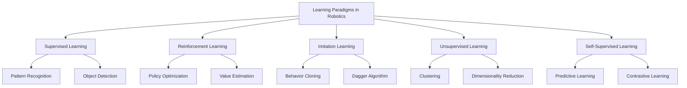
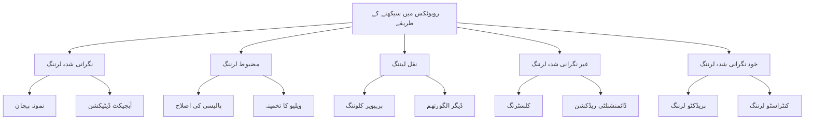

import { PersonalizeButton, UrduToggleButton } from '@site/src/components/LanguageButtons';

<PersonalizeButton />
<UrduToggleButton />

# Chapter 10: Learning & Adaptation

## Introduction

Welcome to Chapter 10 of the Physical AI & Humanoid Robotics textbook. In this chapter, we explore the fascinating world of learning and adaptation in humanoid robotics. We'll examine how robots can acquire new skills, adapt to changing environments, and improve their performance through various machine learning techniques.

Machine learning has revolutionized robotics by enabling robots to learn from experience, adapt to new situations, and develop sophisticated behaviors without explicit programming for every scenario. This chapter covers the fundamental approaches to learning in robotics, including reinforcement learning, imitation learning, and adaptive control systems.

Understanding these concepts is crucial for developing intelligent humanoid robots that can operate effectively in dynamic, real-world environments. Whether it's learning to walk more efficiently, adapting manipulation strategies, or improving interaction with humans, learning and adaptation form the foundation of truly intelligent robotic systems.

## Learning Paradigms in Robotics

Machine learning in robotics encompasses several paradigms, each suited to different types of problems and learning objectives. The primary approaches include:

1. **Supervised Learning**: Using labeled datasets to train models that can predict outcomes based on input data
2. **Reinforcement Learning**: Learning through trial and error by receiving rewards or penalties for actions
3. **Imitation Learning**: Learning by observing and mimicking expert demonstrations
4. **Unsupervised Learning**: Discovering patterns and structures in unlabeled data
5. **Self-Supervised Learning**: Creating supervision from the data itself

Each paradigm offers unique advantages and is often combined to achieve robust learning capabilities in humanoid robots.



## Reinforcement Learning in Robotics

Reinforcement Learning (RL) is particularly well-suited for robotics applications where agents must learn to interact with physical environments through sequential decision-making. In RL, an agent learns to take actions in an environment to maximize cumulative reward.

### Core Components of RL

- **State Space**: The set of all possible states the robot can be in
- **Action Space**: The set of all possible actions the robot can take
- **Reward Function**: A function that assigns a scalar reward to each state-action pair
- **Policy**: A mapping from states to actions that defines the agent's behavior
- **Value Function**: Estimates the expected cumulative reward from a given state

### Deep Reinforcement Learning

Deep RL combines deep neural networks with reinforcement learning, enabling robots to learn complex behaviors from high-dimensional sensory inputs like camera images and joint encoders.

```python
# Example: Deep Q-Network (DQN) for robotic manipulation
import torch
import torch.nn as nn
import numpy as np

class RobotDQN(nn.Module):
    def __init__(self, state_dim, action_dim, hidden_dim=256):
        super(RobotDQN, self).__init__()

        # Convolutional layers for processing visual input
        self.conv_layers = nn.Sequential(
            nn.Conv2d(3, 32, kernel_size=8, stride=4),
            nn.ReLU(),
            nn.Conv2d(32, 64, kernel_size=4, stride=2),
            nn.ReLU(),
            nn.Conv2d(64, 64, kernel_size=3, stride=1),
            nn.ReLU()
        )

        # Calculate the output size after convolutions
        conv_out_size = self._get_conv_out_size(state_dim)

        # Fully connected layers
        self.fc_layers = nn.Sequential(
            nn.Linear(conv_out_size + 6, hidden_dim),  # Include proprioceptive features
            nn.ReLU(),
            nn.Linear(hidden_dim, hidden_dim),
            nn.ReLU(),
            nn.Linear(hidden_dim, action_dim)
        )

    def _get_conv_out_size(self, input_shape):
        """Calculate the output size after convolution layers"""
        o = self.conv_layers(torch.zeros(1, *input_shape))
        return int(np.prod(o.size()))

    def forward(self, vision_input, proprio_input):
        conv_features = self.conv_layers(vision_input)
        conv_features = conv_features.view(conv_features.size(0), -1)

        # Concatenate vision and proprioceptive features
        combined = torch.cat([conv_features, proprio_input], dim=1)
        q_values = self.fc_layers(combined)
        return q_values

# Example usage in a robotic manipulation task
def train_robot_dqn():
    device = torch.device("cuda" if torch.cuda.is_available() else "cpu")

    # Initialize network
    state_dim = (3, 84, 84)  # Image dimensions
    action_dim = 18  # Joint space actions for manipulator
    dqn = RobotDQN(state_dim, action_dim).to(device)

    optimizer = torch.optim.Adam(dqn.parameters(), lr=1e-4)
    criterion = nn.MSELoss()

    # Training loop would include:
    # - Collecting experiences from robot interaction
    # - Storing transitions in replay buffer
    # - Sampling batches for training
    # - Computing target Q-values
    # - Updating network weights

    return dqn
```

### Policy Gradient Methods

Policy gradient methods directly optimize the policy function, making them suitable for continuous action spaces common in robotic control.

```python
# Example: Proximal Policy Optimization (PPO) for locomotion
import torch
import torch.nn as nn
import torch.optim as optim

class ActorCritic(nn.Module):
    def __init__(self, state_dim, action_dim):
        super(ActorCritic, self).__init__()

        # Shared feature extractor
        self.feature_extractor = nn.Sequential(
            nn.Linear(state_dim, 256),
            nn.Tanh(),
            nn.Linear(256, 256),
            nn.Tanh()
        )

        # Actor network (policy)
        self.actor_mean = nn.Linear(256, action_dim)
        self.actor_logstd = nn.Parameter(torch.zeros(action_dim))

        # Critic network (value function)
        self.critic = nn.Linear(256, 1)

    def forward(self, state):
        features = self.feature_extractor(state)

        # Actor: compute action distribution
        mean = torch.tanh(self.actor_mean(features))
        std = torch.exp(self.actor_logstd)

        # Critic: compute value
        value = self.critic(features)

        return mean, std, value

class PPOTrainer:
    def __init__(self, state_dim, action_dim, lr=3e-4, clip_epsilon=0.2):
        self.actor_critic = ActorCritic(state_dim, action_dim)
        self.optimizer = optim.Adam(self.actor_critic.parameters(), lr=lr)
        self.clip_epsilon = clip_epsilon

    def update(self, states, actions, old_log_probs, returns, advantages):
        # Forward pass
        new_mean, new_std, values = self.actor_critic(states)

        # Compute new log probabilities
        dist = torch.distributions.Normal(new_mean, new_std)
        new_log_probs = dist.log_prob(actions).sum(dim=-1)

        # Compute ratio
        ratio = torch.exp(new_log_probs - old_log_probs)

        # PPO surrogate loss
        surr1 = ratio * advantages
        surr2 = torch.clamp(ratio, 1 - self.clip_epsilon, 1 + self.clip_epsilon) * advantages
        actor_loss = -torch.min(surr1, surr2).mean()

        # Value loss
        value_loss = nn.MSELoss()(values.squeeze(), returns)

        # Total loss
        total_loss = actor_loss + 0.5 * value_loss

        # Update parameters
        self.optimizer.zero_grad()
        total_loss.backward()
        torch.nn.utils.clip_grad_norm_(self.actor_critic.parameters(), 0.5)
        self.optimizer.step()

        return actor_loss.item(), value_loss.item()
```

## Imitation Learning

Imitation learning enables robots to learn complex behaviors by observing and replicating expert demonstrations. This approach is particularly valuable when defining appropriate reward functions for reinforcement learning is challenging.

### Behavior Cloning

Behavior cloning treats imitation learning as a supervised learning problem, where the robot learns to map observations to actions based on expert demonstrations.

```python
# Example: Behavior Cloning for robotic manipulation
import torch
import torch.nn as nn
import torch.optim as optim

class BehaviorCloningNet(nn.Module):
    def __init__(self, obs_dim, action_dim):
        super(BehaviorCloningNet, self).__init__()

        self.network = nn.Sequential(
            nn.Linear(obs_dim, 256),
            nn.ReLU(),
            nn.Linear(256, 256),
            nn.ReLU(),
            nn.Linear(256, 128),
            nn.ReLU(),
            nn.Linear(128, action_dim)
        )

    def forward(self, obs):
        return self.network(obs)

class BehaviorCloning:
    def __init__(self, obs_dim, action_dim, lr=1e-3):
        self.network = BehaviorCloningNet(obs_dim, action_dim)
        self.optimizer = optim.Adam(self.network.parameters(), lr=lr)
        self.criterion = nn.MSELoss()

    def train_step(self, obs_batch, action_batch):
        self.optimizer.zero_grad()
        pred_actions = self.network(obs_batch)
        loss = self.criterion(pred_actions, action_batch)
        loss.backward()
        self.optimizer.step()
        return loss.item()

# Example usage
def collect_demonstrations(robot_env, expert_policy, num_demos=1000):
    """
    Collect expert demonstrations for behavior cloning
    """
    demonstrations = []

    for demo_idx in range(num_demos):
        obs_list = []
        action_list = []

        obs = robot_env.reset()
        done = False

        while not done:
            # Expert provides action
            expert_action = expert_policy(obs)

            # Store observation-action pair
            obs_list.append(obs.copy())
            action_list.append(expert_action.copy())

            # Execute action
            obs, reward, done, info = robot_env.step(expert_action)

        demonstrations.append({
            'observations': np.array(obs_list),
            'actions': np.array(action_list)
        })

    return demonstrations
```

### DAgger Algorithm

DAgger (Dataset Aggregation) addresses the covariate shift problem in behavior cloning by iteratively collecting data from the expert on states visited by the learned policy.

```python
# Example: DAgger algorithm implementation
import numpy as np

class DAgger:
    def __init__(self, bc_model, expert_policy):
        self.bc_model = bc_model
        self.expert_policy = expert_policy
        self.all_obs = []
        self.all_actions = []

    def train_iteration(self, robot_env, policy, num_rollouts=10):
        """
        Perform one iteration of DAgger
        """
        new_obs_list = []
        new_action_list = []

        for rollout in range(num_rollouts):
            obs = robot_env.reset()
            done = False

            while not done:
                # Query expert for action on current policy's state
                expert_action = self.expert_policy(obs)

                # Collect state-action pair
                new_obs_list.append(obs.copy())
                new_action_list.append(expert_action.copy())

                # Execute learned policy action to visit new state
                with torch.no_grad():
                    policy_action = policy.network(torch.FloatTensor(obs)).numpy()

                obs, reward, done, info = robot_env.step(policy_action)

        # Aggregate new data with old data
        self.all_obs.extend(new_obs_list)
        self.all_actions.extend(new_action_list)

        # Train behavior cloning model on aggregated dataset
        if len(self.all_obs) > 0:
            obs_tensor = torch.FloatTensor(self.all_obs)
            action_tensor = torch.FloatTensor(self.all_actions)

            # Train for multiple epochs
            for epoch in range(10):
                indices = np.random.permutation(len(self.all_obs))
                for i in range(0, len(indices), 32):  # Batch size 32
                    batch_indices = indices[i:i+32]
                    batch_obs = obs_tensor[batch_indices]
                    batch_actions = action_tensor[batch_indices]

                    self.bc_model.train_step(batch_obs, batch_actions)
```

## Adaptive Control Systems

Adaptive control systems enable robots to adjust their control parameters in real-time based on changing environmental conditions or system dynamics. This is crucial for humanoid robots operating in dynamic environments.

### Model Reference Adaptive Control (MRAC)

MRAC adjusts controller parameters to make the plant behave like a desired reference model.

```python
# Example: Model Reference Adaptive Control for robotic joint
import numpy as np

class MRACController:
    def __init__(self, reference_model_params, initial_controller_params):
        # Reference model parameters
        self.ref_A = reference_model_params['A']
        self.ref_B = reference_model_params['B']
        self.ref_C = reference_model_params['C']

        # Controller parameters (initially unknown, adapted online)
        self.theta_m = initial_controller_params['theta_m']  # Model parameters
        self.theta_r = initial_controller_params['theta_r']  # Reference parameters

        # Adaptation gains
        self.gamma_m = 0.1  # Model adaptation gain
        self.gamma_r = 0.1  # Reference adaptation gain

        # State variables
        self.state = np.zeros(len(self.ref_A))
        self.ref_state = np.zeros(len(self.ref_A))

    def update(self, y, r, dt):
        """
        Update controller parameters based on tracking error
        y: actual output
        r: reference input
        dt: time step
        """
        # Compute tracking error
        e = y - r

        # Update reference model state
        self.ref_state += dt * (self.ref_A @ self.ref_state + self.ref_B * r)

        # Update controller state
        u = -self.theta_m @ self.state + self.theta_r * r
        self.state += dt * (self.ref_A @ self.state + self.ref_B * u)

        # Adapt parameters based on error
        self.theta_m += -self.gamma_m * e * self.state
        self.theta_r += self.gamma_r * e * r

        return u

# Example: Adaptive control for robotic manipulator joint
class AdaptiveJointController:
    def __init__(self, joint_id, initial_mass=1.0, initial_damping=0.1):
        self.joint_id = joint_id
        self.mass = initial_mass
        self.damping = initial_damping

        # Adaptive parameters
        self.param_history = {'mass': [], 'damping': []}

    def update_model(self, torque, acceleration, velocity, position, dt):
        """
        Adapt model parameters based on observed dynamics
        """
        # Physics-based parameter estimation
        # tau = m*q_ddot + b*q_dot + k*q (simplified)
        estimated_mass = torque / (acceleration + 1e-6)  # Add small value to avoid division by zero
        estimated_damping = torque / (velocity + 1e-6)

        # Update parameters with low-pass filtering
        alpha = 0.01  # Adaptation rate
        self.mass = (1 - alpha) * self.mass + alpha * estimated_mass
        self.damping = (1 - alpha) * self.damping + alpha * estimated_damping

        # Store history for analysis
        self.param_history['mass'].append(self.mass)
        self.param_history['damping'].append(self.damping)

    def compute_control(self, desired_pos, desired_vel, current_pos, current_vel, dt):
        """
        Compute adaptive control signal
        """
        # PD control with adaptive parameters
        pos_error = desired_pos - current_pos
        vel_error = desired_vel - current_vel

        # Compute control effort
        proportional_term = self.mass * pos_error
        derivative_term = self.damping * vel_error

        control_signal = proportional_term + derivative_term

        return control_signal
```

### Self-Organizing Maps for Adaptive Behavior

Self-Organizing Maps (SOMs) can be used for adaptive behavior learning and clustering of similar movement patterns.

```python
# Example: Self-Organizing Map for movement pattern learning
import numpy as np

class SOMRobotLearning:
    def __init__(self, grid_width, grid_height, input_dim, learning_rate=0.1):
        self.grid_width = grid_width
        self.grid_height = grid_height
        self.input_dim = input_dim
        self.learning_rate = learning_rate

        # Initialize weight vectors randomly
        self.weights = np.random.randn(grid_width, grid_height, input_dim)

        # Neighborhood function parameters
        self.sigma = max(grid_width, grid_height) / 2.0  # Initial neighborhood radius
        self.lambda_decay = 1000  # Decay constant

    def find_bmu(self, input_vector):
        """
        Find Best Matching Unit (BMU) for input vector
        """
        distances = np.linalg.norm(self.weights - input_vector, axis=2)
        bmu_x, bmu_y = np.unravel_index(np.argmin(distances), distances.shape)
        return bmu_x, bmu_y

    def update_weights(self, input_vector, bmu_x, bmu_y, iteration):
        """
        Update weights based on neighborhood of BMU
        """
        # Decay parameters over time
        current_lr = self.learning_rate * np.exp(-iteration / self.lambda_decay)
        current_sigma = self.sigma * np.exp(-iteration / self.lambda_decay)

        # Create coordinate grid
        xx, yy = np.meshgrid(range(self.grid_width), range(self.grid_height))

        # Calculate distance from BMU in grid space
        grid_distances = (xx - bmu_x)**2 + (yy - bmu_y)**2

        # Calculate neighborhood influence
        neighborhood = np.exp(-grid_distances / (2 * current_sigma**2))

        # Update weights
        self.weights += current_lr * neighborhood[:, :, np.newaxis] * \
                       (input_vector - self.weights)

    def learn_pattern(self, input_sequence, iterations=1000):
        """
        Learn a sequence of input patterns
        """
        for i in range(iterations):
            idx = np.random.randint(0, len(input_sequence))
            input_vector = input_sequence[idx]

            bmu_x, bmu_y = self.find_bmu(input_vector)
            self.update_weights(input_vector, bmu_x, bmu_y, i)

    def recall_pattern(self, input_vector):
        """
        Recall learned pattern for input vector
        """
        bmu_x, bmu_y = self.find_bmu(input_vector)
        return self.weights[bmu_x, bmu_y]

# Example usage for learning walking patterns
def learn_walking_patterns():
    # Define walking phase features (e.g., joint angles, ground reaction forces)
    som = SOMRobotLearning(grid_width=10, grid_height=10, input_dim=12)

    # Simulate walking pattern sequence
    walking_patterns = []
    for phase in range(100):  # 100 walking phases
        # Generate synthetic walking features
        features = np.random.randn(12)  # 12 joint angles + 4 GRF values
        walking_patterns.append(features)

    # Learn walking patterns
    som.learn_pattern(walking_patterns, iterations=5000)

    return som
```

## Transfer Learning in Robotics

Transfer learning allows robots to leverage knowledge acquired in one task or environment to improve learning in related tasks or environments. This is particularly valuable for reducing training time and improving sample efficiency.

### Domain Adaptation

Domain adaptation techniques help transfer learned policies across different environments or robot configurations.

```python
# Example: Domain adaptation for different robot morphologies
import torch
import torch.nn as nn

class DomainAdaptationNet(nn.Module):
    def __init__(self, shared_dim=256, source_dim=10, target_dim=12):
        super(DomainAdaptationNet, self).__init__()

        # Shared feature extractor
        self.shared_encoder = nn.Sequential(
            nn.Linear(shared_dim, 256),
            nn.ReLU(),
            nn.Linear(256, 256),
            nn.ReLU(),
            nn.Linear(256, shared_dim),
            nn.ReLU()
        )

        # Domain-specific decoders
        self.source_decoder = nn.Sequential(
            nn.Linear(shared_dim, 128),
            nn.ReLU(),
            nn.Linear(128, source_dim)
        )

        self.target_decoder = nn.Sequential(
            nn.Linear(shared_dim, 128),
            nn.ReLU(),
            nn.Linear(128, target_dim)
        )

        # Domain classifier for adversarial training
        self.domain_classifier = nn.Sequential(
            nn.Linear(shared_dim, 64),
            nn.ReLU(),
            nn.Linear(64, 2)
        )

    def encode(self, x):
        return self.shared_encoder(x)

    def decode_source(self, z):
        return self.source_decoder(z)

    def decode_target(self, z):
        return self.target_decoder(z)

    def classify_domain(self, z):
        return self.domain_classifier(z)

class DomainAdaptationTrainer:
    def __init__(self, model, lambda_adv=0.1):
        self.model = model
        self.lambda_adv = lambda_adv
        self.recon_criterion = nn.MSELoss()
        self.domain_criterion = nn.CrossEntropyLoss()

    def train_step(self, source_data, target_data):
        # Encode both domains
        source_encoded = self.model.encode(source_data)
        target_encoded = self.model.encode(target_data)

        # Reconstruct original data
        source_recon = self.model.decode_source(source_encoded)
        target_recon = self.model.decode_target(target_encoded)

        # Reconstruction losses
        source_recon_loss = self.recon_criterion(source_recon, source_data)
        target_recon_loss = self.recon_criterion(target_recon, target_data)

        # Domain classification
        source_domains = torch.zeros(source_encoded.size(0)).long()
        target_domains = torch.ones(target_encoded.size(0)).long()

        all_encoded = torch.cat([source_encoded, target_encoded], dim=0)
        all_domains = torch.cat([source_domains, target_domains], dim=0)

        domain_preds = self.model.classify_domain(all_encoded)
        domain_loss = self.domain_criterion(domain_preds, all_domains)

        # Adversarial loss (reverse gradients)
        # In practice, you'd use gradient reversal layer
        total_loss = source_recon_loss + target_recon_loss - self.lambda_adv * domain_loss

        return total_loss
```

## Safety in Learning Systems

Safety considerations are paramount when deploying learning algorithms on physical robots. Safe learning ensures that robots do not damage themselves or their environment during the learning process.

### Safe Exploration Strategies

Safe exploration balances the need to explore the environment to learn with the need to avoid dangerous states.

```python
# Example: Safe exploration with constraint satisfaction
import numpy as np
from scipy.optimize import minimize

class SafeExploration:
    def __init__(self, safety_constraints, exploration_rate=0.1):
        self.safety_constraints = safety_constraints
        self.exploration_rate = exploration_rate
        self.constraint_history = []

    def is_safe_action(self, state, action):
        """
        Check if action is safe in given state
        """
        # Apply action and check constraints
        next_state = self.simulate_transition(state, action)

        for constraint in self.safety_constraints:
            if not constraint(next_state):
                return False
        return True

    def safe_exploration_policy(self, state, q_values):
        """
        Modify Q-values to ensure safe exploration
        """
        safe_actions = []
        for action in range(len(q_values)):
            if self.is_safe_action(state, action):
                safe_actions.append(action)

        if not safe_actions:
            # No safe actions available, return random safe action or null
            return None

        # Apply epsilon-greedy on safe actions only
        if np.random.rand() < self.exploration_rate:
            # Explore: choose random safe action
            chosen_action = np.random.choice(safe_actions)
        else:
            # Exploit: choose best safe action
            safe_q_values = q_values[safe_actions]
            best_safe_idx = np.argmax(safe_q_values)
            chosen_action = safe_actions[best_safe_idx]

        return chosen_action

    def simulate_transition(self, state, action):
        """
        Simulate state transition (simplified model)
        """
        # Placeholder for physics simulation
        next_state = state + 0.1 * action  # Simplified dynamics
        return next_state

# Example safety constraints
def joint_limit_constraint(state):
    """Ensure joint positions are within limits"""
    joint_limits = [-2.0, 2.0]  # Example limits
    for joint_pos in state[:6]:  # First 6 joints
        if joint_pos < joint_limits[0] or joint_pos > joint_limits[1]:
            return False
    return True

def collision_constraint(state):
    """Check for potential collisions"""
    # Simplified collision check
    obstacle_positions = [1.5, -1.0]  # Example obstacle positions
    robot_pos = state[0]  # Robot position

    for obs_pos in obstacle_positions:
        if abs(robot_pos - obs_pos) < 0.5:  # Collision threshold
            return False
    return True

# Example usage
safety_system = SafeExploration([joint_limit_constraint, collision_constraint])
```

## Hardware-Specific Implementations

Different hardware configurations require tailored learning and adaptation approaches. Let's implement specific examples for different hardware types:

### GPU-Accelerated Learning

For robots with powerful GPUs, we can implement more computationally intensive learning algorithms:

```jsx
// Example: GPU-accelerated learning component (React/Preact)
import React, { useState, useEffect } from 'react';

const GPULearningComponent = ({ robotSpecs }) => {
  const [isLearning, setIsLearning] = useState(false);
  const [performanceMetrics, setPerformanceMetrics] = useState({
    fps: 0,
    memoryUsage: 0,
    learningRate: 0
  });

  useEffect(() => {
    if (isLearning) {
      // Initialize GPU-accelerated learning
      initializeGPULearning();
    }
  }, [isLearning]);

  const initializeGPULearning = () => {
    // Check GPU capabilities
    const gpuInfo = getGPUInfo();

    if (gpuInfo.supportsCompute) {
      // Configure learning parameters based on GPU
      const params = configureLearningParams(gpuInfo);

      // Start learning process
      startLearningProcess(params);
    }
  };

  const getGPUInfo = () => {
    // In a real implementation, this would query WebGL/Compute capabilities
    return {
      supportsCompute: true,
      memorySize: robotSpecs.gpuMemory || 8192, // MB
      computeCapability: robotSpecs.gpuComputeCapability || '7.5'
    };
  };

  const configureLearningParams = (gpuInfo) => {
    // Adjust parameters based on GPU capabilities
    const batchSize = Math.min(64, Math.floor(gpuInfo.memorySize / 1024));
    const learningRate = gpuInfo.computeCapability >= 7.0 ? 0.001 : 0.0005;

    return {
      batchSize,
      learningRate,
      useMixedPrecision: gpuInfo.computeCapability >= 7.0
    };
  };

  const startLearningProcess = (params) => {
    // Simulate learning process
    const interval = setInterval(() => {
      setPerformanceMetrics(prev => ({
        ...prev,
        fps: Math.random() * 30 + 20, // 20-50 FPS
        memoryUsage: Math.random() * 80 + 10, // 10-90%
        learningRate: params.learningRate
      }));
    }, 1000);

    // Cleanup
    return () => clearInterval(interval);
  };

  return (
    <div className="gpu-learning-container">
      <h3>GPU-Accelerated Learning</h3>
      <button
        onClick={() => setIsLearning(!isLearning)}
        className={`btn ${isLearning ? 'btn-danger' : 'btn-success'}`}
      >
        {isLearning ? 'Stop Learning' : 'Start Learning'}
      </button>

      {isLearning && (
        <div className="metrics">
          <p>FPS: {performanceMetrics.fps.toFixed(2)}</p>
          <p>Memory Usage: {performanceMetrics.memoryUsage.toFixed(1)}%</p>
          <p>Learning Rate: {performanceMetrics.learningRate}</p>
        </div>
      )}
    </div>
  );
};

export default GPULearningComponent;
```

### Jetson-Based Learning

For NVIDIA Jetson platforms, we can implement optimized learning algorithms:

```python
# Example: Jetson-specific learning optimizations
import jetson.inference
import jetson.utils
import numpy as np
import torch
import torch.nn as nn

class JetsonLearningOptimizer:
    def __init__(self, jetson_model):
        self.jetson_model = jetson_model
        self.is_jetson = self.detect_jetson_platform()

        if self.is_jetson:
            self.configure_jetson_optimizations()

    def detect_jetson_platform(self):
        """Detect if running on NVIDIA Jetson"""
        try:
            with open('/proc/device-tree/model', 'r') as f:
                model = f.read().strip('\x00')
                return 'jetson' in model.lower()
        except:
            return False

    def configure_jetson_optimizations(self):
        """Configure optimizations specific to Jetson platform"""
        import subprocess

        # Enable Jetson-specific optimizations
        self.tensorrt_enabled = True
        self.gpu_memory_fraction = 0.8

        # Set power mode for optimal performance
        try:
            subprocess.run(['nvpmodel', '-m', '0'], check=True)  # MAX performance
            print("Jetson configured for maximum performance mode")
        except:
            print("Could not configure Jetson power mode")

    def optimize_model_for_jetson(self, model):
        """Optimize PyTorch model for Jetson deployment"""
        if not self.is_jetson:
            return model

        # Convert to TensorRT for inference acceleration
        if self.tensorrt_enabled:
            import torch_tensorrt

            # Compile model with TensorRT
            compiled_model = torch_tensorrt.compile(
                model,
                inputs=[torch_tensorrt.Input((1, 3, 224, 224))],
                enabled_precisions={torch.float, torch.half},
                workspace_size=1<<25
            )
            return compiled_model

        return model

    def adaptive_learning_rate(self, episode_num):
        """Adjust learning rate based on Jetson capabilities"""
        if not self.is_jetson:
            return 0.001

        # Reduce learning rate to account for computational constraints
        base_lr = 0.0005
        decay_factor = 0.995

        return base_lr * (decay_factor ** episode_num)

# Example: Jetson-specific reinforcement learning
class JetsonRLAgent:
    def __init__(self, state_dim, action_dim):
        self.state_dim = state_dim
        self.action_dim = action_dim
        self.optimizer = JetsonLearningOptimizer(self)

        # Initialize network
        self.network = self.build_network()
        self.network = self.optimizer.optimize_model_for_jetson(self.network)

        # Configure learning parameters for Jetson
        self.learning_rate = self.optimizer.adaptive_learning_rate(0)
        self.optimizer = torch.optim.Adam(self.network.parameters(), lr=self.learning_rate)

    def build_network(self):
        """Build lightweight network suitable for Jetson"""
        return nn.Sequential(
            nn.Linear(self.state_dim, 128),
            nn.ReLU(),
            nn.Dropout(0.1),  # Light regularization
            nn.Linear(128, 128),
            nn.ReLU(),
            nn.Dropout(0.1),
            nn.Linear(128, self.action_dim)
        )

    def train_step(self, states, actions, rewards):
        """Perform training step optimized for Jetson"""
        if not self.optimizer.is_jetson:
            # Standard training
            pass
        else:
            # Jetson-optimized training
            with torch.cuda.amp.autocast():  # Mixed precision
                predictions = self.network(states)
                loss = nn.MSELoss()(predictions, actions)

            # Scale loss for mixed precision
            scaler = torch.cuda.amp.GradScaler()
            scaler.scale(loss).backward()
            scaler.step(self.optimizer)
            scaler.update()

            # Clear gradients periodically
            if torch.cuda.memory_allocated() > 0.8 * torch.cuda.get_device_properties(0).total_memory:
                torch.cuda.empty_cache()
```

### Real Robot Integration

For robots with real hardware, we need to consider real-time constraints and safety:

```python
# Example: Real robot learning with safety constraints
import rospy
from sensor_msgs.msg import JointState
from std_msgs.msg import Float64MultiArray
import threading
import time

class RealRobotLearner:
    def __init__(self, robot_type="unitree_go2"):
        self.robot_type = robot_type
        self.joint_states = None
        self.is_learning = False
        self.safety_monitor = SafetyMonitor()

        # Initialize ROS subscribers/publishers
        self.joint_sub = rospy.Subscriber('/joint_states', JointState, self.joint_callback)
        self.command_pub = rospy.Publisher('/joint_commands', Float64MultiArray, queue_size=10)

        # Learning parameters
        self.learning_thread = None
        self.data_buffer = []
        self.max_buffer_size = 1000

    def joint_callback(self, msg):
        """Callback for joint state updates"""
        self.joint_states = msg
        self.update_data_buffer(msg)

    def update_data_buffer(self, joint_msg):
        """Update learning data buffer"""
        if len(self.data_buffer) >= self.max_buffer_size:
            self.data_buffer.pop(0)  # Remove oldest entry

        # Extract relevant state information
        state_info = {
            'positions': list(joint_msg.position),
            'velocities': list(joint_msg.velocity),
            'effort': list(joint_msg.effort),
            'timestamp': rospy.Time.now().to_sec()
        }

        self.data_buffer.append(state_info)

    def start_learning(self):
        """Start learning process with safety monitoring"""
        if not self.safety_monitor.is_safe_to_learn():
            print("Safety check failed - cannot start learning")
            return False

        self.is_learning = True
        self.learning_thread = threading.Thread(target=self.learning_loop)
        self.learning_thread.start()
        return True

    def learning_loop(self):
        """Main learning loop for real robot"""
        while self.is_learning and not rospy.is_shutdown():
            # Safety check
            if not self.safety_monitor.is_safe_to_operate():
                print("Safety violation - stopping learning")
                self.stop_learning()
                break

            # Collect current state
            if self.joint_states is not None:
                current_state = self.extract_state_features(self.joint_states)

                # Determine next action using learning algorithm
                action = self.select_action(current_state)

                # Publish action with safety limits
                self.publish_safe_action(action)

            time.sleep(0.01)  # 100Hz control loop

    def extract_state_features(self, joint_msg):
        """Extract relevant features from joint states"""
        # Normalize joint positions to [-1, 1] range
        position_range = 3.14  # Assuming ±π range
        normalized_positions = [pos / position_range for pos in joint_msg.position]

        # Normalize velocities
        velocity_range = 10.0  # rad/s
        normalized_velocities = [vel / velocity_range for vel in joint_msg.velocity]

        # Combine features
        features = normalized_positions + normalized_velocities

        return np.array(features)

    def select_action(self, state):
        """Select action based on current state and learning algorithm"""
        # Placeholder for actual learning algorithm
        # In practice, this would use a trained neural network or policy
        action = np.random.normal(0, 0.1, size=len(state))  # Random exploration

        # Ensure action is within safe limits
        action = np.clip(action, -0.5, 0.5)  # Limit to ±0.5 rad
        return action

    def publish_safe_action(self, action):
        """Publish action with safety checks"""
        # Apply safety limits
        safe_action = self.safety_monitor.apply_safety_limits(action)

        # Publish to robot
        cmd_msg = Float64MultiArray()
        cmd_msg.data = safe_action.tolist()
        self.command_pub.publish(cmd_msg)

    def stop_learning(self):
        """Stop learning process safely"""
        self.is_learning = False
        if self.learning_thread:
            self.learning_thread.join(timeout=1.0)

        # Send zero commands to stop robot
        zero_cmd = Float64MultiArray()
        zero_cmd.data = [0.0] * 12  # Assuming 12 joints
        self.command_pub.publish(zero_cmd)

class SafetyMonitor:
    def __init__(self):
        self.joint_limits = {
            'min': [-2.0] * 12,  # Example limits
            'max': [2.0] * 12
        }
        self.velocity_limits = [5.0] * 12  # rad/s
        self.effort_limits = [100.0] * 12  # N*m

    def is_safe_to_learn(self):
        """Check if it's safe to start learning"""
        # Check if robot is in safe initial position
        # Check if emergency stop is not engaged
        # Check if environment is safe
        return True  # Placeholder

    def is_safe_to_operate(self):
        """Check if it's safe to continue operation"""
        # Check joint limits
        # Check for collisions
        # Check for hardware faults
        return True  # Placeholder

    def apply_safety_limits(self, action):
        """Apply safety limits to action"""
        limited_action = np.clip(action,
                                np.array(self.joint_limits['min']),
                                np.array(self.joint_limits['max']))
        return limited_action

# Example usage
def main():
    rospy.init_node('real_robot_learner')

    learner = RealRobotLearner(robot_type="unitree_go2")

    # Start learning
    if learner.start_learning():
        print("Learning started successfully")

        # Run for 10 minutes or until stopped
        start_time = time.time()
        while time.time() - start_time < 600 and not rospy.is_shutdown():
            time.sleep(1)

        learner.stop_learning()
        print("Learning stopped")

    rospy.spin()
```

## Urdu Content: سیکھنے اور مطابقت کے نظام

<details>
<summary>اردو میں پڑھیں / Show in Urdu</summary>

# باب 10: سیکھنے اور مطابقت کے نظام

## تعارف

"سیکھنے اور مطابقت کے نظام" کا باب 10 آپ کو فزیکل ای آئی اور ہیومنوائڈ روبوٹکس کے ٹیکسٹ بک میں خوش آمدید کہتا ہے۔ اس باب میں، ہم ہیومنوائڈ روبوٹکس میں سیکھنے اور مطابقت کی دلچسپ دنیا کا جائزہ لیتے ہیں۔ ہم اس بات کا جائزہ لیں گے کہ روبوٹ نئے ہنر کیسے حاصل کرتے ہیں، تبدیل ہوتے ماحول کے مطابق اپنے آپ کو کیسے ڈھالتے ہیں، اور مختلف مشین لرننگ کی تکنیکوں کے ذریعے اپنا کام کیسے بہتر بناتے ہیں۔

مشین لرننگ نے روبوٹکس کو انقلابی طور پر بدل دیا ہے کیونکہ اس نے روبوٹس کو تجربہ سے سیکھنے، نئی صورتحال کے مطابق اپنے آپ کو ڈھالنے، اور ہر اسٹیٹ کے لیے صرف پروگرامنگ کے بغیر جٹیل طرز عمل تیار کرنے کے قابل بنایا ہے۔ یہ باب روبوٹکس میں سیکھنے کے بنیادی طریقے دکھاتا ہے، بشمول مضبوط لرننگ، نقل لیننگ، اور موافق کنٹرول سسٹمز۔

ان تصورات کو سمجھنا ہیومنوائڈ روبوٹس کو تیار کرنے کے لیے ضروری ہے جو متحرک، حقیقی دنیا کے ماحول میں مؤثر طریقے سے کام کر سکیں۔ چاہے یہ زیادہ کارآمد چلنا سیکھنا ہو، ہاتھ سے کام کرنے کی حکمت عملیوں کو ڈھالنا ہو، یا انسانوں کے ساتھ تعامل کو بہتر بنانا ہو، سیکھنا اور مطابقت روبوٹکس کے سچے انٹیلیجنٹ سسٹمز کی بنیاد ہے۔

## روبوٹکس میں سیکھنے کے طریقے

робوٹکس میں مشین لرننگ کئی طریقوں کو احاطہ کرتا ہے، جن میں سے ہر ایک مختلف قسم کے مسائل اور سیکھنے کے مقاصد کے لیے مناسب ہے۔ اہم طریقے درج ذیل ہیں:

1. **نگرانی شدہ لرننگ**: لیبل والے ڈیٹا سیٹ کا استعمال کرکے ماڈلز کو تربیت دینا جو ان پٹ ڈیٹا کی بنیاد پر نتائج کی پیشن گوئی کر سکیں
2. **مضبوط لرننگ**: ایکشنز کے لیے انعام یا سزا کے ذریعے تجربہ اور غلطی کے ذریعے سیکھنا
3. **نقل لیننگ**: ماہر کی مظاہرے کو دیکھ کر اور نقل کر کے سیکھنا
4. **غیر نگرانی شدہ لرننگ**: لیبل والے ڈیٹا کے بغیر نمونوں اور ساختوں کو دریافت کرنا
5. **خود نگرانی شدہ لرننگ**: ڈیٹا کے خود سے نگرانی پیدا کرنا

ہر طریقہ اپنے منفرد فوائد فراہم کرتا ہے اور اکثر روبوٹکس میں مضبوط سیکھنے کی صلاحیتوں کو حاصل کرنے کے لیے ملا کر استعمال کیا جاتا ہے۔



## روبوٹکس میں مضبوط لرننگ

مضبوط لرننگ (RL) بالخصوص اس وقت کے لیے مناسب ہے جب ایجنٹس کو فزیکل ماحول کے ساتھ متسلسل فیصلہ سازی کے ذریعے بات چیت کرنا سیکھنی ہو۔ RL میں، ایک ایجنٹ ماحول میں اقدامات کر کے کل انعام کو زیادہ سے زیادہ کرنے کے لیے سیکھتا ہے۔

### RL کے بنیادی جزو

- **اسٹیٹ اسپیس**: تمام ممکنہ اسٹیٹس کا سیٹ جن میں روبوٹ ہو سکتا ہے
- **ایکشن اسپیس**: تمام ممکنہ ایکشنز کا سیٹ جو روبوٹ کر سکتا ہے
- **انعام فنکشن**: ہر اسٹیٹ ایکشن جوڑی کو اسکیلر انعام تفویض کرنے والا فنکشن
- **پالیسی**: اسٹیٹس سے ایکشنز تک میپنگ جو ایجنٹ کے طرز عمل کی وضاحت کرتی ہے
- **ویلیو فنکشن**: ایک دی گئی اسٹیٹ سے متوقع کل انعام کا تخمینہ لگاتا ہے

### گہرا مضبوط لرننگ

گہرا RL گہرے نیورل نیٹ ورکس کو مضبوط لرننگ کے ساتھ جوڑتا ہے، جس سے روبوٹس کیمرہ کی تصاویر اور جوائنٹ انکوڈرز جیسے زیادہ بعدی حواسی ان پٹس سے جٹیل طرز عمل سیکھنے کے قابل ہو جاتے ہیں۔

```python
# مثال: روبوٹکس مینیپولیشن کے لیے ڈیف Q-نیٹ ورک (DQN)
import torch
import torch.nn as nn
import numpy as np

class RobotDQN(nn.Module):
    def __init__(self, state_dim, action_dim, hidden_dim=256):
        super(RobotDQN, self).__init__()

        # وژن ان پٹ کو پروسیس کرنے کے لیے کنولوشنل لیئرز
        self.conv_layers = nn.Sequential(
            nn.Conv2d(3, 32, kernel_size=8, stride=4),
            nn.ReLU(),
            nn.Conv2d(32, 64, kernel_size=4, stride=2),
            nn.ReLU(),
            nn.Conv2d(64, 64, kernel_size=3, stride=1),
            nn.ReLU()
        )

        # کنولوشن کے بعد آؤٹ پٹ سائز کا حساب لگائیں
        conv_out_size = self._get_conv_out_size(state_dim)

        # مکمل طور پر منسلک لیئرز
        self.fc_layers = nn.Sequential(
            nn.Linear(conv_out_size + 6, hidden_dim),  # پروپریوسیفٹو خصوصیات شامل کریں
            nn.ReLU(),
            nn.Linear(hidden_dim, hidden_dim),
            nn.ReLU(),
            nn.Linear(hidden_dim, action_dim)
        )

    def _get_conv_out_size(self, input_shape):
        """کنولوشن لیئرز کے بعد آؤٹ پٹ سائز کا حساب لگائیں"""
        o = self.conv_layers(torch.zeros(1, *input_shape))
        return int(np.prod(o.size()))

    def forward(self, vision_input, proprio_input):
        conv_features = self.conv_layers(vision_input)
        conv_features = conv_features.view(conv_features.size(0), -1)

        # وژن اور پروپریوسیفٹو خصوصیات کو جوڑیں
        combined = torch.cat([conv_features, proprio_input], dim=1)
        q_values = self.fc_layers(combined)
        return q_values

# روبوٹکس مینیپولیشن ٹاسک میں مثال کا استعمال
def train_robot_dqn():
    device = torch.device("cuda" if torch.cuda.is_available() else "cpu")

    # نیٹ ورک کو شروع کریں
    state_dim = (3, 84, 84)  # تصویر کے ابعاد
    action_dim = 18  # مینیپولیٹر کے جوائنٹ اسپیس ایکشنز
    dqn = RobotDQN(state_dim, action_dim).to(device)

    optimizer = torch.optim.Adam(dqn.parameters(), lr=1e-4)
    criterion = nn.MSELoss()

    # تربیت لوپ میں شامل ہوگا:
    # - روبوٹ کی بات چیت سے تجربات جمع کرنا
    # - ریپلے بفر میں ٹرانزیشنز اسٹور کرنا
    # - تربیت کے لیے بیچس کا نمونہ لینا
    # - ہدف Q-ویلیوز کا حساب لگانا
    # - نیٹ ورک وزن اپ ڈیٹ کرنا

    return dqn
```

### پالیسی گریڈیئنٹ میتھڈس

پالیسی گریڈیئنٹ میتھڈس براہ راست پالیسی فنکشن کی اصلاح کرتے ہیں، جو روبوٹکس کنٹرول میں مسلسل ایکشن اسپیس کے لیے مناسب ہے۔

```python
# مثال: لاکوموشن کے لیے پروکسیمل پالیسی آپٹیمائزنگ (PPO)
import torch
import torch.nn as nn
import torch.optim as optim

class ActorCritic(nn.Module):
    def __init__(self, state_dim, action_dim):
        super(ActorCritic, self).__init__()

        # مشترکہ فیچر ایکسٹریکٹر
        self.feature_extractor = nn.Sequential(
            nn.Linear(state_dim, 256),
            nn.Tanh(),
            nn.Linear(256, 256),
            nn.Tanh()
        )

        # ایکٹر نیٹ ورک (پالیسی)
        self.actor_mean = nn.Linear(256, action_dim)
        self.actor_logstd = nn.Parameter(torch.zeros(action_dim))

        # کریٹک نیٹ ورک (ویلیو فنکشن)
        self.critic = nn.Linear(256, 1)

    def forward(self, state):
        features = self.feature_extractor(state)

        # ایکٹر: ایکشن تقسیم کا حساب لگائیں
        mean = torch.tanh(self.actor_mean(features))
        std = torch.exp(self.actor_logstd)

        # کریٹک: ویلیو کا حساب لگائیں
        value = self.critic(features)

        return mean, std, value

class PPOTrainer:
    def __init__(self, state_dim, action_dim, lr=3e-4, clip_epsilon=0.2):
        self.actor_critic = ActorCritic(state_dim, action_dim)
        self.optimizer = optim.Adam(self.actor_critic.parameters(), lr=lr)
        self.clip_epsilon = clip_epsilon

    def update(self, states, actions, old_log_probs, returns, advantages):
        # فارورڈ پاس
        new_mean, new_std, values = self.actor_critic(states)

        # نئے لاگ امکانات کا حساب لگائیں
        dist = torch.distributions.Normal(new_mean, new_std)
        new_log_probs = dist.log_prob(actions).sum(dim=-1)

        # تناسب کا حساب لگائیں
        ratio = torch.exp(new_log_probs - old_log_probs)

        # PPO سرروگیٹ نقصان
        surr1 = ratio * advantages
        surr2 = torch.clamp(ratio, 1 - self.clip_epsilon, 1 + self.clip_epsilon) * advantages
        actor_loss = -torch.min(surr1, surr2).mean()

        # ویلیو نقصان
        value_loss = nn.MSELoss()(values.squeeze(), returns)

        # کل نقصان
        total_loss = actor_loss + 0.5 * value_loss

        # پیرامیٹرز اپ ڈیٹ کریں
        self.optimizer.zero_grad()
        total_loss.backward()
        torch.nn.utils.clip_grad_norm_(self.actor_critic.parameters(), 0.5)
        self.optimizer.step()

        return actor_loss.item(), value_loss.item()
```

## نقل لیننگ

نقل لیننگ روبوٹس کو ماہر مظاہرے دیکھ کر اور نقل کر کے جٹیل طرز عمل سیکھنے کی اجازت دیتا ہے۔ یہ اس وقت خاص طور پر قیمتی ہے جب مضبوط لرننگ کے لیے مناسب انعام فنکشنز کی وضاحت کرنا چیلنجنگ ہو۔

### برہیویر کلوننگ

برہیویر کلوننگ نقل لیننگ کو ایک نگرانی شدہ لرننگ کے مسئلہ کے طور پر سمجھتا ہے، جہاں روبوٹ ماہر مظاہرے کی بنیاد پر مشاہدات کو ایکشنز میں میپ کرنا سیکھتا ہے۔

```python
# مثال: روبوٹکس مینیپولیشن کے لیے برہیویر کلوننگ
import torch
import torch.nn as nn
import torch.optim as optim

class BehaviorCloningNet(nn.Module):
    def __init__(self, obs_dim, action_dim):
        super(BehaviorCloningNet, self).__init__()

        self.network = nn.Sequential(
            nn.Linear(obs_dim, 256),
            nn.ReLU(),
            nn.Linear(256, 256),
            nn.ReLU(),
            nn.Linear(256, 128),
            nn.ReLU(),
            nn.Linear(128, action_dim)
        )

    def forward(self, obs):
        return self.network(obs)

class BehaviorCloning:
    def __init__(self, obs_dim, action_dim, lr=1e-3):
        self.network = BehaviorCloningNet(obs_dim, action_dim)
        self.optimizer = optim.Adam(self.network.parameters(), lr=lr)
        self.criterion = nn.MSELoss()

    def train_step(self, obs_batch, action_batch):
        self.optimizer.zero_grad()
        pred_actions = self.network(obs_batch)
        loss = self.criterion(pred_actions, action_batch)
        loss.backward()
        self.optimizer.step()
        return loss.item()

# مثال کا استعمال
def collect_demonstrations(robot_env, expert_policy, num_demos=1000):
    """
    برہیویر کلوننگ کے لیے ماہر مظاہرے جمع کریں
    """
    demonstrations = []

    for demo_idx in range(num_demos):
        obs_list = []
        action_list = []

        obs = robot_env.reset()
        done = False

        while not done:
            # ماہر ایکشن فراہم کرتا ہے
            expert_action = expert_policy(obs)

            # مشاہدہ ایکشن جوڑی اسٹور کریں
            obs_list.append(obs.copy())
            action_list.append(expert_action.copy())

            # ایکشن انجام دیں
            obs, reward, done, info = robot_env.step(expert_action)

        demonstrations.append({
            'observations': np.array(obs_list),
            'actions': np.array(action_list)
        })

    return demonstrations
```

### DAgger الگورتھم

DAgger (ڈیٹا سیٹ ایگریگیشن) برہیویر کلوننگ میں کوواریئٹ شفٹ کے مسئلہ کو حل کرتا ہے جو سیکھی گئی پالیسی کے ذریعے ملاحظہ کردہ اسٹیٹس پر ماہر سے ڈیٹا جمع کر کے.

```python
# مثال: DAgger الگورتھم کا نفاذ
import numpy as np

class DAgger:
    def __init__(self, bc_model, expert_policy):
        self.bc_model = bc_model
        self.expert_policy = expert_policy
        self.all_obs = []
        self.all_actions = []

    def train_iteration(self, robot_env, policy, num_rollouts=10):
        """
        DAgger کا ایک ایٹریشن کریں
        """
        new_obs_list = []
        new_action_list = []

        for rollout in range(num_rollouts):
            obs = robot_env.reset()
            done = False

            while not done:
                # ماہر کو سیکھی گئی پالیسی کی اسٹیٹ پر ایکشن کے لیے کہیں
                expert_action = self.expert_policy(obs)

                # اسٹیٹ ایکشن جوڑی جمع کریں
                new_obs_list.append(obs.copy())
                new_action_list.append(expert_action.copy())

                # سیکھی گئی پالیسی ایکشن انجام دیں تاکہ نئی اسٹیٹ ملاحظہ کی جا سکے
                with torch.no_grad():
                    policy_action = policy.network(torch.FloatTensor(obs)).numpy()

                obs, reward, done, info = robot_env.step(policy_action)

        # نیا ڈیٹا پرانے ڈیٹا کے ساتھ ایگریگیٹ کریں
        self.all_obs.extend(new_obs_list)
        self.all_actions.extend(new_action_list)

        # ایگریگیٹڈ ڈیٹا سیٹ پر برتاؤ کلوننگ ماڈل تربیت دیں
        if len(self.all_obs) > 0:
            obs_tensor = torch.FloatTensor(self.all_obs)
            action_tensor = torch.FloatTensor(self.all_actions)

            # متعدد ایپوکس کے لیے تربیت دیں
            for epoch in range(10):
                indices = np.random.permutation(len(self.all_obs))
                for i in range(0, len(indices), 32):  # بیچ سائز 32
                    batch_indices = indices[i:i+32]
                    batch_obs = obs_tensor[batch_indices]
                    batch_actions = action_tensor[batch_indices]

                    self.bc_model.train_step(batch_obs, batch_actions)
```

## موافق کنٹرول سسٹمز

موافق کنٹرول سسٹمز روبوٹس کو اصل وقت میں اپنے کنٹرول پیرامیٹرز کو تبدیل ہوتے ماحول یا سسٹم ڈینامکس کے مطابق ڈھالنے کی اجازت دیتے ہیں۔ یہ ہیومنوائڈ روبوٹس کے لیے اہم ہے جو متحرک ماحول میں کام کر رہے ہوں۔

### ماڈل ریفرنس موافق کنٹرول (MRAC)

MRAC کنٹرولر پیرامیٹرز کو اس طرح ایڈجسٹ کرتا ہے کہ پلانٹ مطلوبہ ریفرنس ماڈل کی طرح برتاؤ کرے۔

```python
# مثال: روبوٹک جوائنٹ کے لیے ماڈل ریفرنس موافق کنٹرول
import numpy as np

class MRACController:
    def __init__(self, reference_model_params, initial_controller_params):
        # ریفرنس ماڈل پیرامیٹرز
        self.ref_A = reference_model_params['A']
        self.ref_B = reference_model_params['B']
        self.ref_C = reference_model_params['C']

        # کنٹرولر پیرامیٹرز (شروع میں نامعلوم، آن لائن ایڈجسٹ ہوتے ہیں)
        self.theta_m = initial_controller_params['theta_m']  # ماڈل پیرامیٹرز
        self.theta_r = initial_controller_params['theta_r']  # ریفرنس پیرامیٹرز

        # ایڈاپٹیشن گینز
        self.gamma_m = 0.1  # ماڈل ایڈاپٹیشن گین
        self.gamma_r = 0.1  # ریفرنس ایڈاپٹیشن گین

        # اسٹیٹ متغیرات
        self.state = np.zeros(len(self.ref_A))
        self.ref_state = np.zeros(len(self.ref_A))

    def update(self, y, r, dt):
        """
        ٹریکنگ غلطی کی بنیاد پر کنٹرولر پیرامیٹرز اپ ڈیٹ کریں
        y: اصل آؤٹ پٹ
        r: ریفرنس ان پٹ
        dt: ٹائم سٹیپ
        """
        # ٹریکنگ غلطی کا حساب لگائیں
        e = y - r

        # ریفرنس ماڈل اسٹیٹ اپ ڈیٹ کریں
        self.ref_state += dt * (self.ref_A @ self.ref_state + self.ref_B * r)

        # کنٹرولر اسٹیٹ اپ ڈیٹ کریں
        u = -self.theta_m @ self.state + self.theta_r * r
        self.state += dt * (self.ref_A @ self.state + self.ref_B * u)

        # غلطی کی بنیاد پر پیرامیٹرز ایڈجسٹ کریں
        self.theta_m += -self.gamma_m * e * self.state
        self.theta_r += self.gamma_r * e * r

        return u

# مثال: روبوٹک مینیپولیٹر جوائنٹ کے لیے موافق کنٹرول
class AdaptiveJointController:
    def __init__(self, joint_id, initial_mass=1.0, initial_damping=0.1):
        self.joint_id = joint_id
        self.mass = initial_mass
        self.damping = initial_damping

        # موافق پیرامیٹرز
        self.param_history = {'mass': [], 'damping': []}

    def update_model(self, torque, acceleration, velocity, position, dt):
        """
        مشاہدہ ڈینامکس کی بنیاد پر ماڈل پیرامیٹرز اپ ڈیٹ کریں
        """
        # فزکس بیسڈ پیرامیٹر اسٹیمیشن
        # tau = m*q_ddot + b*q_dot + k*q (سادہ)
        estimated_mass = torque / (acceleration + 1e-6)  # تقسیم بر صفر سے بچنے کے لیے چھوٹی قیمت شامل کریں
        estimated_damping = torque / (velocity + 1e-6)

        # کم گزر کے فلٹر کے ساتھ پیرامیٹرز اپ ڈیٹ کریں
        alpha = 0.01  # ایڈاپٹیشن ریٹ
        self.mass = (1 - alpha) * self.mass + alpha * estimated_mass
        self.damping = (1 - alpha) * self.damping + alpha * estimated_damping

        # تجزیہ کے لیے تاریخ اسٹور کریں
        self.param_history['mass'].append(self.mass)
        self.param_history['damping'].append(self.damping)

    def compute_control(self, desired_pos, desired_vel, current_pos, current_vel, dt):
        """
        موافق کنٹرول سگنل کا حساب لگائیں
        """
        # PD کنٹرول موافق پیرامیٹرز کے ساتھ
        pos_error = desired_pos - current_pos
        vel_error = desired_vel - current_vel

        # کنٹرول ایفورٹ کا حساب لگائیں
        proportional_term = self.mass * pos_error
        derivative_term = self.damping * vel_error

        control_signal = proportional_term + derivative_term

        return control_signal
```

### موافق طرز عمل کے لیے سیلف آرگنائزنگ میپس

سیلف آرگنائزنگ میپس (SOMs) موافق طرز عمل لرننگ اور مماثل حرکت کے نمونوں کے کلسٹرنگ کے لیے استعمال کیے جا سکتے ہیں۔

```python
# مثال: حرکت کے نمونے سیکھنے کے لیے سیلف آرگنائزنگ میپ
import numpy as np

class SOMRobotLearning:
    def __init__(self, grid_width, grid_height, input_dim, learning_rate=0.1):
        self.grid_width = grid_width
        self.grid_height = grid_height
        self.input_dim = input_dim
        self.learning_rate = learning_rate

        # وزن ویکٹرز کو بے ترتیب طور پر شروع کریں
        self.weights = np.random.randn(grid_width, grid_height, input_dim)

        # ہمسایہ فنکشن پیرامیٹرز
        self.sigma = max(grid_width, grid_height) / 2.0  # ابتدائی ہمسایہ رداس
        self.lambda_decay = 1000  # ڈیکے مستقل

    def find_bmu(self, input_vector):
        """
        ان پٹ ویکٹر کے لیے بیسٹ میچنگ یونٹ (BMU) تلاش کریں
        """
        distances = np.linalg.norm(self.weights - input_vector, axis=2)
        bmu_x, bmu_y = np.unravel_index(np.argmin(distances), distances.shape)
        return bmu_x, bmu_y

    def update_weights(self, input_vector, bmu_x, bmu_y, iteration):
        """
        BMU کے ہمسایہ کی بنیاد پر وزن اپ ڈیٹ کریں
        """
        # وقت کے ساتھ پیرامیٹرز ڈیک کریں
        current_lr = self.learning_rate * np.exp(-iteration / self.lambda_decay)
        current_sigma = self.sigma * np.exp(-iteration / self.lambda_decay)

        # کوآرڈینیٹ گرڈ بنائیں
        xx, yy = np.meshgrid(range(self.grid_width), range(self.grid_height))

        # گرڈ سپیس میں BMU سے فاصلہ کا حساب لگائیں
        grid_distances = (xx - bmu_x)**2 + (yy - bmu_y)**2

        # ہمسایہ کے اثر کا حساب لگائیں
        neighborhood = np.exp(-grid_distances / (2 * current_sigma**2))

        # وزن اپ ڈیٹ کریں
        self.weights += current_lr * neighborhood[:, :, np.newaxis] * \
                       (input_vector - self.weights)

    def learn_pattern(self, input_sequence, iterations=1000):
        """
        ان پٹ پیٹرنز کی ترتیب سیکھیں
        """
        for i in range(iterations):
            idx = np.random.randint(0, len(input_sequence))
            input_vector = input_sequence[idx]

            bmu_x, bmu_y = self.find_bmu(input_vector)
            self.update_weights(input_vector, bmu_x, bmu_y, i)

    def recall_pattern(self, input_vector):
        """
        ان پٹ ویکٹر کے لیے سیکھا ہوا پیٹرن یاد کریں
        """
        bmu_x, bmu_y = self.find_bmu(input_vector)
        return self.weights[bmu_x, bmu_y]

# چلنے کے پیٹرن سیکھنے کے لیے مثال کا استعمال
def learn_walking_patterns():
    # چلنے کے مرحلے کی خصوصیات کی وضاحت کریں (مثلاً جوائنٹ اینگلز، گراؤنڈ ری ایکشن فورسز)
    som = SOMRobotLearning(grid_width=10, grid_height=10, input_dim=12)

    # چلنے کا پیٹرن ترتیب کا شبیہ سازی کریں
    walking_patterns = []
    for phase in range(100):  # 100 چلنے کے مراحل
        # مصنوعی چلنے کی خصوصیات پیدا کریں
        features = np.random.randn(12)  # 12 جوائنٹ اینگلز + 4 GRF ویلیوز
        walking_patterns.append(features)

    # چلنے کے پیٹرن سیکھیں
    som.learn_pattern(walking_patterns, iterations=5000)

    return som
```

## روبوٹکس میں ٹرانسفر لرننگ

ٹرانسفر لرننگ روبوٹس کو ایک ٹاسک یا ماحول میں حاصل کردہ علم کو متعلقہ ٹاسک یا ماحول میں سیکھنے کو بہتر بنانے کے لیے استعمال کرنے کی اجازت دیتا ہے۔ یہ تربیت کا وقت کم کرنے اور نمونہ کی کارکردگی کو بہتر بنانے کے لیے خاص طور پر قیمتی ہے۔

### ڈومین اڈاپٹیشن

ڈومین اڈاپٹیشن کی تکنیکیں مختلف ماحول یا روبوٹ کنفیگریشنز پر سیکھے گئے پالیسیز منتقل کرنے میں مدد کرتی ہیں۔

```python
# مثال: مختلف روبوٹ مورفولوجیز کے لیے ڈومین اڈاپٹیشن
import torch
import torch.nn as nn

class DomainAdaptationNet(nn.Module):
    def __init__(self, shared_dim=256, source_dim=10, target_dim=12):
        super(DomainAdaptationNet, self).__init__()

        # مشترکہ فیچر ایکسٹریکٹر
        self.shared_encoder = nn.Sequential(
            nn.Linear(shared_dim, 256),
            nn.ReLU(),
            nn.Linear(256, 256),
            nn.ReLU(),
            nn.Linear(256, shared_dim),
            nn.ReLU()
        )

        # ڈومین مخصوص ڈیکوڈرز
        self.source_decoder = nn.Sequential(
            nn.Linear(shared_dim, 128),
            nn.ReLU(),
            nn.Linear(128, source_dim)
        )

        self.target_decoder = nn.Sequential(
            nn.Linear(shared_dim, 128),
            nn.ReLU(),
            nn.Linear(128, target_dim)
        )

        # ایڈورسریل ٹریننگ کے لیے ڈومین کلاسیفائر
        self.domain_classifier = nn.Sequential(
            nn.Linear(shared_dim, 64),
            nn.ReLU(),
            nn.Linear(64, 2)
        )

    def encode(self, x):
        return self.shared_encoder(x)

    def decode_source(self, z):
        return self.source_decoder(z)

    def decode_target(self, z):
        return self.target_decoder(z)

    def classify_domain(self, z):
        return self.domain_classifier(z)

class DomainAdaptationTrainer:
    def __init__(self, model, lambda_adv=0.1):
        self.model = model
        self.lambda_adv = lambda_adv
        self.recon_criterion = nn.MSELoss()
        self.domain_criterion = nn.CrossEntropyLoss()

    def train_step(self, source_data, target_data):
        # دونوں ڈومینز انکوڈ کریں
        source_encoded = self.model.encode(source_data)
        target_encoded = self.model.encode(target_data)

        # اصل ڈیٹا ریکنسٹرکٹ کریں
        source_recon = self.model.decode_source(source_encoded)
        target_recon = self.model.decode_target(target_encoded)

        # ریکنسٹرکشن نقصانات
        source_recon_loss = self.recon_criterion(source_recon, source_data)
        target_recon_loss = self.recon_criterion(target_recon, target_data)

        # ڈومین کلاسیفکیشن
        source_domains = torch.zeros(source_encoded.size(0)).long()
        target_domains = torch.ones(target_encoded.size(0)).long()

        all_encoded = torch.cat([source_encoded, target_encoded], dim=0)
        all_domains = torch.cat([source_domains, target_domains], dim=0)

        domain_preds = self.model.classify_domain(all_encoded)
        domain_loss = self.domain_criterion(domain_preds, all_domains)

        # ایڈورسریل نقصان (گریڈیئنٹس ریورس کریں)
        # عمل میں، آپ گریڈیئنٹ ریورسال لیئر استعمال کریں گے
        total_loss = source_recon_loss + target_recon_loss - self.lambda_adv * domain_loss

        return total_loss
```

## سیفٹی لرننگ سسٹمز میں

سیفٹی کا خیال جسمانی روبوٹس پر لرننگ الگورتھمز کو اتارنے میں انتہائی اہم ہے۔ محفوظ لرننگ یہ یقینی بناتا ہے کہ روبوٹ لرننگ کے عمل کے دوران اپنے آپ کو یا اپنے ماحول کو نقصان نہیں پہنچاتے۔

### محفوظ ایکسپلوریشن اسٹریٹیجز

محفوظ ایکسپلوریشن ماحول میں ایکسپلور کرنے کی ضرورت کو محفوظ رکھنے کے ساتھ متوازن کرتا ہے تاکہ خطرناک اسٹیٹس سے بچا جا سکے۔

```python
# مثال: محدودیت کی تسلی کے ساتھ محفوظ ایکسپلوریشن
import numpy as np
from scipy.optimize import minimize

class SafeExploration:
    def __init__(self, safety_constraints, exploration_rate=0.1):
        self.safety_constraints = safety_constraints
        self.exploration_rate = exploration_rate
        self.constraint_history = []

    def is_safe_action(self, state, action):
        """
        چیک کریں کہ کیا ایکشن دی گئی اسٹیٹ میں محفوظ ہے
        """
        # ایکشن لگائیں اور محدودیتیں چیک کریں
        next_state = self.simulate_transition(state, action)

        for constraint in self.safety_constraints:
            if not constraint(next_state):
                return False
        return True

    def safe_exploration_policy(self, state, q_values):
        """
        Q-ویلیوز کو محفوظ ایکسپلوریشن کے لیے تبدیل کریں
        """
        safe_actions = []
        for action in range(len(q_values)):
            if self.is_safe_action(state, action):
                safe_actions.append(action)

        if not safe_actions:
            # کوئی محفوظ ایکشن دستیاب نہیں، بے ترتیب محفوظ ایکشن یا نل لوٹائیں
            return None

        # صرف محفوظ ایکشنز پر ایبسیلون گریڈی کا اطلاق
        if np.random.rand() < self.exploration_rate:
            # ایکسپلور: بے ترتیب محفوظ ایکشن منتخب کریں
            chosen_action = np.random.choice(safe_actions)
        else:
            # ایکسپلوٹ: بہترین محفوظ ایکشن منتخب کریں
            safe_q_values = q_values[safe_actions]
            best_safe_idx = np.argmax(safe_q_values)
            chosen_action = safe_actions[best_safe_idx]

        return chosen_action

    def simulate_transition(self, state, action):
        """
        اسٹیٹ ٹرانزیشن کی شبیہ سازی کریں (سادہ ماڈل)
        """
        # فزکس کی شبیہ سازی کے لیے جگہ
        next_state = state + 0.1 * action  # سادہ ڈینامکس
        return next_state

# مثال سیفٹی محدودیتیں
def joint_limit_constraint(state):
    """یقینی بنائیں کہ جوائنٹ پوزیشن محدودیت کے اندر ہیں"""
    joint_limits = [-2.0, 2.0]  # مثال محدودیتیں
    for joint_pos in state[:6]:  # پہلے 6 جوائنٹس
        if joint_pos < joint_limits[0] or joint_pos > joint_limits[1]:
            return False
    return True

def collision_constraint(state):
    """ممکنہ ٹکراؤ کی جانچ کریں"""
    # سادہ ٹکراؤ چیک
    obstacle_positions = [1.5, -1.0]  # مثال ٹکراؤ کی پوزیشن
    robot_pos = state[0]  # روبوٹ کی پوزیشن

    for obs_pos in obstacle_positions:
        if abs(robot_pos - obs_pos) < 0.5:  # ٹکراؤ کی حد
            return False
    return True

# مثال کا استعمال
safety_system = SafeExploration([joint_limit_constraint, collision_constraint])
```

</details>

## Key Takeaways

1. **Learning Paradigms**: Understanding the different approaches to machine learning in robotics (supervised, reinforcement, imitation, unsupervised) is crucial for selecting the right technique for specific tasks.

2. **Reinforcement Learning**: Deep RL enables robots to learn complex behaviors from raw sensory inputs, while policy gradient methods are ideal for continuous control tasks.

3. **Imitation Learning**: Behavior cloning and DAgger algorithms allow robots to learn from expert demonstrations, which is particularly valuable when reward functions are difficult to define.

4. **Adaptive Control**: MRAC and other adaptive control systems enable robots to adjust their control parameters in real-time based on changing conditions.

5. **Safety in Learning**: Implementing safe exploration strategies and constraint satisfaction is essential for deploying learning algorithms on physical robots.

6. **Transfer Learning**: Domain adaptation techniques can accelerate learning by transferring knowledge between similar tasks or robot configurations.

7. **Hardware Considerations**: Different hardware platforms (GPU, Jetson, real robots) require tailored learning approaches to optimize performance and safety.

## Practice Exercises

1. **Reinforcement Learning Implementation**: Implement a simple DQN agent to control a 2-DOF robotic arm to reach a target position. Compare the performance with a traditional PID controller.

2. **Imitation Learning Challenge**: Create a demonstration dataset for a simple pick-and-place task and implement behavior cloning to learn the task. Evaluate the success rate compared to hand-coded controllers.

3. **Adaptive Control Simulation**: Design an adaptive controller for a single robotic joint and simulate its response to varying load conditions. Compare with a fixed-parameter controller.

4. **Safety Constraint Integration**: Implement safety constraints in a learning algorithm to prevent a simulated robot from entering dangerous states. Test the algorithm's ability to learn while maintaining safety.

5. **Cross-Platform Learning**: Develop a learning algorithm that can transfer knowledge from a simulated robot to a physical robot with different kinematic properties.

## Quiz: Learning & Adaptation

1. What is the primary advantage of using Deep Reinforcement Learning in robotics compared to traditional control methods?
   a) Lower computational requirements
   b) Ability to learn from high-dimensional sensory inputs
   c) Faster convergence rates
   d) Simpler mathematical formulation

   **Answer: b)** Deep RL enables robots to learn from high-dimensional sensory inputs like camera images and joint encoders, which traditional control methods struggle with.

2. In the DAgger algorithm, what problem does iterative data collection address?
   a) Slow convergence of policy optimization
   b) Covariate shift between expert and learned policy states
   c) Computational complexity of neural networks
   d) Lack of sufficient demonstration data

   **Answer: b)** DAgger addresses the covariate shift problem by collecting expert demonstrations on states visited by the learned policy, not just initial states.

3. Which type of learning is most appropriate when defining a reward function is challenging?
   a) Supervised learning
   b) Reinforcement learning
   c) Imitation learning
   d) Unsupervised learning

   **Answer: c)** Imitation learning is ideal when reward functions are difficult to define, as it learns from expert demonstrations instead of relying on reward signals.

4. What is the main purpose of Model Reference Adaptive Control (MRAC)?
   a) To reduce computational complexity
   b) To make the plant behave like a desired reference model
   c) To eliminate the need for sensors
   d) To speed up training processes

   **Answer: b)** MRAC adjusts controller parameters to make the controlled system (plant) behave like a desired reference model.

5. Why is safe exploration critical in robotics learning systems?
   a) To reduce computational costs
   b) To prevent damage to the robot or environment during learning
   c) To speed up the learning process
   d) To simplify algorithm design

   **Answer: b)** Safe exploration is critical because physical robots can cause damage to themselves or their environment during the learning process if safety is not maintained.

## Further Reading

1. Sutton, R. S., & Barto, A. G. (2018). "Reinforcement Learning: An Introduction". MIT Press. This foundational text covers the theory and practice of reinforcement learning, including applications to robotics.

2. Argall, B. D., Chernova, S., Veloso, M., & Browning, B. (2009). "A survey of robot learning from demonstration". Robotics and Autonomous Systems, 57(5), 469-483. A comprehensive overview of imitation learning techniques in robotics.

3. Slotine, J. J. E., & Li, W. (1991). "Applied Nonlinear Control". Prentice Hall. Covers adaptive control theory and its application to robotic systems.

4. Kober, J., Bagnell, J. A., & Peters, J. (2013). "Reinforcement learning in robotics: A survey". The International Journal of Robotics Research, 32(11), 1238-1274. An extensive survey of RL applications in robotics.

5. Taylor, M. E., & Stone, P. (2009). "Transfer learning for reinforcement learning domains: A survey". Journal of Machine Learning Research, 10(7). This paper explores various transfer learning techniques applicable to robotics.

6. Cheng, C. A., Rai, A., Losey, D., & O'Malley, M. K. (2019). "CLARC: A unified framework for concurrent learning and robust control". IEEE Transactions on Robotics, 35(5), 1148-1165. Discusses safe learning and control integration.

7. Abbeel, P., Quigley, M., & Ng, A. Y. (2006). "Using inaccurate models in reinforcement learning". Proceedings of the 23rd international conference on Machine learning. This paper addresses practical challenges in applying RL to physical systems.

8. Chen, K., Bai, H., Hutter, M., & Fua, P. (2021). "Sim-to-Real Transfer in Deep Reinforcement Learning for Robotics: a Survey". arXiv preprint arXiv:2103.12711. A comprehensive survey on sim-to-real transfer techniques for robotic learning.
