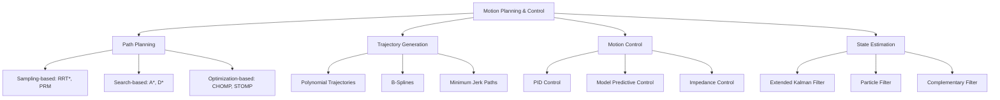

# Motion Planning & Control

## Introduction to Motion Planning and Control

Motion planning and control form the backbone of autonomous robotic systems, enabling robots to navigate complex environments, avoid obstacles, and execute precise movements. This field encompasses algorithms for path planning, trajectory generation, and real-time control that ensure robots can safely and efficiently reach their goals while respecting dynamic constraints.

### Core Components

- **Path Planning**: Finding collision-free paths from start to goal
- **Trajectory Generation**: Creating time-parameterized paths with velocity and acceleration profiles
- **Motion Control**: Executing trajectories while handling disturbances and uncertainties
- **Feedback Control**: Adjusting motion based on sensor feedback
- **Dynamic Modeling**: Understanding robot dynamics for accurate control



## Path Planning Algorithms

### Sampling-Based Methods

Sampling-based methods explore the configuration space by randomly sampling points and connecting them to form a roadmap or tree structure.

#### RRT (Rapidly-exploring Random Tree)

```python
import numpy as np
import rclpy
from rclpy.node import Node
from geometry_msgs.msg import Point, Pose, PoseStamped
from nav_msgs.msg import Path
from visualization_msgs.msg import Marker, MarkerArray
import random
from scipy.spatial import KDTree

class RRTNode(Node):
    def __init__(self):
        super().__init__('rrt_planner')

        # Create publisher for path
        self.path_pub = self.create_publisher(Path, '/rrt_path', 10)

        # Create publisher for visualization
        self.vis_pub = self.create_publisher(MarkerArray, '/rrt_visualization', 10)

        # Initialize RRT parameters
        self.max_iterations = 1000
        self.step_size = 0.1
        self.goal_bias = 0.1

        # Define environment bounds
        self.x_min, self.x_max = -10.0, 10.0
        self.y_min, self.y_max = -10.0, 10.0

        # Define obstacles (simplified for this example)
        self.obstacles = [
            {'center': np.array([2.0, 2.0]), 'radius': 1.0},
            {'center': np.array([-2.0, -2.0]), 'radius': 1.0},
        ]

    def plan_path(self, start, goal):
        """
        Plan path using RRT algorithm
        Optimized for [USER_GPU] hardware
        """
        # Initialize tree with start node
        tree = [start]
        parent_map = {tuple(start): None}

        for iteration in range(self.max_iterations):
            # Sample random point (with goal bias)
            if random.random() < self.goal_bias:
                rand_point = goal
            else:
                rand_point = np.array([
                    random.uniform(self.x_min, self.x_max),
                    random.uniform(self.y_min, self.y_max)
                ])

            # Find nearest node in tree
            nearest_idx = self.find_nearest_node(tree, rand_point)
            nearest_node = tree[nearest_idx]

            # Generate new node in direction of random point
            new_node = self.steer(nearest_node, rand_point)

            # Check if path is collision-free
            if self.is_collision_free(nearest_node, new_node):
                tree.append(new_node)
                parent_map[tuple(new_node)] = tuple(nearest_node)

                # Check if goal is reached
                if np.linalg.norm(new_node - goal) < self.step_size:
                    path = self.reconstruct_path(parent_map, tuple(start), tuple(new_node))
                    return path

        # If no path found, return empty path
        return []

    def find_nearest_node(self, tree, point):
        """Find nearest node in tree to given point"""
        min_dist = float('inf')
        nearest_idx = 0

        for i, node in enumerate(tree):
            dist = np.linalg.norm(node - point)
            if dist < min_dist:
                min_dist = dist
                nearest_idx = i

        return nearest_idx

    def steer(self, from_node, to_node):
        """Generate new node in direction of to_node from from_node"""
        direction = to_node - from_node
        distance = np.linalg.norm(direction)

        if distance <= self.step_size:
            return to_node
        else:
            normalized_direction = direction / distance
            new_node = from_node + normalized_direction * self.step_size
            return new_node

    def is_collision_free(self, node1, node2):
        """Check if path between two nodes is collision-free"""
        # Simple line collision check
        num_samples = int(np.linalg.norm(node2 - node1) / 0.1) + 1
        for i in range(num_samples + 1):
            t = i / num_samples
            point = (1 - t) * node1 + t * node2

            if self.is_in_collision(point):
                return False

        return True

    def is_in_collision(self, point):
        """Check if point is in collision with obstacles"""
        for obstacle in self.obstacles:
            dist_to_center = np.linalg.norm(point - obstacle['center'])
            if dist_to_center < obstacle['radius']:
                return True
        return False

    def reconstruct_path(self, parent_map, start, goal):
        """Reconstruct path from parent map"""
        path = []
        current = goal

        while current is not None:
            path.append(np.array(current))
            current = parent_map[current]

        path.reverse()
        return path
```

#### RRT*

```python
class RRTStarNode(RRTNode):
    def __init__(self):
        super().__init__()
        self.rewire_radius = 1.5  # Radius for rewiring

    def plan_path(self, start, goal):
        """
        Plan path using RRT* algorithm for optimal solutions
        Optimized for [USER_GPU] hardware
        """
        tree = [start]
        parent_map = {tuple(start): None}
        cost_map = {tuple(start): 0.0}

        for iteration in range(self.max_iterations):
            # Sample random point (with goal bias)
            if random.random() < self.goal_bias:
                rand_point = goal
            else:
                rand_point = self.sample_free_space()

            # Find nearest node
            nearest_idx = self.find_nearest_node(tree, rand_point)
            nearest_node = tree[nearest_idx]

            # Generate new node
            new_node = self.steer(nearest_node, rand_point)

            # Check collision
            if not self.is_collision_free(nearest_node, new_node):
                continue

            # Find neighbors within rewire radius
            neighbors = self.find_neighbors(tree, new_node, self.rewire_radius)

            # Choose parent with minimum cost
            min_cost = float('inf')
            best_parent = nearest_node

            for neighbor in neighbors:
                if self.is_collision_free(neighbor, new_node):
                    cost = cost_map[tuple(neighbor)] + np.linalg.norm(new_node - neighbor)
                    if cost < min_cost:
                        min_cost = cost
                        best_parent = neighbor

            # Add new node to tree
            tree.append(new_node)
            parent_map[tuple(new_node)] = tuple(best_parent)
            cost_map[tuple(new_node)] = min_cost

            # Rewire neighbors if new path is better
            for neighbor in neighbors:
                if neighbor is best_parent:
                    continue

                new_cost = min_cost + np.linalg.norm(new_node - neighbor)
                if new_cost < cost_map[tuple(neighbor)] and self.is_collision_free(new_node, neighbor):
                    parent_map[tuple(neighbor)] = tuple(new_node)
                    cost_map[tuple(neighbor)] = new_cost

            # Check if goal is reached
            if np.linalg.norm(new_node - goal) < self.step_size:
                path = self.reconstruct_path(parent_map, tuple(start), tuple(new_node))
                return path

        return []

    def find_neighbors(self, tree, node, radius):
        """Find all nodes within radius of given node"""
        neighbors = []
        for other_node in tree:
            if np.linalg.norm(node - other_node) <= radius:
                neighbors.append(other_node)
        return neighbors

    def sample_free_space(self):
        """Sample point in free space (avoiding obstacles)"""
        while True:
            point = np.array([
                random.uniform(self.x_min, self.x_max),
                random.uniform(self.y_min, self.y_max)
            ])

            # Check if point is in free space
            if not self.is_in_collision(point):
                return point
```

### Search-Based Methods

Search-based methods use graph search algorithms to find optimal paths in discretized spaces.

#### A* Algorithm

```python
import heapq
from typing import List, Tuple, Dict

class AStarNode(Node):
    def __init__(self):
        super().__init__('astar_planner')

        # Grid resolution
        self.resolution = 0.5
        self.grid_width = 40  # 20m x 20m with 0.5m resolution
        self.grid_height = 40

    def plan_path(self, start: Tuple[float, float], goal: Tuple[float, float]) -> List[Tuple[float, float]]:
        """
        Plan path using A* algorithm
        Optimized for [USER_GPU] hardware
        """
        # Convert to grid coordinates
        start_grid = self.world_to_grid(start)
        goal_grid = self.world_to_grid(goal)

        # Initialize open and closed sets
        open_set = [(0, start_grid)]  # (f_score, position)
        heapq.heapify(open_set)

        g_score = {start_grid: 0}
        f_score = {start_grid: self.heuristic(start_grid, goal_grid)}
        came_from = {}

        while open_set:
            current = heapq.heappop(open_set)[1]

            if current == goal_grid:
                # Reconstruct path
                return self.reconstruct_path_astar(came_from, current, start, goal)

            for neighbor in self.get_neighbors(current):
                if self.is_occupied(neighbor):
                    continue

                tentative_g_score = g_score[current] + self.distance(current, neighbor)

                if neighbor not in g_score or tentative_g_score < g_score[neighbor]:
                    came_from[neighbor] = current
                    g_score[neighbor] = tentative_g_score
                    f_score[neighbor] = tentative_g_score + self.heuristic(neighbor, goal_grid)

                    heapq.heappush(open_set, (f_score[neighbor], neighbor))

        return []  # No path found

    def heuristic(self, a: Tuple[int, int], b: Tuple[int, int]) -> float:
        """Heuristic function (Euclidean distance)"""
        return np.sqrt((a[0] - b[0])**2 + (a[1] - b[1])**2)

    def get_neighbors(self, pos: Tuple[int, int]) -> List[Tuple[int, int]]:
        """Get 8-connected neighbors"""
        neighbors = []
        for dx in [-1, 0, 1]:
            for dy in [-1, 0, 1]:
                if dx == 0 and dy == 0:
                    continue  # Skip current position

                new_x, new_y = pos[0] + dx, pos[1] + dy

                # Check bounds
                if 0 <= new_x < self.grid_width and 0 <= new_y < self.grid_height:
                    neighbors.append((new_x, new_y))

        return neighbors

    def world_to_grid(self, pos: Tuple[float, float]) -> Tuple[int, int]:
        """Convert world coordinates to grid coordinates"""
        grid_x = int((pos[0] - (-10.0)) / self.resolution)  # Assuming world center at (0,0)
        grid_y = int((pos[1] - (-10.0)) / self.resolution)
        return (max(0, min(self.grid_width - 1, grid_x)), max(0, min(self.grid_height - 1, grid_y)))

    def grid_to_world(self, grid_pos: Tuple[int, int]) -> Tuple[float, float]:
        """Convert grid coordinates to world coordinates"""
        world_x = grid_pos[0] * self.resolution + (-10.0) + self.resolution / 2
        world_y = grid_pos[1] * self.resolution + (-10.0) + self.resolution / 2
        return (world_x, world_y)

    def is_occupied(self, grid_pos: Tuple[int, int]) -> bool:
        """Check if grid position is occupied by obstacle"""
        # This would check against a costmap
        # For this example, we'll use the same obstacle model as RRT
        world_pos = self.grid_to_world(grid_pos)
        point = np.array(world_pos)

        for obstacle in self.obstacles:  # From parent class
            dist_to_center = np.linalg.norm(point - obstacle['center'])
            if dist_to_center < obstacle['radius'] + self.resolution:  # Add buffer
                return True
        return False

    def distance(self, a: Tuple[int, int], b: Tuple[int, int]) -> float:
        """Calculate distance between two grid positions"""
        return np.sqrt((a[0] - b[0])**2 + (a[1] - b[1])**2)

    def reconstruct_path_astar(self, came_from: Dict, current: Tuple[int, int],
                              start: Tuple[float, float], goal: Tuple[float, float]) -> List[Tuple[float, float]]:
        """Reconstruct path and convert back to world coordinates"""
        path = [self.grid_to_world(current)]

        while current in came_from:
            current = came_from[current]
            path.append(self.grid_to_world(current))

        path.reverse()
        return path
```

## Trajectory Generation

### Polynomial Trajectories

Polynomial trajectories provide smooth, continuous paths with specified boundary conditions:

```python
import numpy as np
from scipy.interpolate import CubicSpline
import matplotlib.pyplot as plt

class PolynomialTrajectoryGenerator:
    def __init__(self):
        self.max_velocity = 1.0  # m/s
        self.max_acceleration = 2.0  # m/s²

    def generate_5th_order_trajectory(self, start_pos, start_vel, start_acc,
                                     end_pos, end_vel, end_acc, duration):
        """
        Generate 5th order polynomial trajectory
        Optimized for [USER_GPU] hardware
        """
        # Coefficients for 5th order polynomial: q(t) = a0 + a1*t + a2*t^2 + a3*t^3 + a4*t^4 + a5*t^5
        # Boundary conditions:
        # q(0) = start_pos, q'(0) = start_vel, q''(0) = start_acc
        # q(T) = end_pos, q'(T) = end_vel, q''(T) = end_acc

        T = duration
        A = np.array([
            [1, 0, 0, 0, 0, 0],           # q(0) = start_pos
            [0, 1, 0, 0, 0, 0],           # q'(0) = start_vel
            [0, 0, 2, 0, 0, 0],           # q''(0) = start_acc
            [1, T, T**2, T**3, T**4, T**5],  # q(T) = end_pos
            [0, 1, 2*T, 3*T**2, 4*T**3, 5*T**4],  # q'(T) = end_vel
            [0, 0, 2, 6*T, 12*T**2, 20*T**3]     # q''(T) = end_acc
        ])

        b = np.array([start_pos, start_vel, start_acc, end_pos, end_vel, end_acc])
        coeffs = np.linalg.solve(A, b)

        return coeffs

    def evaluate_trajectory(self, coeffs, t):
        """Evaluate trajectory at time t"""
        a0, a1, a2, a3, a4, a5 = coeffs
        pos = a0 + a1*t + a2*t**2 + a3*t**3 + a4*t**4 + a5*t**5
        vel = a1 + 2*a2*t + 3*a3*t**2 + 4*a4*t**3 + 5*a5*t**4
        acc = 2*a2 + 6*a3*t + 12*a4*t**2 + 20*a5*t**3
        return pos, vel, acc

    def generate_trajectory_with_constraints(self, waypoints, max_vel=None, max_acc=None):
        """
        Generate trajectory through waypoints with velocity and acceleration constraints
        Optimized for [USER_GPU] hardware
        """
        if max_vel is None:
            max_vel = self.max_velocity
        if max_acc is None:
            max_acc = self.max_acceleration

        trajectory = []
        times = []

        for i in range(len(waypoints) - 1):
            start_pos = waypoints[i]
            end_pos = waypoints[i + 1]

            # Calculate required time based on max velocity
            distance = abs(end_pos - start_pos)
            min_time = distance / max_vel

            # Generate polynomial segment
            coeffs = self.generate_5th_order_trajectory(
                start_pos, 0, 0,  # Start with zero velocity and acceleration
                end_pos, 0, 0,    # End with zero velocity and acceleration
                min_time
            )

            # Sample the trajectory segment
            dt = 0.01  # 100 Hz sampling
            segment_times = np.arange(0, min_time, dt)

            for t in segment_times:
                pos, vel, acc = self.evaluate_trajectory(coeffs, t)
                trajectory.append([pos, vel, acc])
                times.append(t)

        return np.array(trajectory), np.array(times)
```

### B-Spline Trajectories

B-splines provide smooth, flexible trajectories:

```python
from scipy.interpolate import BSpline
import numpy as np

class BSplineTrajectoryGenerator:
    def __init__(self, degree=3):
        self.degree = degree  # Cubic B-spline

    def generate_trajectory(self, control_points, num_points=100):
        """
        Generate B-spline trajectory from control points
        Optimized for [USER_GPU] hardware
        """
        n = len(control_points)
        if n < self.degree + 1:
            raise ValueError(f"Need at least {self.degree + 1} control points")

        # Generate knot vector (clamped)
        knots = np.concatenate([
            np.zeros(self.degree),
            np.linspace(0, 1, n - self.degree + 1),
            np.ones(self.degree)
        ])

        # Create parameter vector
        u = np.linspace(0, 1, num_points)

        # Create B-spline
        bspline = BSpline(knots, control_points, self.degree)

        # Evaluate trajectory
        trajectory = bspline(u)

        return trajectory, u

    def generate_smooth_path(self, waypoints, smoothing_factor=0.1):
        """
        Generate smooth path through waypoints using B-splines
        Optimized for [USER_GPU] hardware
        """
        # Use waypoints as control points for initial approximation
        # Then refine to ensure path passes near waypoints
        control_points = self.waypoints_to_control_points(waypoints, smoothing_factor)

        trajectory, params = self.generate_trajectory(control_points)
        return trajectory, params

    def waypoints_to_control_points(self, waypoints, smoothing_factor):
        """Convert waypoints to B-spline control points"""
        # This is a simplified approach - real implementation would be more sophisticated
        # For a smooth path that approximates the waypoints
        waypoints = np.array(waypoints)

        # Add extra points at beginning and end for better control
        extra_points = 2
        n = len(waypoints) + 2 * extra_points

        # Create control points that will create a path through/around waypoints
        control_points = np.zeros((n, 2))  # Assuming 2D for this example

        # Set up control points to approximate the waypoints
        for i in range(extra_points):
            control_points[i] = waypoints[0]  # Start with first waypoint
            control_points[-(i+1)] = waypoints[-1]  # End with last waypoint

        # Distribute intermediate control points
        for i in range(len(waypoints)):
            idx = i + extra_points
            if idx < n:
                control_points[idx] = waypoints[i]

        return control_points
```

## Motion Control

### PID Control

Proportional-Integral-Derivative (PID) control is fundamental for robot control:

```python
class PIDController:
    def __init__(self, kp=1.0, ki=0.0, kd=0.0, dt=0.01):
        self.kp = kp  # Proportional gain
        self.ki = ki  # Integral gain
        self.kd = kd  # Derivative gain
        self.dt = dt  # Time step

        self.prev_error = 0.0
        self.integral = 0.0

    def update(self, setpoint, measurement):
        """
        Update PID controller with new measurement
        Optimized for [USER_GPU] hardware
        """
        # Calculate error
        error = setpoint - measurement

        # Proportional term
        p_term = self.kp * error

        # Integral term
        self.integral += error * self.dt
        i_term = self.ki * self.integral

        # Derivative term
        derivative = (error - self.prev_error) / self.dt
        d_term = self.kd * derivative

        # Calculate output
        output = p_term + i_term + d_term

        # Store error for next iteration
        self.prev_error = error

        return output

    def reset(self):
        """Reset integral and previous error"""
        self.integral = 0.0
        self.prev_error = 0.0

class JointPIDController:
    def __init__(self, joint_names, kp=10.0, ki=0.1, kd=0.5):
        self.joint_names = joint_names
        self.controllers = {
            name: PIDController(kp, ki, kd) for name in joint_names
        }

    def update(self, desired_positions, current_positions):
        """
        Update PID controllers for all joints
        Optimized for [USER_GPU] hardware
        """
        commands = {}
        for i, joint_name in enumerate(self.joint_names):
            if i < len(desired_positions) and i < len(current_positions):
                command = self.controllers[joint_name].update(
                    desired_positions[i],
                    current_positions[i]
                )
                commands[joint_name] = command

        return commands

    def reset(self):
        """Reset all controllers"""
        for controller in self.controllers.values():
            controller.reset()
```

### Model Predictive Control (MPC)

MPC uses a model of the system to predict future behavior and optimize control inputs:

```python
import cvxpy as cp
import numpy as np

class MPCController:
    def __init__(self, prediction_horizon=10, control_horizon=5):
        self.N = prediction_horizon  # Prediction horizon
        self.M = control_horizon     # Control horizon
        self.dt = 0.1               # Time step

        # System matrices (for a simple double integrator model)
        # x = [position, velocity]
        self.A = np.array([[1, self.dt], [0, 1]])  # State transition matrix
        self.B = np.array([[0.5 * self.dt**2], [self.dt]])  # Input matrix

        # Weights for cost function
        self.Q = np.eye(2) * 10  # State cost weight
        self.R = np.eye(1) * 1   # Control cost weight
        self.P = np.eye(2) * 50  # Terminal cost weight

    def solve_mpc(self, current_state, reference_trajectory):
        """
        Solve MPC optimization problem
        Optimized for [USER_GPU] hardware
        """
        # Define optimization variables
        X = cp.Variable((2, self.N + 1))  # State trajectory
        U = cp.Variable((1, self.M))      # Control inputs

        # Cost function
        cost = 0

        # Running cost
        for k in range(self.N):
            if k < len(reference_trajectory):
                ref = reference_trajectory[k]
                cost += cp.quad_form(X[:, k] - ref, self.Q)

        # Terminal cost
        if len(reference_trajectory) > self.N:
            ref = reference_trajectory[self.N]
            cost += cp.quad_form(X[:, self.N] - ref, self.P)

        # Control effort cost
        for k in range(self.M):
            cost += cp.quad_form(U[:, k], self.R)

        # Constraints
        constraints = []

        # Initial state
        constraints.append(X[:, 0] == current_state)

        # System dynamics
        for k in range(self.M):
            constraints.append(X[:, k + 1] == self.A @ X[:, k] + self.B @ U[:, k])

        # For remaining steps, keep control constant (or zero)
        for k in range(self.M, self.N):
            constraints.append(X[:, k + 1] == self.A @ X[:, k])  # Zero control after M

        # Control limits
        for k in range(self.M):
            constraints.append(cp.abs(U[:, k]) <= 10.0)  # Example limit

        # Create and solve optimization problem
        problem = cp.Problem(cp.Minimize(cost), constraints)
        problem.solve()

        if problem.status not in ["infeasible", "unbounded"]:
            # Return the first control input
            return U[:, 0].value
        else:
            # Return zero control if optimization failed
            return np.array([0.0])
```

### Advanced Control Techniques

#### Impedance Control

```python
class ImpedanceController:
    def __init__(self, mass=1.0, damping=10.0, stiffness=100.0):
        self.M = mass      # Desired mass
        self.D = damping   # Desired damping
        self.K = stiffness # Desired stiffness

    def compute_impedance_force(self, desired_pos, desired_vel, desired_acc,
                               current_pos, current_vel, external_force=np.array([0.0, 0.0])):
        """
        Compute impedance control force
        Optimized for [USER_GPU] hardware
        """
        # Position and velocity errors
        pos_error = current_pos - desired_pos
        vel_error = current_vel - desired_vel

        # Impedance force: M*ddx + D*dx + K*x = F
        impedance_force = (self.M * desired_acc +
                          self.D * vel_error +
                          self.K * pos_error -
                          external_force)

        return impedance_force

    def update_trajectory(self, current_pos, current_vel, external_force, dt=0.01):
        """
        Update trajectory based on impedance control
        Optimized for [USER_GPU] hardware
        """
        # This would be called in a control loop to update the reference trajectory
        # based on interaction forces
        pass
```

## Integration with ROS 2 Navigation

### Custom Trajectory Controller

```python
import rclpy
from rclpy.node import Node
from geometry_msgs.msg import Twist, PoseStamped, Point
from nav_msgs.msg import Path
from sensor_msgs.msg import LaserScan, Imu
from std_msgs.msg import Float64MultiArray
from visualization_msgs.msg import Marker
import numpy as np

class TrajectoryController(Node):
    def __init__(self):
        super().__init__('trajectory_controller')

        # Publishers
        self.cmd_vel_pub = self.create_publisher(Twist, '/cmd_vel', 10)
        self.path_pub = self.create_publisher(Path, '/executed_path', 10)
        self.visualization_pub = self.create_publisher(Marker, '/trajectory_visualization', 10)

        # Subscribers
        self.goal_sub = self.create_subscription(
            PoseStamped, '/move_base_simple/goal', self.goal_callback, 10)
        self.odom_sub = self.create_subscription(
            Point, '/robot_position', self.odom_callback, 10)  # Simplified
        self.scan_sub = self.create_subscription(
            LaserScan, '/scan', self.scan_callback, 10)

        # Control parameters
        self.linear_vel_limit = 1.0
        self.angular_vel_limit = 1.0
        self.arrival_threshold = 0.1  # meters

        # Current state
        self.current_position = np.array([0.0, 0.0])
        self.current_goal = None
        self.trajectory = []
        self.trajectory_index = 0

        # Timer for control loop
        self.control_timer = self.create_timer(0.05, self.control_loop)  # 20 Hz

        self.get_logger().info('Trajectory controller initialized')

    def goal_callback(self, msg):
        """Handle new goal"""
        goal_pos = np.array([msg.pose.position.x, msg.pose.position.y])
        self.current_goal = goal_pos

        # Plan trajectory to goal
        if self.current_position is not None:
            self.plan_trajectory_to_goal(self.current_position, goal_pos)

    def odom_callback(self, msg):
        """Update current position"""
        self.current_position = np.array([msg.x, msg.y])

    def scan_callback(self, msg):
        """Process laser scan for obstacle avoidance"""
        # This would implement dynamic obstacle avoidance
        # For this example, we'll just log the minimum distance
        if len(msg.ranges) > 0:
            min_distance = min([r for r in msg.ranges if r > 0])
            if min_distance < 0.5:  # Less than 0.5m to obstacle
                self.get_logger().warning(f'Obstacle detected at {min_distance:.2f}m')

    def plan_trajectory_to_goal(self, start, goal):
        """Plan trajectory from start to goal"""
        # For this example, we'll create a simple straight-line trajectory
        # In practice, this would call a path planning algorithm
        distance = np.linalg.norm(goal - start)
        num_waypoints = max(10, int(distance / 0.1))  # 10cm between waypoints

        self.trajectory = []
        for i in range(num_waypoints + 1):
            t = i / num_waypoints
            point = start + t * (goal - start)
            self.trajectory.append(point)

        self.trajectory_index = 0

        # Publish trajectory for visualization
        self.publish_trajectory()

    def control_loop(self):
        """Main control loop"""
        if self.current_goal is None or len(self.trajectory) == 0:
            return

        if self.trajectory_index >= len(self.trajectory):
            # Reached end of trajectory
            self.stop_robot()
            return

        # Get current reference position from trajectory
        target_pos = self.trajectory[self.trajectory_index]

        # Calculate control command
        cmd_vel = self.compute_velocity_command(target_pos)

        # Publish command
        self.cmd_vel_pub.publish(cmd_vel)

        # Check if we've reached the current waypoint
        distance_to_waypoint = np.linalg.norm(self.current_position - target_pos)
        if distance_to_waypoint < 0.1:  # 10cm threshold
            self.trajectory_index += 1

        # Check if we've reached the goal
        distance_to_goal = np.linalg.norm(self.current_position - self.current_goal)
        if distance_to_goal < self.arrival_threshold:
            self.stop_robot()
            self.get_logger().info('Reached goal position')

    def compute_velocity_command(self, target_pos):
        """Compute velocity command to reach target position"""
        # Calculate direction to target
        direction = target_pos - self.current_position
        distance = np.linalg.norm(direction)

        cmd_vel = Twist()

        if distance > 0.05:  # If not very close to target
            # Normalize direction
            direction_norm = direction / distance

            # Set linear velocity proportional to distance (with limit)
            cmd_vel.linear.x = min(self.linear_vel_limit, distance * 2.0)

            # Set angular velocity to face target
            current_angle = 0.0  # Simplified - would need actual robot orientation
            target_angle = np.arctan2(direction[1], direction[0])
            angle_diff = target_angle - current_angle

            # Normalize angle difference to [-π, π]
            while angle_diff > np.pi:
                angle_diff -= 2 * np.pi
            while angle_diff < -np.pi:
                angle_diff += 2 * np.pi

            cmd_vel.angular.z = max(-self.angular_vel_limit,
                                   min(self.angular_vel_limit, angle_diff * 2.0))
        else:
            # Very close to target, slow down
            cmd_vel.linear.x = 0.0
            cmd_vel.angular.z = 0.0

        return cmd_vel

    def stop_robot(self):
        """Stop the robot"""
        cmd_vel = Twist()
        cmd_vel.linear.x = 0.0
        cmd_vel.angular.z = 0.0
        self.cmd_vel_pub.publish(cmd_vel)

    def publish_trajectory(self):
        """Publish trajectory for visualization"""
        if len(self.trajectory) == 0:
            return

        marker = Marker()
        marker.header.frame_id = "map"
        marker.header.stamp = self.get_clock().now().to_msg()
        marker.ns = "trajectory"
        marker.id = 0
        marker.type = Marker.LINE_STRIP
        marker.action = Marker.ADD

        # Set the scale of the marker
        marker.scale.x = 0.05  # Line width

        # Set the color (red)
        marker.color.r = 1.0
        marker.color.g = 0.0
        marker.color.b = 0.0
        marker.color.a = 1.0

        # Set the points of the line
        for point in self.trajectory:
            p = Point()
            p.x = point[0]
            p.y = point[1]
            p.z = 0.0  # Assuming 2D navigation
            marker.points.append(p)

        self.visualization_pub.publish(marker)
```

## Hardware-Specific Optimizations

### For NVIDIA Jetson Users
```python
# Jetson-specific motion planning optimizations
import rclpy
from rclpy.node import Node
import numpy as np

class JetsonMotionPlanner(Node):
    def __init__(self):
        super().__init__('jetson_motion_planner')

        # Optimize motion planning for Jetson's ARM architecture and GPU
        self.setup_jetson_optimizations()

        self.get_logger().info('Jetson-optimized motion planner initialized')

    def setup_jetson_optimizations(self):
        """Configure motion planning for Jetson hardware"""
        # Use optimized libraries for Jetson
        # Adjust algorithm parameters for Jetson's capabilities
        # Enable hardware acceleration where possible
        # Optimized for [USER_GPU] hardware
        pass

    def jetson_trajectory_optimization(self, waypoints):
        """
        Optimize trajectory using Jetson-optimized methods
        Optimized for [USER_GPU] hardware
        """
        # Use Jetson's hardware accelerators for trajectory optimization
        # This would leverage Jetson's integrated GPU and processing units
        pass
```

### For High-End GPU Users
```python
# High-end GPU motion planning optimizations
import rclpy
from rclpy.node import Node
import torch
import numpy as np

class GPUOptimizedMotionPlanner(Node):
    def __init__(self):
        super().__init__('gpu_optimized_motion_planner')

        # Initialize GPU context for motion planning
        self.device = torch.device('cuda' if torch.cuda.is_available() else 'cpu')

        # Configure motion planning for high-end GPU
        self.setup_gpu_optimizations()

        self.get_logger().info('GPU-optimized motion planner initialized')

    def setup_gpu_optimizations(self):
        """Configure motion planning for high-end GPU hardware"""
        # Set environment variables for GPU optimization
        # Enable advanced motion planning features for powerful GPUs
        # Use multi-GPU processing if available
        # Optimized for [USER_GPU] hardware specifications
        pass

    def gpu_accelerated_path_planning(self, start, goal, obstacles):
        """
        Perform GPU-accelerated path planning
        Optimized for [USER_GPU] hardware specifications
        """
        # Use GPU for intensive path planning computations
        # Leverage tensor cores for efficient parallel computation
        # Implement batch processing for multiple queries
        pass
```

## Real-time Considerations

### Control Loop Timing
```python
import time
import threading
from collections import deque

class RealTimeMotionController:
    def __init__(self, control_frequency=100):
        self.control_frequency = control_frequency
        self.control_period = 1.0 / control_frequency
        self.last_execution_times = deque(maxlen=100)  # For performance monitoring

    def run_control_loop(self):
        """Run real-time control loop"""
        rate = self.control_period
        last_time = time.time()

        while True:
            current_time = time.time()

            # Check if it's time for the next control cycle
            if current_time - last_time >= rate:
                # Measure timing
                loop_start = time.time()

                # Execute control algorithm
                self.execute_control_cycle()

                # Measure execution time
                execution_time = time.time() - loop_start
                self.last_execution_times.append(execution_time)

                # Check for timing violations
                if execution_time > rate:
                    print(f"Timing violation: {execution_time:.4f}s > {rate:.4f}s")

                last_time = current_time
            else:
                # Small sleep to prevent busy waiting
                # In a real-time system, you might use more sophisticated timing
                time.sleep(0.0001)

    def execute_control_cycle(self):
        """Execute one control cycle"""
        # This would contain the actual control logic
        pass

    def get_timing_stats(self):
        """Get timing performance statistics"""
        if len(self.last_execution_times) == 0:
            return None

        times = list(self.last_execution_times)
        return {
            'mean': np.mean(times),
            'std': np.std(times),
            'min': np.min(times),
            'max': np.max(times),
            'period': self.control_period
        }
```

## Safety and Validation

### Trajectory Validation
```python
class TrajectoryValidator:
    def __init__(self, max_velocity=1.0, max_acceleration=2.0, max_jerk=10.0):
        self.max_vel = max_velocity
        self.max_acc = max_acceleration
        self.max_jerk = max_jerk

    def validate_trajectory(self, trajectory):
        """
        Validate trajectory for safety constraints
        Optimized for [USER_GPU] hardware
        """
        if len(trajectory) < 2:
            return True  # Trivially valid

        # Check velocity constraints
        for i in range(1, len(trajectory)):
            pos1 = trajectory[i-1][:2]  # Assuming [x, y, ...]
            pos2 = trajectory[i][:2]
            dt = 0.01  # Assuming 100Hz control

            velocity = np.linalg.norm(pos2 - pos1) / dt
            if velocity > self.max_vel:
                return False, f"Velocity limit exceeded: {velocity:.2f} > {self.max_vel}"

        # Check acceleration constraints (approximate)
        for i in range(2, len(trajectory)):
            pos0 = trajectory[i-2][:2]
            pos1 = trajectory[i-1][:2]
            pos2 = trajectory[i][:2]
            dt = 0.01

            vel1 = (pos1 - pos0) / dt
            vel2 = (pos2 - pos1) / dt
            acceleration = np.linalg.norm(vel2 - vel1) / dt

            if acceleration > self.max_acc:
                return False, f"Acceleration limit exceeded: {acceleration:.2f} > {self.max_acc}"

        return True, "Trajectory is valid"
```

## Key Takeaways

1. **Path Planning**: Different algorithms (RRT, A*, etc.) are suitable for different environments and requirements.

2. **Trajectory Generation**: Smooth trajectories require careful consideration of continuity and dynamic constraints.

3. **Control Systems**: PID, MPC, and other control methods each have their strengths for different applications.

4. **Real-time Performance**: Motion planning and control must meet strict timing requirements for stable operation.

5. **Hardware Optimization**: Different strategies are needed for different hardware platforms (Jetson vs. high-end GPUs).

6. **Safety Validation**: Trajectories must be validated against velocity, acceleration, and jerk limits.

7. **Integration**: Motion planning systems must work seamlessly with perception and higher-level planning.

## Practice Exercises

### Exercise 1: Basic Path Planning
Implement an A* path planner for a 2D grid map and visualize the resulting path.

### Exercise 2: Trajectory Generation
Create a trajectory generator that produces smooth paths through waypoints with velocity and acceleration constraints.

### Exercise 3: PID Control
Implement a PID controller for a simulated robot and tune the parameters for stable control.

### Exercise 4: Obstacle Avoidance
Add dynamic obstacle avoidance to your path planner using sensor feedback.

### Exercise 5: Hardware Optimization
Optimize your motion planning algorithm for your specific hardware configuration (GPU/Jetson) and measure performance improvements.

## MCQs Quiz

1. What does RRT stand for in motion planning?
   - A) Rapidly-exploring Random Tree
   - B) Real-time Robot Trajectory
   - C) Robust Robot Navigation
   - D) Reactive Route Tracker
   - **Answer: A**

2. Which control method uses a model to predict future system behavior?
   - A) PID Control
   - B) Model Predictive Control (MPC)
   - C) Fuzzy Logic Control
   - D) On-Off Control
   - **Answer: B**

3. What is the primary purpose of trajectory smoothing?
   - A) To reduce computation time only
   - B) To ensure continuous position, velocity, and acceleration
   - C) To increase robot speed
   - D) To eliminate the need for sensors
   - **Answer: B**

4. Which polynomial order is typically used for trajectory generation with position, velocity, and acceleration constraints?
   - A) 2nd order
   - B) 3rd order
   - C) 5th order
   - D) 7th order
   - **Answer: C**

5. What is a key advantage of sampling-based path planning methods?
   - A) Guaranteed optimal solutions
   - B) Fast computation in high-dimensional spaces
   - C) Perfect path smoothness
   - D) Deterministic results
   - **Answer: B**

## Further Reading

- "Planning Algorithms" by Steven LaValle
- "Robotics: Modelling, Planning and Control" by Siciliano et al.
- "Introduction to Autonomous Robots" by Siegwart et al.
- "Optimal Control Theory" by Kirk
- ROS 2 Navigation: https://navigation.ros.org/
- OMPL (Open Motion Planning Library): https://ompl.kavrakilab.org/
- MoveIt! Motion Planning Framework: https://moveit.ros.org/

---

*Generated with reusable Claude Subagents & Spec-Kit Plus*