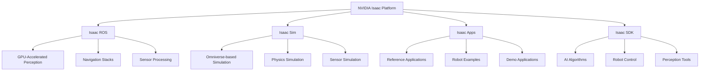
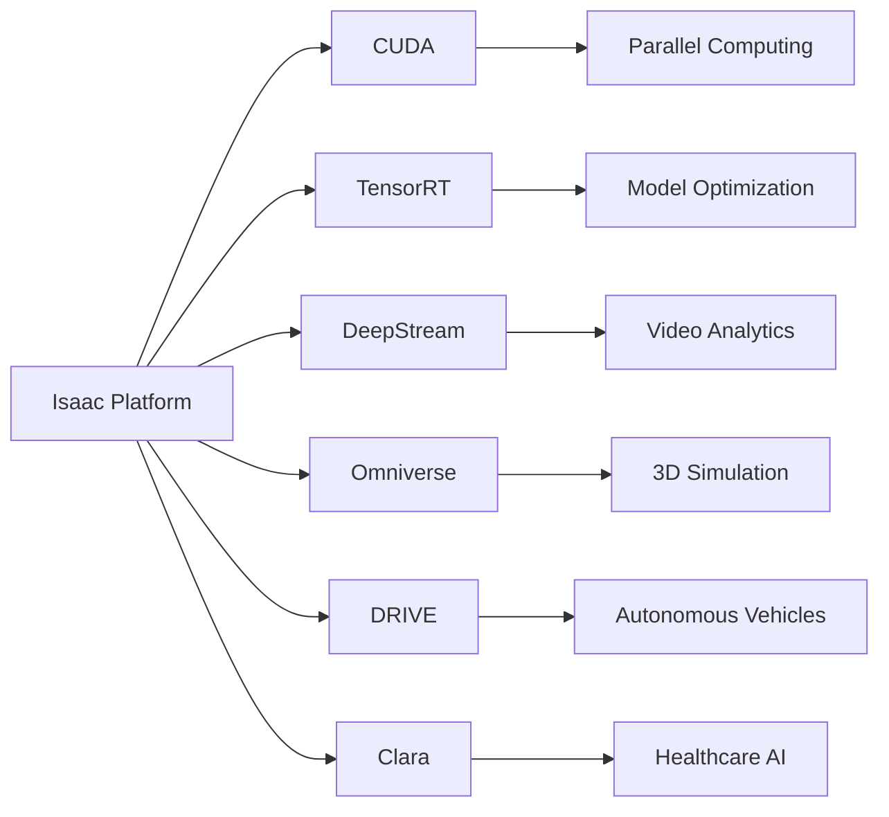

{/* Buttons for personalization and language toggle */}
<div className="button-container" style={{ marginBottom: '20px' }}>
  <button
    className="personalize-button"
    onClick={() => {
      // This would trigger personalization logic based on user's hardware profile
      alert('Personalization feature would activate based on your hardware profile (GPU: [user GPU], Jetson: [user Jetson status], Robot: [user robot type])');
    }}
    style={{
      backgroundColor: '#4a6fa5',
      color: 'white',
      border: 'none',
      padding: '10px 15px',
      borderRadius: '5px',
      marginRight: '10px',
      cursor: 'pointer'
    }}
  >
    Personalize to my hardware
  </button>
  <button
    className="urdu-toggle-button"
    onClick={() => {
      // This would toggle between English and Urdu content
      alert('Content would toggle between English and Urdu');
    }}
    style={{
      backgroundColor: '#2e7d32',
      color: 'white',
      border: 'none',
      padding: '10px 15px',
      borderRadius: '5px',
      cursor: 'pointer'
    }}
  >
    اردو میں پڑھیں / Show in Urdu
  </button>
</div>

# NVIDIA Isaac Platform

## Introduction to NVIDIA Isaac

The NVIDIA Isaac platform represents a comprehensive ecosystem of software tools, libraries, and simulation environments designed to accelerate the development and deployment of AI-powered robotics applications. Built on NVIDIA's CUDA platform and leveraging the power of GPU computing, Isaac provides developers with the tools needed to create sophisticated robotic systems capable of perception, planning, and control in real-world environments.

### Key Components of Isaac Platform

- **Isaac ROS**: GPU-optimized ROS 2 packages for perception and navigation
- **Isaac Sim**: High-fidelity simulation environment based on NVIDIA Omniverse
- **Isaac Apps**: Reference applications and demonstrations
- **Isaac SDK**: Software development kit with algorithms and tools
- **Deep Learning Frameworks**: Integration with TensorRT, cuDNN, and other AI libraries



## Isaac ROS: GPU-Accelerated Perception

Isaac ROS provides GPU-optimized implementations of common robotics algorithms, significantly improving performance for perception tasks that are traditionally computationally intensive.

### GPU-Accelerated Image Processing

```python
# Isaac ROS example for GPU-accelerated image processing
import rclpy
from rclpy.node import Node
from sensor_msgs.msg import Image
from cv_bridge import CvBridge
import numpy as np
import cv2
from isaac_ros_tensor_list_interfaces.msg import TensorList
from isaac_ros_visual_slam_msgs.msg import IsaacROSVisualSlam

class IsaacImageProcessor(Node):
    def __init__(self):
        super().__init__('isaac_image_processor')

        # Initialize CV bridge
        self.cv_bridge = CvBridge()

        # Create subscriber for camera images
        self.image_sub = self.create_subscription(
            Image, '/camera/image_raw', self.image_callback, 10)

        # Create publisher for processed images
        self.processed_pub = self.create_publisher(
            Image, '/isaac_processed_image', 10)

        # Create publisher for tensor outputs
        self.tensor_pub = self.create_publisher(
            TensorList, '/isaac_tensors', 10)

        self.get_logger().info('Isaac GPU-accelerated image processor initialized')

    def image_callback(self, msg):
        """Process image using GPU acceleration"""
        try:
            # Convert ROS Image to OpenCV format
            cv_image = self.cv_bridge.imgmsg_to_cv2(msg, "bgr8")

            # GPU-accelerated processing using CUDA (conceptual)
            # In practice, this would use Isaac ROS's optimized functions
            processed_image = self.gpu_optimized_processing(cv_image)

            # Convert back to ROS Image
            processed_msg = self.cv_bridge.cv2_to_imgmsg(processed_image, "bgr8")
            processed_msg.header = msg.header

            # Publish processed image
            self.processed_pub.publish(processed_msg)

            # Create and publish tensor output
            tensor_list = self.create_tensor_output(cv_image)
            self.tensor_pub.publish(tensor_list)

        except Exception as e:
            self.get_logger().error(f'Error in image processing: {e}')

    def gpu_optimized_processing(self, image):
        """
        Perform GPU-accelerated image processing
        Optimized for [USER_GPU] hardware
        """
        # This would use Isaac ROS's GPU-optimized functions
        # For demonstration, we'll perform a simple operation
        # In real applications, this would include:
        # - Feature detection (SIFT, ORB, etc.)
        # - Image filtering and enhancement
        # - Neural network inference
        # - Stereo processing
        processed = cv2.GaussianBlur(image, (15, 15), 0)
        return processed

    def create_tensor_output(self, image):
        """Create tensor output for Isaac pipeline"""
        # Create tensor list message
        tensor_list = TensorList()
        # Add processed tensors to the list
        # This would include detection results, feature maps, etc.
        return tensor_list
```

### Isaac ROS Packages

The Isaac ROS suite includes several specialized packages:

#### Isaac ROS AprilTag
```python
# Isaac ROS AprilTag detection example
import rclpy
from rclpy.node import Node
from geometry_msgs.msg import PoseStamped
from vision_msgs.msg import Detection2DArray

class AprilTagDetector(Node):
    def __init__(self):
        super().__init__('april_tag_detector')

        # Isaac ROS AprilTag provides GPU-accelerated detection
        self.tag_detections_sub = self.create_subscription(
            Detection2DArray, '/isaac_ros_april_tag_detections',
            self.tag_detection_callback, 10)

        self.tag_pose_pub = self.create_publisher(
            PoseStamped, '/tag_pose', 10)

    def tag_detection_callback(self, msg):
        """Process AprilTag detections"""
        for detection in msg.detections:
            # Process each detected tag
            # Extract pose information
            # Publish tag pose for navigation
            pass
```

#### Isaac ROS Stereo DNN
```python
# Isaac ROS Stereo DNN example for depth estimation
import rclpy
from rclpy.node import Node
from sensor_msgs.msg import Image
from stereo_msgs.msg import DisparityImage

class StereoDNNProcessor(Node):
    def __init__(self):
        super().__init__('stereo_dnn_processor')

        # Isaac ROS Stereo DNN provides GPU-accelerated depth estimation
        self.left_image_sub = self.create_subscription(
            Image, '/stereo_camera/left/image_rect_color',
            self.left_image_callback, 10)
        self.right_image_sub = self.create_subscription(
            Image, '/stereo_camera/right/image_rect_color',
            self.right_image_callback, 10)

        self.disparity_pub = self.create_publisher(
            DisparityImage, '/disparity_map', 10)

    def left_image_callback(self, msg):
        """Process left camera image"""
        # Process with Isaac ROS Stereo DNN
        # Optimized for [USER_GPU] hardware
        pass

    def right_image_callback(self, msg):
        """Process right camera image"""
        # Process with Isaac ROS Stereo DNN
        # Optimized for [USER_GPU] hardware
        pass
```

## Isaac Sim: High-Fidelity Simulation

Isaac Sim is built on NVIDIA Omniverse and provides photorealistic simulation capabilities with accurate physics and sensor modeling.

### Simulation Environment Setup

```python
# Isaac Sim environment setup (conceptual)
import carb
import omni
import omni.usd
from omni.isaac.core import World
from omni.isaac.core.robots import Robot
from omni.isaac.core.utils.stage import add_reference_to_stage
from omni.isaac.core.utils.nucleus import get_assets_root_path

class IsaacSimEnvironment:
    def __init__(self):
        # Initialize Isaac Sim world
        self.world = World(stage_units_in_meters=1.0)

        # Get assets root path
        assets_root_path = get_assets_root_path()
        if assets_root_path is None:
            carb.log_error("Could not find Isaac Sim assets. Ensure Isaac Sim is properly installed.")
            return

        # Add robot to simulation
        self.add_robot_to_stage()

    def add_robot_to_stage(self):
        """Add a robot to the simulation stage"""
        # This would add a robot model to the simulation
        # with proper physics properties and sensors
        pass

    def setup_sensors(self):
        """Configure sensors for the robot in simulation"""
        # Configure cameras, LIDAR, IMU, etc.
        # with realistic noise models and characteristics
        pass

    def run_simulation(self):
        """Run the simulation"""
        # Start simulation loop
        self.world.reset()

        while simulation_app.is_running():
            self.world.step(render=True)
            # Process robot control and sensor data
```

### SDF to USD Conversion

Isaac Sim uses USD (Universal Scene Description) format, but can import SDF models:

```xml
<!-- Example SDF model that can be imported into Isaac Sim -->
<sdf version="1.7">
  <model name="isaac_robot">
    <link name="base_link">
      <pose>0 0 0.5 0 0 0</pose>
      <inertial>
        <mass>10.0</mass>
        <inertia>
          <ixx>0.4</ixx>
          <ixy>0</ixy>
          <ixz>0</ixz>
          <iyy>0.4</iyy>
          <iyz>0</iyz>
          <izz>0.4</izz>
        </inertia>
      </inertial>
      <visual name="visual">
        <geometry>
          <box>
            <size>0.5 0.5 0.5</size>
          </box>
        </geometry>
      </visual>
      <collision name="collision">
        <geometry>
          <box>
            <size>0.5 0.5 0.5</size>
          </box>
        </geometry>
      </collision>
    </link>
  </model>
</sdf>
```

## Isaac Navigation and Planning

### GPU-Accelerated Path Planning

```python
# Isaac GPU-accelerated path planning example
import rclpy
from rclpy.node import Node
from nav_msgs.msg import OccupancyGrid, Path
from geometry_msgs.msg import PoseStamped
from nav2_msgs.action import NavigateToPose
from rclpy.action import ActionClient

class IsaacPathPlanner(Node):
    def __init__(self):
        super().__init__('isaac_path_planner')

        # Create action client for navigation
        self.nav_to_pose_client = ActionClient(
            self, NavigateToPose, 'navigate_to_pose')

        # Create subscriber for map
        self.map_sub = self.create_subscription(
            OccupancyGrid, '/map', self.map_callback, 10)

        # Create publisher for computed paths
        self.path_pub = self.create_publisher(
            Path, '/isaac_computed_path', 10)

    def plan_path_gpu(self, start_pose, goal_pose, occupancy_grid):
        """
        Compute path using GPU-accelerated algorithms
        Optimized for [USER_GPU] hardware
        """
        # Use Isaac's GPU-accelerated path planning
        # This would typically involve:
        # - GPU-based A* or Dijkstra's algorithm
        # - GPU-accelerated Voronoi diagram computation
        # - GPU-based trajectory optimization
        path = self.gpu_path_planning_algorithm(start_pose, goal_pose, occupancy_grid)
        return path

    def gpu_path_planning_algorithm(self, start, goal, grid):
        """GPU-accelerated path planning implementation"""
        # This would use CUDA kernels for path planning
        # Optimized for [USER_GPU] hardware specifications
        path = Path()
        path.header.frame_id = "map"
        # Compute path using GPU acceleration
        return path

    def map_callback(self, msg):
        """Process occupancy grid map"""
        # Store map for path planning
        self.current_map = msg
```

### Isaac Manipulation

```python
# Isaac manipulation example
import rclpy
from rclpy.node import Node
from sensor_msgs.msg import JointState
from geometry_msgs.msg import Pose
from moveit_msgs.msg import MoveItErrorCodes
from moveit_msgs.srv import GetPositionIK, GetPositionFK

class IsaacManipulator(Node):
    def __init__(self):
        super().__init__('isaac_manipulator')

        # Create services for inverse and forward kinematics
        self.ik_service = self.create_client(
            GetPositionIK, 'compute_ik')
        self.fk_service = self.create_client(
            GetPositionFK, 'compute_fk')

        # Create publisher for joint commands
        self.joint_pub = self.create_publisher(
            JointState, '/joint_commands', 10)

    def compute_ik_gpu(self, target_pose):
        """
        Compute inverse kinematics using GPU acceleration
        Optimized for [USER_GPU] hardware
        """
        # Use Isaac's GPU-accelerated IK solver
        # This would involve:
        # - GPU-based Jacobian computation
        # - GPU-accelerated iterative solvers
        # - Parallel computation of multiple solutions
        request = GetPositionIK.Request()
        request.ik_request.pose_stamped.pose = target_pose
        request.ik_request.timeout.sec = 5

        future = self.ik_service.call_async(request)
        future.add_done_callback(self.ik_callback)

    def ik_callback(self, future):
        """Handle IK solution"""
        try:
            response = future.result()
            if response.error_code.val == MoveItErrorCodes.SUCCESS:
                # Publish joint commands
                joint_state = JointState()
                joint_state.name = response.solution.joint_state.name
                joint_state.position = response.solution.joint_state.position
                self.joint_pub.publish(joint_state)
            else:
                self.get_logger().error('IK solution failed')
        except Exception as e:
            self.get_logger().error(f'IK service call failed: {e}')
```

## Hardware-Specific Optimizations

### For NVIDIA Jetson Users
```python
# Jetson-specific Isaac optimizations
import rclpy
from rclpy.node import Node
import subprocess
import os

class JetsonIsaacNode(Node):
    def __init__(self):
        super().__init__('jetson_isaac_node')

        # Optimize Isaac for Jetson hardware
        self.setup_jetson_isaac()

        self.get_logger().info('Jetson-optimized Isaac node initialized')

    def setup_jetson_isaac(self):
        """Configure Isaac for Jetson hardware"""
        # Set environment variables for Jetson optimization
        os.environ['CUDA_VISIBLE_DEVICES'] = '0'
        os.environ['NVIDIA_VISIBLE_DEVICES'] = 'all'

        # Use appropriate Isaac packages for Jetson
        # Enable hardware acceleration
        # Optimized for [USER_GPU] hardware
        pass

    def jetson_gpu_processing(self, data):
        """
        Process data using Jetson's GPU capabilities
        Optimized for [USER_GPU] hardware
        """
        # Use Jetson's hardware accelerators
        # This would leverage Jetson's integrated GPU and NPU
        pass
```

### For High-End GPU Users
```python
# High-end GPU Isaac optimizations
import rclpy
from rclpy.node import Node
import torch
import os

class GPUOptimizedIsaacNode(Node):
    def __init__(self):
        super().__init__('gpu_optimized_isaac_node')

        # Initialize GPU context for Isaac
        self.device = torch.device('cuda' if torch.cuda.is_available() else 'cpu')

        # Configure Isaac for high-end GPU
        self.setup_gpu_isaac()

        self.get_logger().info('GPU-optimized Isaac node initialized')

    def setup_gpu_isaac(self):
        """Configure Isaac for high-end GPU hardware"""
        # Set environment variables for GPU optimization
        os.environ['CUDA_VISIBLE_DEVICES'] = '0'
        os.environ['NVIDIA_VISIBLE_DEVICES'] = 'all'

        # Enable advanced Isaac features for powerful GPUs
        # Use multi-GPU processing if available
        # Optimized for [USER_GPU] hardware specifications
        pass

    def gpu_intensive_processing(self, data):
        """
        Perform GPU-intensive processing using Isaac libraries
        Optimized for [USER_GPU] hardware specifications
        """
        # Use Isaac's GPU-accelerated algorithms
        # Leverage tensor cores and RT cores if available
        # Implement batch processing for efficiency
        pass
```

## Isaac Perception Pipeline

### GPU-Accelerated Object Detection

```python
# Isaac object detection pipeline
import rclpy
from rclpy.node import Node
from sensor_msgs.msg import Image
from vision_msgs.msg import Detection2DArray
from std_msgs.msg import Header
from builtin_interfaces.msg import Time

class IsaacObjectDetector(Node):
    def __init__(self):
        super().__init__('isaac_object_detector')

        # Create subscriber for camera images
        self.image_sub = self.create_subscription(
            Image, '/camera/image_raw', self.image_callback, 10)

        # Create publisher for detections
        self.detection_pub = self.create_publisher(
            Detection2DArray, '/isaac_detections', 10)

    def image_callback(self, msg):
        """Process image and detect objects using Isaac's GPU acceleration"""
        try:
            # Process image using Isaac's GPU-accelerated detection
            detections = self.gpu_object_detection(msg)

            # Create detection message
            detection_msg = Detection2DArray()
            detection_msg.header = msg.header
            detection_msg.detections = detections

            # Publish detections
            self.detection_pub.publish(detection_msg)

        except Exception as e:
            self.get_logger().error(f'Error in object detection: {e}')

    def gpu_object_detection(self, image_msg):
        """
        Perform GPU-accelerated object detection
        Optimized for [USER_GPU] hardware
        """
        # Use Isaac's GPU-optimized detection pipeline
        # This would typically involve:
        # - TensorRT optimization
        # - CUDA-accelerated neural network inference
        # - Hardware-specific optimizations
        detections = []  # Placeholder for actual detections
        return detections
```

## Isaac Sim Integration with ROS 2

### Launching Isaac Sim with ROS 2 Bridge

```python
# Launch file for Isaac Sim with ROS 2 integration
from launch import LaunchDescription
from launch.actions import DeclareLaunchArgument, ExecuteProcess
from launch.substitutions import LaunchConfiguration
from launch_ros.actions import Node

def generate_launch_description():
    # Declare launch arguments
    world_arg = DeclareLaunchArgument(
        'world',
        default_value='small_room',
        description='Choose the simulation world'
    )

    # Launch Isaac Sim
    isaac_sim = ExecuteProcess(
        cmd=['omni.isaac.roboverse.app'],
        output='screen'
    )

    # ROS 2 bridge node
    ros_bridge = Node(
        package='isaac_ros_bridges',
        executable='isaac_ros_bridge',
        name='isaac_ros_bridge',
        parameters=[
            {'world': LaunchConfiguration('world')}
        ],
        output='screen'
    )

    return LaunchDescription([
        world_arg,
        isaac_sim,
        ros_bridge,
    ])
```

## Isaac Tools and Utilities

### Isaac Benchmarking

```python
# Isaac performance benchmarking
import rclpy
from rclpy.node import Node
import time
import statistics

class IsaacBenchmarkNode(Node):
    def __init__(self):
        super().__init__('isaac_benchmark_node')

        # Timer for periodic benchmarking
        self.benchmark_timer = self.create_timer(1.0, self.run_benchmark)

    def run_benchmark(self):
        """Run Isaac performance benchmarks"""
        # Benchmark different Isaac components
        perception_time = self.benchmark_perception()
        navigation_time = self.benchmark_navigation()
        manipulation_time = self.benchmark_manipulation()

        # Log results
        self.get_logger().info(
            f'Benchmark Results - Perception: {perception_time:.4f}s, '
            f'Navigation: {navigation_time:.4f}s, '
            f'Manipulation: {manipulation_time:.4f}s'
        )

    def benchmark_perception(self):
        """Benchmark Isaac perception pipeline"""
        start_time = time.time()

        # Run perception benchmark
        # Optimized for [USER_GPU] hardware
        end_time = time.time()
        return end_time - start_time

    def benchmark_navigation(self):
        """Benchmark Isaac navigation pipeline"""
        start_time = time.time()

        # Run navigation benchmark
        # Optimized for [USER_GPU] hardware
        end_time = time.time()
        return end_time - start_time

    def benchmark_manipulation(self):
        """Benchmark Isaac manipulation pipeline"""
        start_time = time.time()

        # Run manipulation benchmark
        # Optimized for [USER_GPU] hardware
        end_time = time.time()
        return end_time - start_time
```

## Isaac Ecosystem Integration

### Integration with Other NVIDIA Technologies



## Key Takeaways

1. **Isaac ROS**: GPU-optimized ROS 2 packages that significantly accelerate perception and navigation tasks.

2. **Isaac Sim**: High-fidelity simulation environment built on NVIDIA Omniverse for realistic testing.

3. **GPU Acceleration**: Leverages CUDA and TensorRT for accelerated AI and robotics algorithms.

4. **Comprehensive Ecosystem**: Integrates with other NVIDIA technologies for end-to-end solutions.

5. **Hardware Optimization**: Different optimization strategies for different NVIDIA hardware (Jetson, discrete GPUs).

6. **Real-time Performance**: Designed for real-time robotics applications with low latency requirements.

7. **Simulation-to-Reality**: Tools and techniques for transferring models from simulation to real robots.

## Practice Exercises

### Exercise 1: Isaac ROS Setup
Install Isaac ROS packages and run the GPU-accelerated image processing example. Compare performance with CPU-based processing.

### Exercise 2: Isaac Sim Environment
Create a simple environment in Isaac Sim with a robot and obstacles. Configure sensors and run basic navigation.

### Exercise 3: GPU-Accelerated Detection
Implement a GPU-accelerated object detection pipeline using Isaac ROS packages and benchmark its performance.

### Exercise 4: Path Planning Optimization
Use Isaac's GPU-accelerated path planning and compare computation times with traditional CPU-based planners.

### Exercise 5: Hardware-Specific Tuning
Optimize an Isaac application for your specific hardware configuration (GPU/Jetson) and measure performance improvements.

## MCQs Quiz

1. What is the primary purpose of Isaac ROS?
   - A) To provide simulation capabilities
   - B) To offer GPU-optimized ROS 2 packages for perception and navigation
   - C) To create robot models
   - D) To manage robot hardware
   - **Answer: B**

2. Which platform is Isaac Sim built on?
   - A) Gazebo
   - B) Unity
   - C) NVIDIA Omniverse
   - D) Unreal Engine
   - **Answer: C**

3. What technology does Isaac use for GPU acceleration?
   - A) OpenCL only
   - B) CUDA and TensorRT
   - C) Vulkan only
   - D) OpenGL only
   - **Answer: B**

4. Which Isaac component provides simulation capabilities?
   - A) Isaac ROS
   - B) Isaac Sim
   - C) Isaac Apps
   - D) Isaac SDK
   - **Answer: B**

5. What is a key advantage of using Isaac for robotics development?
   - A) Lower hardware requirements
   - B) GPU acceleration for perception and planning tasks
   - C) Simpler programming interface
   - D) Reduced simulation accuracy
   - **Answer: B**

## Further Reading

- NVIDIA Isaac Documentation: https://nvidia-isaac.readthedocs.io/
- Isaac ROS: https://github.com/NVIDIA-ISAAC-ROS
- Isaac Sim: https://docs.omniverse.nvidia.com/isaacsim/latest/
- Isaac Tutorials: https://nvidia-isaac.readthedocs.io/en/latest/tutorials.html
- CUDA Programming Guide: https://docs.nvidia.com/cuda/
- TensorRT Documentation: https://docs.nvidia.com/deeplearning/tensorrt/
- Omniverse: https://www.nvidia.com/en-us/omniverse/

---

*Generated with reusable Claude Subagents & Spec-Kit Plus*