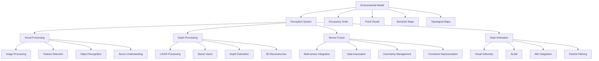

# Perception Systems

## Introduction to Perception Systems

Perception systems form the sensory foundation of autonomous robots, enabling them to interpret and understand their environment through various sensors. These systems process raw sensor data to extract meaningful information about objects, obstacles, surfaces, and other environmental features necessary for navigation, manipulation, and interaction.

### Core Components of Perception Systems

- **Visual Perception**: Processing camera images for object detection, recognition, and scene understanding
- **Depth Perception**: Using stereo cameras, LIDAR, or structured light for 3D scene reconstruction
- **Spatial Mapping**: Creating representations of the environment (occupancy grids, point clouds, meshes)
- **Object Recognition**: Identifying and classifying objects in the environment
- **Sensor Fusion**: Combining data from multiple sensors for robust perception
- **State Estimation**: Determining robot pose and motion using sensor data



## Camera-Based Perception

### Image Processing Fundamentals

Camera-based perception starts with fundamental image processing techniques:

```python
import rclpy
from rclpy.node import Node
from sensor_msgs.msg import Image
from cv_bridge import CvBridge
import cv2
import numpy as np
from std_msgs.msg import Header
from visualization_msgs.msg import Marker, MarkerArray

class CameraPerceptionNode(Node):
    def __init__(self):
        super().__init__('camera_perception_node')

        # Initialize CV bridge
        self.cv_bridge = CvBridge()

        # Create subscriber for camera images
        self.image_sub = self.create_subscription(
            Image, '/camera/image_raw', self.image_callback, 10)

        # Create publisher for processed images
        self.processed_image_pub = self.create_publisher(
            Image, '/processed_image', 10)

        # Create publisher for visualization markers
        self.marker_pub = self.create_publisher(
            MarkerArray, '/perception_markers', 10)

        self.get_logger().info('Camera perception node initialized')

    def image_callback(self, msg):
        """Process incoming camera image"""
        try:
            # Convert ROS Image to OpenCV
            cv_image = self.cv_bridge.imgmsg_to_cv2(msg, "bgr8")

            # Apply various image processing techniques
            processed_image = self.process_image(cv_image)

            # Detect features in the image
            features = self.detect_features(processed_image)

            # Publish processed image
            processed_msg = self.cv_bridge.cv2_to_imgmsg(processed_image, "bgr8")
            processed_msg.header = msg.header
            self.processed_image_pub.publish(processed_msg)

            # Publish visualization markers
            markers = self.create_visualization_markers(features, msg.header)
            self.marker_pub.publish(markers)

        except Exception as e:
            self.get_logger().error(f'Error processing image: {e}')

    def process_image(self, image):
        """Apply basic image processing techniques"""
        # Convert to grayscale
        gray = cv2.cvtColor(image, cv2.COLOR_BGR2GRAY)

        # Apply Gaussian blur to reduce noise
        blurred = cv2.GaussianBlur(gray, (5, 5), 0)

        # Apply adaptive thresholding
        thresh = cv2.adaptiveThreshold(blurred, 255, cv2.ADAPTIVE_THRESH_GAUSSIAN_C, cv2.THRESH_BINARY, 11, 2)

        # Convert back to BGR for visualization
        processed = cv2.cvtColor(thresh, cv2.COLOR_GRAY2BGR)

        return processed

    def detect_features(self, image):
        """Detect features in the image"""
        # Convert to grayscale if needed
        if len(image.shape) == 3:
            gray = cv2.cvtColor(image, cv2.COLOR_BGR2GRAY)
        else:
            gray = image

        # Detect corners using Shi-Tomasi corner detector
        corners = cv2.goodFeaturesToTrack(
            gray,
            maxCorners=100,
            qualityLevel=0.01,
            minDistance=10,
            blockSize=3
        )

        features = []
        if corners is not None:
            for corner in corners:
                x, y = corner.ravel()
                features.append((int(x), int(y)))

        return features

    def create_visualization_markers(self, features, header):
        """Create visualization markers for detected features"""
        marker_array = MarkerArray()

        for i, (x, y) in enumerate(features):
            marker = Marker()
            marker.header = header
            marker.ns = "features"
            marker.id = i
            marker.type = Marker.CYLINDER
            marker.action = Marker.ADD

            # Position
            marker.pose.position.x = x / 100.0  # Scale down for visualization
            marker.pose.position.y = y / 100.0
            marker.pose.position.z = 0.0
            marker.pose.orientation.w = 1.0

            # Scale
            marker.scale.x = 0.02
            marker.scale.y = 0.02
            marker.scale.z = 0.01

            # Color (red)
            marker.color.r = 1.0
            marker.color.g = 0.0
            marker.color.b = 0.0
            marker.color.a = 1.0

            marker_array.markers.append(marker)

        return marker_array
```

### Feature Detection and Matching

Feature detection is crucial for many perception tasks:

```python
class FeatureDetectionNode(Node):
    def __init__(self):
        super().__init__('feature_detection_node')

        # Initialize CV bridge
        self.cv_bridge = CvBridge()

        # Create subscriber and publisher
        self.image_sub = self.create_subscription(
            Image, '/camera/image_raw', self.image_callback, 10)
        self.features_pub = self.create_publisher(
            Image, '/feature_overlay', 10)

        # Initialize different feature detectors
        self.sift = cv2.SIFT_create()
        self.surf = cv2.xfeatures2d.SURF_create() if hasattr(cv2.xfeatures2d, 'SURF_create') else None
        self.orb = cv2.ORB_create()

        self.get_logger().info('Feature detection node initialized')

    def image_callback(self, msg):
        """Process image and detect features"""
        try:
            cv_image = self.cv_bridge.imgmsg_to_cv2(msg, "bgr8")

            # Detect features using different methods
            keypoints_sift, descriptors_sift = self.detect_sift_features(cv_image)
            keypoints_orb, descriptors_orb = self.detect_orb_features(cv_image)

            # Create overlay with features
            overlay_image = self.create_feature_overlay(cv_image, keypoints_sift, keypoints_orb)

            # Publish overlay
            overlay_msg = self.cv_bridge.cv2_to_imgmsg(overlay_image, "bgr8")
            overlay_msg.header = msg.header
            self.features_pub.publish(overlay_msg)

        except Exception as e:
            self.get_logger().error(f'Error in feature detection: {e}')

    def detect_sift_features(self, image):
        """Detect SIFT features"""
        gray = cv2.cvtColor(image, cv2.COLOR_BGR2GRAY)
        keypoints, descriptors = self.sift.detectAndCompute(gray, None)
        return keypoints, descriptors

    def detect_orb_features(self, image):
        """Detect ORB features"""
        gray = cv2.cvtColor(image, cv2.COLOR_BGR2GRAY)
        keypoints, descriptors = self.orb.detectAndCompute(gray, None)
        return keypoints, descriptors

    def create_feature_overlay(self, image, sift_keypoints, orb_keypoints):
        """Create image overlay with detected features"""
        overlay = image.copy()

        # Draw SIFT keypoints in red
        if sift_keypoints:
            overlay = cv2.drawKeypoints(
                overlay, sift_keypoints, None,
                color=(0, 0, 255),
                flags=cv2.DRAW_MATCHES_FLAGS_DRAW_RICH_KEYPOINTS
            )

        # Draw ORB keypoints in blue
        if orb_keypoints:
            overlay = cv2.drawKeypoints(
                overlay, orb_keypoints, None,
                color=(255, 0, 0),
                flags=cv2.DRAW_MATCHES_FLAGS_DRAW_RICH_KEYPOINTS
            )

        return overlay
```

### Object Detection with Deep Learning

Modern perception systems often use deep learning for object detection:

```python
import torch
import torchvision
from torchvision import transforms
from PIL import Image as PILImage
import io

class DeepObjectDetectionNode(Node):
    def __init__(self):
        super().__init__('deep_object_detection_node')

        # Initialize CV bridge
        self.cv_bridge = CvBridge()

        # Load pre-trained object detection model
        self.device = torch.device('cuda' if torch.cuda.is_available() else 'cpu')
        self.model = torchvision.models.detection.fasterrcnn_resnet50_fpn(pretrained=True)
        self.model.to(self.device)
        self.model.eval()

        # Define COCO dataset classes
        self.coco_names = [
            '__background__', 'person', 'bicycle', 'car', 'motorcycle', 'airplane', 'bus',
            'train', 'truck', 'boat', 'traffic light', 'fire hydrant', 'stop sign',
            'parking meter', 'bench', 'bird', 'cat', 'dog', 'horse', 'sheep', 'cow',
            'elephant', 'bear', 'zebra', 'giraffe', 'backpack', 'umbrella', 'handbag',
            'tie', 'suitcase', 'frisbee', 'skis', 'snowboard', 'sports ball', 'kite',
            'baseball bat', 'baseball glove', 'skateboard', 'surfboard', 'tennis racket',
            'bottle', 'wine glass', 'cup', 'fork', 'knife', 'spoon', 'bowl', 'banana',
            'apple', 'sandwich', 'orange', 'broccoli', 'carrot', 'hot dog', 'pizza',
            'donut', 'cake', 'chair', 'couch', 'potted plant', 'bed', 'dining table',
            'toilet', 'tv', 'laptop', 'mouse', 'remote', 'keyboard', 'cell phone',
            'microwave', 'oven', 'toaster', 'sink', 'refrigerator', 'book', 'clock',
            'vase', 'scissors', 'teddy bear', 'hair drier', 'toothbrush'
        ]

        # Create subscriber and publisher
        self.image_sub = self.create_subscription(
            Image, '/camera/image_raw', self.image_callback, 10)
        self.detection_pub = self.create_publisher(
            Image, '/detection_overlay', 10)

        # Image preprocessing
        self.transform = transforms.Compose([
            transforms.ToTensor(),
        ])

        self.get_logger().info('Deep object detection node initialized')

    def image_callback(self, msg):
        """Process image and detect objects using deep learning"""
        try:
            cv_image = self.cv_bridge.imgmsg_to_cv2(msg, "bgr8")

            # Convert OpenCV image to PIL
            pil_image = PILImage.fromarray(cv_image)

            # Preprocess image
            input_tensor = self.transform(pil_image).unsqueeze(0).to(self.device)

            # Run object detection
            with torch.no_grad():
                predictions = self.model(input_tensor)

            # Process predictions
            processed_image = self.draw_detections(cv_image, predictions, msg.header)

            # Publish result
            result_msg = self.cv_bridge.cv2_to_imgmsg(processed_image, "bgr8")
            result_msg.header = msg.header
            self.detection_pub.publish(result_msg)

        except Exception as e:
            self.get_logger().error(f'Error in deep object detection: {e}')

    def draw_detections(self, image, predictions, header):
        """Draw detection results on image"""
        # Get the first (and typically only) image results
        pred = {key: value[0].cpu() for key, value in predictions.items()}

        boxes = pred['boxes'].numpy()
        labels = pred['labels'].numpy()
        scores = pred['scores'].numpy()

        # Filter detections by confidence threshold
        threshold = 0.5
        valid_detections = scores > threshold

        overlay = image.copy()

        for i, valid in enumerate(valid_detections):
            if valid:
                box = boxes[i]
                label = int(labels[i])
                score = scores[i]

                # Draw bounding box
                x1, y1, x2, y2 = map(int, box)
                cv2.rectangle(overlay, (x1, y1), (x2, y2), (0, 255, 0), 2)

                # Draw label and confidence
                label_text = f"{self.coco_names[label]}: {score:.2f}"
                cv2.putText(
                    overlay, label_text, (x1, y1 - 10),
                    cv2.FONT_HERSHEY_SIMPLEX, 0.5, (0, 255, 0), 2
                )

        return overlay
```

## Depth Perception

### Stereo Vision

Stereo vision systems estimate depth by comparing images from two cameras:

```python
class StereoVisionNode(Node):
    def __init__(self):
        super().__init__('stereo_vision_node')

        # Initialize CV bridge
        self.cv_bridge = CvBridge()

        # Create subscribers for left and right cameras
        self.left_sub = self.create_subscription(
            Image, '/stereo_camera/left/image_rect_color', self.left_image_callback, 10)
        self.right_sub = self.create_subscription(
            Image, '/stereo_camera/right/image_rect_color', self.right_image_callback, 10)

        # Create publisher for disparity map
        self.disparity_pub = self.create_publisher(
            Image, '/disparity_map', 10)
        self.depth_pub = self.create_publisher(
            Image, '/depth_image', 10)

        # Initialize stereo matcher
        self.stereo = cv2.StereoSGBM_create(
            minDisparity=0,
            numDisparities=96,  # Must be divisible by 16
            blockSize=5,
            P1=8 * 3 * 5**2,
            P2=32 * 3 * 5**2,
            disp12MaxDiff=1,
            uniquenessRatio=15,
            speckleWindowSize=0,
            speckleRange=2,
            preFilterCap=63,
            mode=cv2.STEREO_SGBM_MODE_SGBM_3WAY
        )

        # Camera parameters (these would come from calibration)
        self.baseline = 0.12  # Baseline in meters
        self.focal_length = 320  # Focal length in pixels (example value)

        # Store images until both are available
        self.left_image = None
        self.right_image = None
        self.left_timestamp = None
        self.right_timestamp = None

        self.get_logger().info('Stereo vision node initialized')

    def left_image_callback(self, msg):
        """Process left camera image"""
        try:
            self.left_image = self.cv_bridge.imgmsg_to_cv2(msg, "mono8")
            self.left_timestamp = msg.header.stamp

            # If we have both images, process them
            if self.right_image is not None:
                self.process_stereo_pair()
        except Exception as e:
            self.get_logger().error(f'Error processing left image: {e}')

    def right_image_callback(self, msg):
        """Process right camera image"""
        try:
            self.right_image = self.cv_bridge.imgmsg_to_cv2(msg, "mono8")
            self.right_timestamp = msg.header.stamp

            # If we have both images, process them
            if self.left_image is not None:
                self.process_stereo_pair()
        except Exception as e:
            self.get_logger().error(f'Error processing right image: {e}')

    def process_stereo_pair(self):
        """Process stereo image pair to generate disparity and depth"""
        if self.left_image is None or self.right_image is None:
            return

        try:
            # Compute disparity map
            disparity = self.stereo.compute(self.left_image, self.right_image).astype(np.float32) / 16.0

            # Convert disparity to depth
            depth = self.disparity_to_depth(disparity)

            # Publish disparity map
            disparity_msg = self.cv_bridge.cv2_to_imgmsg(disparity, "32FC1")
            disparity_msg.header = self.left_timestamp  # Use the earlier timestamp
            self.disparity_pub.publish(disparity_msg)

            # Publish depth image
            depth_msg = self.cv_bridge.cv2_to_imgmsg(depth, "32FC1")
            depth_msg.header = self.left_timestamp
            self.depth_pub.publish(depth_msg)

            # Reset images after processing
            self.left_image = None
            self.right_image = None

        except Exception as e:
            self.get_logger().error(f'Error processing stereo pair: {e}')

    def disparity_to_depth(self, disparity):
        """Convert disparity map to depth map"""
        # Depth = (baseline * focal_length) / disparity
        # Add small value to avoid division by zero
        depth = np.zeros_like(disparity)
        valid_pixels = disparity > 0
        depth[valid_pixels] = (self.baseline * self.focal_length) / (disparity[valid_pixels] + 1e-6)
        return depth
```

### LIDAR Processing

LIDAR sensors provide accurate depth information:

```python
from sensor_msgs.msg import LaserScan, PointCloud2
import sensor_msgs.point_cloud2 as pc2
from geometry_msgs.msg import Point32

class LIDARPerceptionNode(Node):
    def __init__(self):
        super().__init__('lidar_perception_node')

        # Create subscriber for LIDAR scan
        self.scan_sub = self.create_subscription(
            LaserScan, '/scan', self.scan_callback, 10)

        # Create subscriber for point cloud (if available)
        self.pc_sub = self.create_subscription(
            PointCloud2, '/point_cloud', self.pointcloud_callback, 10)

        # Create publisher for processed data
        self.obstacle_pub = self.create_publisher(
            PointCloud2, '/obstacles', 10)
        self.free_space_pub = self.create_publisher(
            PointCloud2, '/free_space', 10)

        # LIDAR parameters
        self.min_range = 0.1
        self.max_range = 10.0
        self.obstacle_threshold = 0.5  # Distance threshold for obstacles

        self.get_logger().info('LIDAR perception node initialized')

    def scan_callback(self, msg):
        """Process LIDAR scan data"""
        try:
            # Convert scan to points
            points = self.scan_to_points(msg)

            # Classify points as obstacles or free space
            obstacles, free_space = self.classify_points(points)

            # Publish results
            obstacles_cloud = self.create_pointcloud2(obstacles, msg.header)
            free_space_cloud = self.create_pointcloud2(free_space, msg.header)

            self.obstacle_pub.publish(obstacles_cloud)
            self.free_space_pub.publish(free_space_cloud)

        except Exception as e:
            self.get_logger().error(f'Error processing LIDAR scan: {e}')

    def scan_to_points(self, scan_msg):
        """Convert LaserScan message to list of 3D points"""
        points = []
        angle = scan_msg.angle_min

        for i, range_val in enumerate(scan_msg.ranges):
            if self.min_range <= range_val <= self.max_range:
                x = range_val * np.cos(angle)
                y = range_val * np.sin(angle)
                z = 0.0  # Assuming 2D scan
                points.append((x, y, z))
            angle += scan_msg.angle_increment

        return points

    def classify_points(self, points):
        """Classify points as obstacles or free space"""
        obstacles = []
        free_space = []

        for point in points:
            x, y, z = point
            distance = np.sqrt(x**2 + y**2)

            if distance < self.obstacle_threshold:
                obstacles.append(point)
            else:
                free_space.append(point)

        return obstacles, free_space

    def pointcloud_callback(self, msg):
        """Process point cloud data"""
        try:
            # Convert point cloud to numpy array
            points = np.array(list(pc2.read_points(msg, field_names=("x", "y", "z"), skip_nans=True)))

            # Perform point cloud processing
            processed_points = self.process_pointcloud(points)

            # Publish results
            processed_cloud = self.create_pointcloud2(processed_points, msg.header)
            self.obstacle_pub.publish(processed_cloud)

        except Exception as e:
            self.get_logger().error(f'Error processing point cloud: {e}')

    def process_pointcloud(self, points):
        """Process point cloud data"""
        # This could include:
        # - Ground plane removal
        # - Clustering for object detection
        # - Surface normal estimation
        # - Feature extraction

        # For this example, we'll just return the points
        return points

    def create_pointcloud2(self, points, header):
        """Create PointCloud2 message from list of points"""
        # Convert to list of Point32
        point32_list = [Point32(x=p[0], y=p[1], z=p[2]) for p in points]

        # Create PointCloud2 message
        cloud_msg = pc2.create_cloud_xyz32(header, point32_list)
        return cloud_msg
```

## Sensor Fusion

### Kalman Filter for Sensor Fusion

Kalman filters combine data from multiple sensors optimally:

```python
import numpy as np
from scipy.linalg import block_diag

class KalmanFilter:
    def __init__(self, dim_x, dim_z, dim_u=0):
        """Initialize Kalman filter
        dim_x: State dimension
        dim_z: Measurement dimension
        dim_u: Control dimension
        """
        self.dim_x = dim_x
        self.dim_z = dim_z
        self.dim_u = dim_u

        # State vector [x, y, vx, vy] for 2D tracking
        self.x = np.zeros((dim_x, 1))

        # State covariance matrix
        self.P = np.eye(dim_x) * 500

        # Process noise covariance
        self.Q = np.eye(dim_x)

        # Measurement noise covariance
        self.R = np.eye(dim_z)

        # State transition matrix (constant velocity model)
        self.F = np.eye(dim_x)

        # Measurement function
        self.H = np.zeros((dim_z, dim_x))

        # Control transition matrix
        if dim_u > 0:
            self.B = np.zeros((dim_x, dim_u))
        else:
            self.B = None

        # Identity matrix for computational efficiency
        self._I = np.eye(dim_x)

    def predict(self, u=None, B=None, F=None, Q=None):
        """Predict next state"""
        if B is None:
            B = self.B
        if F is None:
            F = self.F
        if Q is None:
            Q = self.Q
        elif np.isscalar(Q):
            Q = np.eye(self.dim_x) * Q

        # x = Fx + Bu
        if B is not None and u is not None:
            self.x = np.dot(F, self.x) + np.dot(B, u)
        else:
            self.x = np.dot(F, self.x)

        # P = FPF' + Q
        self.P = np.dot(np.dot(F, self.P), F.T) + Q

    def update(self, z, R=None, H=None):
        """Update state with measurement"""
        if z is None:
            return

        if R is None:
            R = self.R
        elif np.isscalar(R):
            R = np.eye(self.dim_z) * R

        if H is None:
            H = self.H

        # Compute residual
        y = z - np.dot(H, self.x)

        # Compute residual covariance
        PHT = np.dot(self.P, H.T)
        S = np.dot(H, PHT) + R

        # Compute Kalman gain
        K = np.dot(PHT, np.linalg.inv(S))

        # Update state
        self.x = self.x + np.dot(K, y)

        # Update covariance
        I_KH = self._I - np.dot(K, H)
        self.P = np.dot(I_KH, self.P)

class SensorFusionNode(Node):
    def __init__(self):
        super().__init__('sensor_fusion_node')

        # Initialize Kalman filter for 2D position and velocity
        # State: [x, y, vx, vy]
        self.kf = KalmanFilter(dim_x=4, dim_z=2)

        # Initialize filter with constant velocity model
        dt = 0.1  # Time step
        self.kf.F = np.array([
            [1, 0, dt, 0],
            [0, 1, 0, dt],
            [0, 0, 1, 0],
            [0, 0, 0, 1]
        ])

        # Measurement function (we only measure position)
        self.kf.H = np.array([
            [1, 0, 0, 0],
            [0, 1, 0, 0]
        ])

        # Process noise (tuned for our application)
        q = 0.1
        self.kf.Q = block_diag(q**2, q**2, q**2, q**2)

        # Measurement noise
        self.kf.R = np.eye(2) * 0.5**2

        # Subscribe to different sensors
        self.camera_sub = self.create_subscription(
            Point, '/camera_detection', self.camera_callback, 10)
        self.lidar_sub = self.create_subscription(
            Point, '/lidar_detection', self.lidar_callback, 10)
        self.odom_sub = self.create_subscription(
            Point, '/odometry', self.odom_callback, 10)

        # Publisher for fused state
        self.state_pub = self.create_publisher(
            Point, '/fused_state', 10)

        # Timer for prediction step
        self.predict_timer = self.create_timer(0.1, self.predict_step)

        self.get_logger().info('Sensor fusion node initialized')

    def camera_callback(self, msg):
        """Process camera measurement"""
        # Camera provides position measurement
        z = np.array([[msg.x], [msg.y]])
        self.kf.update(z)

    def lidar_callback(self, msg):
        """Process LIDAR measurement"""
        # LIDAR provides position measurement
        z = np.array([[msg.x], [msg.y]])
        self.kf.update(z)

    def odom_callback(self, msg):
        """Process odometry measurement"""
        # Odometry provides position measurement
        z = np.array([[msg.x], [msg.y]])
        self.kf.update(z)

    def predict_step(self):
        """Prediction step of Kalman filter"""
        self.kf.predict()

        # Publish current state estimate
        state_msg = Point()
        state_msg.x = float(self.kf.x[0, 0])
        state_msg.y = float(self.kf.x[1, 0])
        state_msg.z = float(self.kf.x[2, 0])  # x velocity
        # Use z field for x velocity in this example
        self.state_pub.publish(state_msg)
```

### Particle Filter for Non-linear Systems

For non-linear systems, particle filters can be more appropriate:

```python
class ParticleFilter:
    def __init__(self, num_particles, state_dim, process_noise, measurement_noise):
        self.num_particles = num_particles
        self.state_dim = state_dim
        self.process_noise = process_noise
        self.measurement_noise = measurement_noise

        # Initialize particles randomly
        self.particles = np.random.randn(num_particles, state_dim) * 10
        self.weights = np.ones(num_particles) / num_particles

    def predict(self, control_input=None):
        """Predict step: propagate particles through motion model"""
        for i in range(self.num_particles):
            # Simple motion model (constant velocity with noise)
            self.particles[i] += np.random.normal(0, self.process_noise, self.state_dim)

    def update(self, measurement):
        """Update step: adjust weights based on measurement likelihood"""
        # Calculate likelihood of each particle given measurement
        for i in range(self.num_particles):
            # Calculate distance between particle and measurement
            distance = np.linalg.norm(self.particles[i] - measurement)
            # Update weight based on likelihood (Gaussian model)
            likelihood = np.exp(-0.5 * (distance**2) / (self.measurement_noise**2))
            self.weights[i] *= likelihood

        # Normalize weights
        self.weights += 1.e-300  # Avoid zero weights
        self.weights /= np.sum(self.weights)

    def resample(self):
        """Resample particles based on their weights"""
        # Systematic resampling
        indices = []
        step = 1.0 / self.num_particles
        start = np.random.uniform(0, step)

        i = 0
        for j in range(self.num_particles):
            while start > self.weights[i]:
                start -= self.weights[i]
                i += 1
            indices.append(i)

        # Resample particles
        self.particles = self.particles[indices]
        self.weights = np.ones(self.num_particles) / self.num_particles

    def estimate(self):
        """Get state estimate as weighted average of particles"""
        return np.average(self.particles, weights=self.weights, axis=0)

class ParticleFilterNode(Node):
    def __init__(self):
        super().__init__('particle_filter_node')

        # Initialize particle filter
        self.pf = ParticleFilter(
            num_particles=100,
            state_dim=2,  # 2D position
            process_noise=0.1,
            measurement_noise=0.5
        )

        # Subscribe to sensor measurements
        self.measurement_sub = self.create_subscription(
            Point, '/sensor_measurement', self.measurement_callback, 10)

        # Publisher for estimated state
        self.estimate_pub = self.create_publisher(
            Point, '/particle_filter_estimate', 10)

        # Timer for prediction step
        self.predict_timer = self.create_timer(0.1, self.predict_step)

        self.get_logger().info('Particle filter node initialized')

    def measurement_callback(self, msg):
        """Process measurement and update filter"""
        measurement = np.array([msg.x, msg.y])
        self.pf.update(measurement)
        self.pf.resample()

    def predict_step(self):
        """Prediction step"""
        self.pf.predict()

        # Get and publish estimate
        estimate = self.pf.estimate()
        estimate_msg = Point()
        estimate_msg.x = float(estimate[0])
        estimate_msg.y = float(estimate[1])
        estimate_msg.z = 0.0  # Not used in this example
        self.estimate_pub.publish(estimate_msg)
```

## SLAM (Simultaneous Localization and Mapping)

### Visual SLAM

Visual SLAM systems build maps while localizing:

```python
class VisualSLAMNode(Node):
    def __init__(self):
        super().__init__('visual_slam_node')

        # Initialize CV bridge
        self.cv_bridge = CvBridge()

        # Create subscriber for camera images
        self.image_sub = self.create_subscription(
            Image, '/camera/image_raw', self.image_callback, 10)

        # Create publisher for map visualization
        self.map_pub = self.create_publisher(
            MarkerArray, '/slam_map', 10)

        # SLAM parameters
        self.keyframe_threshold = 10  # Threshold for keyframe selection
        self.max_features = 1000      # Maximum features to track

        # Initialize ORB detector and descriptor
        self.orb = cv2.ORB_create(nfeatures=self.max_features)

        # FLANN matcher for feature matching
        FLANN_INDEX_LSH = 6
        index_params = dict(algorithm=FLANN_INDEX_LSH, table_number=6, key_size=12, multi_probe_level=1)
        search_params = dict(checks=50)
        self.flann = cv2.FlannBasedMatcher(index_params, search_params)

        # SLAM state
        self.current_frame = None
        self.keyframes = []
        self.map_points = []
        self.current_pose = np.eye(4)  # 4x4 identity matrix

        self.get_logger().info('Visual SLAM node initialized')

    def image_callback(self, msg):
        """Process image for SLAM"""
        try:
            cv_image = self.cv_bridge.imgmsg_to_cv2(msg, "bgr8")

            # Extract features from current image
            keypoints, descriptors = self.extract_features(cv_image)

            if len(self.keyframes) == 0:
                # First frame - initialize
                self.keyframes.append({
                    'image': cv_image,
                    'keypoints': keypoints,
                    'descriptors': descriptors,
                    'pose': self.current_pose.copy()
                })
            else:
                # Track features and estimate motion
                prev_frame = self.keyframes[-1]
                matches = self.match_features(prev_frame['descriptors'], descriptors)

                if len(matches) > 10:  # Minimum matches for reliable pose estimation
                    # Estimate relative pose
                    pose_change = self.estimate_pose(
                        prev_frame['keypoints'], keypoints, matches
                    )

                    # Update current pose
                    self.current_pose = self.current_pose @ pose_change

                    # Add as keyframe if significant motion
                    if self.should_add_keyframe():
                        self.keyframes.append({
                            'image': cv_image,
                            'keypoints': keypoints,
                            'descriptors': descriptors,
                            'pose': self.current_pose.copy()
                        })

                        # Update map points
                        self.update_map_points(keypoints, matches)

            # Publish map visualization
            self.publish_map_visualization(msg.header)

        except Exception as e:
            self.get_logger().error(f'Error in SLAM: {e}')

    def extract_features(self, image):
        """Extract ORB features from image"""
        gray = cv2.cvtColor(image, cv2.COLOR_BGR2GRAY)
        keypoints, descriptors = self.orb.detectAndCompute(gray, None)
        return keypoints, descriptors

    def match_features(self, desc1, desc2):
        """Match features between two descriptors"""
        if desc1 is None or desc2 is None:
            return []

        try:
            matches = self.flann.knnMatch(desc1, desc2, k=2)
            # Apply Lowe's ratio test
            good_matches = []
            for match_pair in matches:
                if len(match_pair) == 2:
                    m, n = match_pair
                    if m.distance < 0.7 * n.distance:
                        good_matches.append(m)
            return good_matches
        except:
            return []

    def estimate_pose(self, kp1, kp2, matches):
        """Estimate relative pose from matched keypoints"""
        if len(matches) >= 4:
            # Get matched points
            src_pts = np.float32([kp1[m.queryIdx].pt for m in matches]).reshape(-1, 1, 2)
            dst_pts = np.float32([kp2[m.trainIdx].pt for m in matches]).reshape(-1, 1, 2)

            # Find fundamental matrix
            F, mask = cv2.findFundamentalMat(src_pts, dst_pts, cv2.RANSAC, 4, 0.999)

            # For simplicity, we'll return a simple transformation
            # In a real system, this would involve more complex pose estimation
            return np.eye(4)  # Placeholder
        else:
            return np.eye(4)

    def should_add_keyframe(self):
        """Determine if current frame should be added as keyframe"""
        # Simple criterion: add keyframe if we have enough new features
        # or if enough time has passed
        return len(self.keyframes) % self.keyframe_threshold == 0

    def update_map_points(self, keypoints, matches):
        """Update map points based on current observations"""
        # This would triangulate 3D points from stereo observations
        # or track points across frames
        pass

    def publish_map_visualization(self, header):
        """Publish map visualization markers"""
        marker_array = MarkerArray()

        # Create markers for keyframe positions
        for i, kf in enumerate(self.keyframes):
            marker = Marker()
            marker.header = header
            marker.ns = "keyframes"
            marker.id = i
            marker.type = Marker.CUBE
            marker.action = Marker.ADD

            # Position from pose
            marker.pose.position.x = kf['pose'][0, 3] / 10  # Scale down for visualization
            marker.pose.position.y = kf['pose'][1, 3] / 10
            marker.pose.position.z = kf['pose'][2, 3] / 10
            marker.pose.orientation.w = 1.0

            # Scale
            marker.scale.x = 0.1
            marker.scale.y = 0.1
            marker.scale.z = 0.1

            # Color (blue)
            marker.color.b = 1.0
            marker.color.a = 1.0

            marker_array.markers.append(marker)

        self.map_pub.publish(marker_array)
```

## Hardware-Specific Optimizations

### For NVIDIA Jetson Users
```python
# Jetson-specific perception optimizations
import rclpy
from rclpy.node import Node
import numpy as np

class JetsonPerceptionNode(Node):
    def __init__(self):
        super().__init__('jetson_perception_node')

        # Optimize perception for Jetson's ARM architecture and GPU
        self.setup_jetson_optimizations()

        self.get_logger().info('Jetson-optimized perception node initialized')

    def setup_jetson_optimizations(self):
        """Configure perception for Jetson hardware"""
        # Use optimized libraries for Jetson
        # Adjust algorithm parameters for Jetson's capabilities
        # Enable hardware acceleration where possible
        # Optimized for [USER_GPU] hardware
        pass

    def jetson_image_processing(self, image):
        """
        Process image using Jetson-optimized methods
        Optimized for [USER_GPU] hardware
        """
        # Use Jetson's hardware accelerators for image processing
        # This would leverage Jetson's ISP, GPU, and other processing units
        pass
```

### For High-End GPU Users
```python
# High-end GPU perception optimizations
import rclpy
from rclpy.node import Node
import torch
import numpy as np

class GPUOptimizedPerceptionNode(Node):
    def __init__(self):
        super().__init__('gpu_optimized_perception_node')

        # Initialize GPU context for perception
        self.device = torch.device('cuda' if torch.cuda.is_available() else 'cpu')

        # Configure perception for high-end GPU
        self.setup_gpu_optimizations()

        self.get_logger().info('GPU-optimized perception node initialized')

    def setup_gpu_optimizations(self):
        """Configure perception for high-end GPU hardware"""
        # Set environment variables for GPU optimization
        # Enable advanced perception features for powerful GPUs
        # Use multi-GPU processing if available
        # Optimized for [USER_GPU] hardware specifications
        pass

    def gpu_accelerated_perception(self, sensor_data):
        """
        Perform GPU-accelerated perception processing
        Optimized for [USER_GPU] hardware specifications
        """
        # Use GPU for intensive perception computations
        # Leverage tensor cores for efficient parallel computation
        # Implement batch processing for efficiency
        pass
```

## 3D Perception and Reconstruction

### Point Cloud Processing

```python
from sensor_msgs.msg import PointCloud2
import sensor_msgs.point_cloud2 as pc2
from geometry_msgs.msg import Point
from std_msgs.msg import Header

class PointCloudPerceptionNode(Node):
    def __init__(self):
        super().__init__('pointcloud_perception_node')

        # Subscribe to point cloud
        self.pc_sub = self.create_subscription(
            PointCloud2, '/points', self.pointcloud_callback, 10)

        # Publishers for processed data
        self.ground_pub = self.create_publisher(
            PointCloud2, '/ground_points', 10)
        self.obstacles_pub = self.create_publisher(
            PointCloud2, '/obstacle_points', 10)

        # RANSAC parameters for ground plane detection
        self.ransac_max_iterations = 100
        self.ransac_distance_threshold = 0.1

        self.get_logger().info('Point cloud perception node initialized')

    def pointcloud_callback(self, msg):
        """Process point cloud data"""
        try:
            # Convert PointCloud2 to numpy array
            points = np.array(list(pc2.read_points(msg, field_names=("x", "y", "z"), skip_nans=True)))

            if len(points) > 0:
                # Separate ground and obstacles using RANSAC
                ground_points, obstacle_points = self.separate_ground_obstacles(points)

                # Publish results
                if len(ground_points) > 0:
                    ground_cloud = self.create_pointcloud2(ground_points, msg.header)
                    self.ground_pub.publish(ground_cloud)

                if len(obstacle_points) > 0:
                    obstacle_cloud = self.create_pointcloud2(obstacle_points, msg.header)
                    self.obstacles_pub.publish(obstacle_cloud)

        except Exception as e:
            self.get_logger().error(f'Error processing point cloud: {e}')

    def separate_ground_obstacles(self, points):
        """Separate ground and obstacle points using RANSAC"""
        if len(points) < 3:
            return np.array([]), points

        best_model = None
        best_inliers = []
        best_error = float('inf')

        # RANSAC for plane fitting (ground plane)
        for _ in range(self.ransac_max_iterations):
            # Randomly select 3 points
            indices = np.random.choice(len(points), 3, replace=False)
            sample_points = points[indices]

            # Fit plane to these points
            model = self.fit_plane(sample_points)

            if model is not None:
                # Calculate distances to plane
                distances = np.abs(np.dot(points, model[:3]) + model[3])
                inliers = points[distances < self.ransac_distance_threshold]

                if len(inliers) > len(best_inliers):
                    best_model = model
                    best_inliers = inliers
                    best_error = np.mean(distances[distances < self.ransac_distance_threshold])

        # If we found a good ground plane
        if best_model is not None and len(best_inliers) > len(points) * 0.1:  # At least 10% of points
            # Calculate distances to the best plane
            all_distances = np.abs(np.dot(points, best_model[:3]) + best_model[3])
            ground_mask = all_distances < self.ransac_distance_threshold

            ground_points = points[ground_mask]
            obstacle_points = points[~ground_mask]
        else:
            # If no good ground plane found, assume no ground separation
            ground_points = np.array([])
            obstacle_points = points

        return ground_points, obstacle_points

    def fit_plane(self, points):
        """Fit a plane to 3D points using SVD"""
        if len(points) < 3:
            return None

        # Calculate centroid
        centroid = np.mean(points, axis=0)

        # Center points
        centered_points = points - centroid

        # Calculate covariance matrix
        cov_matrix = np.cov(centered_points.T)

        # Calculate SVD
        u, s, vh = np.linalg.svd(cov_matrix)

        # Normal vector is the eigenvector with smallest eigenvalue
        normal = vh[2, :]

        # Calculate d parameter: ax + by + cz + d = 0
        d = -np.dot(normal, centroid)

        return np.array([normal[0], normal[1], normal[2], d])

    def create_pointcloud2(self, points, header):
        """Create PointCloud2 message from numpy array"""
        # Convert numpy array to list of Point32
        point32_list = [Point32(x=p[0], y=p[1], z=p[2]) for p in points]

        # Create PointCloud2 message
        cloud_msg = pc2.create_cloud_xyz32(header, point32_list)
        return cloud_msg
```

## Perception Quality Assessment

### Performance Metrics

```python
class PerceptionQualityNode(Node):
    def __init__(self):
        super().__init__('perception_quality_node')

        # Publishers for quality metrics
        self.quality_pub = self.create_publisher(
            Float64MultiArray, '/perception_quality', 10)

        # Quality assessment parameters
        self.confidence_threshold = 0.5
        self.min_detection_count = 5

        # Store metrics over time
        self.detection_confidences = []
        self.detection_rates = []

        # Timer for quality assessment
        self.quality_timer = self.create_timer(1.0, self.assess_quality)

        self.get_logger().info('Perception quality assessment node initialized')

    def assess_quality(self):
        """Assess perception system quality"""
        if len(self.detection_confidences) == 0:
            return

        # Calculate quality metrics
        avg_confidence = np.mean(self.detection_confidences)
        confidence_std = np.std(self.detection_confidences)
        detection_rate = len([c for c in self.detection_confidences if c > self.confidence_threshold]) / len(self.detection_confidences)

        # Prepare quality report
        quality_metrics = [
            float(avg_confidence),
            float(confidence_std),
            float(detection_rate),
            float(len(self.detection_confidences))
        ]

        # Publish quality metrics
        quality_msg = Float64MultiArray()
        quality_msg.data = quality_metrics
        self.quality_pub.publish(quality_msg)

        # Log quality assessment
        self.get_logger().info(
            f'Perception Quality - Avg Confidence: {avg_confidence:.3f}, '
            f'Detection Rate: {detection_rate:.3f}, '
            f'Count: {len(self.detection_confidences)}'
        )

        # Clear metrics for next assessment
        self.detection_confidences.clear()
```

## Key Takeaways

1. **Multi-sensor Integration**: Effective perception combines data from multiple sensors for robustness.

2. **Real-time Processing**: Perception systems must operate within strict timing constraints for robot control.

3. **Uncertainty Management**: All perception results have associated uncertainties that must be handled properly.

4. **Hardware Optimization**: Different optimization strategies are needed for different hardware platforms.

5. **SLAM**: Simultaneous Localization and Mapping is essential for autonomous navigation in unknown environments.

6. **Quality Assessment**: Perception systems need continuous quality monitoring and assessment.

7. **3D Understanding**: Modern robots require 3D scene understanding for manipulation and navigation.

## Practice Exercises

### Exercise 1: Feature Detection
Implement a feature detection system that can detect and match features between consecutive camera frames.

### Exercise 2: Sensor Fusion
Create a sensor fusion system that combines camera and LIDAR data to improve object detection accuracy.

### Exercise 3: SLAM Implementation
Implement a basic visual SLAM system that can build a map while tracking the robot's position.

### Exercise 4: 3D Reconstruction
Create a system that reconstructs 3D scenes from stereo camera images or LIDAR data.

### Exercise 5: Hardware Optimization
Optimize a perception algorithm for your specific hardware configuration (GPU/Jetson) and measure performance improvements.

## MCQs Quiz

1. What does SLAM stand for in robotics?
   - A) Simultaneous Localization and Mapping
   - B) Sensor Localization and Mapping
   - C) Stereo Localization and Mapping
   - D) Systematic Localization and Mapping
   - **Answer: A**

2. Which sensor provides the most accurate depth information for close-range perception?
   - A) Camera
   - B) LIDAR
   - C) Ultrasonic sensor
   - D) Infrared sensor
   - **Answer: B**

3. What is the primary purpose of sensor fusion in perception systems?
   - A) To reduce cost only
   - B) To combine data from multiple sensors for robust perception
   - C) To increase sensor range
   - D) To eliminate the need for calibration
   - **Answer: B**

4. Which feature detector is known for being scale-invariant?
   - A) Harris corner detector
   - B) SIFT (Scale-Invariant Feature Transform)
   - C) Canny edge detector
   - D) Sobel operator
   - **Answer: B**

5. What is a key advantage of using a particle filter over a Kalman filter?
   - A) Lower computational cost
   - B) Better performance with non-linear systems and non-Gaussian noise
   - C) Guaranteed convergence
   - D) Simpler implementation
   - **Answer: B**

## Further Reading

- "Computer Vision: Algorithms and Applications" by Richard Szeliski
- "Probabilistic Robotics" by Thrun, Burgard, and Fox
- "Multiple View Geometry in Computer Vision" by Hartley and Zisserman
- "Learning OpenCV" by Bradski and Kaehler
- Point Cloud Library (PCL): http://pointclouds.org/
- ROS Perception: http://wiki.ros.org/perception
- OpenCV Documentation: https://docs.opencv.org/
- "Visual SLAM: Why Bundle Adjust?" - Recent advances in SLAM research

---

*Generated with reusable Claude Subagents & Spec-Kit Plus*