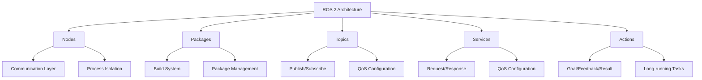
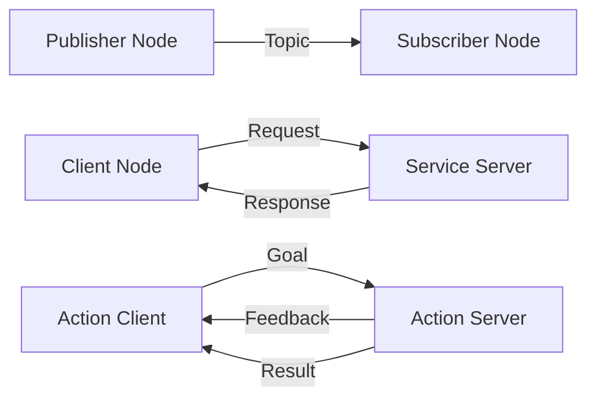

{/* Buttons for personalization and language toggle */}
<div className="button-container" style={{ marginBottom: '20px' }}>
  <button
    className="personalize-button"
    onClick={() => {
      // This would trigger personalization logic based on user's hardware profile
      alert('Personalization feature would activate based on your hardware profile (GPU: [user GPU], Jetson: [user Jetson status], Robot: [user robot type])');
    }}
    style={{
      backgroundColor: '#4a6fa5',
      color: 'white',
      border: 'none',
      padding: '10px 15px',
      borderRadius: '5px',
      marginRight: '10px',
      cursor: 'pointer'
    }}
  >
    Personalize to my hardware
  </button>
  <button
    className="urdu-toggle-button"
    onClick={() => {
      // This would toggle between English and Urdu content
      alert('Content would toggle between English and Urdu');
    }}
    style={{
      backgroundColor: '#2e7d32',
      color: 'white',
      border: 'none',
      padding: '10px 15px',
      borderRadius: '5px',
      cursor: 'pointer'
    }}
  >
    اردو میں پڑھیں / Show in Urdu
  </button>
</div>

# ROS 2 Fundamentals

## Introduction to ROS 2

Robot Operating System 2 (ROS 2) represents a significant evolution from its predecessor, designed to address the limitations of ROS 1 and meet the requirements of modern robotics applications. ROS 2 provides a flexible framework for writing robot software, offering improved real-time capabilities, enhanced security, and better support for commercial applications.

### Key Improvements over ROS 1

- **Real-time support**: Better integration with real-time operating systems
- **Security**: Built-in security features including authentication and encryption
- **Quality of Service (QoS)**: Configurable reliability and performance options
- **Multi-platform support**: Native Windows and macOS support alongside Linux
- **DDS-based middleware**: More robust communication layer



## ROS 2 Architecture

### Nodes and Processes

In ROS 2, nodes are separate processes that communicate with each other through topics, services, and actions. Each node runs independently and can be written in different programming languages (C++, Python, etc.).

```python
# Example ROS 2 node implementation
import rclpy
from rclpy.node import Node
from std_msgs.msg import String
from sensor_msgs.msg import JointState
from geometry_msgs.msg import Twist

class RobotController(Node):
    def __init__(self):
        super().__init__('robot_controller')

        # Create publishers
        self.joint_pub = self.create_publisher(JointState, 'joint_states', 10)
        self.cmd_vel_pub = self.create_publisher(Twist, 'cmd_vel', 10)
        self.status_pub = self.create_publisher(String, 'robot_status', 10)

        # Create subscribers
        self.imu_sub = self.create_subscription(
            String, 'imu_data', self.imu_callback, 10)
        self.lidar_sub = self.create_subscription(
            String, 'lidar_data', self.lidar_callback, 10)

        # Create timer for control loop
        self.timer = self.create_timer(0.05, self.control_loop)  # 20 Hz

        self.get_logger().info('Robot Controller node initialized')

    def control_loop(self):
        """Main control loop executed at 20Hz"""
        # Get current robot state
        # Compute control commands
        # Publish commands to robot
        msg = String()
        msg.data = f'Control loop executing at {self.get_clock().now().nanoseconds}'
        self.status_pub.publish(msg)

    def imu_callback(self, msg):
        """Process IMU data"""
        self.get_logger().info(f'Received IMU data: {msg.data}')

    def lidar_callback(self, msg):
        """Process LIDAR data"""
        self.get_logger().info(f'Received LIDAR data: {msg.data}')

def main(args=None):
    rclpy.init(args=args)
    robot_controller = RobotController()

    try:
        rclpy.spin(robot_controller)
    except KeyboardInterrupt:
        pass
    finally:
        robot_controller.destroy_node()
        rclpy.shutdown()

if __name__ == '__main__':
    main()
```

### Topics, Services, and Actions

ROS 2 provides three primary communication patterns:

- **Topics**: Unidirectional publish/subscribe communication (asynchronous)
- **Services**: Bidirectional request/response communication (synchronous)
- **Actions**: Bidirectional communication for long-running tasks with feedback



### Quality of Service (QoS) Profiles

QoS profiles allow fine-tuning of communication behavior based on application requirements:

```python
from rclpy.qos import QoSProfile, QoSReliabilityPolicy, QoSHistoryPolicy

# Example QoS configurations for different use cases
def create_sensor_qos():
    """QoS for sensor data (high frequency, may drop messages)"""
    return QoSProfile(
        depth=10,
        reliability=QoSReliabilityPolicy.BEST_EFFORT,
        history=QoSHistoryPolicy.KEEP_LAST
    )

def create_control_qos():
    """QoS for control commands (reliable, low latency)"""
    return QoSProfile(
        depth=1,
        reliability=QoSReliabilityPolicy.RELIABLE,
        history=QoSHistoryPolicy.KEEP_LAST
    )

def create_config_qos():
    """QoS for configuration data (reliable, keep all)"""
    return QoSProfile(
        depth=100,
        reliability=QoSReliabilityPolicy.RELIABLE,
        history=QoSHistoryPolicy.KEEP_ALL
    )
```

## Package Structure and Build System

ROS 2 uses the `ament` build system, which supports both CMake and Python packages:

```xml
<!-- package.xml - Package manifest -->
<?xml version="1.0"?>
<?xml-model href="http://download.ros.org/schema/package_format3.xsd" schematypens="http://www.w3.org/2001/XMLSchema"?>
<package format="3">
  <name>robot_controller</name>
  <version>0.1.0</version>
  <description>Robot controller package</description>
  <maintainer email="maintainer@todo.todo">Maintainer</maintainer>
  <license>Apache-2.0</license>

  <depend>rclpy</depend>
  <depend>std_msgs</depend>
  <depend>sensor_msgs</depend>
  <depend>geometry_msgs</depend>

  <exec_depend>ros2launch</exec_depend>

  <export>
    <build_type>ament_python</build_type>
  </export>
</package>
```

```python
# setup.py - Python package setup
from setuptools import setup
import os
from glob import glob

package_name = 'robot_controller'

setup(
    name=package_name,
    version='0.1.0',
    packages=[package_name],
    data_files=[
        ('share/ament_index/resource_index/packages',
            ['resource/' + package_name]),
        ('share/' + package_name, ['package.xml']),
        # Include launch files
        (os.path.join('share', package_name, 'launch'),
         glob('launch/*.py')),
    ],
    install_requires=['setuptools'],
    zip_safe=True,
    maintainer='Maintainer',
    maintainer_email='maintainer@todo.todo',
    description='Robot controller package',
    license='Apache-2.0',
    tests_require=['pytest'],
    entry_points={
        'console_scripts': [
            'robot_controller = robot_controller.robot_controller:main',
        ],
    },
)
```

## Launch Files and System Management

Launch files allow you to start multiple nodes with a single command:

```python
# launch/robot_system.launch.py
from launch import LaunchDescription
from launch.actions import DeclareLaunchArgument
from launch.substitutions import LaunchConfiguration
from launch_ros.actions import Node

def generate_launch_description():
    return LaunchDescription([
        # Declare launch arguments
        DeclareLaunchArgument(
            'use_sim_time',
            default_value='false',
            description='Use simulation clock if true'),

        # Robot controller node
        Node(
            package='robot_controller',
            executable='robot_controller',
            name='robot_controller',
            parameters=[
                {'use_sim_time': LaunchConfiguration('use_sim_time')}
            ],
            output='screen'
        ),

        # Additional nodes can be added here
        Node(
            package='robot_controller',
            executable='sensor_processor',
            name='sensor_processor',
            parameters=[
                {'use_sim_time': LaunchConfiguration('use_sim_time')}
            ],
            output='screen'
        )
    ])
```

## Parameter Management

ROS 2 provides flexible parameter management for configuring nodes at runtime:

```python
# Parameter handling in a ROS 2 node
import rclpy
from rclpy.node import Node
from rcl_interfaces.msg import ParameterType

class ParameterizedNode(Node):
    def __init__(self):
        super().__init__('parameterized_node')

        # Declare parameters with default values
        self.declare_parameter('control_frequency', 50.0)
        self.declare_parameter('max_velocity', 1.0)
        self.declare_parameter('robot_name', 'default_robot')
        self.declare_parameter('safety_enabled', True)

        # Access parameter values
        self.control_freq = self.get_parameter('control_frequency').value
        self.max_vel = self.get_parameter('max_velocity').value
        self.robot_name = self.get_parameter('robot_name').value
        self.safety_enabled = self.get_parameter('safety_enabled').value

        # Set up parameter callback for dynamic reconfiguration
        self.add_on_set_parameters_callback(self.parameters_callback)

    def parameters_callback(self, params):
        """Handle parameter changes"""
        for param in params:
            if param.name == 'control_frequency' and param.type == ParameterType.PARAMETER_DOUBLE:
                self.control_freq = param.value
                self.get_logger().info(f'Control frequency updated to {self.control_freq}')
            elif param.name == 'max_velocity' and param.type == ParameterType.PARAMETER_DOUBLE:
                self.max_vel = param.value
                self.get_logger().info(f'Max velocity updated to {self.max_vel}')

        return rclpy.node.SetParametersResult(successful=True)

def main(args=None):
    rclpy.init(args=args)
    node = ParameterizedNode()
    rclpy.spin(node)
    node.destroy_node()
    rclpy.shutdown()

if __name__ == '__main__':
    main()
```

## Client Libraries and Language Support

ROS 2 supports multiple programming languages through client libraries:

### C++ Example
```cpp
#include <rclcpp/rclcpp.hpp>
#include <std_msgs/msg/string.hpp>

class MinimalPublisher : public rclcpp::Node
{
public:
    MinimalPublisher()
    : Node("minimal_publisher"), count_(0)
    {
        publisher_ = this->create_publisher<std_msgs::msg::String>("topic", 10);
        timer_ = this->create_wall_timer(
            std::chrono::milliseconds(500),
            std::bind(&MinimalPublisher::timer_callback, this));
    }

private:
    void timer_callback()
    {
        auto message = std_msgs::msg::String();
        message.data = "Hello, world! " + std::to_string(count_++);
        RCLCPP_INFO(this->get_logger(), "Publishing: '%s'", message.data.c_str());
        publisher_->publish(message);
    }
    rclcpp::TimerBase::SharedPtr timer_;
    rclcpp::Publisher<std_msgs::msg::String>::SharedPtr publisher_;
    size_t count_;
};
```

### Python Example with Advanced Features
```python
# Advanced ROS 2 node with service and action clients
import rclpy
from rclpy.node import Node
from rclpy.action import ActionClient
from rclpy.callback_groups import ReentrantCallbackGroup
from rclpy.executors import MultiThreadedExecutor

from example_interfaces.srv import AddTwoInts
from example_interfaces.action import Fibonacci

class AdvancedNode(Node):
    def __init__(self):
        super().__init__('advanced_node')

        # Service client
        self.cli = self.create_client(AddTwoInts, 'add_two_ints')
        while not self.cli.wait_for_service(timeout_sec=1.0):
            self.get_logger().info('Service not available, waiting again...')

        # Action client
        self._action_client = ActionClient(
            self, Fibonacci, 'fibonacci')

        # Timer for periodic tasks
        self.timer = self.create_timer(1.0, self.timer_callback)

    def timer_callback(self):
        """Execute service call and action goal"""
        self.send_request()
        self.send_goal()

    def send_request(self):
        """Send service request"""
        request = AddTwoInts.Request()
        request.a = 41
        request.b = 1

        future = self.cli.call_async(request)
        future.add_done_callback(self.service_callback)

    def service_callback(self, future):
        """Handle service response"""
        try:
            response = future.result()
            self.get_logger().info(f'Result of service call: {response.sum}')
        except Exception as e:
            self.get_logger().error(f'Service call failed: {e}')

    def send_goal(self):
        """Send action goal"""
        goal_msg = Fibonacci.Goal()
        goal_msg.order = 10

        self._action_client.wait_for_server()
        send_goal_future = self._action_client.send_goal_async(
            goal_msg,
            feedback_callback=self.feedback_callback)

        send_goal_future.add_done_callback(self.goal_response_callback)

    def goal_response_callback(self, future):
        """Handle action goal response"""
        goal_handle = future.result()
        if not goal_handle.accepted:
            self.get_logger().info('Goal rejected')
            return

        self.get_logger().info('Goal accepted')
        get_result_future = goal_handle.get_result_async()
        get_result_future.add_done_callback(self.get_result_callback)

    def feedback_callback(self, feedback_msg):
        """Handle action feedback"""
        feedback = feedback_msg.feedback
        self.get_logger().info(f'Received feedback: {feedback.sequence}')

    def get_result_callback(self, future):
        """Handle action result"""
        result = future.result().result
        self.get_logger().info(f'Result: {result.sequence}')

def main(args=None):
    rclpy.init(args=args)

    node = AdvancedNode()
    executor = MultiThreadedExecutor()
    executor.add_node(node)

    try:
        executor.spin()
    except KeyboardInterrupt:
        pass
    finally:
        node.destroy_node()
        rclpy.shutdown()

if __name__ == '__main__':
    main()
```

## Hardware-Specific Optimizations

### For NVIDIA Jetson Users
```python
# Jetson-specific optimizations
import jetson.utils
import rclpy
from rclpy.node import Node

class JetsonOptimizedNode(Node):
    def __init__(self):
        super().__init__('jetson_optimized_node')

        # Optimize for Jetson's ARM architecture and GPU
        self.get_logger().info('Initializing Jetson-optimized node')

        # Use Jetson's hardware accelerators
        self.use_hardware_acceleration = True
        self.setup_jetson_cameras()

    def setup_jetson_cameras(self):
        """Configure Jetson cameras with hardware acceleration"""
        # Jetson-specific camera setup code
        # Optimized for [USER_GPU] hardware
        pass
```

### For High-End GPU Users
```python
# GPU-optimized processing
import torch
import rclpy
from rclpy.node import Node

class GPUOptimizedNode(Node):
    def __init__(self):
        super().__init__('gpu_optimized_node')

        # Initialize GPU context
        self.device = torch.device('cuda' if torch.cuda.is_available() else 'cpu')
        self.get_logger().info(f'Using device: {self.device}')

        # Load models to GPU
        self.load_gpu_models()

    def load_gpu_models(self):
        """Load and optimize models for GPU processing"""
        # GPU-specific model loading and optimization
        # Optimized for [USER_GPU] hardware specifications
        pass
```

## Testing and Debugging

ROS 2 provides comprehensive testing tools:

```bash
# Common ROS 2 commands for testing and debugging
ros2 run robot_controller robot_controller
ros2 launch robot_controller robot_system.launch.py
ros2 topic list
ros2 topic echo /joint_states
ros2 service list
ros2 action list
ros2 param list /robot_controller
ros2 run rqt_graph rqt_graph
ros2 run rviz2 rviz2
```

## Key Takeaways

1. **ROS 2 Architecture**: Built on DDS middleware with improved real-time capabilities and security features compared to ROS 1.

2. **Communication Patterns**: Three primary patterns (topics, services, actions) with configurable Quality of Service (QoS) profiles.

3. **Package Management**: Uses the `ament` build system supporting both CMake and Python packages.

4. **Launch Files**: Enable coordinated startup of multiple nodes with parameter configuration.

5. **Parameter Management**: Allows dynamic reconfiguration of node parameters at runtime.

6. **Multi-language Support**: Supports C++, Python, and other languages through client libraries.

7. **Hardware Optimization**: Different optimization strategies for different hardware platforms (Jetson, high-end GPUs, etc.).

## Practice Exercises

### Exercise 1: Simple Publisher/Subscriber
Create a publisher node that publishes "Hello, ROS 2!" messages at 1 Hz and a subscriber node that prints received messages to the console.

### Exercise 2: Service Server
Implement a service server that takes two integers and returns their sum. Create a client that calls this service with different values.

### Exercise 3: Parameter Configuration
Create a node that declares multiple parameters and adjusts its behavior based on parameter values. Test changing parameters at runtime.

### Exercise 4: Launch File
Create a launch file that starts multiple nodes with different parameter configurations and use it to launch your system.

### Exercise 5: Hardware Optimization
Optimize a simple node for your specific hardware configuration (GPU/Jetson). Compare performance between different optimization strategies.

## MCQs Quiz

1. What does DDS stand for in ROS 2 architecture?
   - A) Distributed Data Service
   - B) Data Distribution Service
   - C) Distributed Data System
   - D) Data Distribution System
   - **Answer: B**

2. Which build system does ROS 2 use?
   - A) catkin
   - B) colcon
   - C) ament
   - D) cmake
   - **Answer: C**

3. What type of communication pattern is used for long-running tasks with feedback?
   - A) Topics
   - B) Services
   - C) Actions
   - D) Parameters
   - **Answer: C**

4. Which QoS policy is best for sensor data where some messages can be dropped?
   - A) RELIABLE
   - B) BEST_EFFORT
   - C) TRANSIENT_LOCAL
   - D) DURABLE
   - **Answer: B**

5. What is the default communication pattern in ROS 2 for asynchronous data flow?
   - A) Services
   - B) Actions
   - C) Topics
   - D) Parameters
   - **Answer: C**

## Further Reading

- ROS 2 Documentation: https://docs.ros.org/en/humble/
- Design Papers: "The New Robotics: Cognition, Development and Multipurpose Platforms"
- Tutorials: https://docs.ros.org/en/humble/Tutorials.html
- ROS 2 Design: https://design.ros2.org/
- Quality of Service: https://docs.ros.org/en/humble/Concepts/About-Quality-of-Service-Settings.html
- Real-time Performance: https://docs.ros.org/en/humble/How-To-Guides/Real-time-performant-applications.html
- Security: https://docs.ros.org/en/humble/Concepts/About-Security.html

---

*Generated with reusable Claude Subagents & Spec-Kit Plus*