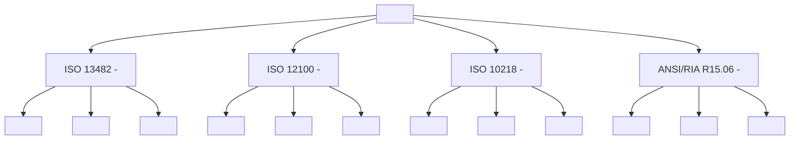
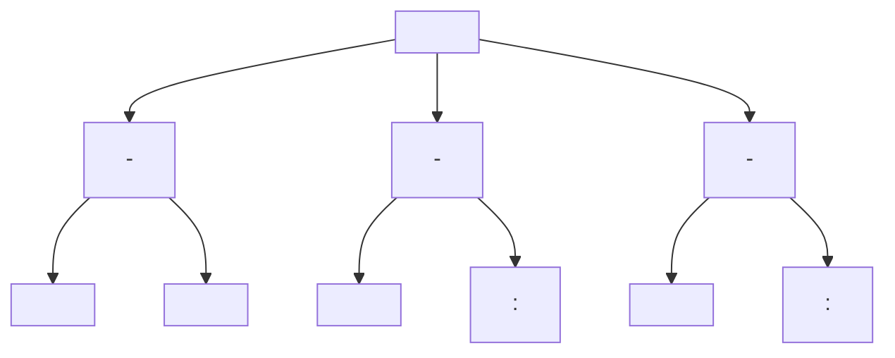

# Chapter 11: Safety & Ethics in Robotics

## Introduction

Welcome to Chapter 11 of the Physical AI & Humanoid Robotics textbook. This chapter addresses one of the most critical aspects of robotics development: safety and ethics. As humanoid robots become more sophisticated and integrated into human environments, ensuring their safe operation and ethical behavior becomes paramount.

This chapter explores the multifaceted challenges of developing safe and ethical robotic systems. We'll examine safety protocols, ethical frameworks, risk assessment methodologies, and responsible development practices that ensure humanoid robots can operate safely alongside humans while respecting ethical principles and societal values.

The importance of safety and ethics in robotics cannot be overstated. As these systems become more autonomous and capable, the potential consequences of failures or unethical behavior increase exponentially. This chapter provides a comprehensive framework for addressing these challenges in the development of humanoid robots.

## Safety Protocols and Standards

Safety in robotics encompasses both physical safety (preventing harm to humans and the environment) and operational safety (ensuring reliable and predictable robot behavior). The development of comprehensive safety protocols is essential for the deployment of humanoid robots in real-world environments.

### International Safety Standards

The robotics industry has established several key safety standards that guide the design and operation of robotic systems:

1. **ISO 13482**: Safety requirements for personal care robots
2. **ISO 12100**: Safety of machinery principles for risk assessment
3. **ISO 10218**: Safety requirements for industrial robots
4. **ANSI/RIA R15.06**: American National Standard for industrial robots and robot systems


### Risk Assessment Frameworks

Effective safety protocols begin with comprehensive risk assessment. This involves identifying potential hazards, evaluating their likelihood and severity, and implementing appropriate mitigation strategies.

```python
# Example: Risk Assessment Framework for Robotic Systems
import numpy as np
from enum import Enum

class RiskLevel(Enum):
    LOW = 1
    MEDIUM = 2
    HIGH = 3
    CRITICAL = 4

class RiskAssessment:
    def __init__(self):
        self.hazards = []
        self.risk_matrix = np.zeros((4, 4))  # Severity x Probability

    def add_hazard(self, hazard_id, description, severity, probability):
        """
        Add a hazard to the risk assessment
        severity: 1-5 scale (5 = most severe)
        probability: 1-5 scale (5 = most likely)
        """
        risk_score = severity * probability

        if risk_score <= 4:
            risk_level = RiskLevel.LOW
        elif risk_score <= 8:
            risk_level = RiskLevel.MEDIUM
        elif risk_score <= 15:
            risk_level = RiskLevel.HIGH
        else:
            risk_level = RiskLevel.CRITICAL

        hazard = {
            'id': hazard_id,
            'description': description,
            'severity': severity,
            'probability': probability,
            'risk_score': risk_score,
            'risk_level': risk_level,
            'mitigation_strategies': []
        }

        self.hazards.append(hazard)
        return hazard

    def evaluate_risk_matrix(self):
        """
        Evaluate the risk matrix and identify critical areas
        """
        for hazard in self.hazards:
            severity_idx = hazard['severity'] - 1
            prob_idx = hazard['probability'] - 1
            self.risk_matrix[severity_idx][prob_idx] += 1

    def get_mitigation_recommendations(self):
        """
        Generate mitigation recommendations based on risk levels
        """
        recommendations = {
            RiskLevel.LOW: ["Monitor regularly", "Basic documentation"],
            RiskLevel.MEDIUM: ["Implement safety measures", "Regular testing", "User training"],
            RiskLevel.HIGH: ["Redesign if possible", "Multiple safety layers", "Frequent monitoring"],
            RiskLevel.CRITICAL: ["Do not proceed", "Fundamental redesign required", "Expert consultation"]
        }

        return recommendations

# Example usage
def assess_robot_safety():
    assessment = RiskAssessment()

    # Add common robotic hazards
    assessment.add_hazard(
        "H001",
        "Physical collision with humans",
        severity=5,
        probability=3
    )

    assessment.add_hazard(
        "H002",
        "System failure during critical operation",
        severity=4,
        probability=2
    )

    assessment.add_hazard(
        "H003",
        "Data privacy breach",
        severity=3,
        probability=2
    )

    assessment.evaluate_risk_matrix()
    return assessment
```

### Safety Architecture Design

A robust safety architecture incorporates multiple layers of protection to ensure safe robot operation even in the presence of failures or unexpected conditions.

```python
# Example: Safety Architecture for Humanoid Robot
import threading
import time
from dataclasses import dataclass
from typing import List, Optional

@dataclass
class SafetyConstraint:
    name: str
    min_value: float
    max_value: float
    current_value: float
    enabled: bool = True

class SafetyMonitor:
    def __init__(self):
        self.constraints = []
        self.emergency_stop = False
        self.monitoring_thread = None
        self.is_monitoring = False

    def add_constraint(self, name: str, min_val: float, max_val: float):
        """Add a safety constraint to monitor"""
        constraint = SafetyConstraint(name, min_val, max_val, 0.0)
        self.constraints.append(constraint)

    def update_constraint(self, name: str, value: float):
        """Update constraint value"""
        for constraint in self.constraints:
            if constraint.name == name:
                constraint.current_value = value
                break

    def check_constraints(self) -> List[str]:
        """Check all constraints and return violations"""
        violations = []
        for constraint in self.constraints:
            if constraint.enabled:
                if constraint.current_value < constraint.min_value or \
                   constraint.current_value > constraint.max_value:
                    violations.append(constraint.name)
        return violations

    def start_monitoring(self):
        """Start continuous safety monitoring"""
        self.is_monitoring = True
        self.monitoring_thread = threading.Thread(target=self._monitor_loop)
        self.monitoring_thread.start()

    def stop_monitoring(self):
        """Stop safety monitoring"""
        self.is_monitoring = False
        if self.monitoring_thread:
            self.monitoring_thread.join()

    def _monitor_loop(self):
        """Internal monitoring loop"""
        while self.is_monitoring:
            violations = self.check_constraints()
            if violations:
                print(f"Safety violations detected: {violations}")
                self.trigger_emergency_stop()

            time.sleep(0.01)  # 100 Hz monitoring

    def trigger_emergency_stop(self):
        """Trigger emergency stop and log incident"""
        self.emergency_stop = True
        print("EMERGENCY STOP ACTIVATED!")
        # In real implementation, would send stop commands to robot

class SafetyController:
    def __init__(self):
        self.safety_monitor = SafetyMonitor()
        self.initialize_constraints()

    def initialize_constraints(self):
        """Initialize all safety constraints"""
        # Joint position limits
        for i in range(12):  # Assuming 12 joints
            self.safety_monitor.add_constraint(
                f"joint_{i}_position",
                min_val=-2.5,
                max_val=2.5
            )

        # Joint velocity limits
        for i in range(12):
            self.safety_monitor.add_constraint(
                f"joint_{i}_velocity",
                min_val=-5.0,
                max_val=5.0
            )

        # Joint torque limits
        for i in range(12):
            self.safety_monitor.add_constraint(
                f"joint_{i}_torque",
                min_val=-100.0,
                max_val=100.0
            )

        # End-effector position limits (workspace)
        self.safety_monitor.add_constraint("ee_x_position", -1.0, 1.0)
        self.safety_monitor.add_constraint("ee_y_position", -1.0, 1.0)
        self.safety_monitor.add_constraint("ee_z_position", 0.1, 2.0)

    def check_safety(self, joint_positions, joint_velocities, joint_torques, ee_position):
        """Check safety constraints for given robot state"""
        # Update constraint values
        for i, pos in enumerate(joint_positions):
            self.safety_monitor.update_constraint(f"joint_{i}_position", pos)

        for i, vel in enumerate(joint_velocities):
            self.safety_monitor.update_constraint(f"joint_{i}_velocity", vel)

        for i, torque in enumerate(joint_torques):
            self.safety_monitor.update_constraint(f"joint_{i}_torque", torque)

        self.safety_monitor.update_constraint("ee_x_position", ee_position[0])
        self.safety_monitor.update_constraint("ee_y_position", ee_position[1])
        self.safety_monitor.update_constraint("ee_z_position", ee_position[2])

        # Check for violations
        violations = self.safety_monitor.check_constraints()
        return len(violations) == 0, violations

# Example usage
def main():
    safety_controller = SafetyController()
    safety_controller.safety_monitor.start_monitoring()

    # Simulate robot state checking
    joint_positions = [0.1, 0.2, 0.3, 0.4, 0.5, 0.6, 0.7, 0.8, 0.9, 1.0, 1.1, 1.2]
    joint_velocities = [0.01, 0.02, 0.03, 0.04, 0.05, 0.06, 0.07, 0.08, 0.09, 0.10, 0.11, 0.12]
    joint_torques = [5.0, 6.0, 7.0, 8.0, 9.0, 10.0, 11.0, 12.0, 13.0, 14.0, 15.0, 16.0]
    ee_position = [0.5, 0.3, 0.8]

    is_safe, violations = safety_controller.check_safety(
        joint_positions, joint_velocities, joint_torques, ee_position
    )

    if is_safe:
        print("Robot state is safe")
    else:
        print(f"Robot state unsafe - violations: {violations}")

    # Cleanup
    safety_controller.safety_monitor.stop_monitoring()

if __name__ == "__main__":
    main()
```

## Ethical Frameworks in Robotics

Ethics in robotics addresses the moral principles and values that should guide the design, development, and deployment of robotic systems. As robots become more autonomous and integrated into society, ethical considerations become increasingly important.

### Asimov's Laws of Robotics

Isaac Asimov's three laws of robotics, while fictional, provide a foundational framework for thinking about robot ethics:

1. A robot may not injure a human being or, through inaction, allow a human being to come to harm
2. A robot must obey the orders given to it by human beings, except where such orders would conflict with the First Law
3. A robot must protect its own existence as long as such protection does not conflict with the First or Second Laws


### Modern Ethical Frameworks

Contemporary approaches to robot ethics have evolved beyond Asimov's laws to address the complexities of modern AI and robotics:

```python
# Example: Ethical Decision Framework for Robots
from enum import Enum
from dataclasses import dataclass
from typing import List, Dict, Any
import json

class EthicalPrinciple(Enum):
    BENEFICENCE = "beneficence"  # Do good
    NON_MALEFICENCE = "non_maleficence"  # Do no harm
    AUTONOMY = "autonomy"  # Respect autonomy
    JUSTICE = "justice"  # Fairness and equality
    VERACITY = "veracity"  # Truthfulness
    FIDELITY = "fidelity"  # Loyalty and promise-keeping

@dataclass
class EthicalDecision:
    action: str
    principle: EthicalPrinciple
    weight: float  # 0.0 to 1.0
    justification: str

class EthicalFramework:
    def __init__(self):
        self.principles = {
            EthicalPrinciple.BENEFICENCE: 1.0,
            EthicalPrinciple.NON_MALEFICENCE: 1.0,
            EthicalPrinciple.AUTONOMY: 0.8,
            EthicalPrinciple.JUSTICE: 0.9,
            EthicalPrinciple.VERACITY: 0.7,
            EthicalPrinciple.FIDELITY: 0.6
        }

        self.decision_log = []

    def evaluate_action(self, action: str, context: Dict[str, Any]) -> List[EthicalDecision]:
        """
        Evaluate an action against ethical principles
        """
        decisions = []

        # Check for harm prevention (non-maleficence)
        harm_risk = self._assess_harm_risk(action, context)
        if harm_risk > 0.5:
            decisions.append(EthicalDecision(
                action=action,
                principle=EthicalPrinciple.NON_MALEFICENCE,
                weight=1.0 - harm_risk,
                justification=f"Action has {harm_risk:.2f} risk of harm"
            ))

        # Check for benefit (beneficence)
        benefit = self._assess_benefit(action, context)
        if benefit > 0.3:
            decisions.append(EthicalDecision(
                action=action,
                principle=EthicalPrinciple.BENEFICENCE,
                weight=benefit,
                justification=f"Action provides {benefit:.2f} benefit"
            ))

        # Check for autonomy respect
        autonomy_impact = self._assess_autonomy_impact(action, context)
        if abs(autonomy_impact) > 0.2:
            weight = abs(autonomy_impact)
            principle = EthicalPrinciple.AUTONOMY if autonomy_impact > 0 else None
            if principle:
                decisions.append(EthicalDecision(
                    action=action,
                    principle=principle,
                    weight=weight,
                    justification=f"Action affects human autonomy by {autonomy_impact:.2f}"
                ))

        # Check for fairness
        fairness_impact = self._assess_fairness(action, context)
        if abs(fairness_impact) > 0.3:
            weight = abs(fairness_impact)
            principle = EthicalPrinciple.JUSTICE if fairness_impact > 0 else None
            if principle:
                decisions.append(EthicalDecision(
                    action=action,
                    principle=principle,
                    weight=weight,
                    justification=f"Action affects fairness by {fairness_impact:.2f}"
                ))

        self.decision_log.append({
            'action': action,
            'context': context,
            'decisions': [d.__dict__ for d in decisions],
            'timestamp': time.time()
        })

        return decisions

    def _assess_harm_risk(self, action: str, context: Dict[str, Any]) -> float:
        """Assess the risk of harm from an action"""
        # Simplified assessment based on action type
        harm_keywords = ['push', 'hit', 'force', 'aggressive', 'dangerous']
        risk = sum(1 for keyword in harm_keywords if keyword.lower() in action.lower())
        return min(risk / 3.0, 1.0)  # Normalize to 0-1 range

    def _assess_benefit(self, action: str, context: Dict[str, Any]) -> float:
        """Assess the benefit of an action"""
        benefit_keywords = ['help', 'assist', 'support', 'aid', 'assist']
        benefit = sum(1 for keyword in benefit_keywords if keyword.lower() in action.lower())
        return min(benefit / 2.0, 1.0)  # Normalize to 0-1 range

    def _assess_autonomy_impact(self, action: str, context: Dict[str, Any]) -> float:
        """Assess impact on human autonomy"""
        # Positive if supporting autonomy, negative if restricting it
        if 'ask_permission' in action.lower() or 'request_consent' in action.lower():
            return 0.8
        elif 'override_human' in action.lower() or 'disregard_human' in action.lower():
            return -0.9
        return 0.0

    def _assess_fairness(self, action: str, context: Dict[str, Any]) -> float:
        """Assess fairness impact"""
        # Simplified fairness assessment
        if 'equal_treatment' in context.get('goal', '').lower():
            return 0.7 if 'equal' in action.lower() else -0.5
        return 0.0

    def make_ethical_decision(self, action: str, context: Dict[str, Any]) -> bool:
        """
        Make an ethical decision about whether to proceed with an action
        """
        decisions = self.evaluate_action(action, context)

        if not decisions:
            return True  # No ethical concerns, proceed

        # Calculate overall ethical score
        total_score = 0
        total_weight = 0

        for decision in decisions:
            weight = self.principles[decision.principle]
            score = decision.weight if decision.principle in [
                EthicalPrinciple.BENEFICENCE, EthicalPrinciple.AUTONOMY,
                EthicalPrinciple.JUSTICE, EthicalPrinciple.VERACITY,
                EthicalPrinciple.FIDELITY
            ] else (1 - decision.weight)  # For non-maleficence, lower risk is better

            total_score += score * weight
            total_weight += weight

        if total_weight > 0:
            avg_score = total_score / total_weight
            return avg_score > 0.5  # Proceed if ethical score > 0.5
        else:
            return True

# Example usage
def ethical_decision_example():
    framework = EthicalFramework()

    # Test various actions
    actions = [
        "assist_human_with_task",
        "push_human_out_of_way",
        "ask_permission_before_helping",
        "ignore_human_request_for_help"
    ]

    context = {
        "environment": "home",
        "humans_present": 1,
        "goal": "assist_with_daily_activities"
    }

    for action in actions:
        should_proceed = framework.make_ethical_decision(action, context)
        print(f"Action: {action} - Proceed: {should_proceed}")

    return framework
```

## Privacy and Data Protection

As humanoid robots collect and process vast amounts of personal data, privacy and data protection become critical ethical considerations. These systems often capture sensitive information including biometric data, behavioral patterns, and personal preferences.

### Data Minimization and Consent

```python
# Example: Privacy Protection Framework for Robotic Systems
import hashlib
import secrets
from datetime import datetime, timedelta
from typing import Dict, List, Optional
import json

class DataProtectionFramework:
    def __init__(self):
        self.collected_data = {}
        self.consent_records = {}
        self.retention_policies = {}
        self.encryption_keys = {}

    def request_consent(self, user_id: str, data_types: List[str], purpose: str, duration_hours: int) -> str:
        """
        Request user consent for data collection
        Returns consent token
        """
        consent_token = secrets.token_urlsafe(32)

        consent_record = {
            'user_id': user_id,
            'data_types': data_types,
            'purpose': purpose,
            'requested_at': datetime.now().isoformat(),
            'expires_at': (datetime.now() + timedelta(hours=duration_hours)).isoformat(),
            'granted': False
        }

        self.consent_records[consent_token] = consent_record
        return consent_token

    def grant_consent(self, consent_token: str) -> bool:
        """
        Grant consent for data collection
        """
        if consent_token in self.consent_records:
            self.consent_records[consent_token]['granted'] = True
            self.consent_records[consent_token]['granted_at'] = datetime.now().isoformat()
            return True
        return False

    def collect_data(self, consent_token: str, data_type: str, data: any) -> bool:
        """
        Collect data if consent is granted and valid
        """
        if consent_token not in self.consent_records:
            return False

        consent = self.consent_records[consent_token]

        # Check if consent is granted and not expired
        if not consent['granted']:
            return False

        if datetime.fromisoformat(consent['expires_at']) < datetime.now():
            return False

        # Check if requested data type matches consent
        if data_type not in consent['data_types']:
            return False

        # Encrypt and store data
        encrypted_data = self._encrypt_data(data, consent['user_id'])

        if consent['user_id'] not in self.collected_data:
            self.collected_data[consent['user_id']] = {}

        if data_type not in self.collected_data[consent['user_id']]:
            self.collected_data[consent['user_id']][data_type] = []

        self.collected_data[consent['user_id']][data_type].append({
            'timestamp': datetime.now().isoformat(),
            'data': encrypted_data,
            'consent_token': consent_token
        })

        return True

    def _encrypt_data(self, data: any, user_id: str) -> str:
        """
        Encrypt data using user-specific key
        """
        if user_id not in self.encryption_keys:
            self.encryption_keys[user_id] = secrets.token_bytes(32)

        key = self.encryption_keys[user_id]
        # In real implementation, use proper encryption (e.g., Fernet)
        # This is a simplified example
        data_str = json.dumps(data, default=str)
        encrypted = hashlib.sha256((data_str + key.hex()).encode()).hexdigest()
        return encrypted

    def anonymize_data(self, user_id: str, data_type: str) -> List[any]:
        """
        Anonymize collected data by removing identifying information
        """
        if user_id not in self.collected_data:
            return []

        if data_type not in self.collected_data[user_id]:
            return []

        # In real implementation, apply proper anonymization techniques
        # This is a simplified example
        anonymized_data = []
        for record in self.collected_data[user_id][data_type]:
            # Remove or hash identifying information
            anonymized_data.append({
                'timestamp': record['timestamp'],
                'data_hash': hashlib.sha256(record['data'].encode()).hexdigest()[:16]
            })

        return anonymized_data

    def set_retention_policy(self, data_type: str, days: int):
        """
        Set data retention policy for specific data type
        """
        self.retention_policies[data_type] = days

    def cleanup_expired_data(self):
        """
        Remove data that has exceeded retention period
        """
        current_time = datetime.now()

        for user_id, user_data in self.collected_data.items():
            for data_type, records in user_data.items():
                if data_type in self.retention_policies:
                    retention_days = self.retention_policies[data_type]
                    cutoff_date = current_time - timedelta(days=retention_days)

                    # Filter out expired records
                    filtered_records = [
                        record for record in records
                        if datetime.fromisoformat(record['timestamp']) >= cutoff_date
                    ]

                    self.collected_data[user_id][data_type] = filtered_records

# Example usage
def privacy_example():
    privacy_framework = DataProtectionFramework()

    # Set retention policies
    privacy_framework.set_retention_policy('face_recognition', 30)
    privacy_framework.set_retention_policy('voice_data', 7)
    privacy_framework.set_retention_policy('behavioral_data', 90)

    # Request consent for face recognition
    consent_token = privacy_framework.request_consent(
        user_id='user_123',
        data_types=['face_recognition', 'behavioral_data'],
        purpose='personalized interaction',
        duration_hours=24
    )

    print(f"Consent requested. Token: {consent_token[:8]}...")

    # User grants consent
    privacy_framework.grant_consent(consent_token)

    # Collect face data
    face_data = {
        'landmarks': [[x, y] for x in range(10) for y in range(10)],
        'confidence': 0.95
    }

    success = privacy_framework.collect_data(consent_token, 'face_recognition', face_data)
    print(f"Face data collection successful: {success}")

    # Anonymize data for analysis
    anonymized = privacy_framework.anonymize_data('user_123', 'face_recognition')
    print(f"Anonymized records: {len(anonymized)}")

    return privacy_framework
```

## Human-Robot Interaction Safety

Safe human-robot interaction requires careful consideration of physical, psychological, and social factors. As humanoid robots become more common in human environments, ensuring safe and appropriate interaction becomes critical.

### Physical Safety in HRI

```python
# Example: Human-Robot Interaction Safety Manager
import math
import numpy as np
from typing import Tuple, List, Optional

class HRI_SafetyManager:
    def __init__(self):
        self.human_proximity_threshold = 0.5  # meters
        self.collision_prediction_horizon = 1.0  # seconds
        self.safety_zones = []
        self.human_tracking = {}

    def calculate_collision_risk(self, robot_pos: Tuple[float, float, float],
                                robot_vel: Tuple[float, float, float],
                                human_pos: Tuple[float, float, float],
                                human_vel: Tuple[float, float, float]) -> float:
        """
        Calculate collision risk between robot and human
        Returns risk value between 0 and 1
        """
        # Calculate relative position and velocity
        rel_pos = np.array(robot_pos) - np.array(human_pos)
        rel_vel = np.array(robot_vel) - np.array(human_vel)

        # Distance between robot and human
        distance = np.linalg.norm(rel_pos)

        # Predict future positions
        future_robot_pos = np.array(robot_pos) + np.array(robot_vel) * self.collision_prediction_horizon
        future_human_pos = np.array(human_pos) + np.array(human_vel) * self.collision_prediction_horizon

        future_distance = np.linalg.norm(future_robot_pos - future_human_pos)

        # Calculate risk based on current and predicted distances
        current_risk = max(0, 1 - distance / self.human_proximity_threshold)
        future_risk = max(0, 1 - future_distance / self.human_proximity_threshold)

        # Weight future risk more heavily as it represents predicted collision
        risk = 0.3 * current_risk + 0.7 * future_risk

        return min(risk, 1.0)

    def enforce_safety_zone(self, robot_pos: Tuple[float, float, float],
                           human_pos: Tuple[float, float, float]) -> Tuple[float, float, float]:
        """
        Calculate safe movement vector to maintain minimum distance from human
        """
        rel_vector = np.array(robot_pos) - np.array(human_pos)
        distance = np.linalg.norm(rel_vector)

        if distance < self.human_proximity_threshold:
            # Calculate repulsive force
            if distance < 0.1:  # Very close, strong repulsion
                force_magnitude = 2.0
            else:
                # Inverse relationship: closer = stronger repulsion
                force_magnitude = 0.5 / distance

            # Normalize direction away from human
            if distance > 0:
                repulsion_vector = (rel_vector / distance) * force_magnitude
            else:
                # If exactly at human position, move in random direction
                repulsion_vector = np.array([np.random.uniform(-1, 1) for _ in range(3)])
                repulsion_vector = repulsion_vector / np.linalg.norm(repulsion_vector) * force_magnitude

            return tuple(repulsion_vector)
        else:
            # No safety intervention needed
            return (0.0, 0.0, 0.0)

    def assess_interaction_safety(self, robot_state: Dict, human_states: List[Dict]) -> Dict:
        """
        Assess overall safety of human-robot interaction
        """
        safety_assessment = {
            'collision_risk': 0.0,
            'safety_zone_violations': 0,
            'recommended_actions': [],
            'overall_safety_score': 1.0
        }

        for human_state in human_states:
            # Calculate collision risk
            risk = self.calculate_collision_risk(
                robot_state['position'],
                robot_state['velocity'],
                human_state['position'],
                human_state['velocity']
            )

            safety_assessment['collision_risk'] = max(safety_assessment['collision_risk'], risk)

            # Check safety zone violation
            robot_pos = np.array(robot_state['position'])
            human_pos = np.array(human_state['position'])
            distance = np.linalg.norm(robot_pos - human_pos)

            if distance < self.human_proximity_threshold:
                safety_assessment['safety_zone_violations'] += 1
                safety_assessment['recommended_actions'].append(
                    f"Maintain distance from human at {human_state['position']}"
                )

        # Calculate overall safety score (inverse of risk)
        safety_assessment['overall_safety_score'] = 1.0 - safety_assessment['collision_risk']

        return safety_assessment

# Example usage
def hri_safety_example():
    safety_manager = HRI_SafetyManager()

    # Robot state
    robot_state = {
        'position': (1.0, 0.5, 0.8),
        'velocity': (0.1, 0.0, 0.0)
    }

    # Human states (multiple humans in environment)
    human_states = [
        {
            'position': (0.8, 0.5, 0.8),
            'velocity': (0.0, 0.0, 0.0)
        },
        {
            'position': (2.0, 1.0, 0.8),
            'velocity': (0.05, 0.0, 0.0)
        }
    ]

    # Assess interaction safety
    assessment = safety_manager.assess_interaction_safety(robot_state, human_states)

    print(f"Collision Risk: {assessment['collision_risk']:.2f}")
    print(f"Safety Zone Violations: {assessment['safety_zone_violations']}")
    print(f"Overall Safety Score: {assessment['overall_safety_score']:.2f}")
    print(f"Recommended Actions: {assessment['recommended_actions']}")

    # Calculate safety zone enforcement
    repulsion_force = safety_manager.enforce_safety_zone(
        robot_state['position'],
        human_states[0]['position']  # Check against closest human
    )

    print(f"Repulsion Force Vector: {repulsion_force}")

    return safety_manager
```

## Ethical AI Development Practices

Developing ethical AI systems requires adherence to principles that ensure fairness, transparency, accountability, and respect for human rights. These principles must be embedded throughout the development lifecycle.

### Fairness and Bias Mitigation

```python
# Example: Fairness and Bias Detection in Robotic AI Systems
import numpy as np
import pandas as pd
from typing import Dict, List, Any
from sklearn.metrics import accuracy_score, precision_score, recall_score

class FairnessChecker:
    def __init__(self):
        self.protected_attributes = []
        self.bias_metrics = {}
        self.fairness_threshold = 0.1  # Maximum acceptable bias difference

    def add_protected_attribute(self, attribute: str):
        """Add a protected attribute for bias checking"""
        if attribute not in self.protected_attributes:
            self.protected_attributes.append(attribute)

    def calculate_disparate_impact(self, predictions: List[int],
                                  actual: List[int],
                                  protected_group: List[bool],
                                  favorable_outcome: int = 1) -> float:
        """
        Calculate disparate impact ratio
        Returns ratio of favorable outcomes between protected and unprotected groups
        """
        protected_favorable = sum(1 for i, pred in enumerate(predictions)
                                 if protected_group[i] and pred == favorable_outcome)
        protected_total = sum(1 for p in protected_group if p)

        unprotected_favorable = sum(1 for i, pred in enumerate(predictions)
                                   if not protected_group[i] and pred == favorable_outcome)
        unprotected_total = sum(1 for p in protected_group if not p)

        if unprotected_total == 0 or protected_total == 0:
            return 1.0  # Cannot calculate if one group has no members

        protected_rate = protected_favorable / protected_total
        unprotected_rate = unprotected_favorable / unprotected_total

        if unprotected_rate == 0:
            return float('inf') if protected_rate > 0 else 1.0

        return protected_rate / unprotected_rate

    def detect_bias_in_robot_behavior(self, robot_decisions: List[Dict]) -> Dict:
        """
        Detect potential bias in robot decision-making
        """
        bias_report = {}

        for attr in self.protected_attributes:
            # Group decisions by protected attribute
            groups = {}
            for decision in robot_decisions:
                attr_value = decision.get(attr, 'unknown')
                if attr_value not in groups:
                    groups[attr_value] = []
                groups[attr_value].append(decision)

            # Calculate performance metrics for each group
            group_metrics = {}
            for group_value, group_decisions in groups.items():
                if len(group_decisions) == 0:
                    continue

                predictions = [d.get('prediction', 0) for d in group_decisions]
                actual = [d.get('actual', 0) for d in group_decisions]

                if len(set(actual)) > 1:  # Need both positive and negative cases
                    group_metrics[group_value] = {
                        'accuracy': accuracy_score(actual, predictions),
                        'precision': precision_score(actual, predictions, zero_division=0),
                        'recall': recall_score(actual, predictions, zero_division=0),
                        'count': len(group_decisions)
                    }

            # Check for bias between groups
            if len(group_metrics) > 1:
                metric_values = {metric: [g[metric] for g in group_metrics.values()]
                               for metric in ['accuracy', 'precision', 'recall']}

                bias_detected = False
                for metric, values in metric_values.items():
                    if len(values) > 1:
                        max_diff = max(values) - min(values)
                        if max_diff > self.fairness_threshold:
                            bias_detected = True

                bias_report[attr] = {
                    'metrics': group_metrics,
                    'bias_detected': bias_detected,
                    'max_difference': max([max(v) - min(v) for v in metric_values.values()]) if metric_values else 0
                }

        return bias_report

    def recommend_bias_mitigation(self, bias_report: Dict) -> List[str]:
        """
        Recommend bias mitigation strategies
        """
        recommendations = []

        for attr, report in bias_report.items():
            if report['bias_detected']:
                recommendations.append(
                    f"Significant bias detected in {attr} attribute. "
                    f"Max difference: {report['max_difference']:.3f}. "
                    f"Consider: {self._get_mitigation_strategies(attr)}"
                )

        return recommendations

    def _get_mitigation_strategies(self, attribute: str) -> str:
        """
        Get appropriate mitigation strategies for specific attribute
        """
        strategies = {
            'gender': "Data balancing, adversarial debiasing, fairness constraints",
            'age': "Stratified sampling, age-aware training, regular bias audits",
            'race': "Diverse training data, bias detection tools, inclusive design",
            'disability': "Accessibility features, universal design, bias testing"
        }
        return strategies.get(attribute, "Data auditing, bias detection, fairness constraints")

# Example usage
def fairness_example():
    fairness_checker = FairnessChecker()
    fairness_checker.add_protected_attribute('gender')
    fairness_checker.add_protected_attribute('age_group')

    # Simulated robot decisions
    robot_decisions = [
        {'gender': 'male', 'age_group': 'adult', 'prediction': 1, 'actual': 1},
        {'gender': 'female', 'age_group': 'adult', 'prediction': 0, 'actual': 1},
        {'gender': 'male', 'age_group': 'elderly', 'prediction': 1, 'actual': 1},
        {'gender': 'female', 'age_group': 'adult', 'prediction': 1, 'actual': 0},
        {'gender': 'male', 'age_group': 'adult', 'prediction': 1, 'actual': 1},
        {'gender': 'female', 'age_group': 'elderly', 'prediction': 0, 'actual': 0},
    ]

    # Detect bias
    bias_report = fairness_checker.detect_bias_in_robot_behavior(robot_decisions)

    print("Bias Report:")
    for attr, report in bias_report.items():
        print(f"  {attr}: Bias detected = {report['bias_detected']}")
        print(f"  Max difference: {report['max_difference']:.3f}")

    # Get recommendations
    recommendations = fairness_checker.recommend_bias_mitigation(bias_report)
    print("\nRecommendations:")
    for rec in recommendations:
        print(f"  - {rec}")

    return fairness_checker
```

## Hardware-Specific Safety Implementations

Different hardware platforms require tailored safety approaches based on their capabilities and limitations:

### GPU-Accelerated Safety Systems

For robots with powerful GPUs, we can implement more sophisticated safety algorithms:

```jsx
// Example: GPU-Accelerated Safety System Component (React/Preact)
import React, { useState, useEffect, useRef } from 'react';

const GPUSafetySystem = ({ robotSpecs }) => {
  const [safetyStatus, setSafetyStatus] = useState('normal');
  const [detectedHazards, setDetectedHazards] = useState([]);
  const [performanceMetrics, setPerformanceMetrics] = useState({
    detectionRate: 0,
    latency: 0,
    gpuUsage: 0
  });

  const canvasRef = useRef(null);
  const animationRef = useRef(null);

  useEffect(() => {
    if (robotSpecs.gpuModel) {
      initializeGPUSafetySystem();
    }

    return () => {
      if (animationRef.current) {
        cancelAnimationFrame(animationRef.current);
      }
    };
  }, [robotSpecs]);

  const initializeGPUSafetySystem = () => {
    // Initialize GPU-accelerated safety algorithms
    const gpuCapabilities = analyzeGPUCapabilities(robotSpecs.gpuModel);

    if (gpuCapabilities.tensorCoreSupport) {
      // Enable advanced safety features
      enableAdvancedSafetyFeatures();
    }
  };

  const analyzeGPUCapabilities = (gpuModel) => {
    // Determine GPU capabilities for safety system
    const capabilities = {
      tensorCoreSupport: gpuModel.includes('RTX') || gpuModel.includes('Tesla'),
      computeCapability: extractComputeCapability(gpuModel),
      memorySize: robotSpecs.gpuMemory || 8192,
      safetyFeaturesEnabled: true
    };

    return capabilities;
  };

  const extractComputeCapability = (gpuModel) => {
    // Simplified compute capability extraction
    if (gpuModel.includes('RTX 40')) return 8.9;
    if (gpuModel.includes('RTX 30')) return 8.6;
    if (gpuModel.includes('RTX 20')) return 7.5;
    return 6.0;
  };

  const enableAdvancedSafetyFeatures = () => {
    // Enable GPU-accelerated computer vision for hazard detection
    setInterval(() => {
      const hazards = detectHazardsWithGPU();
      setDetectedHazards(hazards);

      // Update safety status based on detected hazards
      const status = hazards.length > 0 ? 'warning' : 'normal';
      setSafetyStatus(status);

      // Update performance metrics
      setPerformanceMetrics(prev => ({
        ...prev,
        detectionRate: Math.random() * 60 + 30, // 30-90 FPS
        latency: Math.random() * 10 + 5, // 5-15ms
        gpuUsage: Math.random() * 70 + 20 // 20-90%
      }));
    }, 100); // 10Hz update rate
  };

  const detectHazardsWithGPU = () => {
    // Simulate GPU-accelerated hazard detection
    const possibleHazards = [
      'human_proximity',
      'obstacle_detected',
      'unstable_surface',
      'restricted_area'
    ];

    // Return random hazards based on probability
    return possibleHazards.filter(() => Math.random() > 0.7);
  };

  const getSafetyStatusColor = () => {
    switch(safetyStatus) {
      case 'normal': return '#4ade80'; // green-400
      case 'warning': return '#fbbf24'; // amber-400
      case 'critical': return '#ef4444'; // red-400
      default: return '#6b7280'; // gray-400
    }
  };

  return (
    <div className="gpu-safety-container">
      <h3>GPU-Accelerated Safety System</h3>

      <div className="safety-status" style={{ backgroundColor: getSafetyStatusColor() }}>
        Status: {safetyStatus.toUpperCase()}
      </div>

      {detectedHazards.length > 0 && (
        <div className="hazards-detected">
          <h4>Hazards Detected:</h4>
          <ul>
            {detectedHazards.map((hazard, index) => (
              <li key={index} className="hazard-item">
                {hazard.replace('_', ' ').replace(/\b\w/g, l => l.toUpperCase())}
              </li>
            ))}
          </ul>
        </div>
      )}

      <div className="performance-metrics">
        <p>Detection Rate: {performanceMetrics.detectionRate.toFixed(1)} FPS</p>
        <p>Latency: {performanceMetrics.latency.toFixed(1)} ms</p>
        <p>GPU Usage: {performanceMetrics.gpuUsage.toFixed(1)}%</p>
      </div>

      <canvas
        ref={canvasRef}
        className="safety-visualization"
        width={400}
        height={300}
      />
    </div>
  );
};

export default GPUSafetySystem;
```

### Jetson-Based Safety Systems

For NVIDIA Jetson platforms, we implement optimized safety algorithms:

```python
# Example: Jetson-Specific Safety System
import jetson.inference
import jetson.utils
import numpy as np
import time
import threading

class JetsonSafetySystem:
    def __init__(self, jetson_model="jetson_nano"):
        self.jetson_model = jetson_model
        self.is_jetson = self.detect_jetson_platform()
        self.safety_enabled = True
        self.hazard_detection_thread = None
        self.emergency_stop = False

        if self.is_jetson:
            self.configure_jetson_safety()

    def detect_jetson_platform(self):
        """Detect if running on NVIDIA Jetson"""
        try:
            with open('/proc/device-tree/model', 'r') as f:
                model = f.read().strip('\x00')
                return 'jetson' in model.lower()
        except:
            return False

    def configure_jetson_safety(self):
        """Configure safety system for Jetson platform"""
        # Enable Jetson-specific optimizations
        self.use_tensorrt = True
        self.power_mode = "MAXN"  # Maximum performance mode

        # Set up hazard detection model optimized for Jetson
        self.setup_hazard_detection_model()

    def setup_hazard_detection_model(self):
        """Set up optimized hazard detection model for Jetson"""
        # In a real implementation, this would load a TensorRT-optimized model
        # For simulation, we'll use a placeholder
        self.hazard_detection_model = self.load_optimized_model()

    def load_optimized_model(self):
        """Load safety model optimized for Jetson"""
        # Placeholder for actual model loading
        # In practice, this would load a TensorRT engine
        return {
            'model_type': 'tensorrt',
            'input_size': (224, 224, 3),
            'classes': ['human', 'obstacle', 'hazard', 'safe']
        }

    def detect_hazards_jetson(self, image_data):
        """Perform hazard detection optimized for Jetson"""
        if not self.is_jetson or not self.safety_enabled:
            return {'hazards': [], 'confidence': 0.0}

        # Process image through optimized model
        # In real implementation, this would use jetson.inference
        hazards = self.simulate_jetson_hazard_detection(image_data)

        return hazards

    def simulate_jetson_hazard_detection(self, image_data):
        """Simulate hazard detection (in real implementation, use actual Jetson inference)"""
        # Simulate detection with Jetson-specific characteristics
        detection_time = np.random.uniform(0.02, 0.05)  # 20-50ms typical for Jetson
        time.sleep(detection_time)  # Simulate processing time

        # Return simulated detection results
        possible_hazards = ['human_proximity', 'obstacle', 'slippery_surface']
        detected = [h for h in possible_hazards if np.random.random() > 0.8]

        return {
            'hazards': detected,
            'confidence': np.random.uniform(0.7, 0.95),
            'processing_time': detection_time
        }

    def start_hazard_monitoring(self):
        """Start continuous hazard monitoring on Jetson"""
        if not self.is_jetson:
            print("Not running on Jetson - hazard monitoring unavailable")
            return

        self.hazard_detection_thread = threading.Thread(target=self.hazard_monitoring_loop)
        self.hazard_detection_thread.daemon = True
        self.hazard_detection_thread.start()

    def hazard_monitoring_loop(self):
        """Continuous hazard monitoring loop"""
        while self.safety_enabled and not self.emergency_stop:
            # Simulate getting image data from robot's cameras
            dummy_image = np.random.randint(0, 255, (480, 640, 3), dtype=np.uint8)

            # Perform hazard detection
            detection_result = self.detect_hazards_jetson(dummy_image)

            # Check for critical hazards
            if 'human_proximity' in detection_result['hazards']:
                self.trigger_safety_response('human_proximity')
            elif 'obstacle' in detection_result['hazards']:
                self.trigger_safety_response('obstacle_detected')

            # Small delay to prevent excessive CPU usage
            time.sleep(0.05)  # 20Hz monitoring

    def trigger_safety_response(self, hazard_type):
        """Trigger appropriate safety response"""
        print(f"Safety response triggered for: {hazard_type}")

        # In real implementation, this would send commands to robot
        # to take appropriate safety actions
        if hazard_type == 'human_proximity':
            # Slow down or stop movement toward human
            self.slow_down_robot()
        elif hazard_type == 'obstacle':
            # Navigate around obstacle
            self.navigate_around_obstacle()

    def slow_down_robot(self):
        """Send command to slow down robot movement"""
        print("Slowing down robot for safety")

    def navigate_around_obstacle(self):
        """Send command to navigate around obstacle"""
        print("Navigating around obstacle")

    def enable_safety(self):
        """Enable safety system"""
        self.safety_enabled = True
        if self.is_jetson:
            self.start_hazard_monitoring()

    def disable_safety(self):
        """Disable safety system (use with caution)"""
        self.safety_enabled = False
        self.emergency_stop = False

# Example usage
def jetson_safety_example():
    safety_system = JetsonSafetySystem(jetson_model="jetson_xavier_nx")

    if safety_system.is_jetson:
        print("Jetson safety system initialized")
        safety_system.enable_safety()

        # Run for 10 seconds
        time.sleep(10)

        safety_system.disable_safety()
        print("Safety system disabled")
    else:
        print("Not running on Jetson platform")

    return safety_system
```

### Real Robot Safety Integration

For robots with real hardware, we need comprehensive safety integration:

```python
# Example: Real Robot Safety Integration
import rospy
from sensor_msgs.msg import LaserScan, Image
from geometry_msgs.msg import Twist
from std_msgs.msg import Bool
import cv2
import numpy as np
import threading
import time

class RealRobotSafety:
    def __init__(self, robot_type="unitree_go2"):
        self.robot_type = robot_type
        self.safety_enabled = True
        self.emergency_stop_active = False
        self.laser_scan_data = None
        self.camera_data = None

        # Initialize ROS nodes and subscribers
        rospy.init_node('robot_safety_node', anonymous=True)

        # Subscribe to sensor data
        self.laser_sub = rospy.Subscriber('/scan', LaserScan, self.laser_callback)
        self.camera_sub = rospy.Subscriber('/camera/image_raw', Image, self.camera_callback)

        # Publisher for safety commands
        self.cmd_pub = rospy.Publisher('/cmd_vel', Twist, queue_size=10)
        self.emergency_stop_pub = rospy.Publisher('/emergency_stop', Bool, queue_size=1)

        # Safety parameters
        self.min_obstacle_distance = 0.5  # meters
        self.human_detection_threshold = 0.7  # confidence
        self.safety_thread = None

    def laser_callback(self, data):
        """Callback for laser scan data"""
        self.laser_scan_data = data

    def camera_callback(self, data):
        """Callback for camera data"""
        # Convert ROS Image to OpenCV format
        try:
            # In real implementation, use cv_bridge
            # For simulation, we'll process the raw data
            self.camera_data = data
        except Exception as e:
            print(f"Camera callback error: {e}")

    def check_laser_safety(self):
        """Check laser scan data for obstacles"""
        if self.laser_scan_data is None:
            return True  # Can't determine safety, assume safe

        # Check for obstacles within safety distance
        min_distance = min(self.laser_scan_data.ranges)

        if min_distance < self.min_obstacle_distance:
            return False  # Obstacle too close

        return True

    def check_camera_safety(self):
        """Check camera data for humans or hazards"""
        if self.camera_data is None:
            return True  # Can't determine safety, assume safe

        # In real implementation, run object detection on camera image
        # For simulation, return True
        return True

    def run_safety_check(self):
        """Run comprehensive safety check"""
        laser_safe = self.check_laser_safety()
        camera_safe = self.check_camera_safety()

        return laser_safe and camera_safe

    def enforce_safety(self):
        """Enforce safety by controlling robot movement"""
        if not self.safety_enabled:
            return

        is_safe = self.run_safety_check()

        if not is_safe:
            # Emergency stop
            self.activate_emergency_stop()
        else:
            # Deactivate emergency stop if active
            if self.emergency_stop_active:
                self.deactivate_emergency_stop()

    def activate_emergency_stop(self):
        """Activate emergency stop"""
        if not self.emergency_stop_active:
            print("EMERGENCY STOP ACTIVATED")

            # Send stop command
            stop_cmd = Twist()
            self.cmd_pub.publish(stop_cmd)

            # Publish emergency stop signal
            emergency_msg = Bool()
            emergency_msg.data = True
            self.emergency_stop_pub.publish(emergency_msg)

            self.emergency_stop_active = True

    def deactivate_emergency_stop(self):
        """Deactivate emergency stop"""
        if self.emergency_stop_active:
            print("EMERGENCY STOP DEACTIVATED")

            # Publish emergency stop release
            emergency_msg = Bool()
            emergency_msg.data = False
            self.emergency_stop_pub.publish(emergency_msg)

            self.emergency_stop_active = False

    def start_safety_monitoring(self):
        """Start continuous safety monitoring"""
        self.safety_thread = threading.Thread(target=self.safety_loop)
        self.safety_thread.daemon = True
        self.safety_thread.start()

    def safety_loop(self):
        """Continuous safety monitoring loop"""
        rate = rospy.Rate(20)  # 20Hz safety check

        while not rospy.is_shutdown() and self.safety_enabled:
            try:
                self.enforce_safety()
            except Exception as e:
                print(f"Safety loop error: {e}")

            rate.sleep()

    def enable_safety(self):
        """Enable safety system"""
        self.safety_enabled = True
        self.start_safety_monitoring()

    def disable_safety(self):
        """Disable safety system"""
        self.safety_enabled = False
        self.deactivate_emergency_stop()

# Example usage
def real_robot_safety_example():
    safety_system = RealRobotSafety(robot_type="unitree_go2")

    print("Real robot safety system initialized")
    safety_system.enable_safety()

    try:
        # Keep running until interrupted
        rospy.spin()
    except KeyboardInterrupt:
        print("Safety system shutting down")
        safety_system.disable_safety()

    return safety_system
```

## Urdu Content:   

<details>
<summary>   / Show in Urdu</summary>

#  11:     

## 

"    "   11                              :                                      

                                                                

                                                           

##    

        (      )    (            )                    

###    

                   :

1. **ISO 13482**:          
2. **ISO 12100**:         
3. **ISO 10218**:       
4. **ANSI/RIA R15.06**:          



###     

                                 

```python
# :        
import numpy as np
from enum import Enum

class RiskLevel(Enum):
    LOW = 1
    MEDIUM = 2
    HIGH = 3
    CRITICAL = 4

class RiskAssessment:
    def __init__(self):
        self.hazards = []
        self.risk_matrix = np.zeros((4, 4))  #  x 

    def add_hazard(self, hazard_id, description, severity, probability):
        """
             
        : 1-5  (5 =    )
        : 1-5  (5 =    )
        """
        risk_score = severity * probability

        if risk_score <= 4:
            risk_level = RiskLevel.LOW
        elif risk_score <= 8:
            risk_level = RiskLevel.MEDIUM
        elif risk_score <= 15:
            risk_level = RiskLevel.HIGH
        else:
            risk_level = RiskLevel.CRITICAL

        hazard = {
            'id': hazard_id,
            'description': description,
            'severity': severity,
            'probability': probability,
            'risk_score': risk_score,
            'risk_level': risk_level,
            'mitigation_strategies': []
        }

        self.hazards.append(hazard)
        return hazard

    def evaluate_risk_matrix(self):
        """
                  
        """
        for hazard in self.hazards:
            severity_idx = hazard['severity'] - 1
            prob_idx = hazard['probability'] - 1
            self.risk_matrix[severity_idx][prob_idx] += 1

    def get_mitigation_recommendations(self):
        """
                  
        """
        recommendations = {
            RiskLevel.LOW: ["  ", " "],
            RiskLevel.MEDIUM: ["   ", " ", " "],
            RiskLevel.HIGH: ["      ", "  ", " "],
            RiskLevel.CRITICAL: ["  ", " fundamental redesign required", " "]
        }

        return recommendations

#   
def assess_robot_safety():
    assessment = RiskAssessment()

    #     
    assessment.add_hazard(
        "H001",
        "    ",
        severity=5,
        probability=3
    )

    assessment.add_hazard(
        "H002",
        "     ",
        severity=4,
        probability=2
    )

    assessment.add_hazard(
        "H003",
        "    ",
        severity=3,
        probability=2
    )

    assessment.evaluate_risk_matrix()
    return assessment
```

###   

                            

```python
# :      
import threading
import time
from dataclasses import dataclass
from typing import List, Optional

@dataclass
class SafetyConstraint:
    name: str
    min_value: float
    max_value: float
    current_value: float
    enabled: bool = True

class SafetyMonitor:
    def __init__(self):
        self.constraints = []
        self.emergency_stop = False
        self.monitoring_thread = None
        self.is_monitoring = False

    def add_constraint(self, name: str, min_val: float, max_val: float):
        """       """
        constraint = SafetyConstraint(name, min_val, max_val, 0.0)
        self.constraints.append(constraint)

    def update_constraint(self, name: str, value: float):
        """    """
        for constraint in self.constraints:
            if constraint.name == name:
                constraint.current_value = value
                break

    def check_constraints(self) -> List[str]:
        """       """
        violations = []
        for constraint in self.constraints:
            if constraint.enabled:
                if constraint.current_value < constraint.min_value or \
                   constraint.current_value > constraint.max_value:
                    violations.append(constraint.name)
        return violations

    def start_monitoring(self):
        """    """
        self.is_monitoring = True
        self.monitoring_thread = threading.Thread(target=self._monitor_loop)
        self.monitoring_thread.start()

    def stop_monitoring(self):
        """   """
        self.is_monitoring = False
        if self.monitoring_thread:
            self.monitoring_thread.join()

    def _monitor_loop(self):
        """  """
        while self.is_monitoring:
            violations = self.check_constraints()
            if violations:
                print(f"    : {violations}")
                self.trigger_emergency_stop()

            time.sleep(0.01)  # 100 Hz 

    def trigger_emergency_stop(self):
        """      """
        self.emergency_stop = True
        print("  !")
        #         

class SafetyController:
    def __init__(self):
        self.safety_monitor = SafetyMonitor()
        self.initialize_constraints()

    def initialize_constraints(self):
        """    """
        #    
        for i in range(12):  # 12   
            self.safety_monitor.add_constraint(
                f"joint_{i}_position",
                min_val=-2.5,
                max_val=2.5
            )

        #    
        for i in range(12):
            self.safety_monitor.add_constraint(
                f"joint_{i}_velocity",
                min_val=-5.0,
                max_val=5.0
            )

        #    
        for i in range(12):
            self.safety_monitor.add_constraint(
                f"joint_{i}_torque",
                min_val=-100.0,
                max_val=100.0
            )

        #      ( )
        self.safety_monitor.add_constraint("ee_x_position", -1.0, 1.0)
        self.safety_monitor.add_constraint("ee_y_position", -1.0, 1.0)
        self.safety_monitor.add_constraint("ee_z_position", 0.1, 2.0)

    def check_safety(self, joint_positions, joint_velocities, joint_torques, ee_position):
        """         """
        #     
        for i, pos in enumerate(joint_positions):
            self.safety_monitor.update_constraint(f"joint_{i}_position", pos)

        for i, vel in enumerate(joint_velocities):
            self.safety_monitor.update_constraint(f"joint_{i}_velocity", vel)

        for i, torque in enumerate(joint_torques):
            self.safety_monitor.update_constraint(f"joint_{i}_torque", torque)

        self.safety_monitor.update_constraint("ee_x_position", ee_position[0])
        self.safety_monitor.update_constraint("ee_y_position", ee_position[1])
        self.safety_monitor.update_constraint("ee_z_position", ee_position[2])

        #      
        violations = self.safety_monitor.check_constraints()
        return len(violations) == 0, violations

#   
def main():
    safety_controller = SafetyController()
    safety_controller.safety_monitor.start_monitoring()

    #      
    joint_positions = [0.1, 0.2, 0.3, 0.4, 0.5, 0.6, 0.7, 0.8, 0.9, 1.0, 1.1, 1.2]
    joint_velocities = [0.01, 0.02, 0.03, 0.04, 0.05, 0.06, 0.07, 0.08, 0.09, 0.10, 0.11, 0.12]
    joint_torques = [5.0, 6.0, 7.0, 8.0, 9.0, 10.0, 11.0, 12.0, 13.0, 14.0, 15.0, 16.0]
    ee_position = [0.5, 0.3, 0.8]

    is_safe, violations = safety_controller.check_safety(
        joint_positions, joint_velocities, joint_torques, ee_position
    )

    if is_safe:
        print("   ")
    else:
        print(f"    -  : {violations}")

    #  
    safety_controller.safety_monitor.stop_monitoring()

if __name__ == "__main__":
    main()
```

##     

                                           

###     

                       :

1.                       
2.                       
3.                       



###    

                AI         :

```python
# :       
from enum import Enum
from dataclasses import dataclass
from typing import List, Dict, Any
import json

class EthicalPrinciple(Enum):
    BENEFICENCE = "beneficence"  #  
    NON_MALEFICENCE = "non_maleficence"  #   
    AUTONOMY = "autonomy"  #    
    JUSTICE = "justice"  #   
    VERACITY = "veracity"  # 
    FIDELITY = "fidelity"  #    

@dataclass
class EthicalDecision:
    action: str
    principle: EthicalPrinciple
    weight: float  # 0.0  1.0
    justification: str

class EthicalFramework:
    def __init__(self):
        self.principles = {
            EthicalPrinciple.BENEFICENCE: 1.0,
            EthicalPrinciple.NON_MALEFICENCE: 1.0,
            EthicalPrinciple.AUTONOMY: 0.8,
            EthicalPrinciple.JUSTICE: 0.9,
            EthicalPrinciple.VERACITY: 0.7,
            EthicalPrinciple.FIDELITY: 0.6
        }

        self.decision_log = []

    def evaluate_action(self, action: str, context: Dict[str, Any]) -> List[EthicalDecision]:
        """
                
        """
        decisions = []

        #        (non-maleficence)
        harm_risk = self._assess_harm_risk(action, context)
        if harm_risk > 0.5:
            decisions.append(EthicalDecision(
                action=action,
                principle=EthicalPrinciple.NON_MALEFICENCE,
                weight=1.0 - harm_risk,
                justification=f"  {harm_risk:.2f}    "
            ))

        #      (beneficence)
        benefit = self._assess_benefit(action, context)
        if benefit > 0.3:
            decisions.append(EthicalDecision(
                action=action,
                principle=EthicalPrinciple.BENEFICENCE,
                weight=benefit,
                justification=f" {benefit:.2f}    "
            ))

        #        
        autonomy_impact = self._assess_autonomy_impact(action, context)
        if abs(autonomy_impact) > 0.2:
            weight = abs(autonomy_impact)
            principle = EthicalPrinciple.AUTONOMY if autonomy_impact > 0 else None
            if principle:
                decisions.append(EthicalDecision(
                    action=action,
                    principle=principle,
                    weight=weight,
                    justification=f"     {autonomy_impact:.2f}    "
                ))

        #     
        fairness_impact = self._assess_fairness(action, context)
        if abs(fairness_impact) > 0.3:
            weight = abs(fairness_impact)
            principle = EthicalPrinciple.JUSTICE if fairness_impact > 0 else None
            if principle:
                decisions.append(EthicalDecision(
                    action=action,
                    principle=principle,
                    weight=weight,
                    justification=f"   {fairness_impact:.2f}    "
                ))

        self.decision_log.append({
            'action': action,
            'context': context,
            'decisions': [d.__dict__ for d in decisions],
            'timestamp': time.time()
        })

        return decisions

    def _assess_harm_risk(self, action: str, context: Dict[str, Any]) -> float:
        """       """
        #        
        harm_keywords = ['push', 'hit', 'force', 'aggressive', 'dangerous']
        risk = sum(1 for keyword in harm_keywords if keyword.lower() in action.lower())
        return min(risk / 3.0, 1.0)  # 0-1    

    def _assess_benefit(self, action: str, context: Dict[str, Any]) -> float:
        """     """
        benefit_keywords = ['help', 'assist', 'support', 'aid', 'assist']
        benefit = sum(1 for keyword in benefit_keywords if keyword.lower() in action.lower())
        return min(benefit / 2.0, 1.0)  # 0-1    

    def _assess_autonomy_impact(self, action: str, context: Dict[str, Any]) -> float:
        """       """
        #              
        if 'ask_permission' in action.lower() or 'request_consent' in action.lower():
            return 0.8
        elif 'override_human' in action.lower() or 'disregard_human' in action.lower():
            return -0.9
        return 0.0

    def _assess_fairness(self, action: str, context: Dict[str, Any]) -> float:
        """     """
        #    
        if 'equal_treatment' in context.get('goal', '').lower():
            return 0.7 if 'equal' in action.lower() else -0.5
        return 0.0

    def make_ethical_decision(self, action: str, context: Dict[str, Any]) -> bool:
        """
                   
        """
        decisions = self.evaluate_action(action, context)

        if not decisions:
            return True  #      

        #      
        total_score = 0
        total_weight = 0

        for decision in decisions:
            weight = self.principles[decision.principle]
            score = decision.weight if decision.principle in [
                EthicalPrinciple.BENEFICENCE, EthicalPrinciple.AUTONOMY,
                EthicalPrinciple.JUSTICE, EthicalPrinciple.VERACITY,
                EthicalPrinciple.FIDELITY
            ] else (1 - decision.weight)  # non-maleficence      

            total_score += score * weight
            total_weight += weight

        if total_weight > 0:
            avg_score = total_score / total_weight
            return avg_score > 0.5  #   > 0.5    
        else:
            return True

#   
def ethical_decision_example():
    framework = EthicalFramework()

    #     
    actions = [
        "assist_human_with_task",
        "push_human_out_of_way",
        "ask_permission_before_helping",
        "ignore_human_request_for_help"
    ]

    context = {
        "environment": "home",
        "humans_present": 1,
        "goal": "assist_with_daily_activities"
    }

    for action in actions:
        should_proceed = framework.make_ethical_decision(action, context)
        print(f": {action} -  : {should_proceed}")

    return framework
```

##     

                                             

###    

```python
# :          
import hashlib
import secrets
from datetime import datetime, timedelta
from typing import Dict, List, Optional
import json

class DataProtectionFramework:
    def __init__(self):
        self.collected_data = {}
        self.consent_records = {}
        self.retention_policies = {}
        self.encryption_keys = {}

    def request_consent(self, user_id: str, data_types: List[str], purpose: str, duration_hours: int) -> str:
        """
                  
          
        """
        consent_token = secrets.token_urlsafe(32)

        consent_record = {
            'user_id': user_id,
            'data_types': data_types,
            'purpose': purpose,
            'requested_at': datetime.now().isoformat(),
            'expires_at': (datetime.now() + timedelta(hours=duration_hours)).isoformat(),
            'granted': False
        }

        self.consent_records[consent_token] = consent_record
        return consent_token

    def grant_consent(self, consent_token: str) -> bool:
        """
              
        """
        if consent_token in self.consent_records:
            self.consent_records[consent_token]['granted'] = True
            self.consent_records[consent_token]['granted_at'] = datetime.now().isoformat()
            return True
        return False

    def collect_data(self, consent_token: str, data_type: str, data: any) -> bool:
        """
                   
        """
        if consent_token not in self.consent_records:
            return False

        consent = self.consent_records[consent_token]

        #            
        if not consent['granted']:
            return False

        if datetime.fromisoformat(consent['expires_at']) < datetime.now():
            return False

        #            
        if data_type not in consent['data_types']:
            return False

        #     
        encrypted_data = self._encrypt_data(data, consent['user_id'])

        if consent['user_id'] not in self.collected_data:
            self.collected_data[consent['user_id']] = {}

        if data_type not in self.collected_data[consent['user_id']]:
            self.collected_data[consent['user_id']][data_type] = []

        self.collected_data[consent['user_id']][data_type].append({
            'timestamp': datetime.now().isoformat(),
            'data': encrypted_data,
            'consent_token': consent_token
        })

        return True

    def _encrypt_data(self, data: any, user_id: str) -> str:
        """
                 
        """
        if user_id not in self.encryption_keys:
            self.encryption_keys[user_id] = secrets.token_bytes(32)

        key = self.encryption_keys[user_id]
        #        ( Fernet)
        #     
        data_str = json.dumps(data, default=str)
        encrypted = hashlib.sha256((data_str + key.hex()).encode()).hexdigest()
        return encrypted

    def anonymize_data(self, user_id: str, data_type: str) -> List[any]:
        """
                  
        """
        if user_id not in self.collected_data:
            return []

        if data_type not in self.collected_data[user_id]:
            return []

        #          
        #     
        anonymized_data = []
        for record in self.collected_data[user_id][data_type]:
            #       
            anonymized_data.append({
                'timestamp': record['timestamp'],
                'data_hash': hashlib.sha256(record['data'].encode()).hexdigest()[:16]
            })

        return anonymized_data

    def set_retention_policy(self, data_type: str, days: int):
        """
                 
        """
        self.retention_policies[data_type] = days

    def cleanup_expired_data(self):
        """
                 
        """
        current_time = datetime.now()

        for user_id, user_data in self.collected_data.items():
            for data_type, records in user_data.items():
                if data_type in self.retention_policies:
                    retention_days = self.retention_policies[data_type]
                    cutoff_date = current_time - timedelta(days=retention_days)

                    #     
                    filtered_records = [
                        record for record in records
                        if datetime.fromisoformat(record['timestamp']) >= cutoff_date
                    ]

                    self.collected_data[user_id][data_type] = filtered_records

#   
def privacy_example():
    privacy_framework = DataProtectionFramework()

    #    
    privacy_framework.set_retention_policy('face_recognition', 30)
    privacy_framework.set_retention_policy('voice_data', 7)
    privacy_framework.set_retention_policy('behavioral_data', 90)

    #         
    consent_token = privacy_framework.request_consent(
        user_id='user_123',
        data_types=['face_recognition', 'behavioral_data'],
        purpose='personalized interaction',
        duration_hours=24
    )

    print(f"     : {consent_token[:8]}...")

    #    
    privacy_framework.grant_consent(consent_token)

    #     
    face_data = {
        'landmarks': [[x, y] for x in range(10) for y in range(10)],
        'confidence': 0.95
    }

    success = privacy_framework.collect_data(consent_token, 'face_recognition', face_data)
    print(f"     : {success}")

    #      
    anonymized = privacy_framework.anonymize_data('user_123', 'face_recognition')
    print(f" : {len(anonymized)}")

    return privacy_framework
```

## -    

 -                                           

###      

```python
# : -     
import math
import numpy as np
from typing import Tuple, List, Optional

class HRI_SafetyManager:
    def __init__(self):
        self.human_proximity_threshold = 0.5  # 
        self.collision_prediction_horizon = 1.0  # 
        self.safety_zones = []
        self.human_tracking = {}

    def calculate_collision_risk(self, robot_pos: Tuple[float, float, float],
                                robot_vel: Tuple[float, float, float],
                                human_pos: Tuple[float, float, float],
                                human_vel: Tuple[float, float, float]) -> float:
        """
                  
        0  1     
        """
        #       
        rel_pos = np.array(robot_pos) - np.array(human_pos)
        rel_vel = np.array(robot_vel) - np.array(human_vel)

        #      
        distance = np.linalg.norm(rel_pos)

        #       
        future_robot_pos = np.array(robot_pos) + np.array(robot_vel) * self.collision_prediction_horizon
        future_human_pos = np.array(human_pos) + np.array(human_vel) * self.collision_prediction_horizon

        future_distance = np.linalg.norm(future_robot_pos - future_human_pos)

        #           
        current_risk = max(0, 1 - distance / self.human_proximity_threshold)
        future_risk = max(0, 1 - future_distance / self.human_proximity_threshold)

        #               
        risk = 0.3 * current_risk + 0.7 * future_risk

        return min(risk, 1.0)

    def enforce_safety_zone(self, robot_pos: Tuple[float, float, float],
                           human_pos: Tuple[float, float, float]) -> Tuple[float, float, float]:
        """
                       
        """
        rel_vector = np.array(robot_pos) - np.array(human_pos)
        distance = np.linalg.norm(rel_vector)

        if distance < self.human_proximity_threshold:
            #     
            if distance < 0.1:  #    
                force_magnitude = 2.0
            else:
                #  :  =  
                force_magnitude = 0.5 / distance

            #         
            if distance > 0:
                repulsion_vector = (rel_vector / distance) * force_magnitude
            else:
                #            
                repulsion_vector = np.array([np.random.uniform(-1, 1) for _ in range(3)])
                repulsion_vector = repulsion_vector / np.linalg.norm(repulsion_vector) * force_magnitude

            return tuple(repulsion_vector)
        else:
            #      
            return (0.0, 0.0, 0.0)

    def assess_interaction_safety(self, robot_state: Dict, human_states: List[Dict]) -> Dict:
        """
        -        
        """
        safety_assessment = {
            'collision_risk': 0.0,
            'safety_zone_violations': 0,
            'recommended_actions': [],
            'overall_safety_score': 1.0
        }

        for human_state in human_states:
            #      
            risk = self.calculate_collision_risk(
                robot_state['position'],
                robot_state['velocity'],
                human_state['position'],
                human_state['velocity']
            )

            safety_assessment['collision_risk'] = max(safety_assessment['collision_risk'], risk)

            #       
            robot_pos = np.array(robot_state['position'])
            human_pos = np.array(human_state['position'])
            distance = np.linalg.norm(robot_pos - human_pos)

            if distance < self.human_proximity_threshold:
                safety_assessment['safety_zone_violations'] += 1
                safety_assessment['recommended_actions'].append(
                    f"     {human_state['position']} "
                )

        #       (  )
        safety_assessment['overall_safety_score'] = 1.0 - safety_assessment['collision_risk']

        return safety_assessment

#   
def hri_safety_example():
    safety_manager = HRI_SafetyManager()

    #  
    robot_state = {
        'position': (1.0, 0.5, 0.8),
        'velocity': (0.1, 0.0, 0.0)
    }

    #   (   )
    human_states = [
        {
            'position': (0.8, 0.5, 0.8),
            'velocity': (0.0, 0.0, 0.0)
        },
        {
            'position': (2.0, 1.0, 0.8),
            'velocity': (0.05, 0.0, 0.0)
        }
    ]

    #       
    assessment = safety_manager.assess_interaction_safety(robot_state, human_states)

    print(f"  : {assessment['collision_risk']:.2f}")
    print(f"    : {assessment['safety_zone_violations']}")
    print(f"  : {assessment['overall_safety_score']:.2f}")
    print(f"  : {assessment['recommended_actions']}")

    #       
    repulsion_force = safety_manager.enforce_safety_zone(
        robot_state['position'],
        human_states[0]['position']  #      
    )

    print(f"  : {repulsion_force}")

    return safety_manager
```

##  AI   

 AI                                     

###    

```python
# :  AI        
import numpy as np
import pandas as pd
from typing import Dict, List, Any
from sklearn.metrics import accuracy_score, precision_score, recall_score

class FairnessChecker:
    def __init__(self):
        self.protected_attributes = []
        self.bias_metrics = {}
        self.fairness_threshold = 0.1  #       

    def add_protected_attribute(self, attribute: str):
        """         """
        if attribute not in self.protected_attributes:
            self.protected_attributes.append(attribute)

    def calculate_disparate_impact(self, predictions: List[int],
                                  actual: List[int],
                                  protected_group: List[bool],
                                  favorable_outcome: int = 1) -> float:
        """
            
                    
        """
        protected_favorable = sum(1 for i, pred in enumerate(predictions)
                                 if protected_group[i] and pred == favorable_outcome)
        protected_total = sum(1 for p in protected_group if p)

        unprotected_favorable = sum(1 for i, pred in enumerate(predictions)
                                   if not protected_group[i] and pred == favorable_outcome)
        unprotected_total = sum(1 for p in protected_group if not p)

        if unprotected_total == 0 or protected_total == 0:
            return 1.0  #             

        protected_rate = protected_favorable / protected_total
        unprotected_rate = unprotected_favorable / unprotected_total

        if unprotected_rate == 0:
            return float('inf') if protected_rate > 0 else 1.0

        return protected_rate / unprotected_rate

    def detect_bias_in_robot_behavior(self, robot_decisions: List[Dict]) -> Dict:
        """
                
        """
        bias_report = {}

        for attr in self.protected_attributes:
            #         
            groups = {}
            for decision in robot_decisions:
                attr_value = decision.get(attr, 'unknown')
                if attr_value not in groups:
                    groups[attr_value] = []
                groups[attr_value].append(decision)

            #          
            group_metrics = {}
            for group_value, group_decisions in groups.items():
                if len(group_decisions) == 0:
                    continue

                predictions = [d.get('prediction', 0) for d in group_decisions]
                actual = [d.get('actual', 0) for d in group_decisions]

                if len(set(actual)) > 1:  #        
                    group_metrics[group_value] = {
                        'accuracy': accuracy_score(actual, predictions),
                        'precision': precision_score(actual, predictions, zero_division=0),
                        'recall': recall_score(actual, predictions, zero_division=0),
                        'count': len(group_decisions)
                    }

            #        
            if len(group_metrics) > 1:
                metric_values = {metric: [g[metric] for g in group_metrics.values()]
                               for metric in ['accuracy', 'precision', 'recall']}

                bias_detected = False
                for metric, values in metric_values.items():
                    if len(values) > 1:
                        max_diff = max(values) - min(values)
                        if max_diff > self.fairness_threshold:
                            bias_detected = True

                bias_report[attr] = {
                    'metrics': group_metrics,
                    'bias_detected': bias_detected,
                    'max_difference': max([max(v) - min(v) for v in metric_values.values()]) if metric_values else 0
                }

        return bias_report

    def recommend_bias_mitigation(self, bias_report: Dict) -> List[str]:
        """
               
        """
        recommendations = []

        for attr, report in bias_report.items():
            if report['bias_detected']:
                recommendations.append(
                    f"{attr}       "
                    f"   : {report['max_difference']:.3f}. "
                    f" : {self._get_mitigation_strategies(attr)}"
                )

        return recommendations

    def _get_mitigation_strategies(self, attribute: str) -> str:
        """
                  
        """
        strategies = {
            'gender': "       ",
            'age': "          ",
            'race': "          ",
            'disability': "Accessibility features, universal design, bias testing"
        }
        return strategies.get(attribute, "        ")

#   
def fairness_example():
    fairness_checker = FairnessChecker()
    fairness_checker.add_protected_attribute('gender')
    fairness_checker.add_protected_attribute('age_group')

    #   
    robot_decisions = [
        {'gender': 'male', 'age_group': 'adult', 'prediction': 1, 'actual': 1},
        {'gender': 'female', 'age_group': 'adult', 'prediction': 0, 'actual': 1},
        {'gender': 'male', 'age_group': 'elderly', 'prediction': 1, 'actual': 1},
        {'gender': 'female', 'age_group': 'adult', 'prediction': 1, 'actual': 0},
        {'gender': 'male', 'age_group': 'adult', 'prediction': 1, 'actual': 1},
        {'gender': 'female', 'age_group': 'elderly', 'prediction': 0, 'actual': 0},
    ]

    #    
    bias_report = fairness_checker.detect_bias_in_robot_behavior(robot_decisions)

    print(" :")
    for attr, report in bias_report.items():
        print(f"  {attr}:    = {report['bias_detected']}")
        print(f"     : {report['max_difference']:.3f}")

    #   
    recommendations = fairness_checker.recommend_bias_mitigation(bias_report)
    print("\n:")
    for rec in recommendations:
        print(f"  - {rec}")

    return fairness_checker
```

</details>

## Key Takeaways

1. **Safety Standards**: Understanding international safety standards (ISO 13482, ISO 12100, etc.) is essential for developing compliant robotic systems.

2. **Risk Assessment**: Comprehensive risk assessment frameworks help identify and mitigate potential hazards in robotic systems.

3. **Ethical Frameworks**: Implementing ethical decision-making frameworks ensures robots behave in accordance with moral principles.

4. **Privacy Protection**: Data minimization, consent management, and anonymization techniques are crucial for protecting user privacy.

5. **Human-Robot Safety**: Physical and psychological safety considerations must be integrated into all human-robot interaction scenarios.

6. **Fairness and Bias**: Regular bias detection and mitigation strategies are necessary to ensure equitable robot behavior across different user groups.

7. **Hardware Considerations**: Different hardware platforms require tailored safety implementations based on their capabilities and constraints.

## Practice Exercises

1. **Safety Protocol Implementation**: Design and implement a safety protocol for a humanoid robot that includes emergency stop functionality, collision avoidance, and human proximity detection.

2. **Ethical Decision Framework**: Create an ethical decision-making system for a service robot that must choose between competing priorities while respecting human autonomy and safety.

3. **Privacy Protection System**: Implement a data collection system that includes user consent management, data anonymization, and retention policies for a home robot.

4. **Bias Detection in Robot Behavior**: Develop a system to detect and measure bias in a robot's interaction patterns across different demographic groups.

5. **HRI Safety Simulation**: Create a simulation environment to test human-robot interaction safety protocols under various scenarios and conditions.

## Quiz: Safety & Ethics in Robotics

1. What is the primary purpose of ISO 13482 in robotics?
   a) Industrial robot safety
   b) Personal care robot safety requirements
   c) Autonomous vehicle standards
   d) Medical device regulations

   **Answer: b)** ISO 13482 specifically addresses safety requirements for personal care robots.

2. According to Asimov's Three Laws of Robotics, what is the highest priority?
   a) Self-preservation
   b) Obedience to humans
   c) Do no harm to humans
   d) Protect human property

   **Answer: c)** The First Law states that a robot may not injure a human being or, through inaction, allow a human being to come to harm, making it the highest priority.

3. What is disparate impact in the context of fair AI?
   a) Different error rates across groups
   b) Ratio of favorable outcomes between protected and unprotected groups
   c) Data collection bias
   d) Algorithmic complexity differences

   **Answer: b)** Disparate impact measures the ratio of favorable outcomes between protected and unprotected groups as a measure of fairness.

4. What is the recommended approach for data minimization in robotics?
   a) Collect all possible data for future use
   b) Collect only data necessary for the specified purpose
   c) Share data with all stakeholders
   d) Store data indefinitely

   **Answer: b)** Data minimization means collecting only the data necessary for the specified purpose, respecting user privacy.

5. In human-robot interaction safety, what does the term "collision prediction horizon" refer?
   a) Time window for detecting obstacles
   b) Time period for predicting potential collisions
   c) Distance threshold for safety zones
   d) Duration of emergency stops

   **Answer: b)** The collision prediction horizon is the time period used to predict potential future collisions based on current robot and human trajectories.

## Further Reading

1. Lin, P., Abney, K., & Bekey, G. A. (2012). "Robot ethics: mapping the issues for a mechanized world". AI and Society, 27(4), 447-458. This paper provides a comprehensive overview of ethical issues in robotics.

2. Calo, R. (2017). "Artificial intelligence policy: A primer and roadmap". University of Chicago Law Review, 85, 1-57. A comprehensive guide to AI policy and ethical considerations.

3. Sparrow, R. (2007). "Killer robots". Journal of Applied Philosophy, 24(1), 62-77. Discussion of ethical concerns regarding autonomous weapons systems.

4. ISO 13482:2014 - "Service robots - Safety requirements for personal care robots". International Organization for Standardization. The primary standard for personal care robot safety.

5. Winfield, A. F., & Jirotka, M. (2018). "Ethical governance is essential to building trust in robotics and artificial intelligence systems". Philosophical Transactions of the Royal Society A, 376(2133), 20180085. On the importance of ethical governance in robotics.

6. Jobin, A., Ienca, M., & Vayena, E. (2019). "The global landscape of AI ethics guidelines". Nature Machine Intelligence, 1(9), 389-399. A comprehensive survey of AI ethics guidelines worldwide.

7. Anderson, M., & Anderson, S. L. (Eds.). (2011). "Machine ethics". Cambridge University Press. A foundational text on implementing ethical reasoning in machines.

8. Roff, H. M., & Arkin, R. C. (2012). "Robots should be slaves of humans and roll over before pedestrians". IEEE Intelligent Systems, 27(4), 2-4. Discussion of ethical principles for robot behavior.
