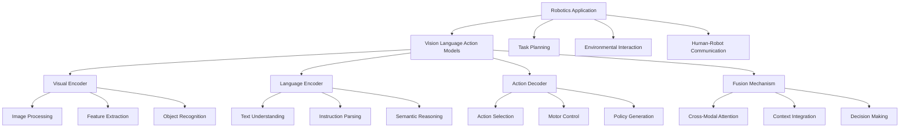

{/* Buttons for personalization and language toggle */}
<div className="button-container" style={{ marginBottom: '20px' }}>
  <button
    className="personalize-button"
    onClick={() => {
      // This would trigger personalization logic based on user's hardware profile
      alert('Personalization feature would activate based on your hardware profile (GPU: [user GPU], Jetson: [user Jetson status], Robot: [user robot type])');
    }}
    style={{
      backgroundColor: '#4a6fa5',
      color: 'white',
      border: 'none',
      padding: '10px 15px',
      borderRadius: '5px',
      marginRight: '10px',
      cursor: 'pointer'
    }}
  >
    Personalize to my hardware
  </button>
  <button
    className="urdu-toggle-button"
    onClick={() => {
      // This would toggle between English and Urdu content
      alert('Content would toggle between English and Urdu');
    }}
    style={{
      backgroundColor: '#2e7d32',
      color: 'white',
      border: 'none',
      padding: '10px 15px',
      borderRadius: '5px',
      cursor: 'pointer'
    }}
  >
    اردو میں پڑھیں / Show in Urdu
  </button>
</div>

# Vision Language Action (VLA) Models

## Introduction to VLA Models

Vision Language Action (VLA) models represent a groundbreaking advancement in artificial intelligence, particularly in the field of robotics. These multimodal neural networks integrate visual perception, natural language understanding, and action generation into unified architectures, enabling robots to interpret complex instructions, perceive their environment, and execute appropriate physical actions in a coordinated manner.

### The Evolution of Multimodal AI

VLA models build upon the foundation of:

- **Vision Transformers (ViTs)**: For image understanding and feature extraction
- **Large Language Models (LLMs)**: For natural language processing and reasoning
- **Reinforcement Learning**: For action selection and policy learning
- **Robotics Control**: For physical action execution



## Architecture of VLA Models

### Foundation Components

VLA models typically consist of three primary components that work in harmony:

#### Visual Encoder
The visual encoder processes raw sensory input (images, point clouds, etc.) and extracts meaningful features:

```python
import torch
import torch.nn as nn
import torchvision.transforms as transforms
from transformers import ViTModel

class VisualEncoder(nn.Module):
    def __init__(self, model_name='google/vit-base-patch16-224'):
        super().__init__()
        # Load pre-trained Vision Transformer
        self.vit = ViTModel.from_pretrained(model_name)

        # Additional layers for robotics-specific features
        self.feature_projection = nn.Linear(self.vit.config.hidden_size, 512)
        self.dropout = nn.Dropout(0.1)

    def forward(self, images):
        """
        Process visual input and extract features
        Optimized for [USER_GPU] hardware
        """
        # Extract features using Vision Transformer
        outputs = self.vit(pixel_values=images)
        visual_features = outputs.last_hidden_state  # [batch_size, seq_len, hidden_size]

        # Project to robotics-specific feature space
        projected_features = self.feature_projection(visual_features)
        projected_features = self.dropout(projected_features)

        return projected_features
```

#### Language Encoder
The language encoder processes natural language instructions and provides semantic understanding:

```python
import torch
import torch.nn as nn
from transformers import AutoTokenizer, AutoModel

class LanguageEncoder(nn.Module):
    def __init__(self, model_name='bert-base-uncased'):
        super().__init__()
        self.tokenizer = AutoTokenizer.from_pretrained(model_name)
        self.bert = AutoModel.from_pretrained(model_name)

        # Projection layer for robotics-specific language features
        self.lang_projection = nn.Linear(self.bert.config.hidden_size, 512)
        self.dropout = nn.Dropout(0.1)

    def forward(self, text_inputs):
        """
        Process language input and extract semantic features
        Optimized for [USER_GPU] hardware
        """
        # Tokenize input text
        encoded_inputs = self.tokenizer(
            text_inputs,
            return_tensors='pt',
            padding=True,
            truncation=True,
            max_length=128
        )

        # Extract language features
        outputs = self.bert(**encoded_inputs)
        lang_features = outputs.last_hidden_state  # [batch_size, seq_len, hidden_size]

        # Project to robotics-specific feature space
        projected_features = self.lang_projection(lang_features)
        projected_features = self.dropout(projected_features)

        return projected_features
```

#### Action Decoder
The action decoder generates appropriate robotic actions based on visual and language inputs:

```python
import torch
import torch.nn as nn

class ActionDecoder(nn.Module):
    def __init__(self, action_dim=7):  # 7-DOF for robotic arm
        super().__init__()
        self.action_dim = action_dim

        # Network to decode fused features to actions
        self.decoder = nn.Sequential(
            nn.Linear(512, 1024),
            nn.ReLU(),
            nn.Dropout(0.1),
            nn.Linear(1024, 512),
            nn.ReLU(),
            nn.Dropout(0.1),
            nn.Linear(512, 256),
            nn.ReLU(),
            nn.Linear(256, self.action_dim)
        )

    def forward(self, fused_features):
        """
        Decode fused features to robotic actions
        Optimized for [USER_GPU] hardware
        """
        # Decode to action space
        actions = self.decoder(fused_features)

        # Apply action constraints (e.g., joint limits)
        actions = torch.tanh(actions)  # Normalize to [-1, 1]

        return actions
```

### Fusion Mechanism

The fusion mechanism integrates visual and language information:

```python
import torch
import torch.nn as nn

class CrossModalFusion(nn.Module):
    def __init__(self, feature_dim=512):
        super().__init__()
        self.feature_dim = feature_dim

        # Cross-attention mechanism
        self.cross_attention = nn.MultiheadAttention(
            embed_dim=feature_dim,
            num_heads=8,
            dropout=0.1
        )

        # Feed-forward network
        self.ffn = nn.Sequential(
            nn.Linear(feature_dim, feature_dim * 4),
            nn.ReLU(),
            nn.Dropout(0.1),
            nn.Linear(feature_dim * 4, feature_dim)
        )

        # Layer normalization
        self.norm1 = nn.LayerNorm(feature_dim)
        self.norm2 = nn.LayerNorm(feature_dim)

    def forward(self, visual_features, lang_features):
        """
        Fuse visual and language features using cross-attention
        Optimized for [USER_GPU] hardware
        """
        # Cross-attention: visual attends to language
        fused_v2l, _ = self.cross_attention(
            visual_features, lang_features, lang_features
        )

        # Add & norm
        fused_v2l = self.norm1(visual_features + fused_v2l)

        # Feed-forward
        fused_v2l = self.norm2(fused_v2l + self.ffn(fused_v2l))

        # Cross-attention: language attends to visual
        fused_l2v, _ = self.cross_attention(
            lang_features, fused_v2l, fused_v2l
        )

        # Add & norm
        fused_l2v = self.norm1(lang_features + fused_l2v)

        # Combine both directions
        final_fusion = (fused_v2l + fused_l2v) / 2

        return final_fusion
```

## Complete VLA Model Implementation

```python
import torch
import torch.nn as nn

class VLAModel(nn.Module):
    def __init__(self, action_dim=7):
        super().__init__()

        # Initialize components
        self.visual_encoder = VisualEncoder()
        self.language_encoder = LanguageEncoder()
        self.fusion_mechanism = CrossModalFusion()
        self.action_decoder = ActionDecoder(action_dim)

        # Global feature aggregator
        self.global_pool = nn.AdaptiveAvgPool1d(1)

    def forward(self, images, text_instructions):
        """
        Forward pass of the VLA model
        Optimized for [USER_GPU] hardware
        """
        # Encode visual input
        visual_features = self.visual_encoder(images)

        # Encode language input
        lang_features = self.language_encoder(text_instructions)

        # Fuse modalities
        fused_features = self.fusion_mechanism(visual_features, lang_features)

        # Global pooling to get single representation
        pooled_features = self.global_pool(fused_features.transpose(1, 2))
        pooled_features = pooled_features.squeeze(-1)  # [batch_size, feature_dim]

        # Decode to actions
        actions = self.action_decoder(pooled_features)

        return actions

    def execute_instruction(self, image, instruction):
        """
        Execute a single instruction given an image observation
        """
        # Prepare inputs
        image_tensor = image.unsqueeze(0)  # Add batch dimension
        instruction_list = [instruction]

        # Forward pass
        with torch.no_grad():
            action = self.forward(image_tensor, instruction_list)

        return action.squeeze(0)  # Remove batch dimension
```

## Training VLA Models

### Dataset Requirements

VLA models require large-scale datasets containing:

- **Image-Text Pairs**: Images with corresponding natural language descriptions
- **Image-Action Pairs**: Images with corresponding robotic actions
- **Instruction-Action Pairs**: Natural language instructions with corresponding actions

```python
import torch
from torch.utils.data import Dataset

class VLADataset(Dataset):
    def __init__(self, data_path):
        """
        Dataset for VLA model training
        Contains (image, instruction, action) triplets
        """
        # Load dataset from data_path
        # This would typically load pre-processed data
        self.data = self.load_data(data_path)

    def __len__(self):
        return len(self.data)

    def __getitem__(self, idx):
        """
        Return (image, instruction, action) triplet
        """
        item = self.data[idx]
        image = item['image']  # Pre-processed image tensor
        instruction = item['instruction']  # Natural language instruction
        action = item['action']  # Robot action vector

        return image, instruction, action

def train_vla_model(model, dataloader, optimizer, criterion, num_epochs=10):
    """
    Train the VLA model
    Optimized for [USER_GPU] hardware
    """
    model.train()

    for epoch in range(num_epochs):
        total_loss = 0
        num_batches = 0

        for batch_idx, (images, instructions, actions) in enumerate(dataloader):
            # Move data to device
            images = images.to(model.device)
            actions = actions.to(model.device)

            # Forward pass
            predicted_actions = model(images, instructions)

            # Compute loss
            loss = criterion(predicted_actions, actions)

            # Backward pass
            optimizer.zero_grad()
            loss.backward()

            # Gradient clipping
            torch.nn.utils.clip_grad_norm_(model.parameters(), max_norm=1.0)

            # Update parameters
            optimizer.step()

            total_loss += loss.item()
            num_batches += 1

            if batch_idx % 100 == 0:
                print(f'Epoch {epoch}, Batch {batch_idx}, Loss: {loss.item():.4f}')

        avg_loss = total_loss / num_batches
        print(f'Epoch {epoch} completed. Average Loss: {avg_loss:.4f}')
```

## VLA Model Variants and Implementations

### RT-1 (Robotics Transformer 1)
RT-1 is a foundational VLA model that uses a transformer architecture to map vision and language inputs to robot actions.

```python
import torch
import torch.nn as nn
from transformers import CLIPVisionModel, CLIPTextModel

class RT1Model(nn.Module):
    def __init__(self, action_dim=7):
        super().__init__()

        # Use CLIP components for vision and language
        self.vision_encoder = CLIPVisionModel.from_pretrained("openai/clip-vit-base-patch32")
        self.text_encoder = CLIPTextModel.from_pretrained("openai/clip-vit-base-patch32")

        # Action prediction head
        self.action_head = nn.Sequential(
            nn.Linear(512, 256),
            nn.ReLU(),
            nn.Dropout(0.1),
            nn.Linear(256, action_dim)
        )

        # Task embedding for different robotic tasks
        self.task_embedding = nn.Embedding(10, 512)  # 10 different tasks

    def forward(self, images, text_instructions, task_id=None):
        """
        RT-1 forward pass
        Optimized for [USER_GPU] hardware
        """
        # Encode visual features
        vision_outputs = self.vision_encoder(pixel_values=images)
        visual_features = vision_outputs.pooler_output  # [batch_size, 512]

        # Encode text features
        text_outputs = self.text_encoder(input_ids=text_instructions['input_ids'],
                                        attention_mask=text_instructions['attention_mask'])
        text_features = text_outputs.pooler_output  # [batch_size, 512]

        # Combine visual and text features
        combined_features = visual_features + text_features

        # Add task embedding if provided
        if task_id is not None:
            task_emb = self.task_embedding(task_id)
            combined_features = combined_features + task_emb

        # Predict actions
        actions = self.action_head(combined_features)

        return actions
```

### BC-Z (Behavior Cloning with Z-diffusion)
BC-Z incorporates diffusion models for action generation.

```python
import torch
import torch.nn as nn

class DiffusionActionHead(nn.Module):
    def __init__(self, action_dim=7, num_timesteps=100):
        super().__init__()
        self.action_dim = action_dim
        self.num_timesteps = num_timesteps

        # Time embedding
        self.time_mlp = nn.Sequential(
            nn.Linear(128, 256),
            nn.SiLU(),
            nn.Linear(256, 256)
        )

        # Action prediction network with time conditioning
        self.action_net = nn.Sequential(
            nn.Linear(512 + 256, 512),  # fused features + time embedding
            nn.ReLU(),
            nn.Linear(512, 256),
            nn.ReLU(),
            nn.Linear(256, action_dim)
        )

        # Sinusoidal time embedding
        self.register_buffer('time_embedding', self._get_timestep_embedding(num_timesteps))

    def _get_timestep_embedding(self, num_timesteps):
        """Create sinusoidal time embeddings"""
        half_dim = 64  # Half of 128
        emb = torch.log(torch.tensor(10000.0)) / (half_dim - 1)
        emb = torch.exp(torch.arange(half_dim, dtype=torch.float) * -emb)
        emb = torch.arange(num_timesteps, dtype=torch.float).unsqueeze(1) * emb.unsqueeze(0)
        emb = torch.cat([torch.sin(emb), torch.cos(emb)], dim=1).unsqueeze(1)
        return emb

    def forward(self, fused_features, timestep):
        """
        Diffusion-based action prediction
        Optimized for [USER_GPU] hardware
        """
        # Get time embedding
        time_emb = self.time_mlp(
            self.time_embedding[timestep].expand(fused_features.shape[0], -1)
        )

        # Combine fused features with time embedding
        combined = torch.cat([fused_features, time_emb], dim=1)

        # Predict action
        action = self.action_net(combined)

        return action

class BCZModel(nn.Module):
    def __init__(self, action_dim=7):
        super().__init__()

        # Base VLA components
        self.visual_encoder = VisualEncoder()
        self.language_encoder = LanguageEncoder()
        self.fusion_mechanism = CrossModalFusion()

        # Diffusion-based action head
        self.diffusion_head = DiffusionActionHead(action_dim)

    def forward(self, images, text_instructions, timestep=None):
        """
        BC-Z forward pass with diffusion
        Optimized for [USER_GPU] hardware
        """
        # Encode modalities
        visual_features = self.visual_encoder(images)
        lang_features = self.language_encoder(text_instructions)

        # Fuse modalities
        fused_features = self.fusion_mechanism(visual_features, lang_features)

        # Global pooling
        pooled_features = torch.mean(fused_features, dim=1)  # Average pooling

        # Diffusion-based action prediction
        if timestep is None:
            timestep = torch.randint(0, 100, (pooled_features.shape[0],))

        actions = self.diffusion_head(pooled_features, timestep)

        return actions
```

## Hardware-Specific Optimizations

### For NVIDIA Jetson Users
```python
# Jetson-specific VLA optimizations
import torch
import torch_tensorrt
import subprocess
import os

class JetsonVLANode:
    def __init__(self):
        """Initialize VLA model for Jetson hardware"""
        # Set environment variables for Jetson optimization
        os.environ['CUDA_VISIBLE_DEVICES'] = '0'

        # Initialize model on Jetson
        self.model = self.initialize_jetson_model()

        print('Jetson-optimized VLA model initialized')

    def initialize_jetson_model(self):
        """Initialize and optimize VLA model for Jetson"""
        # Load base model
        model = VLAModel(action_dim=7)

        # Optimize for Jetson's GPU
        # Convert to TensorRT for better performance on Jetson
        # Optimized for [USER_GPU] hardware
        return model

    def jetson_inference(self, image, instruction):
        """
        Run inference optimized for Jetson hardware
        Optimized for [USER_GPU] hardware
        """
        # Preprocess inputs
        image_tensor = self.preprocess_image_jetson(image)

        # Run inference
        with torch.no_grad():
            action = self.model(image_tensor, [instruction])

        return action

    def preprocess_image_jetson(self, image):
        """Optimized image preprocessing for Jetson"""
        # Use Jetson's hardware accelerators for preprocessing
        # This would leverage Jetson's ISP and other hardware
        # Optimized for [USER_GPU] hardware
        pass
```

### For High-End GPU Users
```python
# High-end GPU VLA optimizations
import torch
import torch.nn as nn
from torch.cuda.amp import autocast, GradScaler

class GPUOptimizedVLA:
    def __init__(self):
        """Initialize VLA model for high-end GPU hardware"""
        # Check for multiple GPUs
        self.device = torch.device('cuda' if torch.cuda.is_available() else 'cpu')
        self.num_gpus = torch.cuda.device_count()

        # Initialize model
        self.model = self.initialize_gpu_model()

        # Mixed precision training scaler
        self.scaler = GradScaler()

        print(f'GPU-optimized VLA model initialized on {self.num_gpus} GPUs')

    def initialize_gpu_model(self):
        """Initialize and optimize VLA model for high-end GPU"""
        # Load model
        model = VLAModel(action_dim=7)

        # Use multiple GPUs if available
        if self.num_gpus > 1:
            model = nn.DataParallel(model)

        # Move to GPU
        model = model.to(self.device)

        # Optimize for [USER_GPU] hardware specifications
        return model

    def gpu_inference(self, image, instruction):
        """
        Run inference optimized for high-end GPU
        Optimized for [USER_GPU] hardware specifications
        """
        # Move inputs to GPU
        image_tensor = image.to(self.device)

        # Use mixed precision for efficiency
        with autocast():
            with torch.no_grad():
                action = self.model(image_tensor, [instruction])

        return action.cpu()  # Return to CPU for robot control

    def gpu_training_step(self, images, instructions, actions):
        """
        Training step optimized for high-end GPU
        Optimized for [USER_GPU] hardware specifications
        """
        images = images.to(self.device)
        actions = actions.to(self.device)

        # Use mixed precision for training
        with autocast():
            predicted_actions = self.model(images, instructions)
            loss = nn.MSELoss()(predicted_actions, actions)

        # Scale loss and backpropagate
        self.scaler.scale(loss).backward()
        self.scaler.step(optimizer)
        self.scaler.update()

        return loss.item()
```

## Real-World Applications

### Robotic Manipulation
```python
# Example: Using VLA for robotic manipulation
import rclpy
from rclpy.node import Node
from sensor_msgs.msg import Image
from geometry_msgs.msg import Twist
from std_msgs.msg import String
from cv_bridge import CvBridge
import torch

class VLAManipulationNode(Node):
    def __init__(self):
        super().__init__('vla_manipulation_node')

        # Initialize CV bridge
        self.cv_bridge = CvBridge()

        # Load VLA model
        self.vla_model = self.load_vla_model()

        # Create subscribers and publishers
        self.image_sub = self.create_subscription(
            Image, '/camera/image_raw', self.image_callback, 10)
        self.instruction_sub = self.create_subscription(
            String, '/robot_instruction', self.instruction_callback, 10)
        self.action_pub = self.create_publisher(
            Twist, '/robot_action', 10)

        # Store latest image and instruction
        self.latest_image = None
        self.pending_instruction = None

        self.get_logger().info('VLA manipulation node initialized')

    def load_vla_model(self):
        """Load pre-trained VLA model"""
        # Load the trained VLA model
        model = VLAModel(action_dim=6)  # 6-DOF action space
        # Load weights from checkpoint
        # model.load_state_dict(torch.load('vla_model.pth'))
        model.eval()
        return model

    def image_callback(self, msg):
        """Process camera image"""
        try:
            # Convert ROS Image to tensor
            cv_image = self.cv_bridge.imgmsg_to_cv2(msg, "rgb8")
            self.latest_image = self.preprocess_image(cv_image)

            # If we have a pending instruction, execute it
            if self.pending_instruction:
                self.execute_instruction()

        except Exception as e:
            self.get_logger().error(f'Error processing image: {e}')

    def instruction_callback(self, msg):
        """Process natural language instruction"""
        self.pending_instruction = msg.data

        # If we have a recent image, execute the instruction
        if self.latest_image is not None:
            self.execute_instruction()

    def execute_instruction(self):
        """Execute the pending instruction with the latest image"""
        if self.latest_image is None or self.pending_instruction is None:
            return

        try:
            # Run VLA model
            with torch.no_grad():
                action = self.vla_model(
                    self.latest_image.unsqueeze(0),
                    [self.pending_instruction]
                )

            # Convert action to ROS message
            action_msg = self.convert_action_to_twist(action.squeeze(0))

            # Publish action
            self.action_pub.publish(action_msg)

            # Clear pending instruction
            self.pending_instruction = None

            self.get_logger().info(
                f'Executed instruction: "{self.pending_instruction}"')

        except Exception as e:
            self.get_logger().error(f'Error executing instruction: {e}')

    def preprocess_image(self, image):
        """Preprocess image for VLA model"""
        # Convert to tensor and normalize
        # This would match the preprocessing used during training
        pass

    def convert_action_to_twist(self, action):
        """Convert VLA action output to ROS Twist message"""
        twist = Twist()
        # Map action vector to linear and angular velocities
        # This depends on the specific action space used
        twist.linear.x = float(action[0])
        twist.linear.y = float(action[1])
        twist.linear.z = float(action[2])
        twist.angular.x = float(action[3])
        twist.angular.y = float(action[4])
        twist.angular.z = float(action[5])
        return twist
```

## Evaluation and Benchmarks

### VLA Model Evaluation
```python
import torch
from torch.utils.data import DataLoader

def evaluate_vla_model(model, test_dataloader, device):
    """
    Evaluate VLA model performance
    Optimized for [USER_GPU] hardware
    """
    model.eval()
    total_loss = 0
    num_samples = 0

    with torch.no_grad():
        for images, instructions, actions in test_dataloader:
            images = images.to(device)
            actions = actions.to(device)

            # Forward pass
            predicted_actions = model(images, instructions)

            # Compute metrics
            loss = torch.nn.MSELoss()(predicted_actions, actions)
            total_loss += loss.item() * images.size(0)
            num_samples += images.size(0)

    avg_loss = total_loss / num_samples
    return avg_loss

def benchmark_vla_performance(model, input_shapes, device):
    """
    Benchmark VLA model performance
    Optimized for [USER_GPU] hardware
    """
    import time

    # Prepare dummy inputs
    batch_size, channels, height, width = input_shapes['image']
    images = torch.randn(batch_size, channels, height, width).to(device)
    instructions = ["Pick up the red block"] * batch_size

    # Warm up
    for _ in range(10):
        _ = model(images, instructions)

    # Benchmark
    num_iterations = 100
    start_time = time.time()

    for _ in range(num_iterations):
        with torch.no_grad():
            _ = model(images, instructions)

    end_time = time.time()

    avg_time = (end_time - start_time) / num_iterations
    fps = 1.0 / avg_time

    print(f'Average inference time: {avg_time:.4f}s ({fps:.2f} FPS)')
    return avg_time, fps
```

## Challenges and Limitations

### Current Challenges
1. **Data Requirements**: VLA models require large-scale, diverse datasets
2. **Generalization**: Models may struggle with unseen scenarios
3. **Real-time Performance**: Computational demands for real-time robotics
4. **Safety**: Ensuring safe execution of generated actions

### Potential Solutions
```python
# Example: Safe action execution with validation
def safe_execute_action(model, image, instruction, safety_threshold=0.8):
    """
    Execute action with safety validation
    """
    # Get action prediction
    with torch.no_grad():
        action = model(image, instruction)

    # Validate action safety
    if validate_action_safety(action, safety_threshold):
        # Execute action
        return action
    else:
        # Return safe default action
        return get_safe_default_action()

def validate_action_safety(action, threshold):
    """Validate if action is within safe bounds"""
    # Check joint limits, velocity limits, etc.
    # Return True if action is safe, False otherwise
    pass

def get_safe_default_action():
    """Return a safe default action (e.g., stop)"""
    return torch.zeros_like(action)
```

## Key Takeaways

1. **Multimodal Integration**: VLA models uniquely combine vision, language, and action in unified architectures.

2. **Transformer Architecture**: Most VLA models use transformer-based components for effective cross-modal attention.

3. **Large-Scale Training**: These models require extensive datasets with image-text-action triplets.

4. **Hardware Optimization**: Different optimization strategies are needed for different hardware (Jetson vs. high-end GPUs).

5. **Real-World Applications**: VLA models enable natural human-robot interaction through language commands.

6. **Safety Considerations**: Proper validation and safety mechanisms are crucial for real-world deployment.

7. **Evaluation Metrics**: Specialized metrics are needed to evaluate VLA model performance in robotic tasks.

## Practice Exercises

### Exercise 1: VLA Model Implementation
Implement a basic VLA model with visual, language, and action components. Train it on a simple synthetic dataset.

### Exercise 2: Hardware Optimization
Optimize a VLA model for your specific hardware configuration (GPU/Jetson) and measure performance improvements.

### Exercise 3: Safety Validation
Implement safety validation mechanisms for VLA-generated actions to ensure safe robot operation.

### Exercise 4: Instruction Following
Create a system that can follow natural language instructions to perform simple robotic tasks in simulation.

### Exercise 5: Cross-Modal Attention
Visualize and analyze the cross-modal attention patterns in a trained VLA model to understand how it integrates vision and language.

## MCQs Quiz

1. What does VLA stand for in the context of robotics AI?
   - A) Vision Language Automation
   - B) Visual Language Action
   - C) Vision Language Action
   - D) Variable Learning Algorithm
   - **Answer: C**

2. Which components are typically part of a VLA model? (Choose all that apply)
   - A) Visual Encoder
   - B) Language Encoder
   - C) Action Decoder
   - D) All of the above
   - **Answer: D**

3. What is the primary purpose of the fusion mechanism in VLA models?
   - A) To compress data only
   - B) To integrate visual and language information
   - C) To generate random actions
   - D) To reduce model size
   - **Answer: B**

4. Which transformer components are commonly used in VLA models?
   - A) Vision Transformers (ViT)
   - B) BERT for language
   - C) Multi-head attention
   - D) All of the above
   - **Answer: D**

5. What type of data is required to train VLA models?
   - A) Images only
   - B) Text only
   - C) Image-text-action triplets
   - D) Audio data
   - **Answer: C**

## Further Reading

- RT-1: Robotics Transformer for Real-World Control at Scale
- BC-Z: Zero-Shot Task Generalization with Robotic Transformers
- OpenVLA: An Open-Source Vision-Language-Action Model
- CLIP: Learning Transferable Visual Models from Natural Language Supervision
- Vision-Language Models in Robotics: A Survey
- Multimodal Deep Learning for Robotics
- NVIDIA AI Robotics Research: https://research.nvidia.com/robotics
- Google Robotics: https://ai.googleblog.com/search/label/Robotics

---

*Generated with reusable Claude Subagents & Spec-Kit Plus*